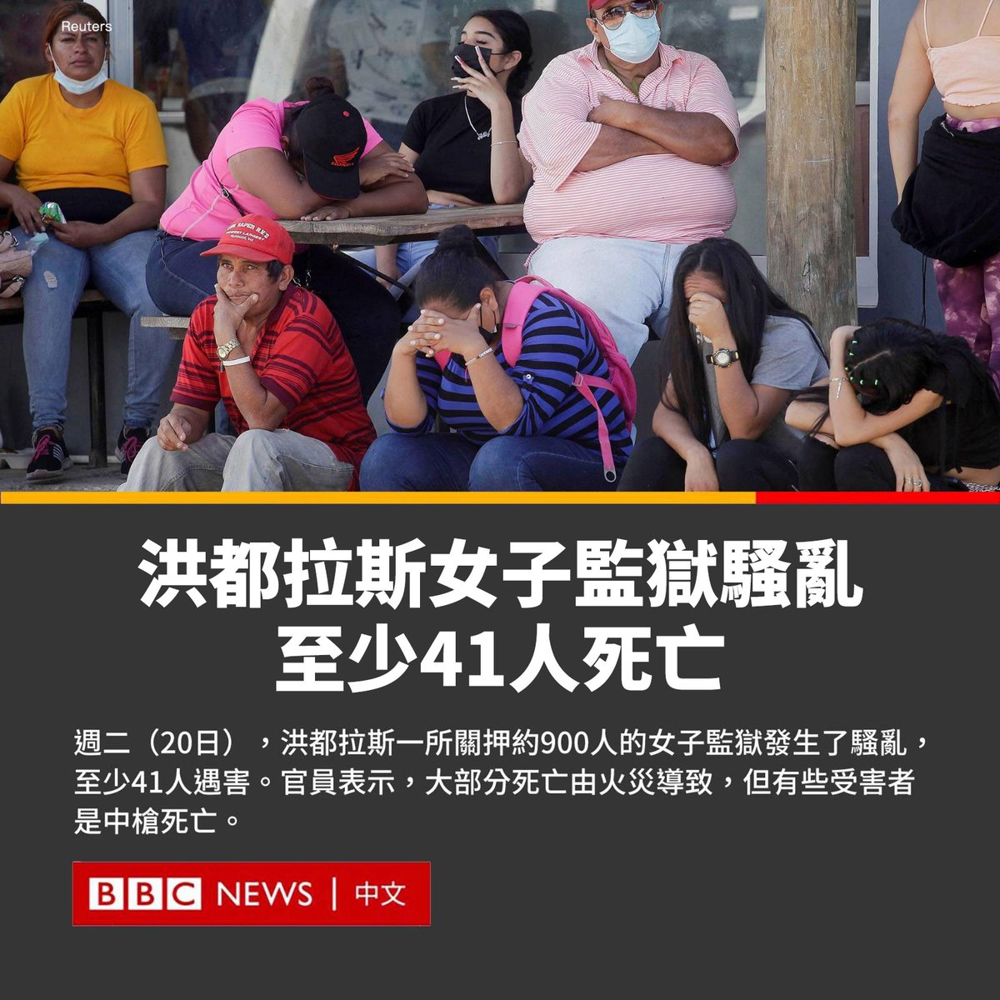
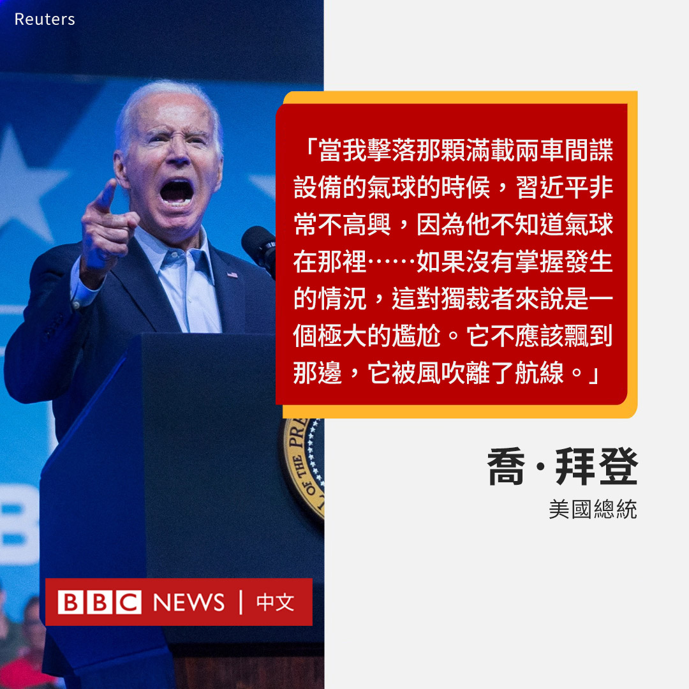

D英国广播公司BBC 北京时间 2023-06-21T12:00:04Z 1671367353827991557 洪都拉斯一所女子监狱周二（6月20日）发生骚乱，造成至少41人遇害。一些囚犯被送往医院。

据报道，事件源于不同帮派之间爆发了斗殴，其中一伙人点燃了一间牢房。

官员表示，大部分死者在火灾中身亡，但也有受害者中枪而亡。

该国安全部副部长朱利莎·维拉努埃瓦（Julissa Villanueva）已宣布紧急状态，并承诺打击暴力，表示“不容忍任何人失去生命”。

她还授权消防队、警察和军队“立即干预”。

目前尚不清楚是否所有死者都是该监狱的囚犯。这所监狱距离洪都拉斯首都特古西加尔巴约20公里，关押有约900人。

代表囚犯家属的德尔玛·奥尔多内斯（Delma Ordonez）告诉当地媒体，监狱的一部分在暴力事件中被“完全摧毁”。

社交媒体上发布的影片显示，女子监狱上空升起了一团巨大的灰色烟雾。

去年，总统希奥玛拉·卡斯特罗（Xiomara Castro）对帮派活动展开了打击行动。她在社交媒体上表示，她对“谋杀妇女的恶行”感到震惊，将采取“严厉措施”。   D英国广播公司BBC 北京时间 2023-06-21T10:14:05Z 1671340682341122050 在美国国务卿布林肯（Antony Blinken）访问中国并会晤国家主席习近平后，美国总统拜登（Joe Biden）称习近平是“独裁者”。

拜登在加利福尼亚州的一次筹款活动中发表讲话称，习近平对今年年初加剧中美紧张局势的“间谍”气球事件感到难堪。

“当我（决定）击落那颗满载两车间谍设备的气球的时候，习近平非常不高兴，因为他不知道气球在那里。”拜登说。

“如果没有掌握发生的情况，这对独裁者来说是一个极大的尴尬。”他说道。“（气球）不应该飘到那边，它被风吹离了航线。”

此前一天，布林肯结束对北京的访问。作为拜登政府上台以来访华的最高级别官员，布林肯此行旨在缓和两个超级大国之间的紧张关系。

习近平表示两国的会谈已经取得进展，布林肯则表示双方均同意须稳定双方关系，而直接接触是最佳途径，但美国将继续采取针对性行动保护美国国家利益。

北京暂未回应拜登的言论。   D英国广播公司BBC 北京时间 2023-06-21T09:23:29Z 1671327947624677376 BBC一项长达一年的调查揭露了横跨印尼和美国的虐待猴子社群。这些虐待、仇恨猴子的群体开始于YouTube，接着转移到Telegram加密群组。

BBC发现，数百名来自美国、英国以及其他国家的“客户”付费，以让印尼人虐待并杀害长尾猕猴宝宝。

透过卧底的方式，BBC追踪到印尼的施虐者，以及美国的买家与经销商。 https://t.co/Uk6Kgm1SE6   D英国广播公司BBC 北京时间 2023-06-21T09:26:02Z 1671328592138215425 阅读详细英文调查：
https://t.co/9pPRb0ndd8   