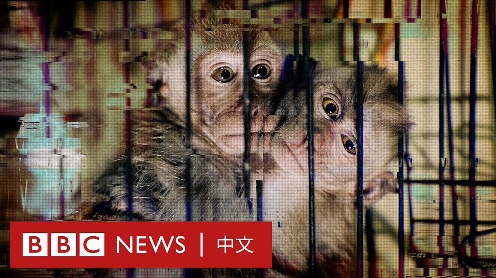

D英国广播公司BBC 北京时间 2023-06-21T09:23:29Z 1671327947624677376 BBC一项长达一年的调查揭露了横跨印尼和美国的虐待猴子社群。这些虐待、仇恨猴子的群体开始于YouTube，接着转移到Telegram加密群组。

BBC发现，数百名来自美国、英国以及其他国家的“客户”付费，以让印尼人虐待并杀害长尾猕猴宝宝。

透过卧底的方式，BBC追踪到印尼的施虐者，以及美国的买家与经销商。 https://t.co/Uk6Kgm1SE6   D英国广播公司BBC 北京时间 2023-06-21T09:26:02Z 1671328592138215425 阅读详细英文调查：
https://t.co/9pPRb0ndd8   