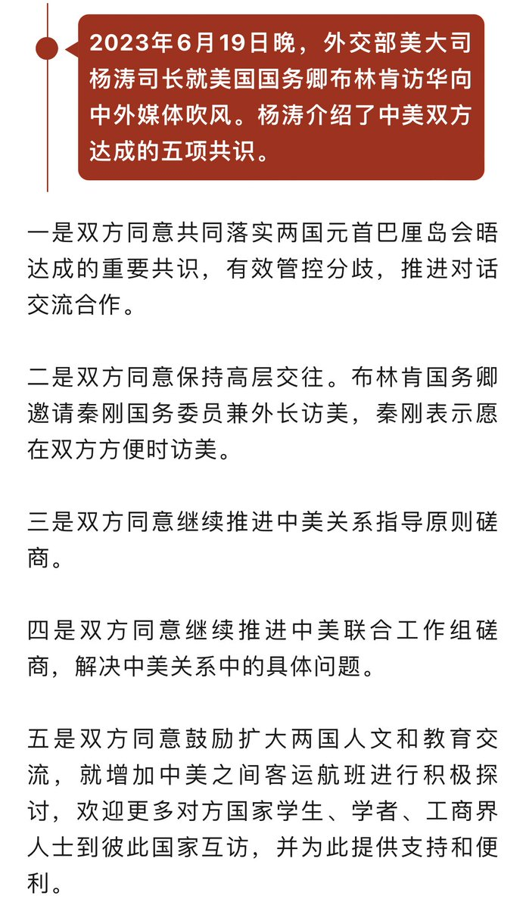

Petrichor 北京时间 2023-06-21T20:40:04Z 1671498218713088000 美国总统管不了美联储，但习主席叫中国人民银行干什么就干什么。   Petrichor 北京时间 2023-06-21T12:31:09Z 1671375178670960644 这11个国家里没有我的祖国，我放心了。 https://t.co/nSLTeNmJIN   Petrichor 北京时间 2023-06-21T12:35:14Z 1671376203813470209 这是中国的悖论之一 https://t.co/5o7lDuzprq   Petrichor 北京时间 2023-06-21T12:53:04Z 1671380694453420033 危险，不要因小失大。
 https://t.co/AgKlnoURcU   Petrichor 北京时间 2023-06-21T08:30:53Z 1671314710489178113 中美“双方同意鼓励扩大两国人文和教育交流”。不包括科学技术和医学？为什么？ https://t.co/M3HNCvUQo9   Petrichor 北京时间 2023-06-21T09:37:02Z 1671331357170061312 举国体制和东西南北中，党是领导一切的优越性。 https://t.co/wP5ZnYhODo   