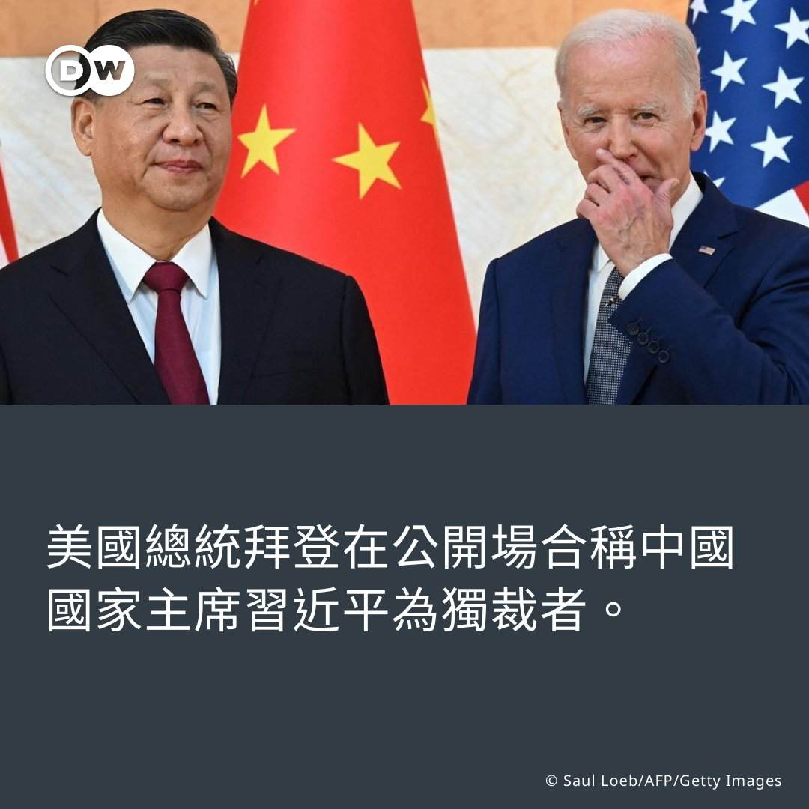
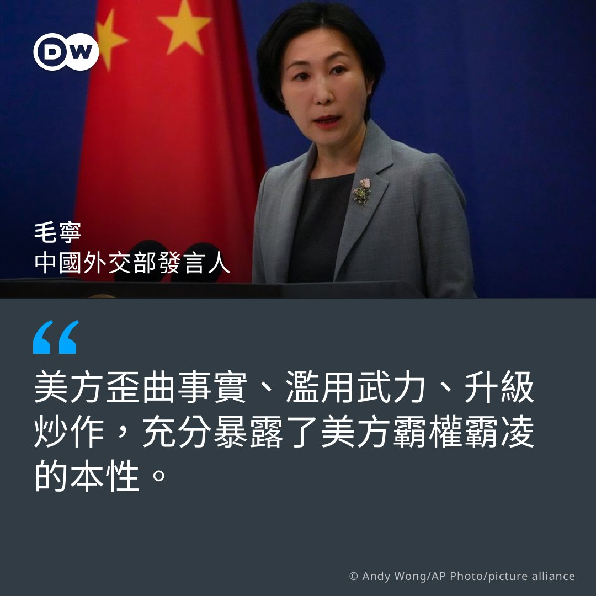
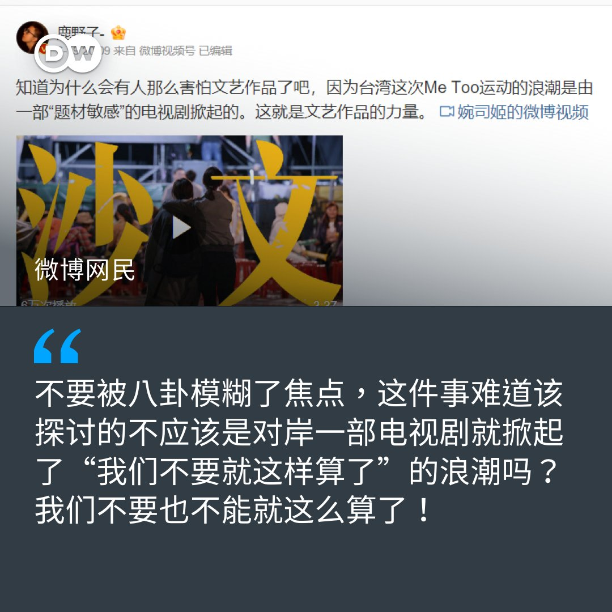

德国之声 北京时间 2023-06-21T22:04:45Z 1671519530051313667 欧盟资深官员表示，欧盟领导人下周将在峰会期间呼吁中国帮助结束乌克兰战争、参与应对气候变化等全球性挑战，并重新调整其与欧盟的经济关系。

https://t.co/tQyci6azCG   德国之声 北京时间 2023-06-21T18:54:20Z 1671471608257560576 特斯拉首席执行官马斯克表示，印度总理莫迪希望特斯拉大举投资印度，相关计划将在近期内正式公布。一段时间以来，马斯克一直在为其下一家超级工厂寻找理想地点。

 https://t.co/cFgltqclyu   德国之声 北京时间 2023-06-21T19:41:15Z 1671483413369438210 路透社根据其获得的三份台湾政府内部报告报道称，台湾认为中国试图通过非法资助对北京有利的候选人，干预明年一月的台湾大选。

报告称，中国当局可能会让相关候选人建立微信公众账号，然后动员用户通过 "观众打赏 "的方式给予金钱上的支持。

https://t.co/M95eoQ2eM2   德国之声 北京时间 2023-06-21T20:36:00Z 1671497192610099200 巴伐利亞「國王」會見中國總理

巴伐利亞的軍樂隊穿綠衣、著短褲、戴綠帽，熱情歡迎來自遠方的客人。和中國脫鈎？「國王」說絕不可行。 https://t.co/2mSMYiqyPr   德国之声 北京时间 2023-06-21T16:25:41Z 1671434197251112960 昨天，美国总统拜登在一场竞选筹款活动中说，数月前在美国上空的中国气球被吹离航线，令习近平感到非常尴尬。他说：“这对独裁者来说是极度的难堪，当他们不知道发生什么事时。气球原本不应该去那里，它被吹离了轨道。”

此前一天，美国国务卿布林肯在北京说，引发两国争执的“气球事件”应到此为止。 https://t.co/Ci5jt0FhX5   德国之声 北京时间 2023-06-21T16:26:11Z 1671434327119343617 6月21日，中国外交部发言人毛宁在新闻例会上回应就美国总统拜登涉无人飞艇事件言论的提问时说，“无人飞艇事件的是非曲直是非常清楚的，完全是一起由不可抗力导致的意外偶发事件。美方本应冷静、理性、专业地处理，但是美方歪曲事实、滥用武力、升级炒作，充分暴露了美方霸权霸凌的本性。” https://t.co/H8AxV0vOio   德国之声 北京时间 2023-06-21T17:07:15Z 1671444658361344002 活跃在上海的女性音乐人
在上海的地下音乐俱乐部里，女性音乐制作人还是凤毛麟角。Eloise Fan用实际行动改变着这一现状。#DW Stories https://t.co/Skn8foYOn7   德国之声 北京时间 2023-06-21T18:02:40Z 1671458606762393600 20日，阿里巴巴控股集团宣布将换帅，显示其重组拆小的方案正在推进。此外，中国财经媒体“晚点LatePost”透露的阿里巴巴创始人马云5月的内部讲话也引起关注，最近现身东京的马云当时说，“一个企业从行业标杆到死亡，半年到一年就足够了“。

https://t.co/RHWQeg8pZ3   德国之声 北京时间 2023-06-21T14:43:21Z 1671408445210128384 【台湾 #MeToo 延烧各界 微博网民羡短时间内修法】🇹🇼🇨🇳
热门网剧《#人选之人》近日在 #台湾 MeToo 掀起燎原大火，从政界、学界延烧至演艺圈， #黄子佼 、#炎亚纶 先后卷入争议，每日均有数起指控浮上台面。台湾行政院日前宣布已着手检视 #性骚扰 防治相关法规，将尽速向立法院提出修正草案。 （续） https://t.co/LcXhQnxqnH   德国之声 北京时间 2023-06-21T14:43:54Z 1671408585656369152 DW在 #微博 搜寻该剧中对抗性骚桥段的台词"我们不要就这样算了，好不好？"，发现许多 #中国 网民都对此剧在台引发性骚相关讨论、甚至促成修法一事十分关注。有网民表示，此事显示"好的电视剧真的可以改变社会"，但对此剧在中国遭禁感到遗憾。 （续）   德国之声 北京时间 2023-06-21T14:44:18Z 1671408686458126336 亦有网民赞许"能改、不捂嘴，是很大的进步"，或借此反思中国的性平环境："短短时间，台湾已从MeToo运动走到了立法程序，那我们呢？"
 
🤔您近期注意到了哪些MeToo事件？请在留言处与我们分享👇
 
🗞️相关报导——台湾MeToo延烧 下一步是什么？ ：https://t.co/UizhgvPV6a   德国之声 北京时间 2023-06-21T15:45:00Z 1671423959676473351 【调查：在华欧企信心明显下降】🇨🇳 🇪🇺

据 #中国欧盟商会 的调查，受监管方面的障碍、政治化因素影响，欧洲企业对 #中国 营商环境的信心大降。四成三的企业重新考虑过 #供应链 策略，12%则表明已将部份业务撤出中国。
详细报导👉 https://t.co/7EN0O49eNn https://t.co/08KbyLDFq3   德国之声 北京时间 2023-06-21T13:03:53Z 1671383416250458113 【NGO控德国车商未处理 #强迫劳动 疑虑】🇩🇪

#大众汽车、#宝马、#奔驰 等德国车商，其供应链长期遭批有强迫劳动疑虑。随着 #德国供应链法 今年正式生效，欧洲宪法和人权中心（ECCHR）向德国监管单位提出申诉，要求德国应调查车厂是否确实处理人权的问题。
详细报导👉https://t.co/34PUm9B3g1 https://t.co/aPcrHyntN6   德国之声 北京时间 2023-06-21T14:12:41Z 1671400729502957568 澳大利亚智库的一项最新民调显示，该国人民对中国的看法较前几年有所缓和，且支持中澳关系解冻，但受访者对中国国家主席习近平的信任度仍非常低。https://t.co/lA7j3oDKRJ   德国之声 北京时间 2023-06-21T11:23:37Z 1671358180599660545 【#台海 若爆发冲突，美国会协防台湾吗？ 】
 
#美国 外交杂志《国家利益》（The National Interest）于5月25日至6月5日期间，依年龄、性别及地区分类，对1105名 #台湾 人进行线上抽样调查，试问："若 #中国 对台湾发动战争，有多大信心美国会保卫台湾？"（续） https://t.co/U6DbNaD1Um   德国之声 北京时间 2023-06-21T11:23:58Z 1671358269015597057 据本月20日公布的结果显示，总体而言，仅35.47%民众对美国的防卫承诺表示"相当有信心"或"非常有信心"，不过他们的信心程度几乎取决于党派——其中有高达73.65%的 #民进党 支持者对此感到相当或非常有信心；#国民党 和 #民众党 支持者则分别只有15%和近19%。   德国之声 北京时间 2023-06-21T12:14:14Z 1671370921012256768 美国总统拜登的儿子亨特被控非法拥枪和逃漏税的案件，週二与检察官达成认罪协议，但共和党为何批评这项认罪协议有问题？https://t.co/jE9TMo9Ntw   德国之声 北京时间 2023-06-21T10:15:26Z 1671341024398942210 #美国 法院日前首次审理了与中国 "#猎狐行动"有关的案件，1名前纽约市警官及2名中国公民被控非法充当中国 #特工。这3位被告做了什么，有哪些罪名成立？🇨🇳🇺🇸
https://t.co/Yq5Lc0Pajy   德国之声 北京时间 2023-06-21T07:00:01Z 1671291843299143681 《南德意志报》评论称，“双方有太充足的理由将其竞争对抗纳入一个管控机制。从经济层面看，美国和中国都不能允许为争夺影响势力范圍而展开一场战争，而军事上，这样一场对决将没有赢家。因此，考虑如何管理这一关系，是明智的。在长时间的互不交流之后，这一成果不可小觑。”

https://t.co/dV3AN7qDtG   德国之声 北京时间 2023-06-21T05:50:00Z 1671274223153856513 什么是典型的德国人？

他们每天几点起床？怎样早餐？跟邻居经常打招呼吗？#euromaxx https://t.co/j588hs4Ul6   德国之声 北京时间 2023-06-21T00:00:01Z 1671186149337907200 据《华尔街日报》引述不具名的美国现任和前任官员称，中国和古巴正就在古巴建立一个新的联合军事培训设施进行谈判。报道称，华盛顿担心，这可能导致中国在距离佛罗里达海岸仅100英里的该处设施驻军，或进行其它安全及情报活动。

https://t.co/klPPXTQqMp   