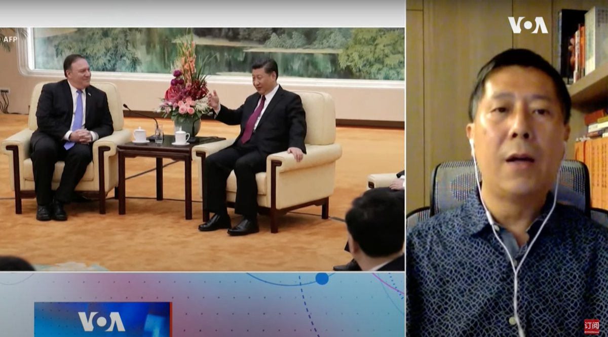
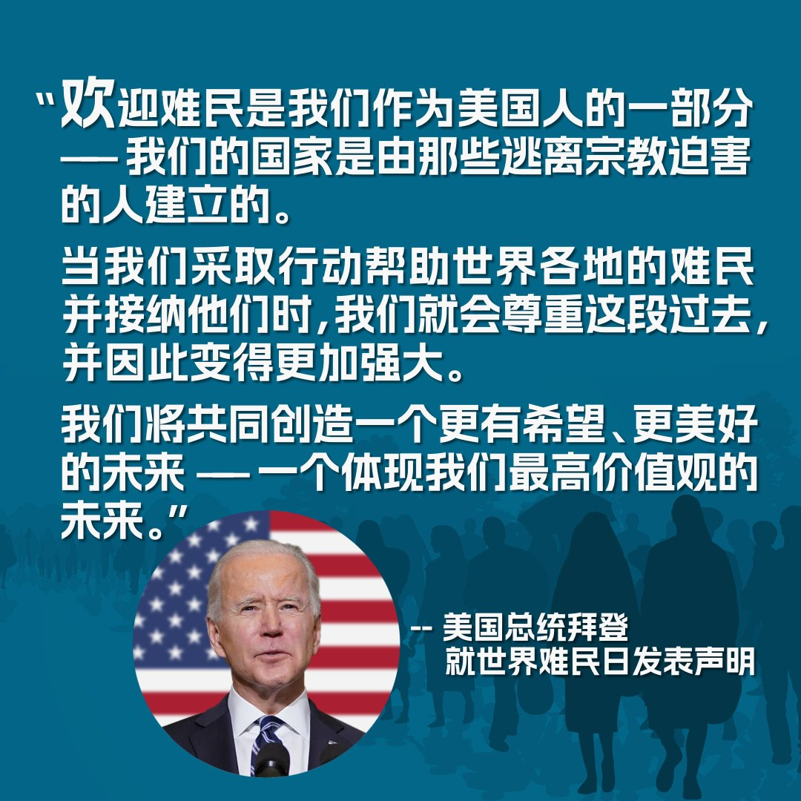

美国之音中文网 北京时间 2023-06-21T21:37:33Z 1671512684037296129 在商言商，中国经济复苏乏力迫使外资公司加速逃离 https://t.co/cgndfNNNeV   美国之音中文网 北京时间 2023-06-21T18:32:05Z 1671466007649722368 报道：台湾对中资干预明年总统大选保持警戒 https://t.co/dlL9In8aee   美国之音中文网 北京时间 2023-06-21T17:47:32Z 1671454799248900097 拜登签署行政命令 延长针对朝鲜的国家紧急措施并维持制裁 https://t.co/MDEm7b3AEv   美国之音中文网 北京时间 2023-06-21T14:40:34Z 1671407745063600128 拜登称中国国家主席习近平为“独裁者” https://t.co/iBflo4U700   美国之音中文网 北京时间 2023-06-21T14:59:03Z 1671412397926678530 五角大楼称正监视中国在西半球的一举一动 并拥有足够资源实施反制 https://t.co/ne0pyZPEW6   美国之音中文网 北京时间 2023-06-21T15:48:32Z 1671424850689429504 莫迪访美 五角大楼称美印防务伙伴关系转型时刻 https://t.co/B99JQcjdvQ   美国之音中文网 北京时间 2023-06-21T15:59:02Z 1671427493864296448 欧盟将于下周峰会再次呼吁中国协助结束俄乌战争 https://t.co/AKZqC8eIfM   美国之音中文网 北京时间 2023-06-21T11:11:00Z 1671355005457293315 新疆维吾尔人士卡西姆在中国赢得过几场英语口语比赛，上过国家级电视台，警方甚至试图招募他到海外工作，监视维吾尔维权组织，但他没有从命。北京对维吾尔实施的高压之下，警方开始一再传唤接受询问，卡西姆的生活陷入恐惧中，被迫带着妻子和女儿出逃，他的很多师友亲戚成为攻击目标。 https://t.co/Ves1d9ZEMK   美国之音中文网 北京时间 2023-06-21T11:14:04Z 1671355777771257857 因应中国挑战 印总理莫迪访美将推动国防合作迈上新台阶 https://t.co/YEktCGSIdE   美国之音中文网 北京时间 2023-06-21T11:30:00Z 1671359787089678340 习近平会见布林肯的座位安排刻意矮化对方，打破过去中共历届领导人会见美国国务卿的惯例。法国巴黎大学教授张伦告诉美国之音，这种小动作透露了习近平内心的焦虑和不自信，反而有损中国形象。完整访谈请看6/20【#时事大家谈】：https://t.co/oSr4bAq3zB https://t.co/MotheQAEwb   美国之音中文网 北京时间 2023-06-21T11:42:35Z 1671362956003790848 芯片禁令对台韩企业放水？专家：美国对华科技堵截并未松动 https://t.co/BZlX7iNjoC   美国之音中文网 北京时间 2023-06-21T12:11:00Z 1671370104892968960 美制复仇者防空系统由悍马车载的8枚装毒刺导弹旋转发射塔加上一门12.7毫米机枪及光电感应器构成，具备高机动性，射程5公里的毒刺导弹与覆盖80-100公里的爱国者远近搭配。乌军防空部队的责任是让百姓休息好，最大困难在于应对俄军无人机和巡航导弹等不同空袭手段同时攻击。 https://t.co/NI9Mpt4fsB   美国之音中文网 北京时间 2023-06-21T09:48:33Z 1671334256398979072 拜登：必须解决人工智能对安全和经济构成的风险 https://t.co/Y8f2DIrV1d   美国之音中文网 北京时间 2023-06-21T09:48:35Z 1671334263860658176 载有五人的泰坦尼克号残骸考察潜水器仍然失联 https://t.co/gqQZbvkAZN   美国之音中文网 北京时间 2023-06-21T10:30:00Z 1671344687301443584 习近平会见布林肯的座位安排刻意矮化对方，打破过去中共历届领导人会见美国国务卿的惯例。台湾时评作家汪浩告诉美国之音，习近平想营造吾皇登基、万邦来朝的形象，但实际上是赢了面子却输了里子。完整访谈请看6/20【#时事大家谈】：https://t.co/oSr4bApvK3 https://t.co/SB0PmVj34V   美国之音中文网 北京时间 2023-06-21T06:27:03Z 1671283548857462784 美英承诺资助乌克兰重建 https://t.co/gFyvf9dSm9   美国之音中文网 北京时间 2023-06-21T07:00:01Z 1671291845618585601 印度总理莫迪访问美国，享受之前只有丘吉尔才有的殊荣。美印关系达到新高度？印度能否成为美国在亚太地区制衡中国的重要盟友？中国总理李强访问德国，柏林把中国定位为“系统性对手”。中德关系今非昔比？美国之音【时事大家谈】6月21日上午9点讨论这些话题，请发表看法或提问。 https://t.co/crIFHwUmbA   美国之音中文网 北京时间 2023-06-21T07:35:23Z 1671300743347986432 美国总统拜登6月20号在加利福尼亚州与科技公司高管开会时强调，人工智能功能强大，有利于推进美国人生活的各个方面，但也需要管理其对社会、经济与国安构成的风险。他说，美国政府将与科技公司、公民社会合作，确保美国不但在此关键领域保持领先地位，也能管理随之而来的风险。 https://t.co/WbUim8UiqR   美国之音中文网 北京时间 2023-06-21T08:32:33Z 1671315132360851461 德国敦促中国对俄罗斯发挥更大影响力；中德领导人承诺合作应对气候问题 https://t.co/3h5zpLl2GY   美国之音中文网 北京时间 2023-06-21T08:46:33Z 1671318654686990336 美众议院共和党外交领袖对布林肯北京之行表示“失望” https://t.co/kZuPiQkrP0   美国之音中文网 北京时间 2023-06-21T09:16:33Z 1671326204656496640 布林肯访中称美“不支持”台湾独立，美议员：台湾已独立 https://t.co/paWBsXr4zY   美国之音中文网 北京时间 2023-06-21T04:31:34Z 1671254487007399937 法官决定8月14日开审特朗普机密文件案 https://t.co/s5jdxR0zhs   美国之音中文网 北京时间 2023-06-21T05:00:35Z 1671261787038318592 被控参与中国猎狐行动的三名男子在美国经审判被裁定有罪 https://t.co/TKUCBTRK3P   美国之音中文网 北京时间 2023-06-21T05:40:18Z 1671271782148640769 “我们已经敞开了大门，只是他们尚未选择走进来，”美国国防部副发言人辛格6月20日在例行记者会上被问到在布林肯访华后，对美中国防部长进行对话的信心是否增加时回答说。关于中国计划在古巴建立军事基地的报道，辛格表示，国防部将继续监测中国在西半球的军事扩张。 https://t.co/4UAbmz5jMn   美国之音中文网 北京时间 2023-06-21T06:14:03Z 1671280278436995072 中国将在巴基斯坦修建新核电站  https://t.co/lW23AcrtaL   美国之音中文网 北京时间 2023-06-21T06:14:57Z 1671280503259815936 "中国一直在努力提高其在西半球的影响力和情报搜集能力，这不是秘密或令人惊讶的事情，”白宫国安会战略沟通协调员科比6月20号在简报会上谈到《华尔街日报》报道称，中国和古巴正就在古巴设立一个新的联合军事训练设施进行谈判时说。该报道让各界担心，中国未来将能利用古巴扩大对美国的情报搜集活动。 https://t.co/PhfkiMLw1G   美国之音中文网 北京时间 2023-06-21T03:04:35Z 1671232594300616706 美国总统拜登在6月20日世界难民日发表声明，向全世界“被迫逃离暴力和压迫的难民的勇敢和坚韧表示敬意”。声明说，今天，全世界有将近1.1亿人被迫离开家园，比历史上任何其他时期都多。拜登政府正致力于重建“美国难民接纳项目”，计划在明年欢迎12万5千名难民到美国，帮助他们重建新生。 https://t.co/RzbP9Zb8TJ   美国之音中文网 北京时间 2023-06-21T03:44:04Z 1671242532926402560 俄罗斯使用无人机空袭基辅和利沃夫等地 https://t.co/ZtnmtWnJIB   美国之音中文网 北京时间 2023-06-21T04:14:03Z 1671250079133601792 亨特·拜登与司法部达成控辩协议，就税收和枪支指控认罪 https://t.co/WS406kVrQL   美国之音中文网 北京时间 2023-06-21T00:32:05Z 1671194219321647106 拜登称普京动用战术核武的威胁是“真实”的 https://t.co/99DePrQYig   美国之音中文网 北京时间 2023-06-21T00:48:33Z 1671198360651583488 民调显示多数澳大利亚人支持台湾抗击中国攻击 https://t.co/z00Jd3XInI   美国之音中文网 北京时间 2023-06-21T00:58:06Z 1671200765602574336 中国爆发停贷风波近一年 多数烂尾楼未复工 https://t.co/KzgwikH471   美国之音中文网 北京时间 2023-06-21T01:15:03Z 1671205031830511616 俄罗斯利用人民币逃避制裁，漏洞现已被堵死 https://t.co/D85NWMK50j   美国之音中文网 北京时间 2023-06-21T00:17:06Z 1671190447275012101 世界难民日：在英港人的漫长等待 https://t.co/bln0D08mrD   美国之音中文网 北京时间 2023-06-21T00:24:33Z 1671192322909036545 拜登将以超规格礼遇迎接印度总理莫迪的访问 https://t.co/nFOdRAG3Id   