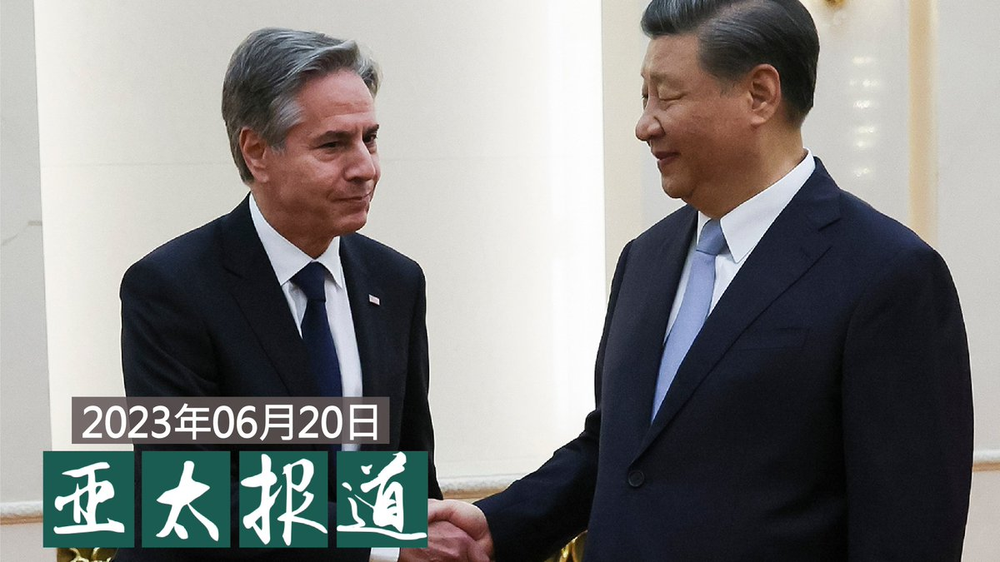

自由亚洲电台 北京时间 2023-06-21T18:48:33Z 1671470152951664640 【路透引述台湾内部安全报告】
【中国企图以旅游招待、微信汇款等影响 #台湾大选】
根据路透社的独家报道，中国政府试图利用不同方法，包括微信等通信软件、以及团体资助等，影响明年一月举行的台湾大选结果。详细报道:https://t.co/TI3mKZ6epx https://t.co/D1Jyp2bGX2   自由亚洲电台 北京时间 2023-06-21T07:00:08Z 1671291874961915904 【＃亚太报道（２０２３－６－２０）】
欢迎收听和订阅播客【亚太报道】 https://t.co/MjLNSvVMqc
海外声援 ＃李文足 等遭逼迁维权律师 家属 / 湖南女子派出所猝死事件引发关注 / ＃中国在古巴建立军事训练设施　计划曝光 / ＃布林肯　结束访华 / 台湾政界批评中国借恢复 ＃释迦 输入实施统战 https://t.co/XmS8NduXie   自由亚洲电台 北京时间 2023-06-21T08:23:45Z 1671312917583519744 RT @RFA_Chinese: 【＃亚太报道（２０２３－６－２０）】
欢迎收听和订阅播客【亚太报道】 https://t.co/MjLNSvVMqc
海外声援 ＃李文足 等遭逼迁维权律师 家属 / 湖南女子派出所猝死事件引发关注 / ＃中国在古巴建立军事训练设施　计划曝光 /…   自由亚洲电台 北京时间 2023-06-21T08:24:47Z 1671313175172599808 RT @RFA_Chinese: 怎么还在传？本台 ＃亚洲事实查核实验室 对比网路文章、抖音视频、声纹辨识后认为，网路上流传的所谓 ＃秦刚内部讲话录音，很可能是某人剪辑网上已有的视频后，冠上秦刚之名，传播错误资讯。   自由亚洲电台 北京时间 2023-06-21T09:16:37Z 1671326220439502849 RT @RFA_Chinese: 【中国聋人眼中的美国】
党大千，从小被诊断为聋人，这个结果给他和他的家庭带来无数的心酸和无助，2008年他毅然决定来美求学，对美国一无所知的他是否可以在美国生存？大千将用自己的亲身经历讲诉美中两国不同的生活，以及聋人眼中的美国社会。完整视频：h…   自由亚洲电台 北京时间 2023-06-21T04:52:18Z 1671259701756002304 纽约布鲁克林陪审团周二裁定一名前纽约市警察中士有罪，因其作为非法 ＃中国特工，恐吓一名在美国的所谓中国逃犯返回中国接受指控。
路透社6 月 20 日的报道援引布鲁克林的联邦检察官说，从纽约警局退休后成为私家侦探的迈克尔·麦克马洪 (Michael McMahon) ，受雇监视新泽西州居民、原武汉市发改委主任徐进，这是中国执法部门名为“＃猎狐行动”的追捕逃亡到境外的人员的专项行动的一部分。
美国一直在打击对持不同政见者和所谓逃犯的“＃跨国镇压”，其中包括中国。
中国驻华盛顿大使馆表示，被告不是中国执法人员，并表示这些指控是诽谤性的或基于谣言，并称遣返逃犯是一个正义的事业。
麦克马洪拒不不认罪，并辩称他不知道自己在为中国工作。   自由亚洲电台 北京时间 2023-06-21T04:59:15Z 1671261452794208256 美国国务卿 #布林肯访华，虽然外界对这次访问的成果普遍期待不高，但从媒体公布的布林肯与中国国家主席 #习近平 等人的对话中，仍然可以看到美中之间在对待两国关系上的深刻差异。 本台记者王允@Jeff23Wang 报道。
https://t.co/Y4SfW7lgh8   自由亚洲电台 北京时间 2023-06-21T06:00:01Z 1671276746295980037 6月19日，广州住房公积金管理中心首次使用 ＃数字人民币 发放贷款，标志着广州实现住房公积金缴存、提取、贷款等主要业务场景数字人民币应用全覆盖。
种种迹象显示，数字人民币试点正在提速。个人财产将变透明，钱财用途将被限制。这对您的生活意味着什么？请在评论区分享。 https://t.co/FEuvpJYGiC   自由亚洲电台 北京时间 2023-06-21T02:32:42Z 1671224572169814037 怎么还在传？本台 ＃亚洲事实查核实验室 对比网路文章、抖音视频、声纹辨识后认为，网路上流传的所谓 ＃秦刚内部讲话录音，很可能是某人剪辑网上已有的视频后，冠上秦刚之名，传播错误资讯。   自由亚洲电台 北京时间 2023-06-21T03:05:35Z 1671232847338962945 【＃事实查核｜"＃红线"取代红毯 　＃布林肯　遭中国羞辱？】
地面红线不过是机场固定画设的标线，您想多了吗？
https://t.co/y2MEPjdK39   自由亚洲电台 北京时间 2023-06-21T03:20:39Z 1671236640575205379 评论 | ＃陈破空：从元首外交到首富外交，＃习近平 能否如愿？
＃马斯克 ＃比尔盖茨 
https://t.co/mvVQp8Hpqz   自由亚洲电台 北京时间 2023-06-21T03:35:17Z 1671240320040972293 今年2月22日的内蒙古 ＃阿拉善盟新井煤矿大面积坍塌，53名工人已确认全部死亡
https://t.co/llqXpLZUDl   自由亚洲电台 北京时间 2023-06-21T03:57:21Z 1671245873064595457 美国官员表示，新的军事设施可为中国提供一个平台，令其有可能在 ＃古巴 永久驻军，扩大针对美国的情报收集活动，包括电子窃听。而最担忧的是，这一规划设施是中国 ＃141项目 的一部分。该项目旨在扩大中国军方的全球军事基地和后勤保障网络，在10年内设立15个海外基地。
https://t.co/jP96JJISJN   自由亚洲电台 北京时间 2023-06-21T00:38:11Z 1671195751068708874 美国国务卿 #布林肯访华 2天，会晤中国国家主席 #习近平 及中国高层外交官员。美方指出，布林肯达成行前拟定的3大目标，预计未来几个月美中官员将互访。
https://t.co/ozDGBkhMCs   自由亚洲电台 北京时间 2023-06-21T00:43:24Z 1671197064217210882 中国民众在深圳 #华强北 电子区可以购买到美国产顶级 #芯片，相关芯片虽然不放在货架上展示，但客户可以在询问店家后购买。而这些芯片所费不赀，有店家匿名告诉路透社，他们提供的少量高端 #英伟达（Nvidia）A100人工智能芯片，一片售价两万美元，是正常价格的两倍。
https://t.co/9PxLfv5dF9   自由亚洲电台 北京时间 2023-06-21T01:18:38Z 1671205931600977922 日本共同社金兰20日消息，#日本海上自卫队 最大护卫舰 #出云号，当天停靠在面朝南海的越南中部军事要冲 #金兰湾 的国际港。“出云”号力争改造为事实上的航母，计划搭载F-35B隐形战机。此次靠港似乎意在制约中国。
https://t.co/egCHoTPmmu   自由亚洲电台 北京时间 2023-06-21T01:40:34Z 1671211452882128901 Alphabet Inc旗下 #谷歌 公司（Google）已开始与印度当地供应商展开初步交涉，寻求将其部分Pixel智能手机移往 #印度 生产。
https://t.co/dCMXIGBj2R   自由亚洲电台 北京时间 2023-06-21T02:16:22Z 1671220462137769998 王丹 @wangdan1989 日前发起声援行动，联署致信北京市长殷勇、公安部长王小洪及北京市公安局长元延军，呼吁当局停止对“#709大抓捕案”律师 #王全璋、#李和平 两家的政治迫害、逼迁及边控。“这种不给人活路的做法，应该引起国际社会的高度关注。”

https://t.co/kdZTC3WoBp https://t.co/dWHBdwP0Vk   自由亚洲电台 北京时间 2023-06-21T00:14:29Z 1671189790551683073 中国国台办本周二宣布，即日起恢复台湾 #释迦（又称番荔枝）输入。有台湾立委批评中方是选择性放行，目的在于分化台湾社会。
https://t.co/PxJbaZE7h5   