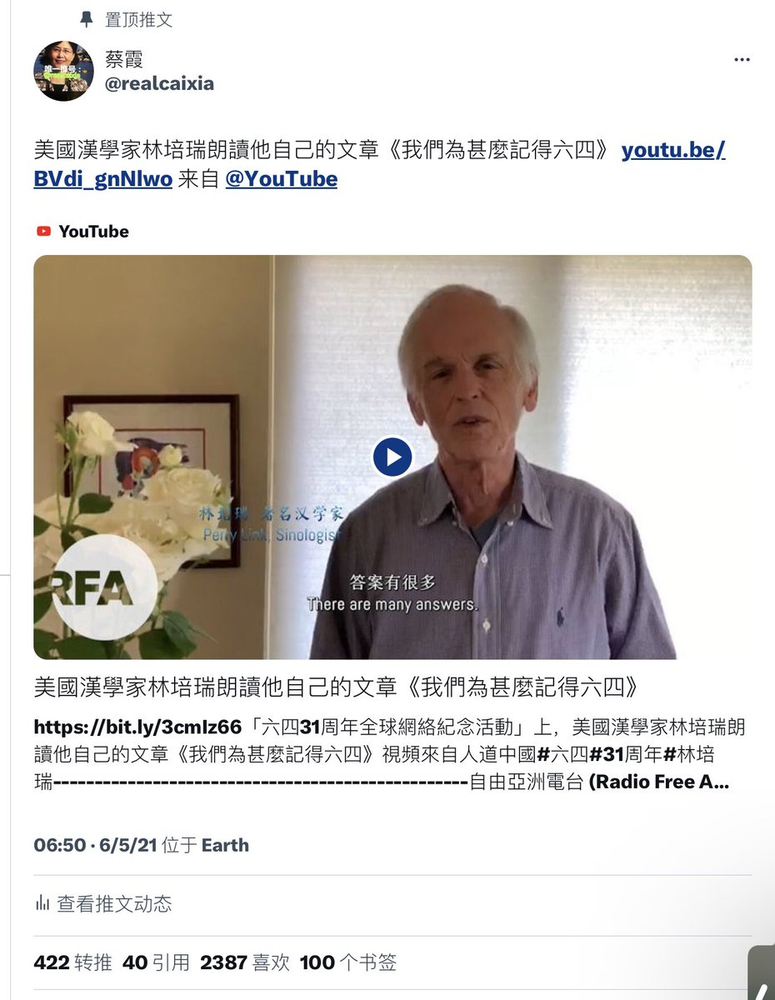

蔡霞 北京时间 2023-06-21T10:35:19Z 1671346026052222977 我已经撤了先前的推特文。   蔡霞 北京时间 2023-06-21T07:01:22Z 1671292186133159937 RT @onglynette: Hired thugs are a v common tactic in forced eviction. If you're curious, listen to my book podcast w @NuVoices :https://t.c…   蔡霞 北京时间 2023-06-21T09:14:11Z 1671325609648091136 这两是同一副照片吗？我觉得参考消息动了些手脚吧？一个中央政府国家通讯社主办的有几十年历史的老报纸，不至于弄些这些小心眼儿小鸡肚肠的上不得台面的小伎俩吧？真不嫌丢人。 https://t.co/uvhGQ7g4Tf   蔡霞 北京时间 2023-06-21T05:52:19Z 1671274806765932544 https://t.co/XKX589LUv5   蔡霞 北京时间 2023-06-21T00:25:06Z 1671192460066803713 RT @gaoyu200812: 八九貴州學運領袖、詩人季風今年五月被北京國保逼遷不得不到外地流浪，最近剛剛回到貴陽，住在朋友家，省國保就找上門，讓他立即離開貴陽，告訴他一會縣裏的國保就來領他，還找了季風在貴州的朋友談話進行恐嚇 。季風早已被邊控，北京、省會不讓呆，是今年人權迫…   蔡霞 北京时间 2023-06-21T00:30:35Z 1671193842224365568 中共习朝自恋幻想症一直发作。   蔡霞 北京时间 2023-06-21T01:16:11Z 1671205315629527055 RT @Jerry00107966: 看图辨真相😄 https://t.co/815k8oUsgc   蔡霞 北京时间 2023-06-21T00:03:37Z 1671187054091182080 沈志华先生是位很扎实严谨的学者，他与宋先生见面，肯定是探讨收集中共党史上一系列重大问题包括中苏关系、韩战等的史料。这样的学术性历史考证研究于民族是功垂千秋，沈先生一生散尽千万金专注于此。“在齐太史简，在晋董狐笔”，我看沈先生，即为当代董狐笔，不为一党一国而为民族治史。   蔡霞 北京时间 2023-06-21T00:11:47Z 1671189111200260097 RT @yibao_en: 華爾街日報：美情報確認 武漢病毒研究所人員最早期感染covid（症狀）那3個人員就是研究sars病毒的人   蔡霞 北京时间 2023-06-21T00:13:25Z 1671189518672699392 RT @ShengXue_ca: 这是年轻一代的英姿～👇
2023 年成为律师的天安决定放弃多伦多高薪的律师事务所工作，加入哥哥王代时创办的北江律师事务所，双双成为人权律师，这是 89.64 精神的传承，也是告慰天安门英年早逝的英雄们的义举……
https://t.co/fUS…   蔡霞 北京时间 2023-06-21T00:20:00Z 1671191177423470592 RT @SecBlinken: I extend my deepest gratitude to the entire Mission China community for your work across the country, especially during the…   