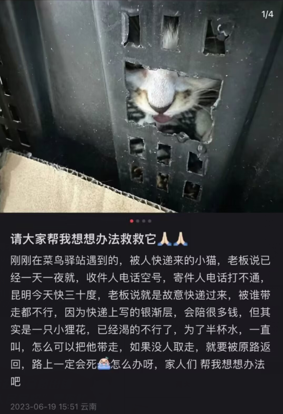
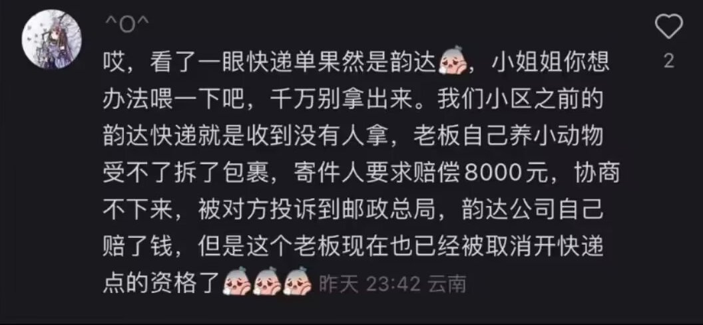
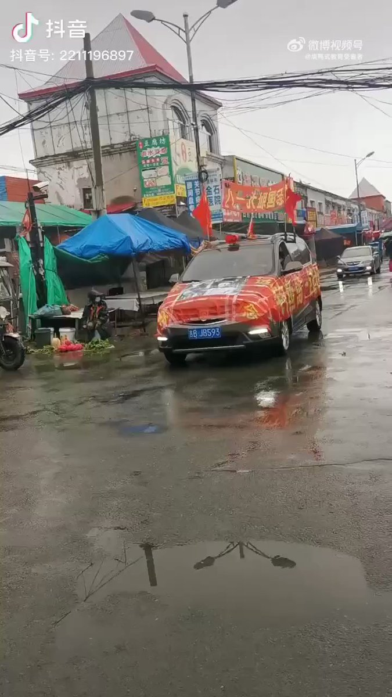
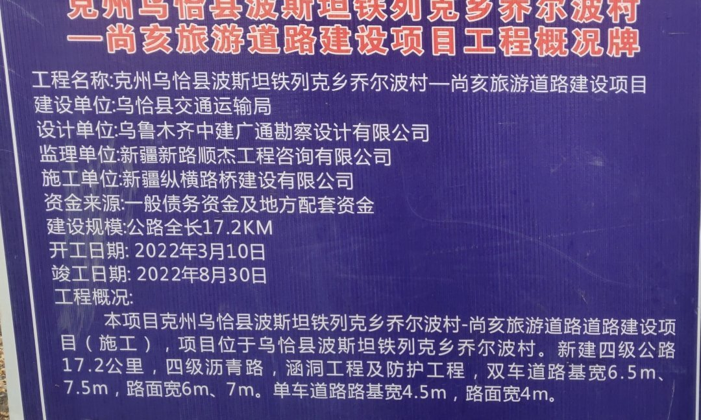

谁将十万横扫三江 北京时间 2023-06-21T18:53:06Z 1671471298223169536 典型的劣币驱逐良币，有爱心？这里是中国 https://t.co/YHyKQmieDv   谁将十万横扫三江 北京时间 2023-06-21T12:14:58Z 1671371102906634241 赚钱嘛，不寒掺 https://t.co/VbaVzv5wV3   谁将十万横扫三江 北京时间 2023-06-21T07:59:08Z 1671306720952590336 https://t.co/lBVLtCPI4o   谁将十万横扫三江 北京时间 2023-06-21T08:26:20Z 1671313565154951168 网友们，大家好！
       我是广州市一名维修人员，在广州市黄埔区护林路状元谷物业维修空调数次，物业欠我维侈及材料费3180元，由于物业人员变动，维修费无法结算。讨薪两年无果。维修清单已交物业。
      我们维修人员一般接到物业电话后，24小时内到达物业，解决空调问题，没想到的是，讨薪那么难。
        先报110，无法解决，然后拔打广州市府热线12345，市政热工作人员称找黄埔区劳动局，找到劳动局之后，劳动局称找法院。这样推来推去，最后赔了夫人又折兵，空手而归。
       2023年2月13日，广东东莞讨薪凶杀案，3600元，死三人，2023年5月31日，江苏南通讨薪案死二人，这些英雄的行为，给了讨薪者们的借鉴。相信不会是最后一例。
      如果我们的政府以及相关部门给不了受害人答复，受害人只有拿起屠刀，为自已维权，为人民英雄点赞
               受害发言人:程伯友   联系:13922297360
              2023年6月21日   谁将十万横扫三江 北京时间 2023-06-21T08:30:39Z 1671314652914139136 河北张家口阳原县泥河湾村虚假扶贫危房改造偷工减料质量堪忧

​​本人常建文家住河北省张家口市阳原县化稍营镇泥河湾村，一身病痛，因病致贫，几万左右的公立医院，三甲医院正规门诊自费票据无法通过防贫保险，，医疗救助，兜底保障报销，统计家庭纯收入，也不扣减因病等刚性支出，虚填贫困收入明白卡表格，医院费用实在是太高了看病看不起，由于身患多种疾病失去劳动能力行动不便，看病加上两个孩子上学，入不敷出，现在儿子已经退学打工，政府口口声声的主动帮扶一部分是我通过多次信访举报拖着病体争取来的，当时申请贫困户办理贫困户，低保的时候村干部暗示得花钱办理，咱也不会人情世故，低保审批不通过，后来通过多次信访举报才办理下来低保。终于明白有钱能使鬼推磨，无钱寸步难行。在国家纪检委实名举报村干部违规存在关系户，直系亲属办贫困户，低保户，国家纪检委转达到镇里纪检委，然后村干部来就来家里找我，镇纪检委也没有送达书面结果，官官相护。昂贵的医疗费用实在负担不起，村里给家里计算纯收入登记时都是村干部自己随意填写。家里省吃俭用生活支出孩子上学费用还有看病开销《刚性支出》就得三四万左右，入不敷出，去年本人发微博，领导们知道后来了我家好几趟，找我谈话，答应帮我解决实际困难，让我删除微博出于压力我只能删除微博，由于身患多种疾病每年需要复查，医疗费用花费太大，孩子上学，家里日常开销，看病花费太大，生活难以维持。妻子受不了这没钱过日子的苦，自费给闺女办理了住校，分居打算离婚。如果没有这场久病，就不会如此狼狈，也看透了人心，那些虚情假意，嘴上一套背地里又一套，在这个充满人情世故的社会里，，当你不知道如何打点关系，那么你的路就会越走越窄。没有好处谁也不会真心实意帮你。只会弄虚作假欺骗老百姓，欺瞒上级。每次生活出现了严重困难，都是自己拖着病体努力去争取，希望能得到政府，国家的帮助度过难关，可每次都是一言难尽，一次次申请，一次次失望，不得不多次信访举报，才解决部分困难问题，只能无奈妥协。2021年由于房屋承重墙多处出现一公分左右的持续裂缝，地基下沉严重向西倾斜，本人申请危房改造，村干部陈卫峰带领住建局来鉴定说本人房屋是危房，得拆除重建，后我给村干部陈卫峰打电话询问危房改造他说得个人出五千块钱，危房改造合格后在给个人账号打款一万一的危房改造款，本人由于需要看病拿不出五千块钱，后村干部带住建局来了几次又改口说不是危房，所以本人通过多次信访，在2022年四月份镇胡在东副书记带着上级领导重新鉴定后说是按危房修缮加固一万一标准拆西承重墙，锯掉下沉房间水泥檐板，减轻东面两间房的倾斜压力，重新砌墙换瓦，在2022年六月才开始施工，让本人和施工队签不公平协议，本人没有签，施工方不按原先计划方案施工，用劣质砖，沙子，原地基拆了一半，不给拆了，就开始施工，由于新旧地基不是一样的水泥，粘合力不强，存在安全隐患，本人多次给村干部和镇胡书记打电话，没有解决所以又信访一次，得罪了施工队，由于房屋已被拆了一半，当时本人还要在东面两间房居住出于安全考虑只能无奈妥协，继续施工，七月份砌了墙抹了灰铺了地砖，从新吊顶，但到了2023年墙面像油渍一样没有干透，墙面到处都是淡黄色裂缝，鼓包开裂，屋内甲醛，TOVC有毒气体严重超标。可这些有毒气体不应该出现在水泥墙和水泥地面里.怀疑信访举报得罪人打击报复施工的时候被添加了别的东西，在本人的洗澡桶和洗菜桶还发现了红色不明物质。4月9号110报警后化稍营镇派出所拿走化验物却一直没有给出化验结果，也没有立案。现在身体出现头晕恶心状况，危害身体健康！有关机关单位办理事项推诿敷衍拖延弄虚作假，扶贫危房改造工程本来应该是施工单位和政府签署协议，为何要把协议转嫁给贫困户?把一切责任推给困难户?既然危房改造款完工质量合格后打卡的困难户手中在转账给施工方，为何实际根本没有这套手续?三月份镇里让村干部带第三方检测机构来家里检测，根本没有按检测要求密封房间最低十二小时以上，温度最低十六度以上检测，只是关了半个小时窗户，室内温度五六度的环境下检测，不符合检查标准要求！而且检测完了也没有让我看当初基本检测数据，也一直不给我看后来的CMA检测报告。官官相护，不解决问题，推诿扯皮，弄虚作假，威逼利诱，画大饼。我只是希望按原来上级领导商议好方案进行，保证房屋安全，和人身健康权益，不浪费国家资源，但希望不要把一切责任推加在老百姓身上，毕竟话语权在施工方和领导干部嘴上，毕竟老百姓实在什么也不懂，老百姓只能听天由命吧！   出于无奈有时候不得不忍气吞声无奈妥协。所以不会人情世故打点关系的老百姓还是平平安安，健健康康就好！否则当你遇到真正困难时，你就会知道生活有多难，社会有多现实。虽然党的政策好，人民当家做主，为民谋利，但总有阳光照不到的地方！基层腐败不作为乱作为，漠视老百姓利益。难道非逼老百姓动不动就信访，纪检委举报?  当扶贫，村集体利益成为当官某些人自己小集体利益的时候，何谈乡村振兴！   谁将十万横扫三江 北京时间 2023-06-21T08:31:19Z 1671314819440590848 我于2022年三月到新疆纵横路桥，乌恰县铁列克乡桥尔波村尚亥旅游道路项目干活，工具车，连人带车工资45800元，陈老板，电话18116943218，项目经理，于经理电话13039457776，纵横公司电话15699039866，是他们交通局的活，也是交通局管吧，乌恰县交通局说3月份解决，又说5月底之前解决，又说6月20号到现在也没解决，希望你们监督该项目把工资给解决了   