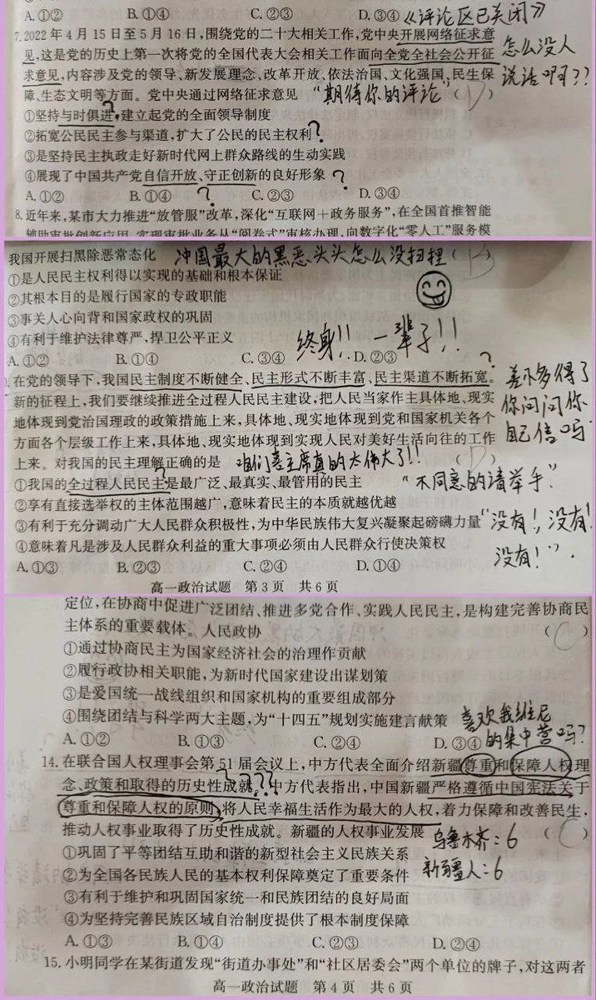

D每日反共 北京时间 2023-06-20T20:38:12Z 1671135360737480705 要素齐全😄 https://t.co/NXXyX71fQM   D每日反共 北京时间 2023-06-20T18:16:39Z 1671099736894615552 扎心的真相👇 https://t.co/KsjSjpWUio   D每日反共 北京时间 2023-06-20T13:08:30Z 1671022187975933954 没有小民尊严，何谈大国崛起？ https://t.co/nlRBdIh2vQ   D每日反共 北京时间 2023-06-20T13:09:20Z 1671022396776804352 RT @gushenyiren8964: 是的，擁護共產黨確實有飯吃，所以中共國在1959年開始了三年大吃飽運動。吃飽到4000萬人撐死了，吃飽到100萬人有力氣有精神游泳到英屬香港。 https://t.co/7dIMNW71zv   D每日反共 北京时间 2023-06-20T13:09:35Z 1671022459955597313 夹缝中求生存😢 https://t.co/YfuUybEtWq   D每日反共 北京时间 2023-06-20T13:36:57Z 1671029349179617280 这么简单的事情，在中共国却能无限反转😓 https://t.co/ifQsoNbo3R   D每日反共 北京时间 2023-06-20T13:47:14Z 1671031934821228545 谁说中国共产党与中国人民不可分割？

这不就分得挺清楚👇 https://t.co/iiSSi6MojF   D每日反共 北京时间 2023-06-20T11:27:07Z 1670996673533980675 流氓外交，成何体统？   D每日反共 北京时间 2023-06-20T11:46:34Z 1671001567779225600 中共那些“科技龙头”可笑不出来😉 https://t.co/39UEccBNnB   D每日反共 北京时间 2023-06-20T09:50:14Z 1670972293638672384 中共国的城市，一下雨就变成威尼斯👇 https://t.co/04KcTztFQC   D每日反共 北京时间 2023-06-20T09:50:33Z 1670972374106406913 💡 https://t.co/0m5KUuFfNH   D每日反共 北京时间 2023-06-20T09:50:55Z 1670972463717695488 RT @gushenyiren8964: 喜歡講「共產黨代表中國人」的，都是在幫共產黨做宣傳搞維穩。

共匪真的代表中國人嗎？如果共匪代表中國人，為何中國每年群體事件20萬起以上？為什麼共匪不敢在中國舉行全民選舉？因為他知道如果中國人有選擇權，第一個就會把共匪罷免下台

維穩費…   D每日反共 北京时间 2023-06-20T09:51:41Z 1670972657817505794 RT @gushenyiren8964: 反駁一個謠言：中國人跪了幾千年

首先中國人以恥辱形態開始跪拜是靖康之恥後金在北方推行。徽欽二宗被抓被迫給金下跪，當時南宋人聽後都認為是奇恥大辱。崖山後蒙古人把下跪推廣全國。明朝沒廢除。清軍入關後再次把下跪「發揚光大」

下跪這東西就是…   D每日反共 北京时间 2023-06-20T09:52:19Z 1670972815900831744 灭共，得靠我们自己。 https://t.co/GPjtcxfVt9   D每日反共 北京时间 2023-06-20T09:54:01Z 1670973244504166400 凭啥？ https://t.co/9siS8winOe   D每日反共 北京时间 2023-06-20T00:24:14Z 1670829854022078464 中共的数据没有丝毫参考价值👇 https://t.co/UynmNfBm1d   