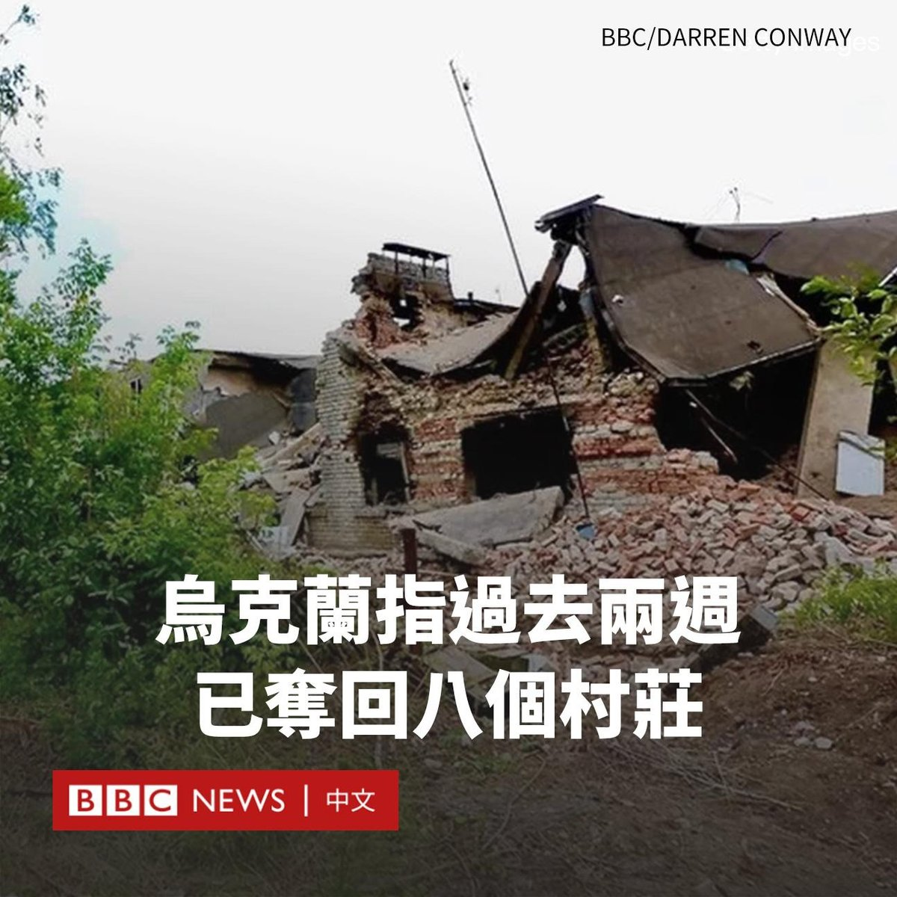
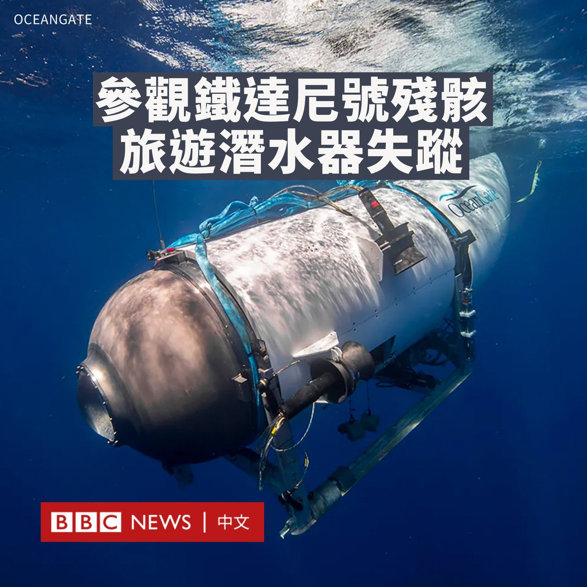
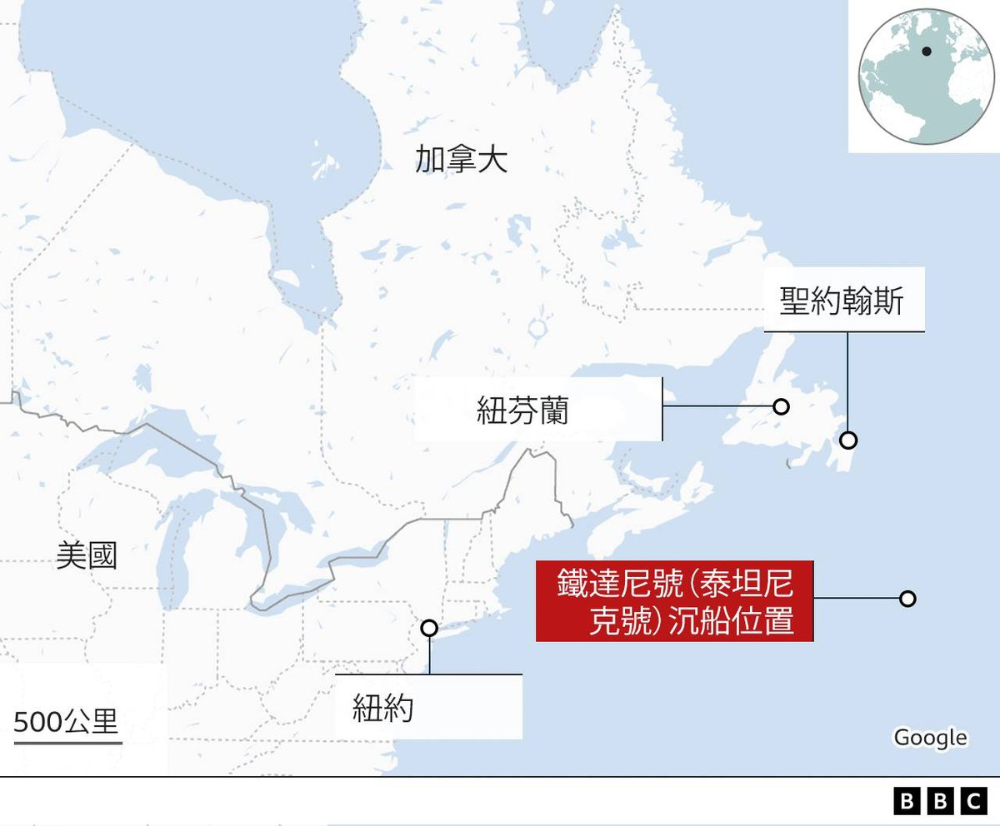
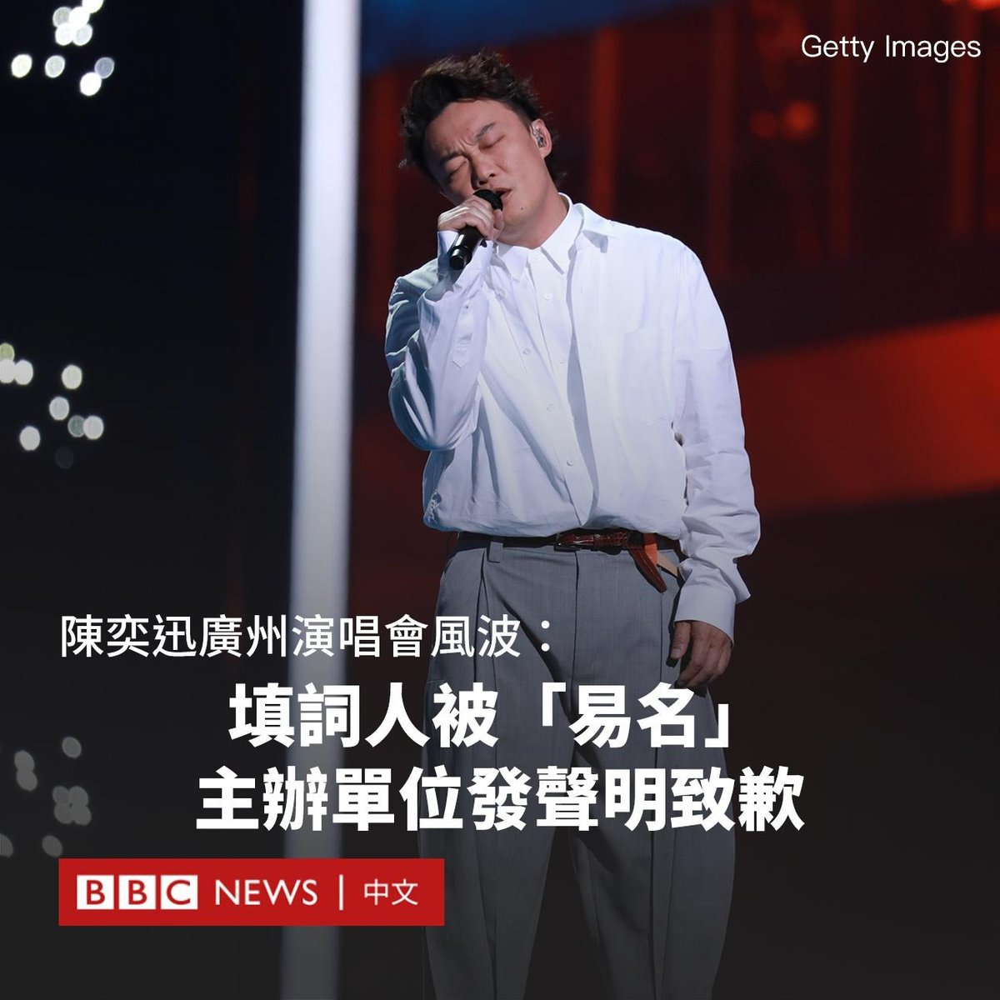

D英国广播公司BBC 北京时间 2023-06-20T20:22:27Z 1671131394456817664 自乌克兰反攻开始以来已经两周，基辅周一（6月19日）表示，乌克兰军队已经从俄方手上夺回八个村庄。

据路透社报导，在两周内，乌克兰向俄罗斯的防线推进了7公里，夺取了113平方公里的土地。

乌克兰国防部副部长马里亚尔（Hanna Maliar）表示，乌克兰军队夺回的领土包括南部战线重镇皮亚季哈特基村（Piatykhatky）。

皮亚季哈特基村是重兵把守的一个定居点，扼守通往亚速海海岸的直接路线。

马里亚尔还表示，俄军不会轻易放弃他们的阵地，乌克兰必须为一场艰难的决斗做好准备，军队 “正在按他们应该有的方式行动。而最大的打击还在后面”。

她表示，最激烈的战斗在乌克兰的东部和南部。另外，乌克兰军方正在阻止俄罗斯在东部地区的推进，其集结了大量部队在那里，包括空中突击部队。

总统泽连斯基（Volodymyr Zelensky）说，基辅的军队在一些地区向前推进，在另一些地区抵御猛烈的攻击。但他称，净结果对乌克兰是有利的。

“我们没有丢失的阵地，只有被解放的阵地，而他们只有损失。”他说道。   D英国广播公司BBC 北京时间 2023-06-20T17:18:51Z 1671085193158078465 美国俄勒冈动物园的工作人员训练了一只获救的九岁海獭朱诺（Juno）打篮球，目的是锻炼她的肘关节，缓解她的关节炎。现在，她已经成为了一个篮球明星。 https://t.co/RnOFo8pd0Y   D英国广播公司BBC 北京时间 2023-06-20T15:50:41Z 1671063005373820928 2019年香港爆发持续数月的“反修例”示威潮。直到2020年北京在香港实施《国安法》，街头抗争才得以平息。之后的几年里，香港政府继续对社会各方面进行“改造”。

BBC中文采访了三位来自不同政治光谱的人，他们透过各自的亲身经历讲述了这些年香港巨大的社会变迁。https://t.co/stffxcsgom   D英国广播公司BBC 北京时间 2023-06-20T12:44:46Z 1671016214963843072 在中国职场竞争激烈的环境下，许多年轻人回家做起了“全职儿女”，通过做家务或陪伴父母来获得认可。有人甚至与父母签订了一份劳务契约，列出付出与报酬。https://t.co/flnsMb91xv   D英国广播公司BBC 北京时间 2023-06-20T14:12:52Z 1671038386289938432 一艘观光潜水器周日（6月18日）在前往参观泰坦尼克号（铁达尼号）沉船残骸时失踪，船内共有五人。美国和加拿大搜救队目前正在大西洋中部彻夜搜救，但目前仍未发现其踪迹。

这艘小型潜水器在下潜约1小时45分钟后，与外界失去联系。该潜水器被认为当时距科德角（Cape Cod）海岸约1450公里。

潜水器上的乘客包括英国富豪、探险家哈米什·哈丁（Hamish Harding）。截至周一（6月19日）下午，据信这些船员还剩下大约四天的氧气。

截至目前，救援人员已经使用了军用飞机、潜艇和声纳浮标来搜寻。

泰坦尼克号的沉船遗址位于加拿大纽芬兰圣约翰斯（St. John's）以南约700公里的海域。

这次旅程为期8天，包括深潜至3800米的沉船遗址，价格为25万美元。

据报导，失踪的潜水器是旅游公司“海洋之门”（OceanGate）的泰坦号（Titan）潜水器，这艘潜水器可容纳五人，通常携带四天的应急氧气供应进行下潜。   D英国广播公司BBC 北京时间 2023-06-20T11:01:04Z 1670990116825726976 上周，一艘移民船在希腊附近海域沉没，数以百计偷渡者生死未卜。BBC掌握的证据显示，超载偷渡者的渔船在沉没前七个小时内几乎不曾移动，与希腊官方说法相违背。

此前，希腊官员称移民船并无险情，反而正安全地驶往意大利，因此海警并未试图上前营救。https://t.co/oh728wu2wK   D英国广播公司BBC 北京时间 2023-06-20T08:58:53Z 1670959368588894208 香港知名歌手陈奕迅近日因广州演唱会送审歌单一事，引发风波。

陈奕迅将于本年年底赴广州举行巡回演唱会，但近期在网上传出一份演唱会歌单，歌单上出现多首由林夕填词的歌曲，但其“填词人”一栏上却出现其他填词人的名字。

林夕是香港知名作词人，香港乐坛相当数量的知名作品都出自他手。但曾多次发声支持香港示威运动的他在2020年在中国当局批评为“港独”，部分作品遭到封杀。

主办单位周日（6月18日）发声明致歉，称其在报批过程中，由于“操作不够严谨”，发生“重大失误”。

据报导，约一周前，广州市文化广电旅游局的官方网站刊登了一份由广州新辉文化公司申请的 “演出准予许可决定”，而新辉文化是“陈奕迅Fear and Dreams巡回演唱会—广州站”的主办单位。

该批文显示了送审的申报资料，并附上演出歌单，包括64首歌曲的信息，其中多首原由林夕填词的作品，填词人栏目却“易名”为其他人。

例如《K歌之王》和《你给我听好》改为林若宁；《十年》改为黄伟文；《爱情转移》和《想哭》改为周耀辉等。

该事件在中国大陆和香港引发议论。有网民批评把林夕的名字“除名”是为了迎合当局，以方便通过审查，还有人指责这种行为“忘恩负义”。

广州新辉文化星期日在微博发声明致歉，称“报批中发生重大失误，对词曲作者造成不良影响”，并会取消此次的批文申请。   