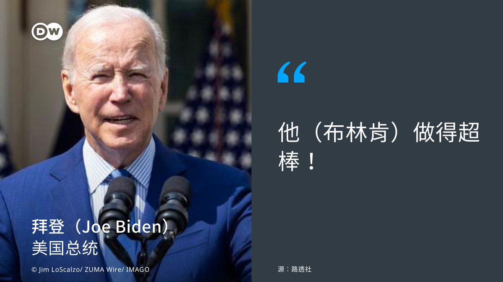

德国之声 北京时间 2023-06-20T16:14:55Z 1671069102285246467 中国大陆国台办发言人朱凤莲表示，“一段时间以来，中国国民党副主席夏立言、台东县长饶庆铃等人士多次向大陆有关方面表达恢复台湾番荔枝（释迦）输入大陆的强烈愿望，并组织业者进行整改。在综合评估相关整改措施的基础上，海关总署决定自6月20日起恢复台湾地区番荔枝输入。” https://t.co/KIWPAuNRT9 https://t.co/1KUbAmnFe9   德国之声 北京时间 2023-06-20T16:16:52Z 1671069592158978050 2021年9月，中国海关总署发布通知，宣布自9月20日起暂停台湾番荔枝（释迦）及莲雾输入中国大陆。理由是：大陆海关多次从台湾地区输大陆番荔枝和莲雾中检出检疫性有害生物“大洋臀纹粉蚧”，为防范植物疫情风险，依据大陆有关法律法规和標准将暂停上述两种水果输人。   德国之声 北京时间 2023-06-20T16:18:31Z 1671070007101464578 包括环球时报、中国新闻网、玉渊谭天在内的一些中国官方媒体微博账号发布恢复从台湾输入释迦水果的消息时，都对评论功能做出限制。   德国之声 北京时间 2023-06-20T11:09:18Z 1670992189411975168 台湾军事专家透露，日本智库将于7月再次举行台海危机的兵推模拟，并首度邀请台方参与，究竟这次的兵推与过去有何不同？https://t.co/OiEc8wbjXz   德国之声 北京时间 2023-06-20T11:23:00Z 1670995637528309762 【中国供应商规避美 #晶片出口管制】🇨🇳 🇺🇸

在 #美国 的出口管制之下，在 #中国 若想买到高阶的英伟达（Nvidia，又译辉达）的 #AI晶片，要去哪里买❓据路透社报导，如果是私下少量购买，还是有机会买到，但价格可就不便宜了。
详细报导👉https://t.co/bUuwphPNQv https://t.co/AJFkCAaa56   德国之声 北京时间 2023-06-20T08:20:36Z 1670949735421870081 【拜登：中美关系走在“正途”上】🇨🇳🇺🇸
美国国务卿 #布林肯 周日（18日）展开推迟已久的访华之旅，先后会见中共中央外事办主任王毅、#习近平 后，美国总统 #拜登（Joe Biden）19日称，美中关系正走在“正确的道路上”。
（续） https://t.co/VrImlYuJVq   德国之声 北京时间 2023-06-20T08:21:09Z 1670949872852434945 当记者询问布林肯此行是否取得进展时，拜登不仅回答“已经取得了进展”，还赞扬了布林肯，称“他做得超棒”。
 
路透社指出，中美19日虽同意稳定关系、避免陷入冲突，但尚未能取得任何重大突破。
 
🤔您同意拜登的说法吗？请在留言处跟与我们分享👇   德国之声 北京时间 2023-06-20T08:21:36Z 1670949985977008128 🗞️相关报导🗞️
。布习会：https://t.co/UFXMncUWGK
。专家评布林肯访华：https://t.co/AJyxOINE10   德国之声 北京时间 2023-06-20T09:40:12Z 1670969766209781760 #日本 警方日前逮捕了1名 #中国 籍研究员，罪名是涉嫌向一家中国公司泄露数据。中国外交部发言人毛宁19日对此发表了回应，她说了什么？这名研究员泄漏了什么数据？🇨🇳🇯🇵https://t.co/XjZzpHqV3z   德国之声 北京时间 2023-06-20T05:42:00Z 1670909822105968642 美国国务卿布林肯到访北京，这是五年以来，访问北京的最高级别美国官员。中国总理李强访问柏林，并开启第七届德中政府磋商。种种迹象显示，中国和西方的对话渠道正在逐步恢复。

https://t.co/RsbkgrqHHl https://t.co/DE3cJgMNWA   德国之声 北京时间 2023-06-20T00:49:22Z 1670836178596122626 美国约翰-霍普金斯大学中国问题专家蓝普顿教授在接受德国之声采访时表示，布林肯访华的积极方面包括，增加了两国首脑年底会晤的可能性。但双方并未就军事领域建立互信和沟通措施达成一致。

https://t.co/AJyxOIN6bs   