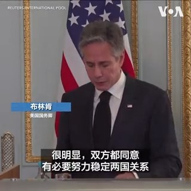
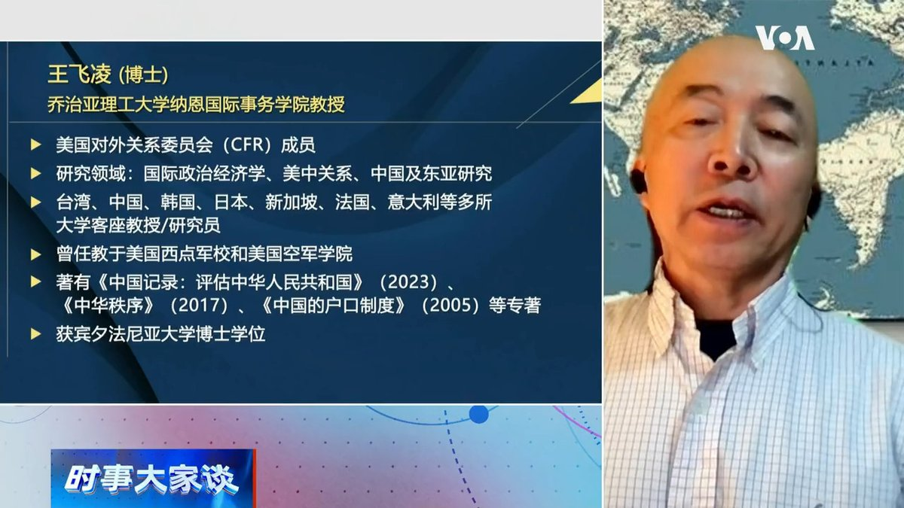
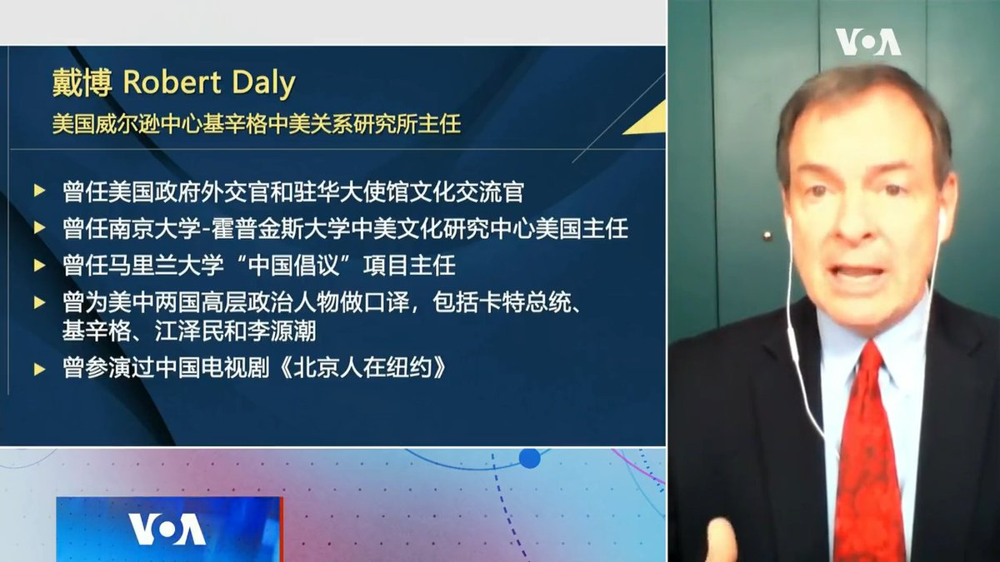
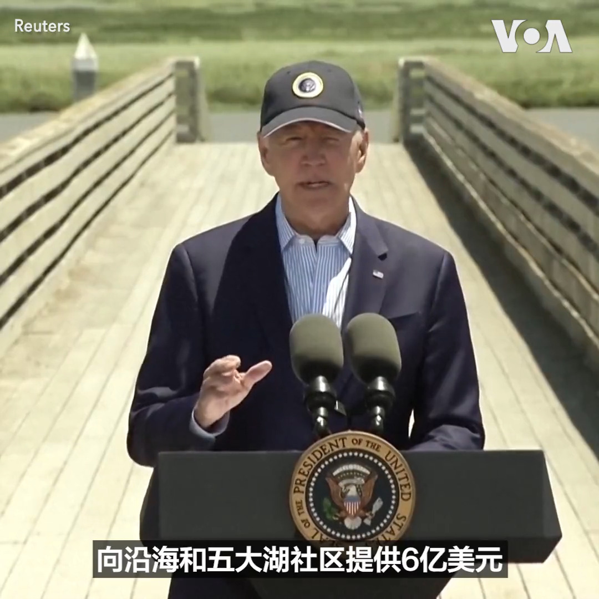
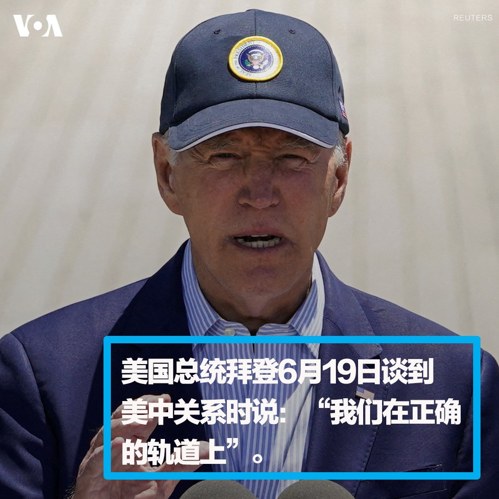
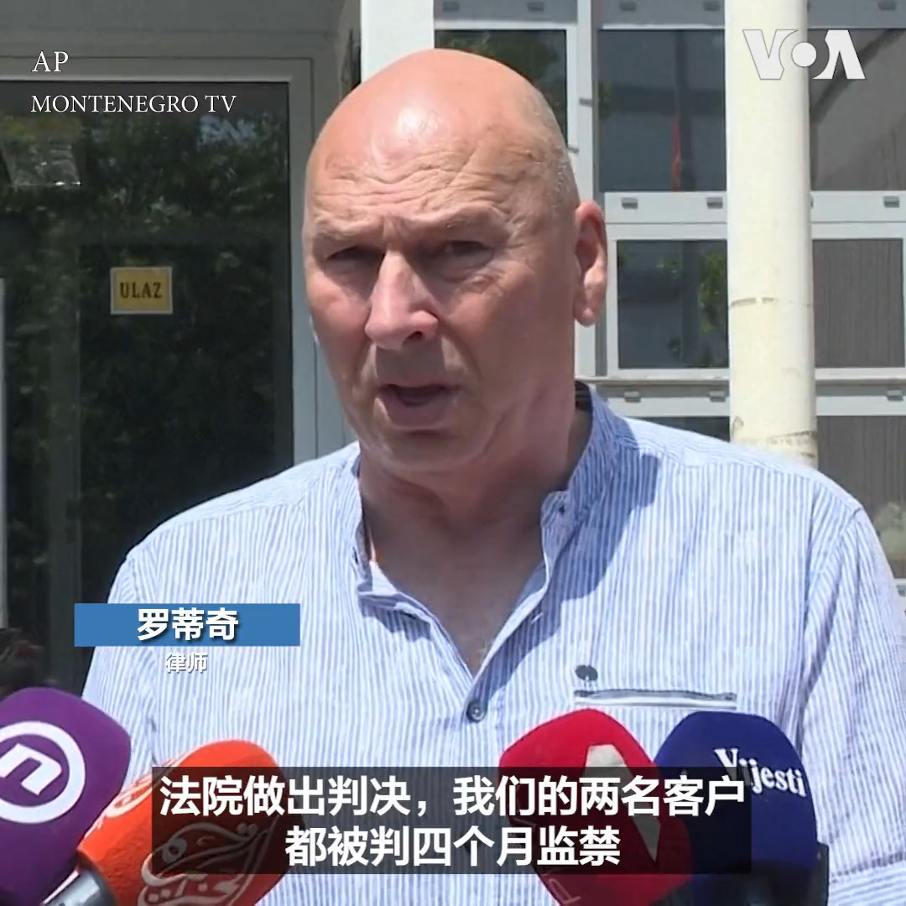
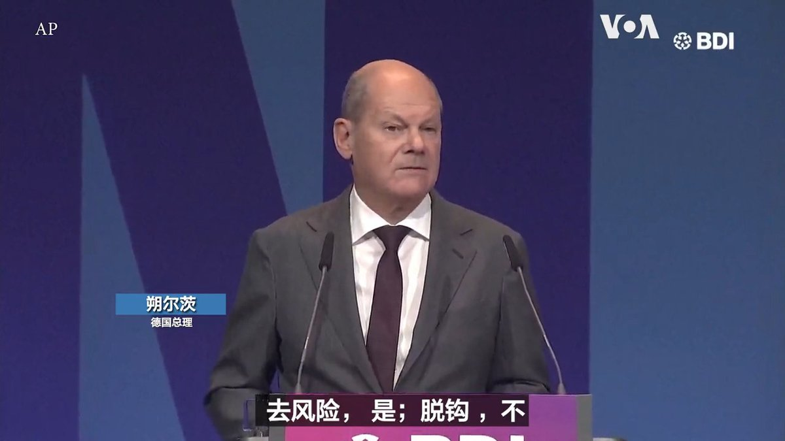
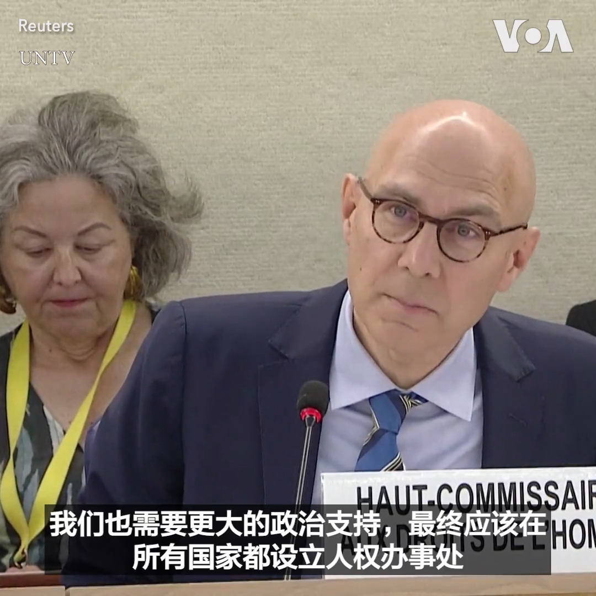

美国之音中文网 北京时间 2023-06-20T23:54:23Z 1671184731067621376 美国国务卿布林肯6月20日表示，尽管美国和中国存在“非常深刻、非常显著的分歧”但双方都同意需要稳定两国关系。他说：“我们确定了对话与合作可能有利于双方和世界其他国家的具体领域。” https://t.co/1rrPUfj4q5   美国之音中文网 北京时间 2023-06-20T20:48:33Z 1671137961923215365 世界媒体看中国：美中关系的悬念 https://t.co/NSgvhrXrQX   美国之音中文网 北京时间 2023-06-20T21:00:36Z 1671140994384019457 6/20【#时事大家谈】美中关系谷底反弹 冷战走向冷和？两岸欧洲交锋 英德法如何选边站？

嘉宾：法国赛尔奇-巴黎大学教授张伦； 台湾时评作家汪浩
主持人：樊冬宁

Youtube🔗 https://t.co/oSr4bAq3zB https://t.co/hlil8TQ0lx   美国之音中文网 北京时间 2023-06-20T21:57:04Z 1671155204765659140 美中关系再添变数：中古谈判在古巴岛北部建立联合军事训练设施 https://t.co/uEkpTbvsME   美国之音中文网 北京时间 2023-06-20T22:08:43Z 1671158140581318656 德国总理朔尔茨和中国国务院总理李强6月20日率内阁成员举行第七轮德中政府磋商。朔尔茨敦促中国在乌克兰战争问题上对俄罗斯施加更大影响并采取更多行动说服俄罗斯结束战争。此外，朔尔茨还强调了德国反对与中国经济脱钩的立场。两国还表示将共同应对气候变化。相关报道：https://t.co/Yz27rGWKoJ https://t.co/9JYdwuLJIE   美国之音中文网 北京时间 2023-06-20T18:22:03Z 1671101095408730112 报道：日本金融监管机构提醒银行为潜在台海冲突制定因应方案  https://t.co/rQTtdzX77l   美国之音中文网 北京时间 2023-06-20T18:36:20Z 1671104691210686465 印太战略专家表示，美国欲透过直接沟通，传达希望中国能成为一个讲法理、负责任的大国的立场，达到多赢的策略。日本学者认为，若是亚洲情势暂时缓和下来，日本有更多的时间做好准备与中国脱钩。朝鲜半岛专家指出，美中若能减低军事冲突的可能性，韩国就能更加专注在朝鲜问上。https://t.co/6jxorANsfL https://t.co/pguBdDCvCw   美国之音中文网 北京时间 2023-06-20T17:14:33Z 1671084109572214784 美中持续抗衡下 李强周二与德国政府进行磋商寻求中国利益 https://t.co/QEXsZOQ9zO   美国之音中文网 北京时间 2023-06-20T17:44:32Z 1671091655422906369 布林肯访中期间重申反对改变台海现状 台政府表态持续深化台美安全伙伴关系 https://t.co/JpSyPauCQm   美国之音中文网 北京时间 2023-06-20T15:43:03Z 1671061083149459456 中国恢复进口台湾番荔枝 国民党称交流对话有成效 民进党批政治操作 https://t.co/vaohNWgCJA   美国之音中文网 北京时间 2023-06-20T12:30:00Z 1671012499225755651 5年前时任国务卿蓬佩奥第二次访问北京没有受到习近平的接见，标志着美中关系冰封。今天习近平会见了布林肯，许多观察人士认为具有指标意义，可能意味着美中关系解冻。乔治亚理工大学国际关系教授王飞凌说，冰冻三尺非一日之寒，习见布林肯谈不上解冻，只具有象征意义。完整版：https://t.co/wcbkP4HxM3 https://t.co/5aEUC6ifAM   美国之音中文网 北京时间 2023-06-20T13:25:03Z 1671026352013873152 为刺激经济增长 中国10个月来首次下调贷款基准  https://t.co/lxbZFVHTiE   美国之音中文网 北京时间 2023-06-20T13:39:00Z 1671029862876975104 乌军18日重新夺回扎波罗热州一个村庄，两周内已向俄军防线推进7公里，夺回113 平方公里土地。乌军持续向巴赫穆特附近的俄军阵地开火，女军医斯维特拉娜也上阵，她左肩扛着RPG-7型反坦克火箭筒。乌军保持着这种在阵地战中非常有效的干扰火力，不让敌人在自己的土地上喘息。 https://t.co/gZy52z4Bkq   美国之音中文网 北京时间 2023-06-20T13:43:33Z 1671031008400134149 欧盟发布经济安全战略 防关键技术泄漏中国 https://t.co/azDVZ6tk5k   美国之音中文网 北京时间 2023-06-20T11:30:00Z 1670997401010839552 最近拜登派许多高官前往北京，有批评意见认为，拜登政府过于主动，似乎在向北京示弱，有些一厢情愿的样子。美中关系专家戴博认为，说大话撑面子，玩弄文字游戏是外交不成熟的表现，美国人不喜欢占小便宜，而是要实实在在的国家利益。#时事大家谈完整版：https://t.co/wcbkP4I5BB https://t.co/tWjWwbNkip   美国之音中文网 北京时间 2023-06-20T11:40:00Z 1670999915642667015 香港电影业在1997年北京恢复行使主权前达到顶峰，其后逐渐滑落。习近平掌权以来的十几年，曾经充满活力的香港公民社会遭到瓦解，审查日益严厉，但电影业在绝境中寻找生路，围绕贴近港人生存状态的家庭、移民等主题讲故事，在经历2019民主抗争和疫情创伤后的观众中引发共鸣。 https://t.co/yRNoR3pXfi   美国之音中文网 北京时间 2023-06-20T09:57:50Z 1670974205154975746 美国总统拜登19日在加州的帕罗阿托宣布了了一项6亿美元的的投资计划，帮助美国沿海社区应对气候变化。资金来自拜登政府的气候和基础设施法案。 https://t.co/BT0hXLkKct   美国之音中文网 北京时间 2023-06-20T10:33:03Z 1670983068251987969 布林肯会习近平：拜登赞布“干得很出色”，“我们走在正确的路上” https://t.co/q2EdOGm6ij   美国之音中文网 北京时间 2023-06-20T06:54:03Z 1670927954334081024 布林肯访华期间，官媒与网民指责西方媒体用滤镜“抹黑”中国 https://t.co/ns8QGAM8nZ   美国之音中文网 北京时间 2023-06-20T07:00:00Z 1670929452933447680 布林肯终于和习近平会面，此一发展能否促使美中关系谷底反弹、从冷战走向冷和？中国国务院总理李强展开欧洲之行，台湾也派出三位部长级高官同时出访欧洲，美中关系跌荡之际，两岸却在欧洲交锋？美中两强若因台湾开战，欧洲各国如何选边站？美东时间週二上午9点【时事大家谈】欢迎留言参加讨论。 https://t.co/c03nUCyouj   美国之音中文网 北京时间 2023-06-20T07:37:45Z 1670938954269618176 美国总统拜登6月19日谈到美中关系时说：“我们在正确的轨道上”。当被记者问到他是否觉得取得了进展时，拜登回答说：“取得了。”他还赞扬刚刚结束北京之行的国务卿布林肯说：“他干得很出色。” 布林肯访华相关报道：https://t.co/piVG8ucUYU https://t.co/ldT6mMHUxi   美国之音中文网 北京时间 2023-06-20T08:05:34Z 1670945951987683329 史上首次：联合国成员国通过保护公海生物多样性的协定 https://t.co/l6iyfvpW5L   美国之音中文网 北京时间 2023-06-20T08:19:34Z 1670949475429535744 斯托尔滕贝格：目前没有正式邀请乌克兰加入北约 https://t.co/BVdv3PlixB   美国之音中文网 北京时间 2023-06-20T08:35:33Z 1670953498266206208 拜登将于6月底展开一系列竞选筹款活动 https://t.co/4FlDTcOcFP   美国之音中文网 北京时间 2023-06-20T09:00:01Z 1670959654292316162 一键解锁#美国热搜 榜1、你为小粉红递刀子，批斗这些“叛国”企业2、小微企业濒死，失业海啸要来3、老蛮用数据解析出口的雪崩4、天价烧烤引发的洗胃5、失业的中年人涌进星巴克6、治疗网瘾7、我们应该怪谁？8、诵读#习近平 著作晚汇报2.0 https://t.co/SXIcPPL66p https://t.co/G2hgtNwAHs   美国之音中文网 北京时间 2023-06-20T09:03:33Z 1670960543245680641 联合国秘书长在苏丹“灾难性”战斗中呼吁谈判 https://t.co/aZsXg5wvyS   美国之音中文网 北京时间 2023-06-20T04:28:12Z 1670891249082204160 “我们相信布林肯国务卿与习主席进行了建设性对话是迈出好的一步，”白宫新闻秘书让-皮埃尔6月19号在空军一号上谈到布林肯访华成果时说。她表示，拜登总统一直在密切关注本次行程，布林肯也将在返美后向拜登进行完整的简报。拜登总统周六表示，他希望未来几个月能和中国国家主席习近平进行会晤。 https://t.co/2ZxD7Uozny   美国之音中文网 北京时间 2023-06-20T04:29:03Z 1670891466263240704 布林肯在美中会谈期间强调直接接触 https://t.co/ou7gojM101   美国之音中文网 北京时间 2023-06-20T04:45:02Z 1670895488445616135 布林肯结束访华，美中就必须稳定关系达成共识，但“重大分歧”难以弥合 https://t.co/1jMZ5PRTUF   美国之音中文网 北京时间 2023-06-20T04:55:50Z 1670898206971146240 黑山一个法院19日判处韩国加密货币商人、Terraform Labs共同创始人权道亨和另一韩国人因使用伪造文件而监禁四个月。Terraform Labs被指造成全球投资者损失400亿美元的加密货币崩盘。美国与韩国都要求引渡权道亨。权道亨和另一名韩国人3月在机场被捕，当时他们持伪造的哥斯达黎加护照准备飞往迪拜。 https://t.co/FNvJLfX2h1   美国之音中文网 北京时间 2023-06-20T05:13:03Z 1670902536767959040 中国总理李强访问德国，德总统敦促美中加强对话 https://t.co/vSA8vE0N1S   美国之音中文网 北京时间 2023-06-20T05:41:03Z 1670909585752993793 联合国人权事务高级专员：根本价值被忽视，人权状况很危险 https://t.co/xxFbi1NVtC   美国之音中文网 北京时间 2023-06-20T03:15:03Z 1670872839921238016 以色列对西岸难民营展开突击行动，打死五名巴勒斯坦人，打伤91人 https://t.co/p3zgBoJMn3   美国之音中文网 北京时间 2023-06-20T03:25:07Z 1670875376342695936 德国总理朔尔茨19日表示七国集团要在与中国进行贸易和依赖中国的出口之间寻求微妙的平衡。朔尔茨表示不与中国脱钩但是要去风险。目前中国总理李强正在对德国进行访问。 https://t.co/ME8bmorYVQ   美国之音中文网 北京时间 2023-06-20T03:48:19Z 1670881215489114117 美国国务卿布林肯的访华行程6月19日划下句点，他于离华前，与中国国家主席习近平会面，为美中重启沟通奠下了基础。不过，观察人士分析，美中两国敌意仍深且歧见难解，尤其在台湾议题上毫无交集，虽然重启沟通是好事，但沟而不通，未来恐仍冲突不断，进入一种“冷和平”的阶段。https://t.co/XKPMJh5Ph4 https://t.co/1imWxg9VQY   美国之音中文网 北京时间 2023-06-20T04:01:33Z 1670884545137348608 俄罗斯反对派领导人纳瓦尔尼面临新的审判 https://t.co/ThLq00jSNi   美国之音中文网 北京时间 2023-06-20T01:01:33Z 1670839244993216513 布习会后 分析:美中两国可能进入冷和平阶段 https://t.co/2OErSBMQgY   美国之音中文网 北京时间 2023-06-20T01:15:33Z 1670842768577662976 联合国人权高级专员敦促国际社会支持在中国和印度设立人权办事处 https://t.co/lvhQfhsmqq   美国之音中文网 北京时间 2023-06-20T01:15:35Z 1670842775800250368 蔡英文分别会见波兰、意大利国会访问团，呼吁两国与台湾更密切合作 https://t.co/3w5tzsSbhP   美国之音中文网 北京时间 2023-06-20T01:44:22Z 1670850019048693760 联合国人权事务高级专员蒂尔克 (Volker Türk)19日在人权理事会会议上呼吁给予人权事务高级专员办事处 (高专办) 更大的政治支持，并寻求在中国和印度建立办事处。虽然北京与新德里尚未回应，不过分析认为在中国建立机构会相当困难。去年接任高级专员职务的蒂尔克表示希望能够将高专办的预算增加一倍。 https://t.co/m6vRMJU9Ab   美国之音中文网 北京时间 2023-06-20T01:57:49Z 1670853405412327424 美国国务卿布林肯的访华行程6月19日划下句点，他于离华前，拜见了中国国家主席习近平，为美中重启沟通奠下了基础。不过，观察人士分析，美中两国敌意仍深且歧见难解，尤其在台湾议题上毫无交集，虽然重启沟通是好事，但沟而不通，未来恐仍冲突不断，进入一种“冷和平”的阶段。https://t.co/XKPMJh5Ph4 https://t.co/Tr3vvtRg4g   美国之音中文网 北京时间 2023-06-20T00:00:09Z 1670823795014402049 英跨党派议员要求首相阻止中共高官访英并发表演讲 https://t.co/GUmrAisZko   