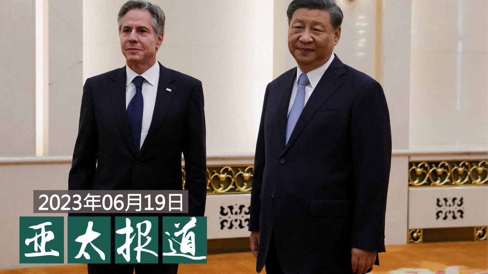
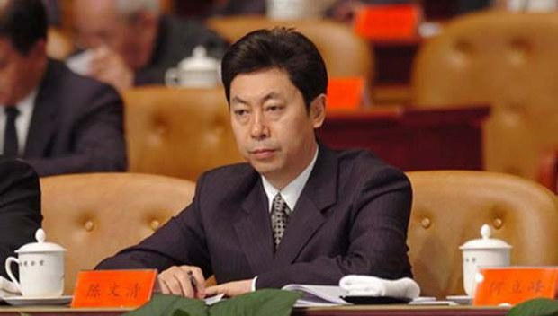
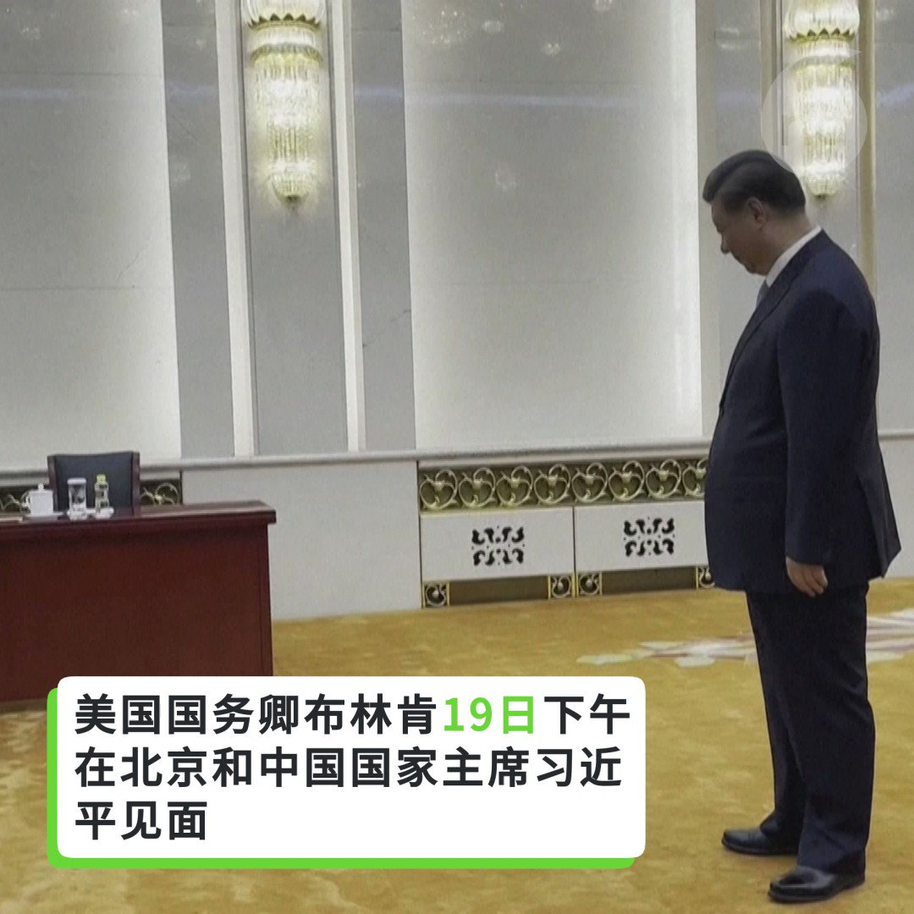
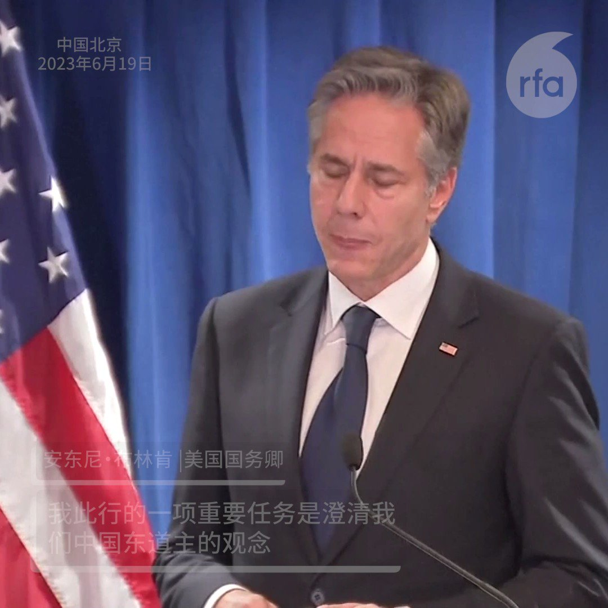

自由亚洲电台 北京时间 2023-06-20T07:00:06Z 1670929476753162242 【#亚太报道（2023-6-19）】
欢迎收听和订阅播客【亚太报道】 https://t.co/MjLNSvVMqc

#布林肯 北京记者会 / #习近平会见布林肯 / #秦刚：#台湾问题 是“最突出的风险” / 官方再确认：#不是鸭脖是鼠头 / #王全璋 一家持续受到逼迁 https://t.co/EPaHRwJ1Y9   自由亚洲电台 北京时间 2023-06-20T07:07:43Z 1670931394011312129 美国白宫新闻秘书卡琳·让-皮埃尔本周一表示，美国国务卿安东尼·#布林肯 在访问北京期间与中国国家主席 #习近平 和其他中国官员进行了建设性对话，这是美中关系向前迈出的良好一步。
https://t.co/EkiV0CzQsj   自由亚洲电台 北京时间 2023-06-20T07:42:23Z 1670940118851416065 据中国官方新华社6月19日报道，中共中央政治局委员、中央政法委书记 #陈文清 14日至18日在 #新疆 调研时强调，新疆政法机关要坚持以习近平新时代中国特色社会主义思想为指导，全面贯彻习近平法治思想和总体国家安全观，完整准确贯彻新时代党的治疆方略，大力推进反恐维稳法治化常态化，强化责任落实。

上述消息公布当天，恰逢中共领导人习近平与到访的美国国务卿布林肯会晤之际。布林肯此行前夕，数十个国际人权组织联署呼吁关注中国的人权状况，而北京当局针对新疆维吾尔等少数民族的种族灭绝暴行更是各方关注的焦点之一。布林肯周一在离开北京前记者会上公开表示，美国与世界很多国家严重关切中国侵犯人权，而中方的侵权行为涉及新疆、西藏和香港等地。

公开资料显示，基层警察出身的陈文清在去年中共20届一中全会晋升政治局委员，并从中国国家安全部长升任中央政法委书记。

陈文清还在上述调研活动中特别要求加强政治建设，以确保政法干警“绝对忠诚、绝对纯洁、绝对可靠”。   自由亚洲电台 北京时间 2023-06-20T08:45:21Z 1670955962679664641 RT @RFA_Chinese: 【#亚太报道（2023-6-19）】
欢迎收听和订阅播客【亚太报道】 https://t.co/MjLNSvVMqc

#布林肯 北京记者会 / #习近平会见布林肯 / #秦刚：#台湾问题 是“最突出的风险” / 官方再确认：#不是鸭脖是鼠头…   自由亚洲电台 北京时间 2023-06-20T08:46:16Z 1670956196935737346 RT @RFA_Chinese: 【美国国务卿布林肯北京记者会 - 1】
结束北京之行前，美国国务卿 #布林肯 在北京召开记者会，介绍他与中国官员会晤的情况。他说，他向中国澄清美国无意和中国 #脱钩。那么美国为什么要向中国限制技术出口呢？
请看布林肯的解释： https://t…   自由亚洲电台 北京时间 2023-06-20T08:46:23Z 1670956226425782272 RT @RFA_Chinese: 【美国国务卿布林肯北京记者会】
由于中方历来称台湾问题是中国核心利益的核心，#布林肯 在记者会上提到和中方讨论了台湾问题，他特别提到为什么一旦台湾发生危机，将会对全世界产生影响。 https://t.co/86nCIrDFuB   自由亚洲电台 北京时间 2023-06-20T02:38:31Z 1670863647139315712 【美国国务卿布林肯北京记者会】
由于中方历来称台湾问题是中国核心利益的核心，#布林肯 在记者会上提到和中方讨论了台湾问题，他特别提到为什么一旦台湾发生危机，将会对全世界产生影响。 https://t.co/86nCIrDFuB   自由亚洲电台 北京时间 2023-06-20T02:51:45Z 1670866980155564033 【美国国务卿布林肯北京记者会 - 1】
结束北京之行前，美国国务卿 #布林肯 在北京召开记者会，介绍他与中国官员会晤的情况。他说，他向中国澄清美国无意和中国 #脱钩。那么美国为什么要向中国限制技术出口呢？
请看布林肯的解释： https://t.co/VA485N6goo   自由亚洲电台 北京时间 2023-06-20T02:59:50Z 1670869011087884289 专栏 | #夜话中南海：#蔡奇 意外上位，五年后的 #陈敏尔 还有戏吗？
https://t.co/Qaqhj2Ndc2   自由亚洲电台 北京时间 2023-06-20T03:11:13Z 1670871878901321728 中国外长 #秦刚 与到访的美国国务卿 #布林肯 举行会谈。秦刚罕见地以“最突出的风险”诠释 #台湾问题。有分析指，虽然中国多次重申台湾是中国核心利益，但是对美国而言，美国有自己的“一中”政策，不会被美中关系绑架。

https://t.co/DEWtWP6f29   自由亚洲电台 北京时间 2023-06-20T03:23:19Z 1670874921394921472 德国总统施泰因迈尔周一接见到访的中国总理 #李强。此行也是李强今年三月出任中国国务院总理后的首次出访。

https://t.co/nh2CnDOGsE   自由亚洲电台 北京时间 2023-06-20T04:00:04Z 1670884169164152832 因为时局动荡，越来越多香港人或选择或被迫离港。温哥华祭作舍剧团和自由港乐队，合作用音乐和戏剧方式展现香港本土情怀丶抚慰离散港人心情。

https://t.co/LzB5W7GJY1   自由亚洲电台 北京时间 2023-06-20T01:45:23Z 1670850278449348622 美国国务卿 #布林肯（Anthony Blinken）19日结束其北京之行前召开记者会，强调保持高层直接沟通、以确保两国竞争不会演变成冲突的重要性。专家则认为，这次布林肯访华，为双边关系螺旋式下降找到了一个‘停损点’，但未来依然是困难重重。
https://t.co/OY8gGKjnwf   自由亚洲电台 北京时间 2023-06-20T00:16:47Z 1670827981768638464 北京当地时间6月19日，美国国务卿 #布林肯 结束对中国为期两天的访问，并在离京前举行记者会。布林肯表示，他此行就一系列重大的国际、地区挑战和双边议题与中国官员进行了深入讨论。

https://t.co/TIp6n3Pbue   