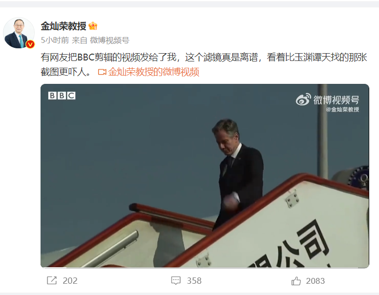
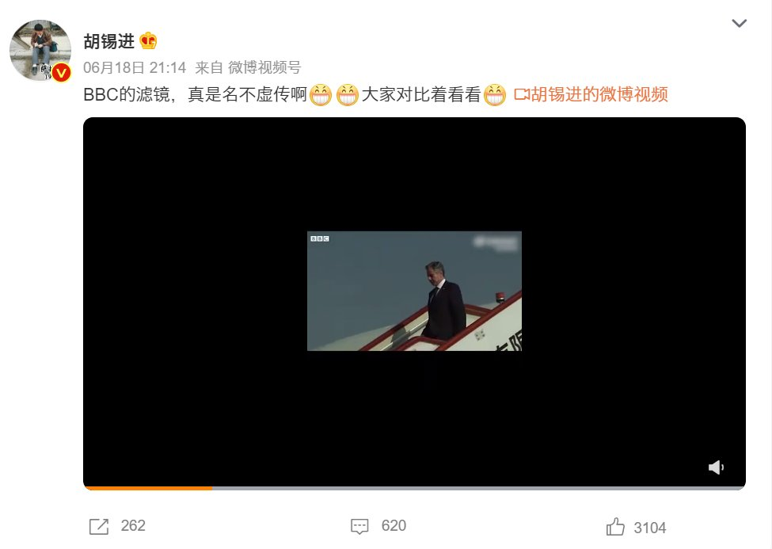
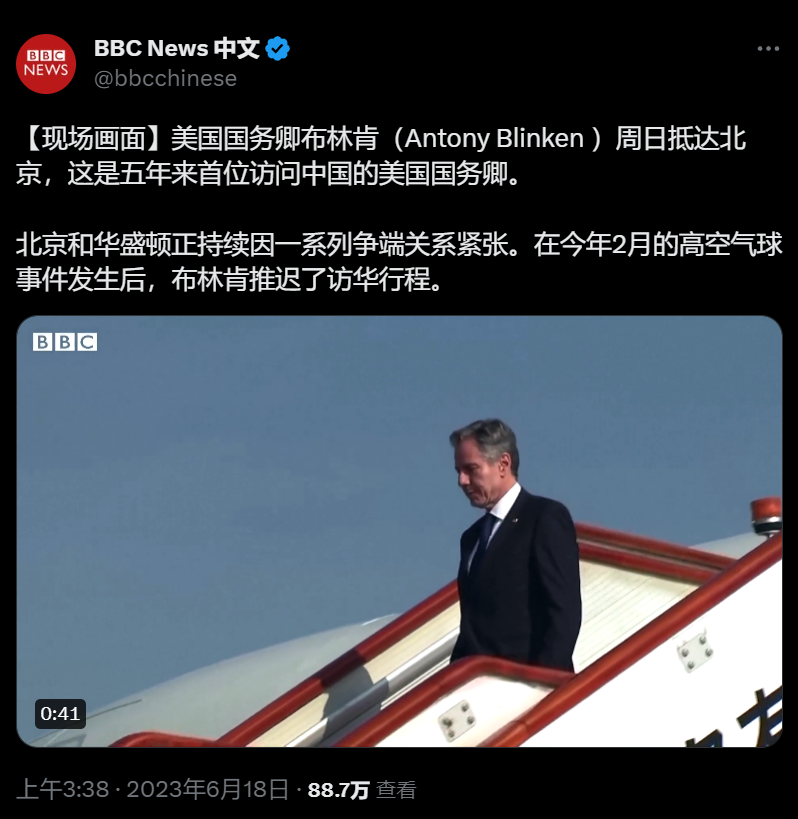
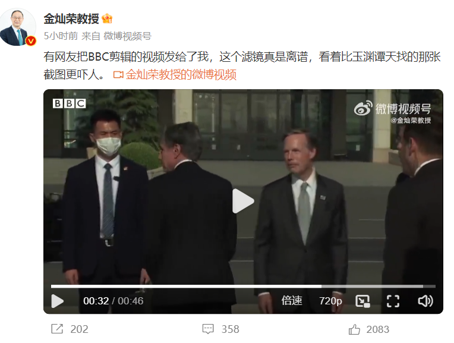
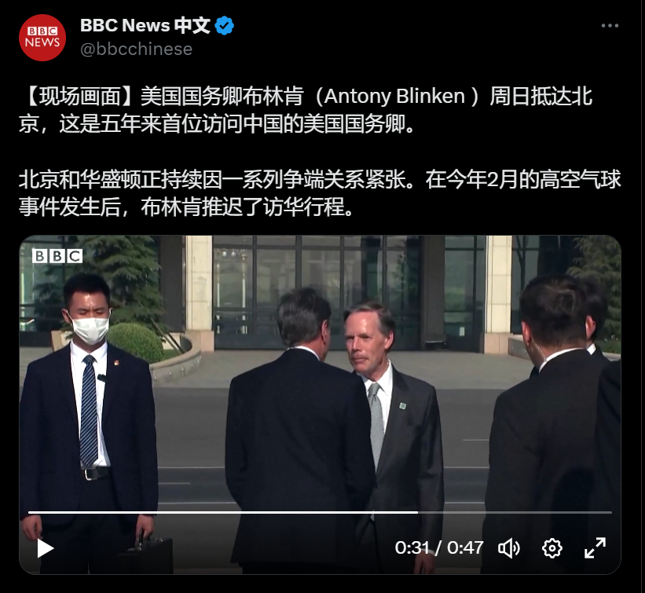
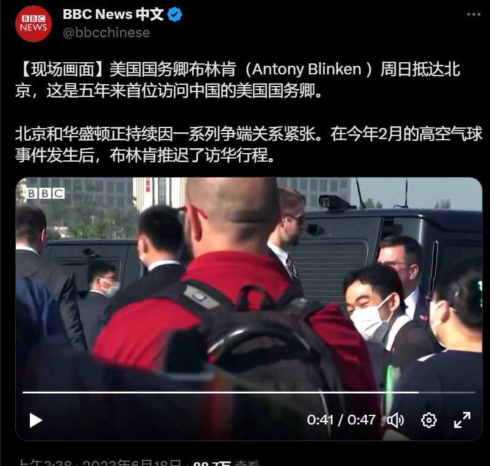

A李老师不是你老师 北京时间 2023-06-19T18:11:52Z 1670736143623618568 网友投稿
广东某单位2023年花5万多元人民币订阅的各种报刊全部堆在角落无人问津。
有评论区网友说，“那本书也是”。 https://t.co/X6aifhy3yP   A李老师不是你老师 北京时间 2023-06-19T03:30:07Z 1670514247795716096 序章 “不再恐惧” 
本文记录汇总了我在11月26日白天至下午四点前收到的投稿。
在整个白天，受前一晚乌鲁木齐的影响，全国各地和高校爆发了声势浩大的反动态清零运动，其中以北京最为频繁。
这一切构成了当晚白纸运动的前奏。
https://t.co/mlJpSIQ9Co   A李老师不是你老师 北京时间 2023-06-19T03:49:00Z 1670518999304531968 11月26日是漫长的一天，这一天里，在全国范围内发生了太多事，以至于我甚至需要按小时来进行章节分割。
在看到那些推文时，我亦不禁被情绪拉扯回去，在这一天之前，我和很多人一样，悲观地认为也许中国会永远地动态清零下去。
希望可以为大家尽可能还原那一天亲历现场直播式的感受。
建议阅读11月25日的推文，从而获得更连贯的体验。
https://t.co/5ygTeYCYur   A李老师不是你老师 北京时间 2023-06-19T01:21:53Z 1670481973821726721 网友投稿
“阴间滤镜”竟是“国产滤镜”？
6月18日，微博上包括胡锡进、金灿荣等一帮爱国大V再次炒作BBC使用“阴间滤镜”报道布林肯访华之事。
然而事实上他们发布的图片是自己调色后的影片。 https://t.co/oNKzesk0rW   A李老师不是你老师 北京时间 2023-06-19T01:22:31Z 1670482134518169600 BBC原新闻
https://t.co/Uvx9SAIeJc   A李老师不是你老师 北京时间 2023-06-19T01:24:09Z 1670482545467637760 更多对比 https://t.co/GGWmzgs314   