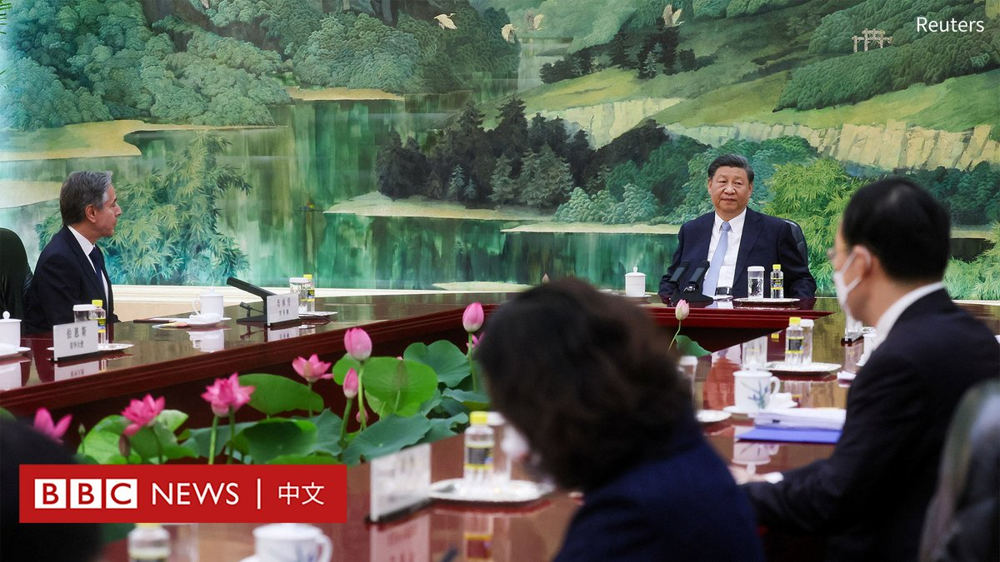
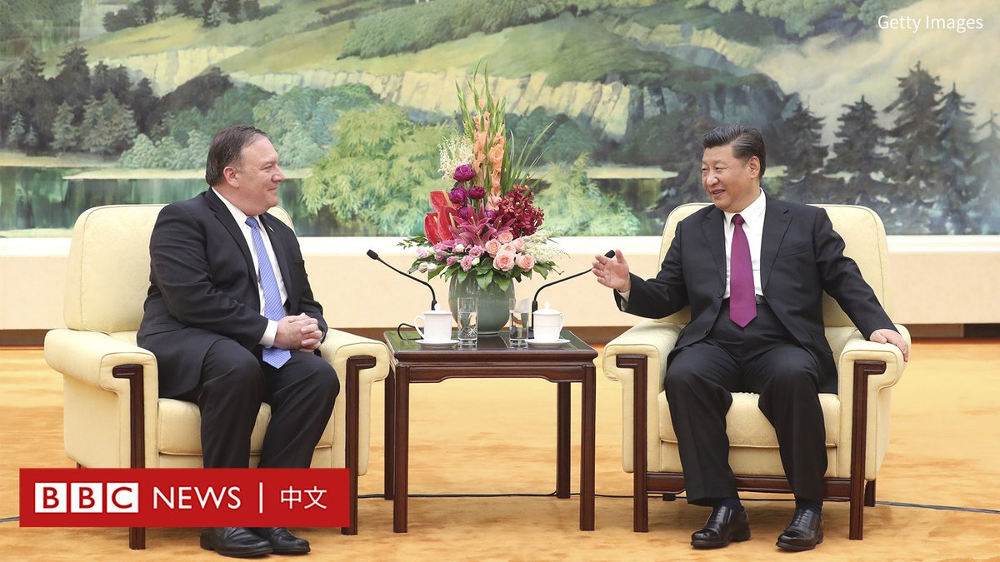
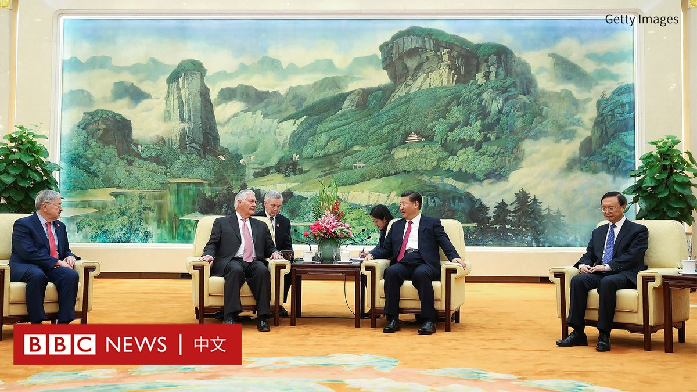
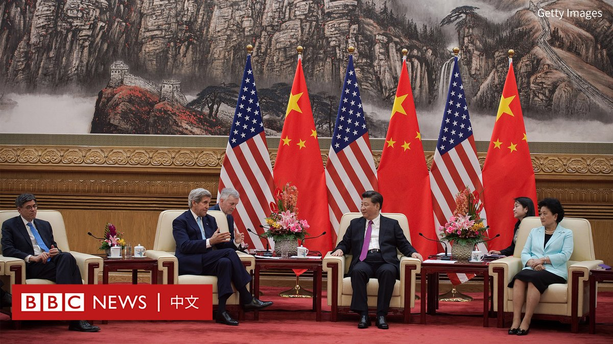
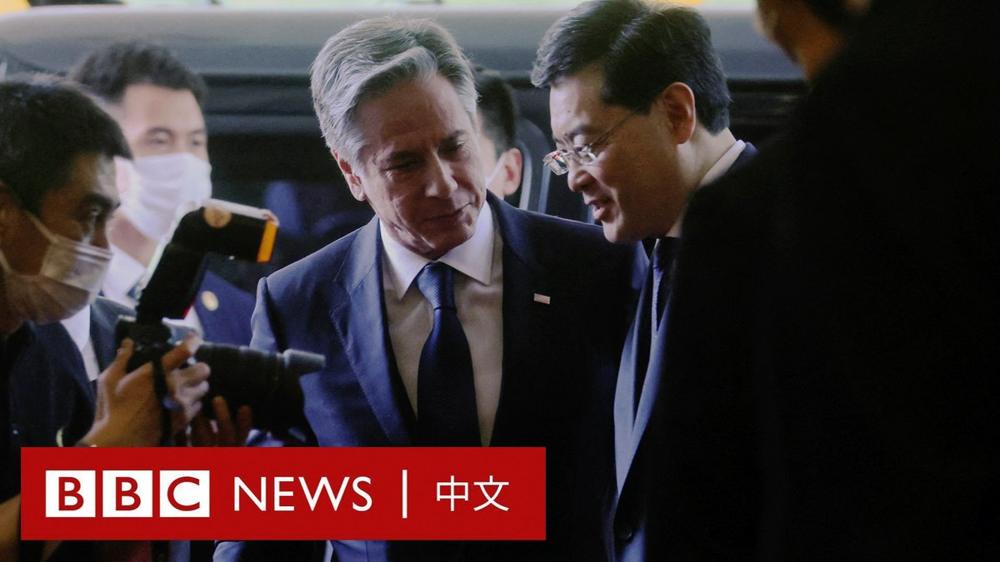
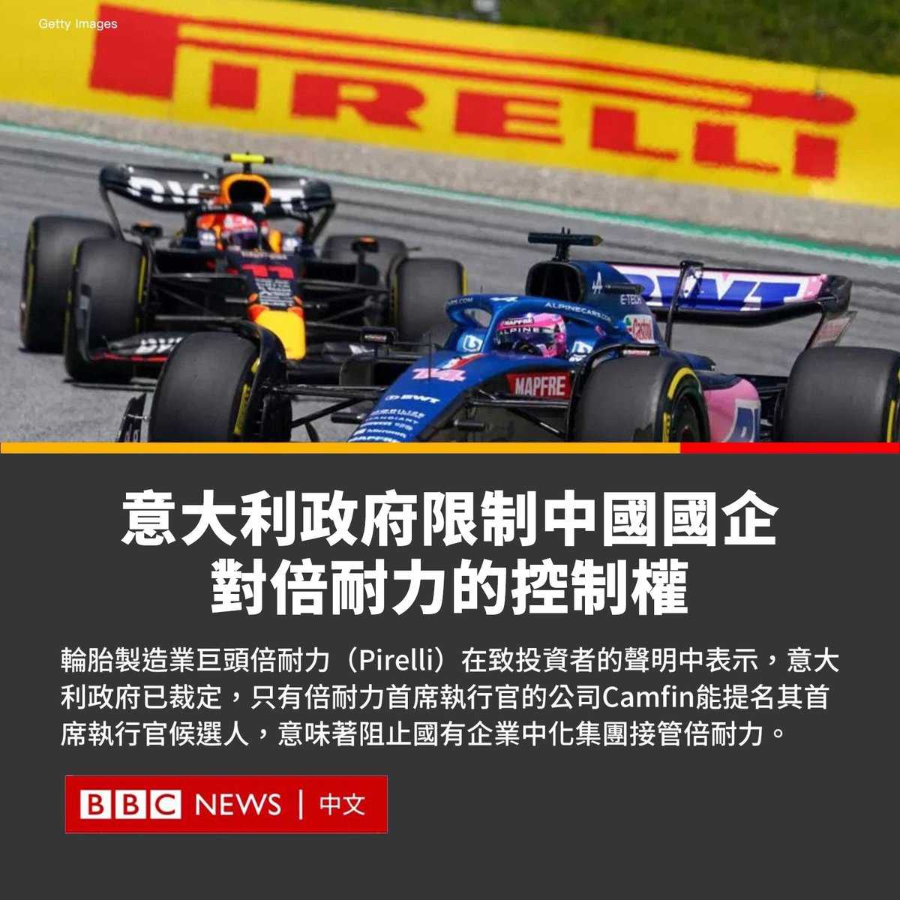
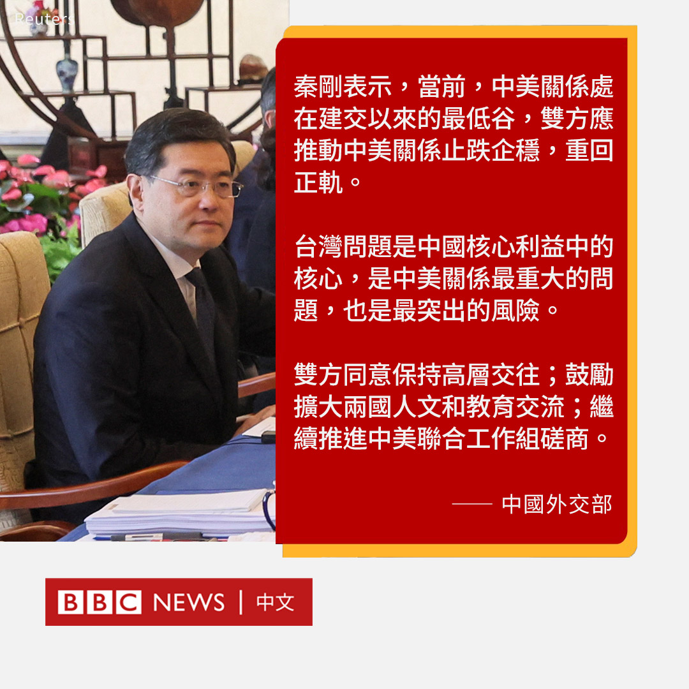
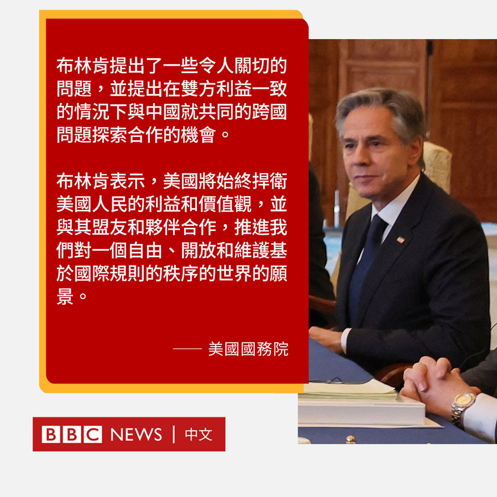
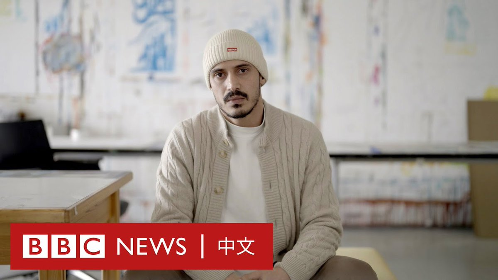

D英国广播公司BBC 北京时间 2023-06-19T17:53:28Z 1670731516018843648 【#习近平会见布林肯】

中国国家主席习近平与美国国务卿布林肯（Antony Blinken）在北京人民大会堂会晤。中国官方媒体发布的影片显示，习近平对布林肯说，双方的会谈是“坦诚深入的”，在一些“具体问题上”达成共识。

不过，两人的座位安排相比于以往发生变化。2018年、2017年和2016年，习近平曾分别与时任美国国务卿蓬佩奥（Mike Pompeo）、蒂勒森（Rex Tillerson）和克里（John Kerry）会晤。

此前，两方为并排就坐，但此次习近平会见布林肯时采用长桌，习近平坐在中间，两国代表团分座两侧。   D英国广播公司BBC 北京时间 2023-06-19T14:40:23Z 1670682923543166978 “我觉得我们回不到过去的好日子……但另一方面，我们可能会进入一个新常态。”中国全球化智库创办人王辉耀说道。

美国国务卿布林肯周日（6月18日）飞抵北京，对中国展开为期两天的访问。他是美国总统拜登2021年上台后到访中国的最高阶美国官员。他已分别和中共中央外办主任王毅以及外交部长秦刚会面。 https://t.co/GQO60LohBV   D英国广播公司BBC 北京时间 2023-06-19T15:48:49Z 1670700144361345025 BBC记者安东尼‧泽克尔（Anthony Zurcher）报道说，美国国务院宣布，国务卿布林肯将于当地时间4:30与中国国家主席习近平会面，即大约45分钟后。   D英国广播公司BBC 北京时间 2023-06-19T13:32:16Z 1670665781963788288 意大利政府为保护轮胎制造巨头倍耐力（Pirelli）的自主权，宣布限制中国股东对该公司的控制权。

中国国有化工巨头中化集团是倍耐力的最大股东，持有这家有着151年历史的公司37%的股份。

周日（6月18日），倍耐力在致投资者的声明中表示，意大利政府已裁定，只有倍耐力首席执行官马可·特龙切蒂·普罗韦拉（Marco Tronchetti Provera）的公司“Camfin”才有权提名倍耐力的CEO。

倍耐力还表示，政府已要求该公司领导层的任何变化都应接受官方审查。

此前，中化集团在3月份告知意大利政府，计划更新一份现有的股东协议。

意大利总理梅洛尼（Giorgia Meloni）动用被称为“黄金权力”（Golden Power Procedure）的规则审查该协议，该规则旨在保护被视为对意大利具有战略意义的企业。

意大利政府还要求，在倍耐力15人的董事会中，中化集团的席位不得超过八个，而“Camfin”可挑选四名董事。某些战略性决策需董事会80%的成员同意。

2015年，倍耐力被以71亿欧元（78亿美元）的价格出售给一个由中国化工和Camfin等投资者组成的集团。六年后，中国化工与国有的中化集团合并。中国政府的丝路基金也持有倍耐力9%的股份。

倍耐力股东于7月31日投票选出新董事会，现任副CEO乔治·布鲁诺（Giorgio Bruno）将接替普罗韦拉，后者将继续担任执行副董事长。   D英国广播公司BBC 北京时间 2023-06-19T11:54:46Z 1670641243574120449 在中美关系紧张之际，中国外交部长秦刚与美国国务卿布林肯（Antony Blinken）周日（6月18日）在北京会晤。

双方都形容此次会谈“坦诚”和“建设性”。

美国国务院在一份声明中称，布林肯提出了一些令人关切的问题，并提出在双方利益一致的情况下与北京就“共同的跨国问题探索合作的机会”。

布林肯还表示，华盛顿“将始终捍卫美国人民的利益和价值观”，并与其盟友合作，推进对一个自由、开放和维护基于国际规则的秩序的世界的愿景。

中国外交部则在会后声明中表示，中美关系处在建交以来的最低谷，而北京致力于构建稳定、可预期、建设性的中美关系。

秦刚警告称，台湾问题是中国核心利益中的核心，是中美关系最重大的问题，也是最突出的风险。

据报道，布林肯邀请秦刚访问美国继续磋商。

BBC记者泽克尔（Anthony Zurcher）报道说，美国国务卿布林肯和中国外长秦刚的会谈于当地时间晚上8点结束，持续了五个半小时，比原定时间长了大约一个小时。   D英国广播公司BBC 北京时间 2023-06-19T09:12:51Z 1670600495558443009 “我已经厌倦这些问题了。”

BBC获得的数据显示，在巴勒斯坦，年轻世代对于为解决以巴冲突而提出的“两国方案”有越来越不支持的趋势。他们对于自身领导层的不满也与日俱增。 https://t.co/vUF301VVhU   D英国广播公司BBC 北京时间 2023-06-19T09:46:32Z 1670608972422995968 【现场画面】美国国务卿布林肯（Antony Blinken）在北京与中共中央外办主任王毅会晤，双方随后开始闭门会谈。 https://t.co/ETVA1nNbbH   