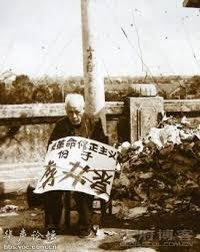

Ivy未央 北京时间 2023-06-19T11:21:26Z 1670632856966639617 当年,四川饿死了八百万多人，省委书记李井泉说:“中国这么大，哪朝哪代不饿死人?"后来,李井泉成了走资派,斗得死去活来,老婆上吊，家破人亡。孩子们没钱吃饭，到垃圾箱拣东西吃。在北京航空学院上学的二儿子李明清受到株连,被打到几乎咽气，竟然活着就塞进焚尸炉,烧成了一把灰
这就叫报应吧？ https://t.co/LDCEzVMTA9   Ivy未央 北京时间 2023-06-19T09:31:26Z 1670605174929334274 转）加拿大领土比中国大，地下原油储量世界第二位，各种矿产丰富。淡水森林野生动物资源，也比中国强。但加拿大军事力量大大落后于美国，与美国不是一个等级。美只出动装甲部队就能把加拿大给灭了。但美加居然在边境线上没驻军，加拿大怎么不怕美国侵略呢？
中共国为什么总怕美国要去侵略他们？   