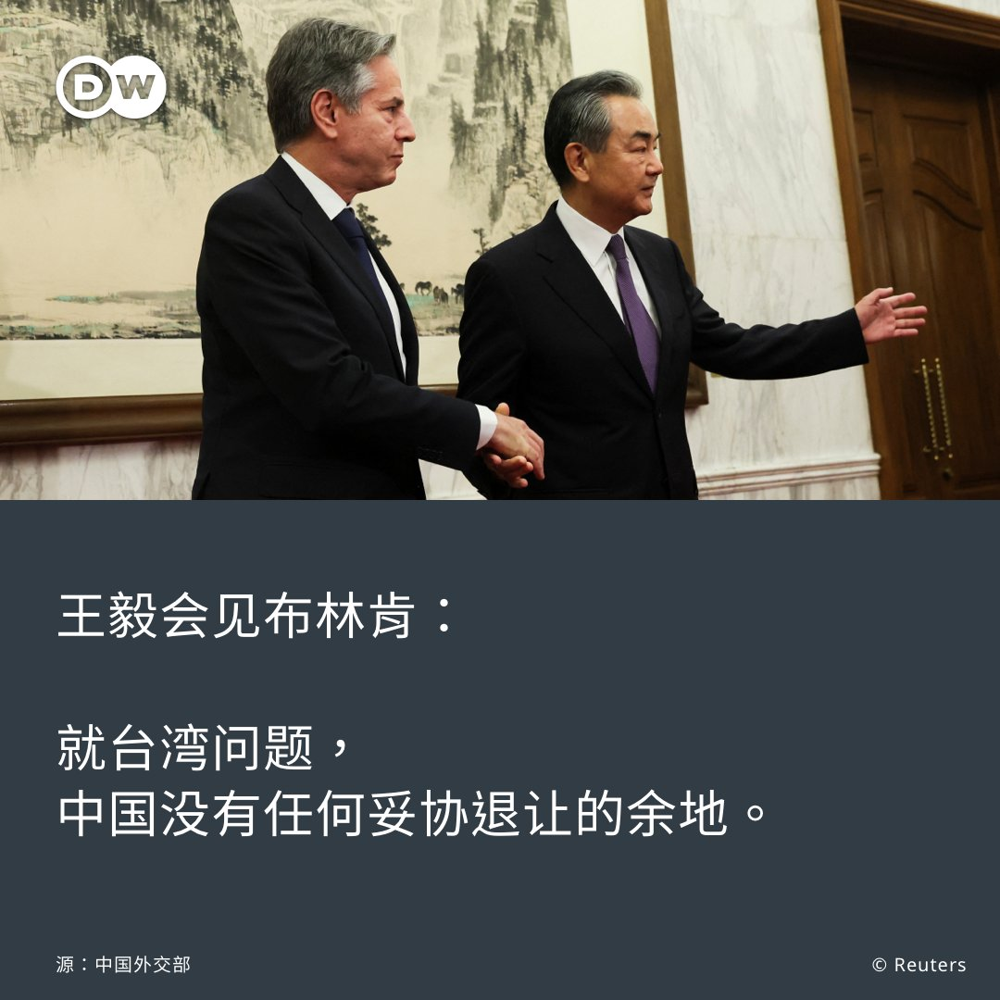
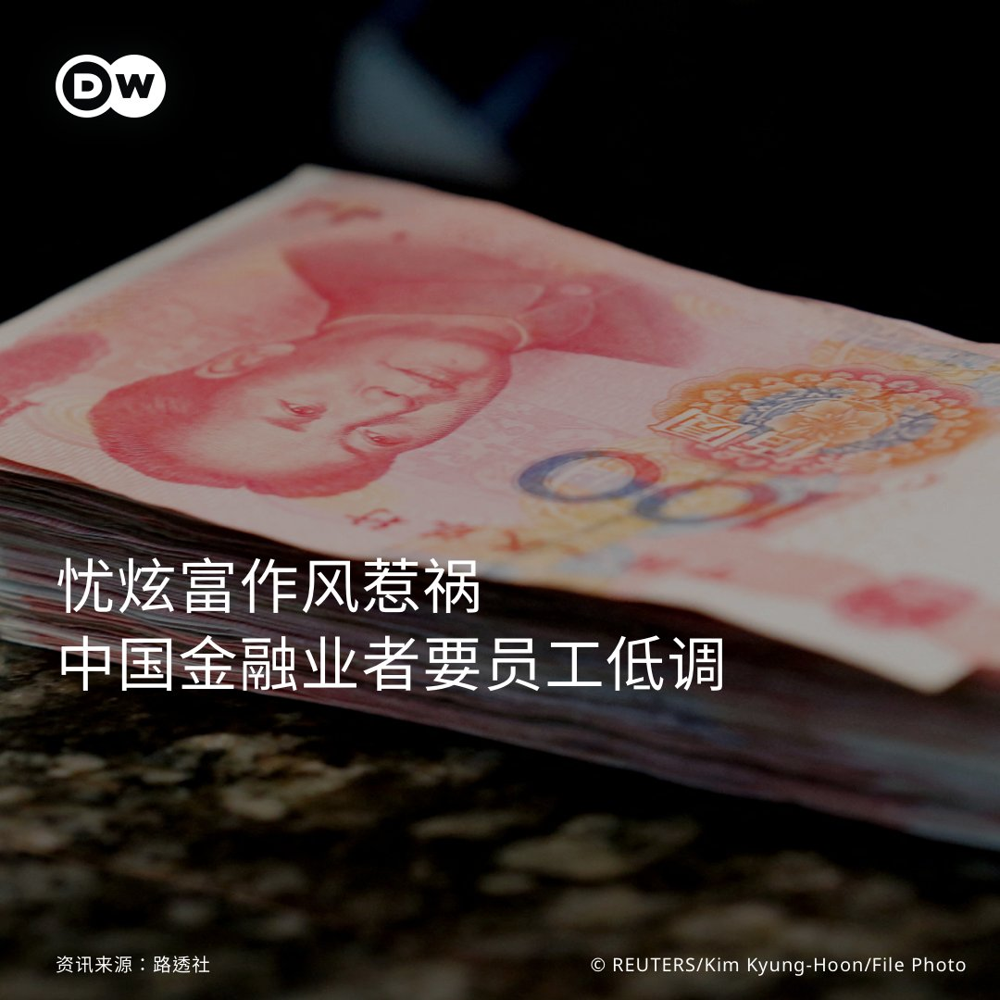
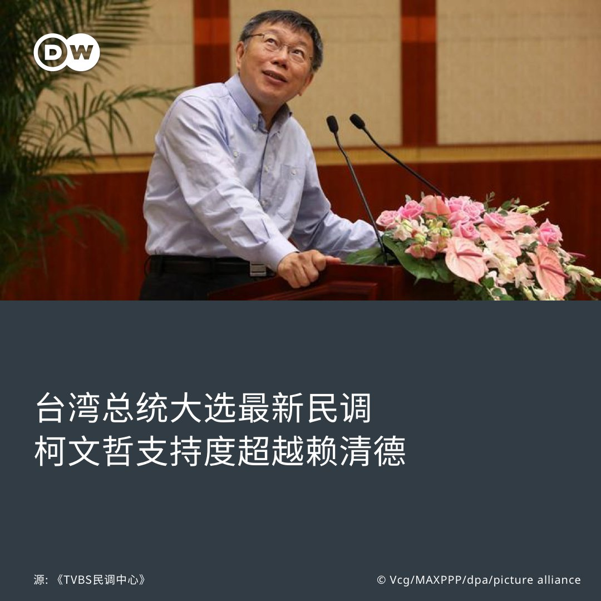
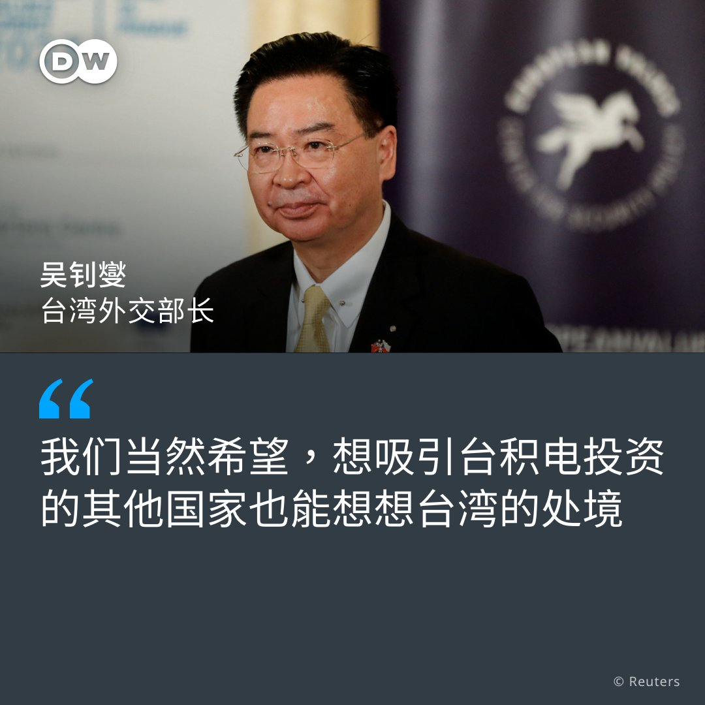

德国之声 北京时间 2023-06-19T16:52:41Z 1670716219513511938 习近平与布林肯的会见已开始举行。中国外交部发言人华春莹 @SpokespersonCHN 在推特上写道：“习主席（在会见时）说，国与国之间的互动应始终建立在相互尊重和真诚的基础上。希望布林肯国务卿的这次访问能够为稳定中美两国关系做出积极贡献。”   德国之声 北京时间 2023-06-19T16:55:27Z 1670716915436666882 @SpokespersonCHN 现场图 https://t.co/JXfUrtVXKz   德国之声 北京时间 2023-06-19T17:05:56Z 1670719554807386112 @SpokespersonCHN https://t.co/Eif4O0IJHe   德国之声 北京时间 2023-06-19T18:01:00Z 1670733409990197248 乌克兰转入反攻之际， #北约开启大规模 #军演 
🔸这场#德国 为主、#美国 积极参与的军演是演给谁看？
🔸#北约军力到底如何？
🔸非北约成员国 #日本 也来参加，北约计划明年在东京设办事处，这是 #亚太北约化 的前兆吗？这和 #中国又有何关系https://t.co/BqnBYJk4O4
新一期「一看你就懂」影片已上線！ https://t.co/C5IaH8Tba1   德国之声 北京时间 2023-06-19T14:53:36Z 1670686248149848064 美国国务卿布林肯週一开展了在中国的第2天访问，并且与中共中央外事办主任王毅会晤。中方究竟如何看待布林肯的访问？他这次有机会见到中国国家主席习近平吗？ 

详细报导：

https://t.co/UFXMncUWGK https://t.co/LGEinHcsHs   德国之声 北京时间 2023-06-19T15:18:45Z 1670692578000527361 🧋奶茶、🌀手持风扇、💧抢水、🔌节电⋯⋯天气越来越热，哪个是您今夏的酷暑风景？
世界气象组织 (WMO)警告，受 #温室气体 及 #厄尔尼诺现象 影响，2023年至2027年可能是有史以来最热的5年🥵🔥🔥🔥
亚洲各国近几个月来，都遇到了哪些 #热浪 灾情？ 👉https://t.co/rtuKmSP3bp   德国之声 北京时间 2023-06-19T16:12:05Z 1670706001450786817 【不要张扬，要低调❓】🇨🇳

#中国 政府近期加大监管 #金融业 及 #反贪腐 的力道，许多业者纷纷开始要求员工上班穿戴尽量不要太豪奢，也不要在社交媒体上 #炫富，避免被北京盯上。

详细报导👉https://t.co/FqUim5ZzQO https://t.co/L2x3aefMRk   德国之声 北京时间 2023-06-19T12:48:04Z 1670654659382353920 【台媒民调：柯文哲支持度超越蓝绿】#台湾总统大选 倒数7个月，台媒TVBS民调中心18日发布最新调查，民众党参选人 #柯文哲 以33%的支持度跃居第一，领先民进党的 #赖清德（30%）及国民党的 #侯友宜（23%），另有14%受访者未表态。/1 https://t.co/x7veFas2h5   德国之声 北京时间 2023-06-19T12:48:19Z 1670654721873395712 此前，赖清德在多数民调中皆为领先，如今遭到超车，他19日向媒体坦承"#民进党 目前的确比较逆风"。而柯文哲则表示，对最新民调"看一看就好"，因为他认为支持度很难在一个月内相差10个百分点。/2   德国之声 北京时间 2023-06-19T12:48:31Z 1670654770762199040 至于侯友宜，近期因辖区幼儿园爆出 #喂药案、大学演讲获差评等原因人气下滑，在民调中位居第三。他日前表示会尊重并参考民调，同时坚定自己的选举节奏。

💬你觉得这份民调可信吗❓   德国之声 北京时间 2023-06-19T10:50:29Z 1670625068886667264 台湾外交部长吴钊燮近期展开欧洲之旅，他接受媒体访问时说，如果欧盟提供了诱因，让台积电放心投资，那么台湾政府不会阻挡该公司投资欧洲，但他期盼，各国在吸引台积电投资时，"也能想想台湾的处境"。他还说了什么❓
详细报导👉 https://t.co/UKivQOh3vA https://t.co/p03MtkiZxE   德国之声 北京时间 2023-06-19T11:15:00Z 1670631236358864897 #中国 日前迎来解除清零后的首个大型 #电商 活动 #618购物节，尽管各电商平台战绩有所回暖，但分析人士指出，中国消费者的信心仍然疲软。专家为何这么说？🇨🇳 中国消费者受到了什么影响？https://t.co/eE4h5SZEJQ   德国之声 北京时间 2023-06-19T09:52:24Z 1670610449585553408 中国外长秦刚与美国国务卿布林肯，週日终于在北京举行了双边会谈。双方究竟讨论了什么？又取得什么样的具体成果？https://t.co/UhUfGJd3Dz   德国之声 北京时间 2023-06-19T08:51:00Z 1670594998943744001 【#北京 对英国提出严正警告】🇨🇳 🇬🇧 #英国安全大臣 图根哈特上周打破外交传统惯例，与台湾数位发展部部长 #唐凤 会晤。 #中国驻英使馆 发言人18日表示："我们要正告英方，任何损害中国利益的行径都必将受到中方 #有力反击！"
请见: https://t.co/fA5LdL6OvK https://t.co/xaibTJ2OWe   德国之声 北京时间 2023-06-19T05:59:00Z 1670551712229392386 有评论认为，习近平最近表达的亡国感应该不是杞人忧天，清零松绑后房市依旧奄奄一息，进出口双双大幅衰退，青年失业率攀高到20.4%已满足触发颜色革命条件，这些因子放在任何朝代都是大革命的火种。 https://t.co/n16uuH5NNh   