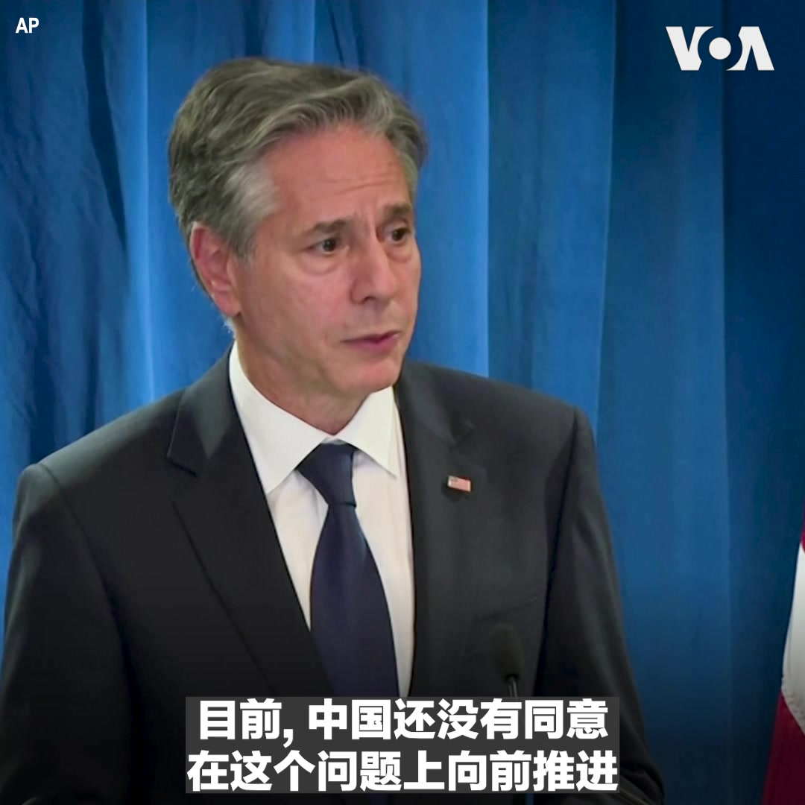
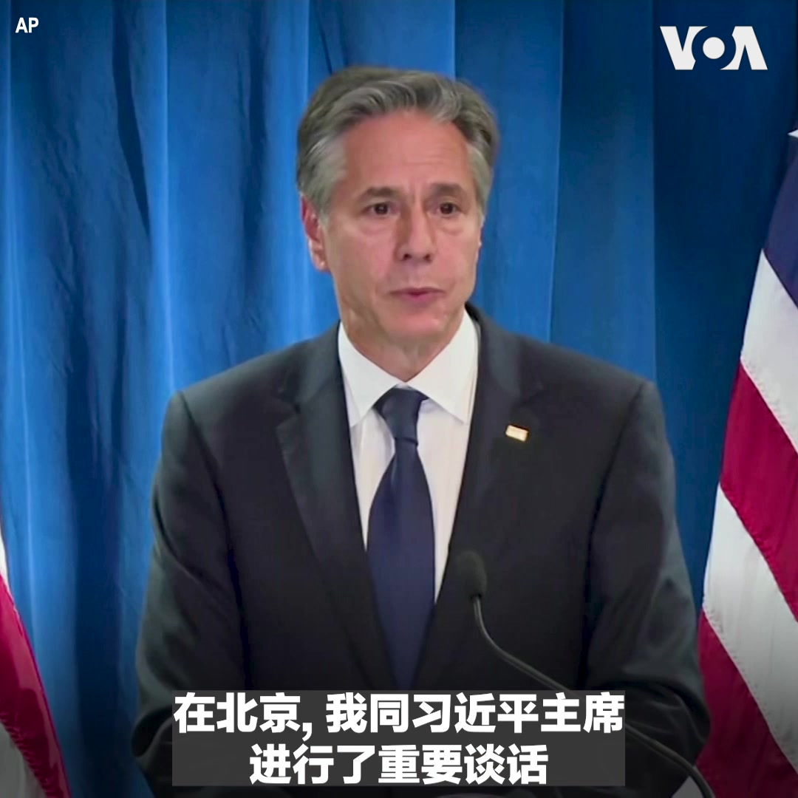
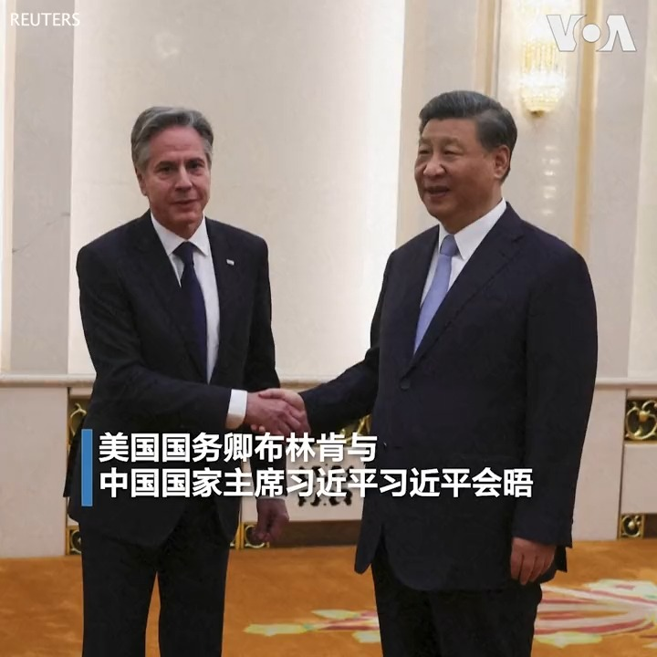
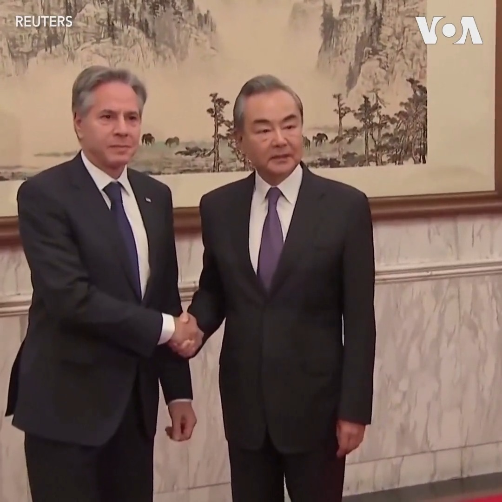
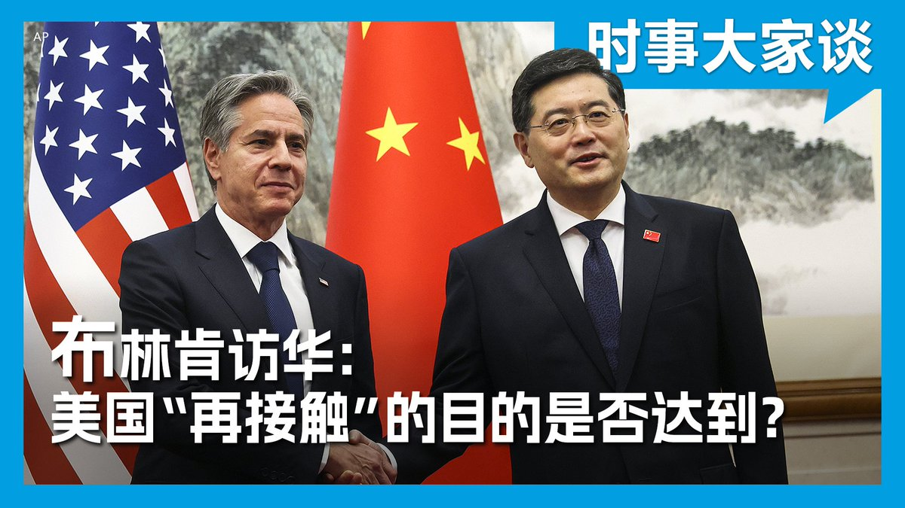

美国之音中文网 北京时间 2023-06-19T23:15:34Z 1670812575913889793 美国务卿访中，印太专家:希望中国讲法理、负责任 https://t.co/eviwwUedTe   美国之音中文网 北京时间 2023-06-19T23:57:16Z 1670823069487861761 美国国务卿布林肯6月19日在访华记者会上表示，美中同意必须负责任地处理双方关系，不过中方还没有同意在恢复军方联络渠道问题上向前推进。他指出，进展是艰难的，不是一次访问或谈话就能做到的。在台湾问题上，布林肯在回答美国之音记者 @rongxiang 提问时说，他向中方重申了维持台海现状的重要性。 https://t.co/JNDlNt9zDu   美国之音中文网 北京时间 2023-06-19T21:00:17Z 1670778530437931008 6/19【#时事大家谈】习近平会见布林肯 美中关系解冻信号？

嘉宾：美国威尔逊中心基辛格中美关系研究所主任戴博；乔治亚理工大学纳恩国际事务学院教授王飞凌
主持人：许波

Youtube🔗 https://t.co/wcbkP4I5BB https://t.co/jR2rtXFIbd   美国之音中文网 北京时间 2023-06-19T21:17:33Z 1670782875715919872 布林肯结束访华，对北京在台海、南中国海挑衅性行动表达关切，但强调保持高层直接沟通的重要性 https://t.co/zpLkSzcgCV   美国之音中文网 北京时间 2023-06-19T21:27:32Z 1670785387508432898 美国国务卿布林肯6月19日结束为期两天的访华行程。他在离开北京前举行的记者会上表示，他与中国国家主席习近平进行了“重要的对话”，并用“坦诚、实质性和建设性”形容他与王毅和秦刚的讨论。布林肯同时也表示，美国对管理美中关系的挑战“不抱任何幻想”。https://t.co/PRsLFQ5ZFn https://t.co/SreWviqFqx   美国之音中文网 北京时间 2023-06-19T21:35:05Z 1670787286253076480 香港上诉庭拒绝黎智英就警方检取手机内新闻材料上诉至终审法院 https://t.co/2WHKV7XrPs   美国之音中文网 北京时间 2023-06-19T21:35:07Z 1670787295048523776 巴基斯坦逮捕12名与希腊移民船悲剧有关的嫌疑人 https://t.co/wv6F07P5bz   美国之音中文网 北京时间 2023-06-19T21:35:09Z 1670787304229847040 乌干达开始埋葬学校遇袭案的受害者 https://t.co/r1gvHNZAeW   美国之音中文网 北京时间 2023-06-19T21:54:33Z 1670792187305418753 RT @rongxiang: 美国国务卿布林肯⁦@SecBlinken⁩ 结束对中国访问。 https://t.co/00eQ4t0NH4   美国之音中文网 北京时间 2023-06-19T18:42:47Z 1670743925924200448 【现场直播：美国国务卿布林肯北京记者会（同声传译）】

YouTube🔗 https://t.co/no8O6UP1la https://t.co/RE3SiRux00   美国之音中文网 北京时间 2023-06-19T18:54:04Z 1670746763811254272 聿文视界：李强，中国的“隐身总理” https://t.co/UCXQ3hJOQD   美国之音中文网 北京时间 2023-06-19T16:45:35Z 1670714433163919360 中国政府可能的刺激经济政策出台前，人民币汇率再走软 https://t.co/DkHiebBsHk   美国之音中文网 北京时间 2023-06-19T16:59:34Z 1670717950314303488 巴黎气候变化峰会 构思全球融资改革 https://t.co/SQwT5lcGPU   美国之音中文网 北京时间 2023-06-19T17:41:35Z 1670728522317594625 台湾总统大选 柯文哲民调冲上第一 https://t.co/gkC9dV2qkc   美国之音中文网 北京时间 2023-06-19T17:46:18Z 1670729710173552640 王毅向布林肯摊牌“要对话还是对抗” 习近平稍后出场 https://t.co/p5oEaGny2q https://t.co/KIytGc8iuh   美国之音中文网 北京时间 2023-06-19T18:09:14Z 1670735484367306752 美国国务卿布林肯在他上任两年半来对中国首次访问最后一天(2023年6月19日)的下午会见了中国国家主席习近平。双方官员在会谈一个小时前才对外宣布这次会晤。全文报道：https://t.co/JLegnxSuIJ https://t.co/hlGyrcukdS   美国之音中文网 北京时间 2023-06-19T18:10:04Z 1670735692450902016 高盛下调对今年中国经济增长的预测 https://t.co/JzaIJ7Bngp   美国之音中文网 北京时间 2023-06-19T18:11:36Z 1670736080004608000 美国国务卿布林肯19日结束对中国的访问，他在访问的最后一天与中国国家主席习近平会面，并和中国主管外交事务最高官员王毅会晤。王毅要求美方“就对话还是对抗作出选择”。华盛顿如何评价此次访问？布林肯将在北京时间星期一傍晚6点40分举行记者会，美国之音将通过同声传译为您现场直播，欢迎收看。 https://t.co/toUCRRAHTM   美国之音中文网 北京时间 2023-06-19T14:49:33Z 1670685232423649281 朝鲜官方严厉检讨军事侦察卫星发射失败 近期准备再发射 https://t.co/BBYgIaITac   美国之音中文网 北京时间 2023-06-19T15:00:00Z 1670687862059307009 94岁的美籍华人吴汉章拒绝进老人院，他或许对纸牌、麻将和填字游戏不感兴趣，但愿意继续演戏。过去一年他拿到很多奖项，在演员工会颁奖典礼上获全场起立欢呼。近70年来他参与制作600多部影片，为200多部作品配音，并在好莱坞星光大道上留下手印。未来他希望出版系列漫画书。 https://t.co/6GGdtyhQNu   美国之音中文网 北京时间 2023-06-19T15:44:31Z 1670699065032556544 RT @rongxiang: 一位美国国务院发言人证实，美国国务卿布林肯周一下午四点半与中华人民共和国国家主席习近平会晤。   美国之音中文网 北京时间 2023-06-19T16:15:33Z 1670706871894962176 布林肯见中国主管外交事务最高官员王毅 之后见习近平 https://t.co/2mf9nIyWgZ   美国之音中文网 北京时间 2023-06-19T13:33:32Z 1670666101754298368 德中政府磋商在即 朔尔茨面临棘手的平衡问题 https://t.co/hCDnK4VYb0   美国之音中文网 北京时间 2023-06-19T14:12:47Z 1670675979445096448 美国国务卿布林肯访华期间，法新社记者街头采访北京当地民众对于布林肯国务卿访华的看法。北京居民陈杰(音译)表示，“美中关系还是和平发展比较好。”另一北京居民孙艺(音译)则认为美中两国像是在吵架的情侣，两边都有各自的想法及理由不愿意退让。 https://t.co/3fZ7Zt4xOw   美国之音中文网 北京时间 2023-06-19T10:47:29Z 1670624313236668416 美国国务卿布林肯在当地时间星期一(6月19日)上午会见了中国主管外交事务的最高官员、中共中央政治局委员、中央外事工作委员会办公室主任王毅。预计，他与王毅的会谈聚焦两国关系的战略层面，会谈结果可能决定他是否在稍后与中国国家主席习近平见面，这也是人们普遍关注的焦点。https://t.co/UtQ16bWDG2 https://t.co/QHxy74pxLy   美国之音中文网 北京时间 2023-06-19T11:00:01Z 1670627468644851712 摇滚歌手科特利亚罗夫在普京入侵乌克兰大约10天后离开俄罗斯，他对自己的国家对这种野蛮行径几乎没有反应感到恶心。最近他在亚美尼亚组织反战音乐会，观众席上的白蓝白旗帜显示意愿，反对侵略、建立民主和自由的俄罗斯。同时也有部分留在俄罗斯的音乐家乘着民族主义浪潮而名利双收。 https://t.co/DOSxCMuxZ6   美国之音中文网 北京时间 2023-06-19T10:41:34Z 1670622822862036993 布林肯会见中国主管外交事务最高官员王毅 能否见习近平被视为关键 https://t.co/c9y5G8N0fy   美国之音中文网 北京时间 2023-06-19T06:43:32Z 1670562920881876992 推特上的中国：美中紧张之际，布林肯首访中国，能否见到习近平受关注 https://t.co/QrVLieOWZE   美国之音中文网 北京时间 2023-06-19T06:59:20Z 1670566895391748096 美国国务卿布林肯的北京之行接近尾声，美方事先预计不会期盼此次访问能够交出很多外交成果，但至少能降低误判风险，避免竞争失控，导致军事冲突。这次访问取得了什么成果？是否达到美方预定的再接触的目的？两国在台湾等热点问题上的冲突和对抗能否缓和？请收看6月19日的时事大家谈并发表看法。 https://t.co/4kirA6wywo   美国之音中文网 北京时间 2023-06-19T08:53:33Z 1670595638571175937 分析师表示，即使在中国大型购物节期间的大幅折扣中，消费依然疲软 https://t.co/sus8NoBwAs   美国之音中文网 北京时间 2023-06-19T04:46:06Z 1670533369011257344 芝加哥、华盛顿州两地发生枪击案，目前三人死亡二十多人受伤 https://t.co/P2s6ETXL9E   美国之音中文网 北京时间 2023-06-19T05:15:03Z 1670540652436934657 中国负债累累的地方政府为了创造税收，巧立名目对居民大开各种奇怪的罚单。分析人士表示，胡乱开罚对中小微企业的影响最大，但地方政府究竟能从中“榨出多少油水”来，令人怀疑，但这将会影响到潜在投资者的投资意愿，长期而言对地方经济反而有害。报道：https://t.co/zcxfhH1zKB https://t.co/l0KrpFbJMp   美国之音中文网 北京时间 2023-06-19T05:46:02Z 1670548450717609985 热浪引发大风暴，美国东南部停电，引发西南部野火担忧 https://t.co/qeKMljNdb3   美国之音中文网 北京时间 2023-06-19T03:49:32Z 1670519131416961025 美中谈判能否重振陷于紧张的两国关系？ https://t.co/wqS14I95PJ   美国之音中文网 北京时间 2023-06-19T01:02:24Z 1670477072542703621 RT @rongxiang: 美国国务卿布林肯 @SecBlinken 周日和中国外长秦刚的会晤加晚餐，总共长达七个半小时。会中秦刚应美方邀请访问美国。双方还大致达成协议，美中之间有必要开放更多民航。布林肯北京之行后，美中将继续举行“工作级别”会议讨论一连串议题。   美国之音中文网 北京时间 2023-06-19T02:03:13Z 1670492375440044032 港股周一起以人民币交易股票 人民币国际化再向前迈一步 https://t.co/IJD2XFcL9u   美国之音中文网 北京时间 2023-06-19T00:03:04Z 1670462141915336705 频遭逼迁骚扰、“限制出境” 709律师家庭还在“勇敢活下去” https://t.co/lcBEYAEp22   美国之音中文网 北京时间 2023-06-19T00:19:03Z 1670466163367890944 拜登总统期待未来数月与习近平会晤 https://t.co/YJ8EYCOxCK   