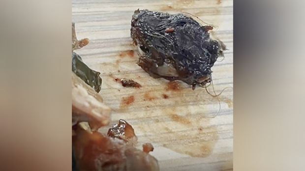
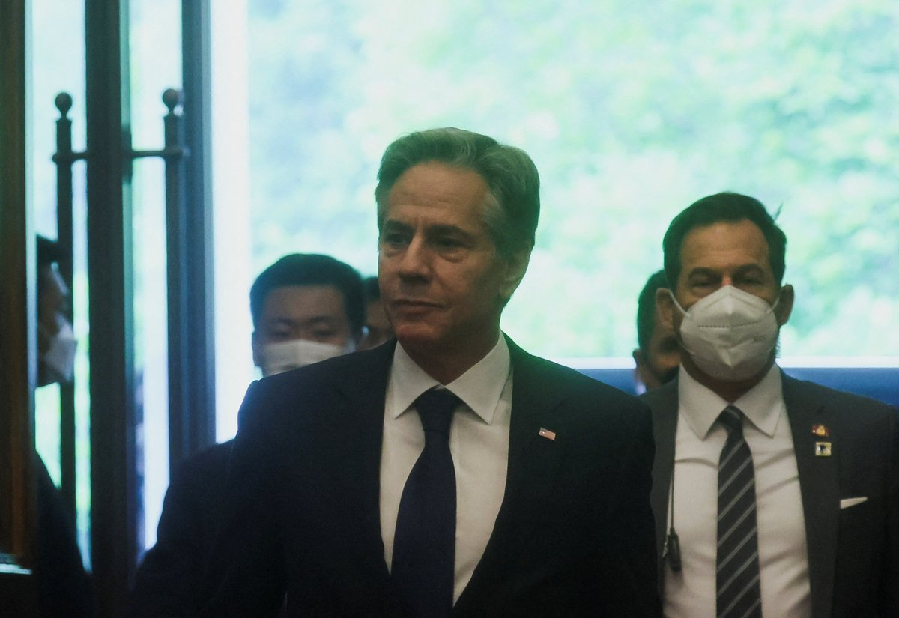

自由亚洲电台 北京时间 2023-06-19T14:45:10Z 1670684126087888896 【江西官方调查判定食堂鸭脖为鼠头】
【事件冲击政府公信力】
备受关注的江西工业职业技术学院食堂发生的“鼠头鸭脖”事件，官方联合调查组公布调查结果，指食堂菜中异物为老鼠类啮齿动物的头部。江西官方的最终定论引发网民热议。有网民问，老鼠身子呢？细思极恐。还有网民质问当局，明明是老鼠头，为何要逼着学生承认是鸭脖子。此事冲击政府公信力。与此同时，河南平顶山一餐厅菜盆中惊现两只老鼠，该餐厅被停业。详细报道:https://t.co/dp0BBzgJne
#鼠头
#鸭脖   自由亚洲电台 北京时间 2023-06-19T15:44:09Z 1670698973244571648 【路透：布林肯将与习近平会面】

路透新闻19日下午三点半引述美国国务院官员消息，到北京访问的美国国务卿 #布林肯 即将与中国国家主席 #习近平 会面。
布林肯是2018年来首次到访中国的美国国务卿。这两天已经和中共外事办主任王毅及外长秦刚的团队进行长时间的会谈，企图为低谷的中美关系建立沟通管道。   自由亚洲电台 北京时间 2023-06-19T12:33:21Z 1670650956348833792 中国人权律师丁家喜的妻子罗胜春本周日在美国通过推特透露，#李翘楚 案的辩护律师当天收到山东省临沂市中级人民法院通知，李翘楚被控“煽动颠覆国家政权罪”一案定于6月20日上午，在山东省临沂经济技术开发区人民法院第一审判庭开庭审理。
https://t.co/nUXSbFXfuN   自由亚洲电台 北京时间 2023-06-19T13:29:36Z 1670665110921314304 【中共騷擾维权律师王全璋升级】
【锁电表箱 门口把守 喷漆监视设备】
中共对709维权律师 #王全璋 和 妻子 #李文足 的打压变本加厉。继一个多月的迫迁动作后，当局在他们昌平昌盛园小区最新的住所，不断派人恐吓骚扰。除了断电，还把电表箱的大门锁住，晚上有人睡在门口地上，24小时围困，快递也无法上门。另外还把监视设备喷漆，不让他们拍摄监视者。门口彪形大汉把守，半夜骚扰，让小孩惊吓生病。   自由亚洲电台 北京时间 2023-06-19T10:37:16Z 1670621740689670144 【布林肯19日上午会见王毅】
【面对镜头 两人表情严肃】
美国国务卿布林肯（Antony Blinken）18日与秦刚会谈5个半小时后，19日上午会见中共中央外事工作委员会办公室主任王毅。布林肯与王毅握手，在镜头前两个人的表情都十分严肃。#布林肯 #王毅 https://t.co/jjz2Uetu7V   自由亚洲电台 北京时间 2023-06-19T03:48:46Z 1670518940957569026 韩联社6月18日引述消息人士披露，中超足球山东泰山队的韩国外援 #孙准浩 周六刑拘期满后，目前已被中国警方逮捕。消息人士表示，中国检方批准逮捕孙准浩后，公安部门通常会进行2个月左右的补充调查，但若案情重大，可能要数月之后才会起诉。
https://t.co/aThokbeUL4   自由亚洲电台 北京时间 2023-06-19T00:24:18Z 1670467484258844672 路透社6月18日引述多位熟悉相关讨论的美国官方消息人士披露，有鉴于目前 #美中关系 处于数十年来最糟糕的状态，美国政府内部正就是否让《#美中科技合作协定》(STA)在今年晚些时候失效进行讨论。
https://t.co/rb30zGKLhR   自由亚洲电台 北京时间 2023-06-19T02:02:28Z 1670492187212017665 美国国务卿 #布林肯 周日与中国国务委员兼外长 #秦刚 在北京举行闭门会谈后，两国官方当天同时公布了会谈内容。
https://t.co/EZTLpVDMtL   