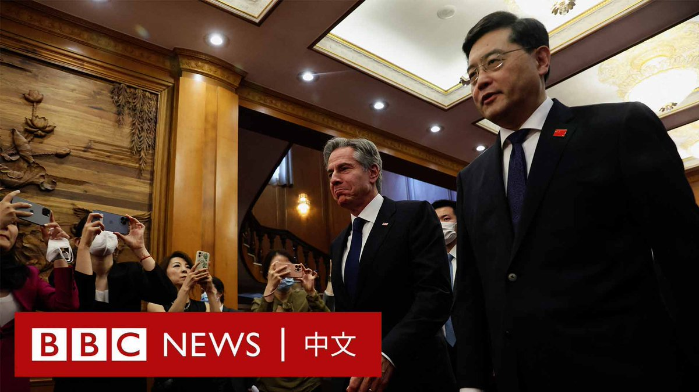
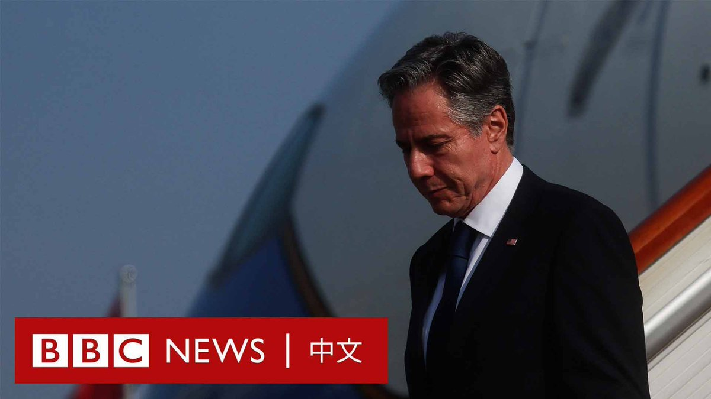

D英国广播公司BBC 北京时间 2023-06-18T21:08:34Z 1670418227640532992 BBC记者安东尼‧泽克尔（Anthony Zurcher）在北京报道说，美国国务卿布林肯和中国外长秦刚的会谈于当地时间晚上8点结束，持续了五个半小时，比原定时间长了大约一个小时。他们现在正在吃“工作晚餐”。   D英国广播公司BBC 北京时间 2023-06-18T18:39:27Z 1670380699323449344 数月来，BBC一直秘密地与朝鲜境内的三个人联络。他们首次披露，政府三年多前封锁边境之后所发生的灾难。饥饿、残暴的镇压，想逃离却苦无机会。
https://t.co/41R8dxZL37   D英国广播公司BBC 北京时间 2023-06-18T15:10:26Z 1670328100285198337 【现场画面】美国国务卿布林肯（Antony Blinken）在北京钓鱼台国宾馆，会见中国外交部长秦刚。 https://t.co/3Rezsj0pSK   D英国广播公司BBC 北京时间 2023-06-18T15:45:06Z 1670336822554284032 BBC记者安东尼‧泽克尔（Anthony Zurcher）在北京钓鱼台国宾馆报道说，美国国务卿布林肯目前正在同中国外交部长秦刚会晤。他们没有向媒体发表讲话，但可以听到他们在寒暄布林肯的飞行旅程。   D英国广播公司BBC 北京时间 2023-06-18T09:38:55Z 1670244668205051904 【现场画面】美国国务卿布林肯（Antony Blinken ）周日抵达北京，这是五年来首位访问中国的美国国务卿。

北京和华盛顿正持续因一系列争端关系紧张。在今年2月的高空气球事件发生后，布林肯推迟了访华行程。 https://t.co/3KG7N0onZs   