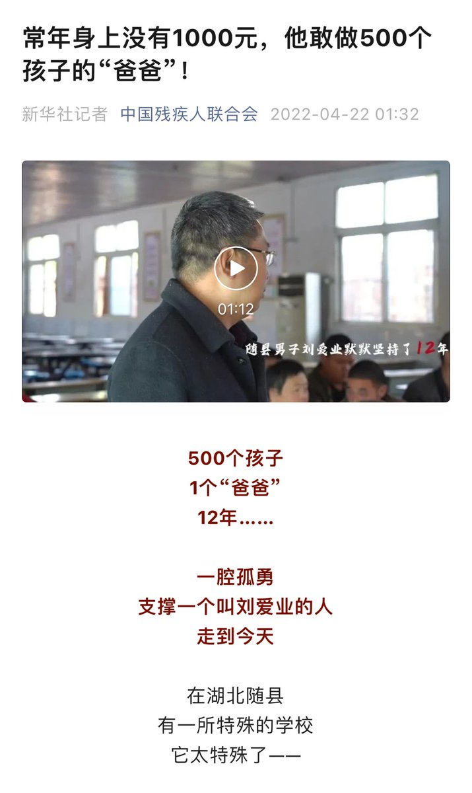
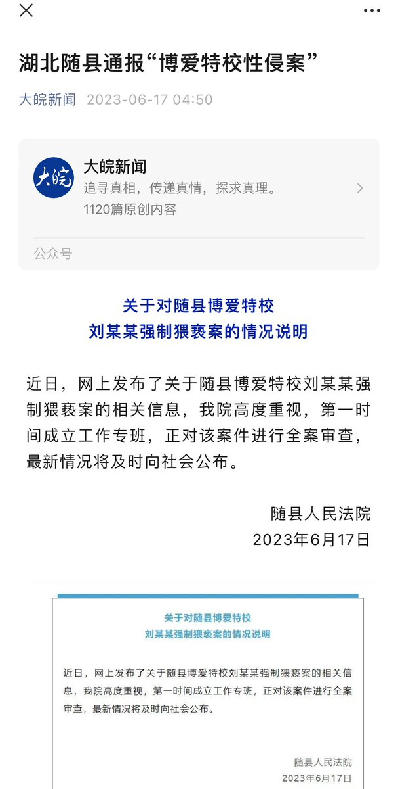

多伦多方脸 北京时间 2023-06-18T13:54:54Z 1670309090336346112 秦刚接见马斯克，习近平接见比尔盖茨。
小粉红，看出来是中国经济要起飞。
我看出来的确实中共确实有些急了。
要是经济还行，马斯克，比尔盖茨，估计很难跟这些人上桌吃饭，只能坐小孩那桌，毕竟中国资本家一直是低官员一等的。
现在都已经能正面交流了，那很显然是中共开始要有求与他们了 https://t.co/Av0jzLZ6ee   多伦多方脸 北京时间 2023-06-18T10:59:19Z 1670264901028450304 一年前的新华社英雄人物，一年后的猥亵犯。
《熔炉》正在中国上演 https://t.co/khrYRFKtKB   多伦多方脸 北京时间 2023-06-18T11:00:27Z 1670265187214192640 最近996又火了起来
有人说是这些人自愿加班的，也有人说是劳资博弈问题
在我看来中国人为什么很多人内卷，是因为中国人身上担子太重
而担子就是很多人要穷其一生去为自己买赎罪券，自己买赎身契
也就是一张张房产证，是国家逼着你内卷
方脸说：中国人为什么难逃996厄运？
https://t.co/heyqd1LBrv   多伦多方脸 北京时间 2023-06-18T08:17:36Z 1670224205269590016 苦了这些奴才了。
这种其实放古代也是没有眼力见的太监，迟早要被砍头。 https://t.co/VH5yNOHbZ9   