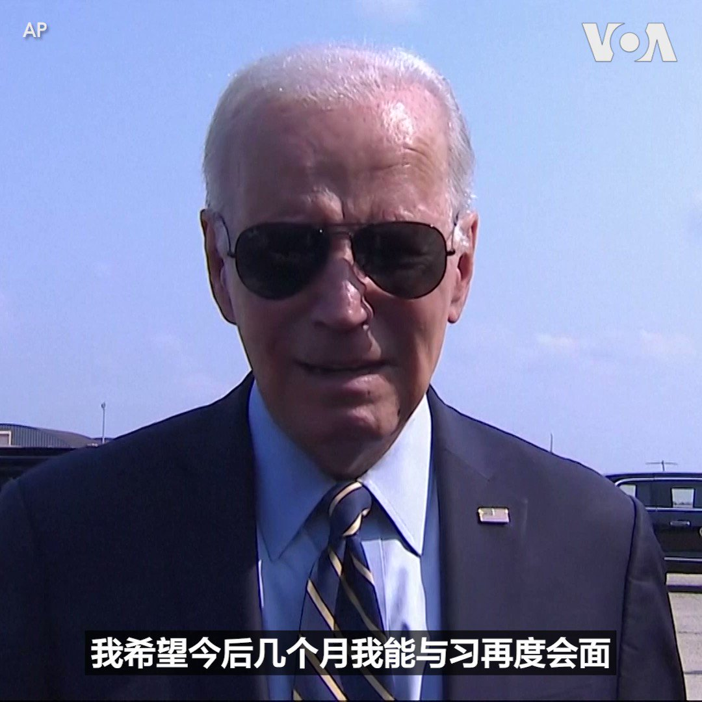

美国之音中文网 北京时间 2023-06-18T03:08:33Z 1670146430458269696 布林肯支持韩国发展“成熟”的对华关系 https://t.co/hzUZuMLm9W   美国之音中文网 北京时间 2023-06-18T04:09:04Z 1670161660475224064 俄罗斯说连夜摧毁了乌克兰的无人机 https://t.co/ioPSJgNBnl   美国之音中文网 北京时间 2023-06-18T00:43:00Z 1670109803472125952 蒙古国前总统查希亚金·额勒贝格道尔吉接受美国之音采访时表示朝鲜人权问题依然严重，外界应不断为朝鲜人权发声；他强调帮助脱北者不仅是政府，也是人道责任。也曾担任过蒙古总理的额勒贝格道尔吉说，他执政时从未遣返过脱北者。他还表示相信自由的力量是强大的，希望有一天朝鲜会变成一个开放的国家。 https://t.co/EEEtEnsMpW   美国之音中文网 北京时间 2023-06-18T01:25:09Z 1670120408597823488 调解俄乌冲突的非洲领导人在圣彼得堡会唔普京，但和平建议遭泽连斯基拒绝 https://t.co/fIg7gBg641   美国之音中文网 北京时间 2023-06-18T01:32:13Z 1670122187964166144 美国总统拜登17日离开华盛顿前往费城之前表示他希望今后几个月有机会与中国国家主席习近平再度会面，“讨论我们之间切实的分歧”以及如何在这些领域相处。美国国务卿布林肯将于18日开始对北京进行两天访问，这是5年来美国国务卿首次访问中国。 https://t.co/OIrlYKDS6z   