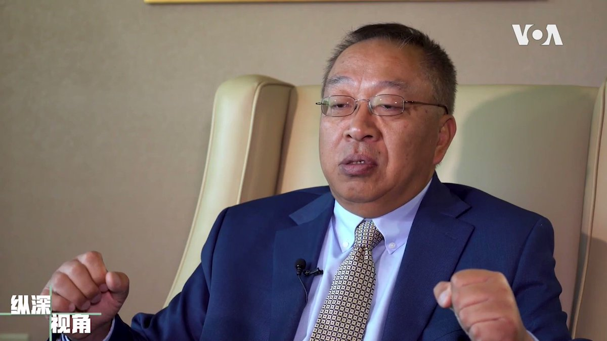
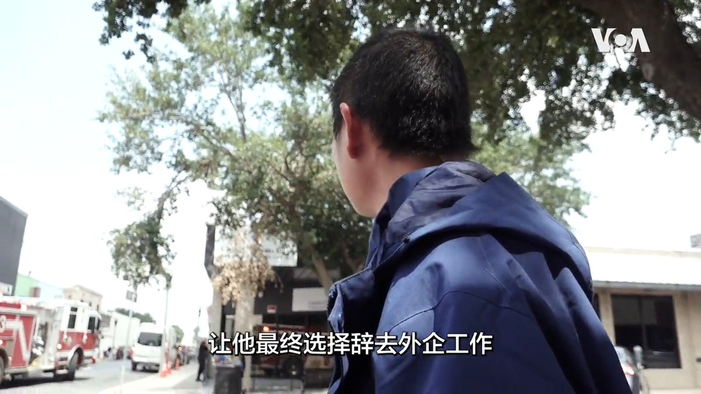
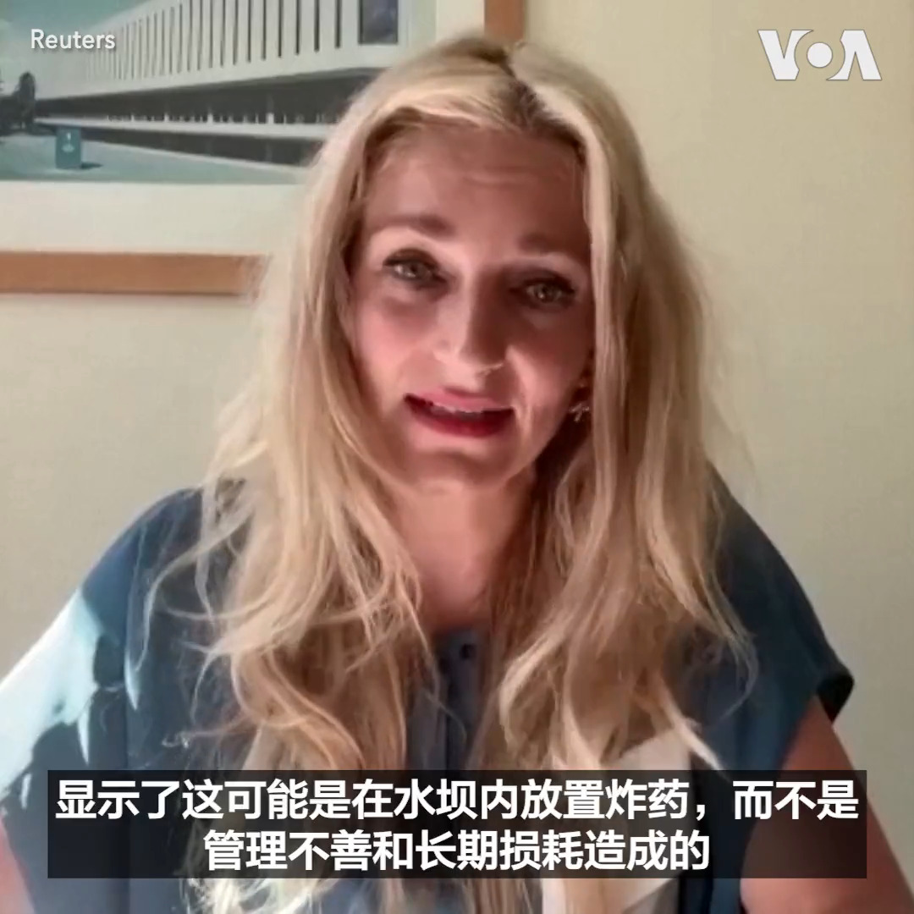

美国之音中文网 北京时间 2023-06-18T06:29:00Z 1670196874123575297 余茂春进入国务院不久便牵头论证“中国是美国的头号威胁”，这个观点现在已逐渐成为美国两党及朝野上下的一个共识，在美国的盟国中也具有重大的影响力。余茂春完整专访请看6/17【纵深视角】：#纵深视角完整版：https://t.co/EHsMrQMKMf https://t.co/mBTmohxPBp   美国之音中文网 北京时间 2023-06-18T07:36:33Z 1670213873646071808 沙特与伊朗讨论增加海湾地区的海事安全 https://t.co/sGvtTPMsSm   美国之音中文网 北京时间 2023-06-18T08:08:56Z 1670222025510748160 6月20日是世界难民日。今年的主题是“去国离乡的希望”。过去几个月，从美墨边境进入美国寻求庇护的中国公民人数激增。其中大多数人跨越半球，穿越中南美洲多国一路北上，历尽艰辛最后从美墨边境偷渡进入美国。他们为何要踏上这样一条非常规的“润”美路？他们的希望又是什么？https://t.co/agXZCusndK https://t.co/APjHOrZEMx   美国之音中文网 北京时间 2023-06-18T08:30:00Z 1670227325076779014 余茂春提出的另外一个著名观点是区分中共和中国人民，时任国务卿蓬佩奥接受了余茂春的建议，于2020年正式推出了这个论断，引发巨大震撼和争议。余茂春说，现在这个观点已被越来越多的人所接受，他没有必要进行任何修正。完整专访请看6/17【纵深视角】：#纵深视角完整版：https://t.co/EHsMrQMKMf https://t.co/46dceGqL2h   美国之音中文网 北京时间 2023-06-18T08:50:35Z 1670232505352622080 国事光析: 1989到2019，从坦克到病毒 https://t.co/J3LMCnOFcb   美国之音中文网 北京时间 2023-06-18T09:00:01Z 1670234881694085127 #美中对标 中国热点对标美国论据，用一杯咖啡的时间聊聊中国热点的美国冷思考。最近中国武汉爆出地方债问题，早前贵州云南等省也都公开向中央喊穷。与此相对美国联邦债务差点触及天花板。本期视频就来对比美中两国究竟谁才是不负责任，没有制衡，缺少监督，高歌猛进地一路借钱。 https://t.co/8TbVKX4VKy   美国之音中文网 北京时间 2023-06-18T05:07:33Z 1670176377767866368 州长：费城I-95公路坍塌路段将在两个星期内恢复交通 https://t.co/GaVVYXmWr1   美国之音中文网 北京时间 2023-06-18T05:51:04Z 1670187327145254913 拜登总统：美国不会让乌克兰加入北约“变的简单” https://t.co/rvaJidRAzq   美国之音中文网 北京时间 2023-06-18T05:58:00Z 1670189075347968001 一个国际专家小组16日公布的初步报告认为乌克兰卡霍夫卡水坝有很大的可能是被俄罗斯放置的炸药炸毁的。国际人权律师事务所“全球权利规范协会“ Global Rights Compliance的专家6月10日至11日与乌克兰检察长和国际刑事法庭的团队一道走访了水坝所在赫尔松地区。 https://t.co/iv9nhk1iIj   美国之音中文网 北京时间 2023-06-18T03:08:33Z 1670146430458269696 布林肯支持韩国发展“成熟”的对华关系 https://t.co/hzUZuMLm9W   美国之音中文网 北京时间 2023-06-18T04:09:04Z 1670161660475224064 俄罗斯说连夜摧毁了乌克兰的无人机 https://t.co/ioPSJgNBnl   美国之音中文网 北京时间 2023-06-18T00:43:00Z 1670109803472125952 蒙古国前总统查希亚金·额勒贝格道尔吉接受美国之音采访时表示朝鲜人权问题依然严重，外界应不断为朝鲜人权发声；他强调帮助脱北者不仅是政府，也是人道责任。也曾担任过蒙古总理的额勒贝格道尔吉说，他执政时从未遣返过脱北者。他还表示相信自由的力量是强大的，希望有一天朝鲜会变成一个开放的国家。 https://t.co/EEEtEnsMpW   美国之音中文网 北京时间 2023-06-18T01:25:09Z 1670120408597823488 调解俄乌冲突的非洲领导人在圣彼得堡会唔普京，但和平建议遭泽连斯基拒绝 https://t.co/fIg7gBg641   美国之音中文网 北京时间 2023-06-18T01:32:13Z 1670122187964166144 美国总统拜登17日离开华盛顿前往费城之前表示他希望今后几个月有机会与中国国家主席习近平再度会面，“讨论我们之间切实的分歧”以及如何在这些领域相处。美国国务卿布林肯将于18日开始对北京进行两天访问，这是5年来美国国务卿首次访问中国。 https://t.co/OIrlYKDS6z   