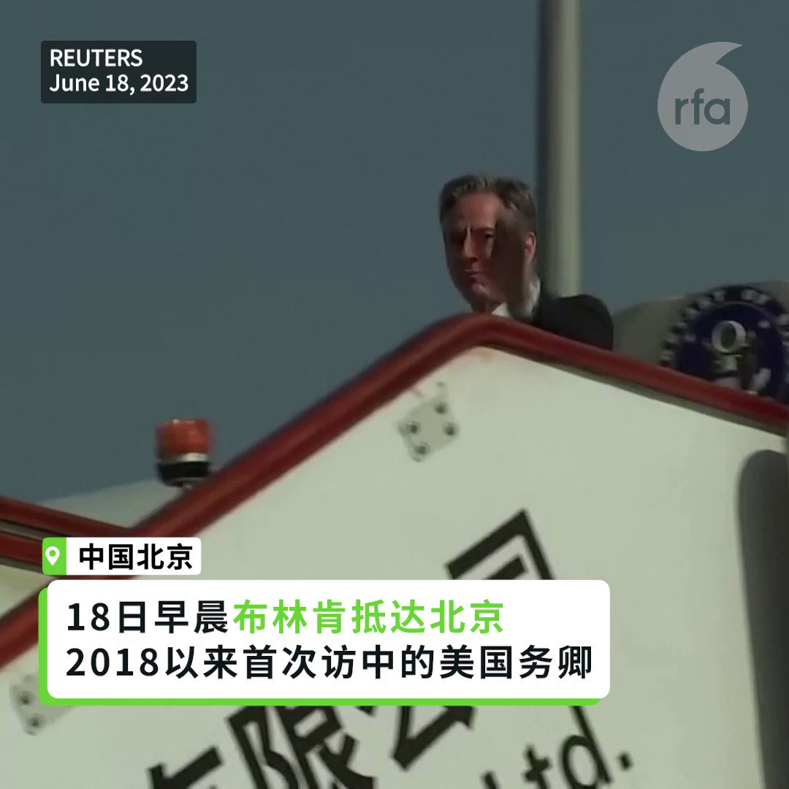

自由亚洲电台 北京时间 2023-06-18T18:18:40Z 1670375469877719041 RT @RFA_Chinese: 【布林肯与秦刚会面】
【双方展开会谈】
北京时间下午两点半，美国国务卿 #布林肯 与中国国务委员、外长 #秦刚 在北京钓鱼台国宾馆会面，两人握手寒暄。双方团队随即展开闭门会谈。 https://t.co/jyyVIU6jue   自由亚洲电台 北京时间 2023-06-18T15:04:14Z 1670326536287731713 【布林肯与秦刚会面】
【双方展开会谈】
北京时间下午两点半，美国国务卿 #布林肯 与中国国务委员、外长 #秦刚 在北京钓鱼台国宾馆会面，两人握手寒暄。双方团队随即展开闭门会谈。 https://t.co/jyyVIU6jue   自由亚洲电台 北京时间 2023-06-18T16:09:44Z 1670343023518167043 https://t.co/6syAGzy4Jd   自由亚洲电台 北京时间 2023-06-18T10:22:37Z 1670255665334603778 【布林肯抵达北京 将会见王毅秦刚】
【能否改善美中关系全球瞩目】
美国国务卿 #布林肯 18日早晨抵达中国。在18，19日两天行程中，将会见中国外长 #秦刚 及中共外事办主任 #王毅。他是近5年来第一位访问中国的美国国务卿，此行能否稳定 #美中关系 受外界瞩目，但各界的期待均不高。

布林肯行前表示，美方应该把一些“非常真实的忧虑”对中国坦率表达。他说，这趟访问的目的是建立“畅通且经过授权的”沟通管道。他说，希望在多个领域加强与北京合作。

详细报道：
https://t.co/XGrSlqtGxF   自由亚洲电台 北京时间 2023-06-18T07:22:01Z 1670210217047650304 评论 | #程晓农：#中美冷战 格局固定化
https://t.co/vLtC2mKf8F   自由亚洲电台 北京时间 2023-06-18T09:45:22Z 1670246291245506561 据路透社6 月 18 日发自东京的消息，美国国务卿 #布林肯访华 将于周日抵达北京，这是五年来第一位访问中国的美国高级外交官，目前双边关系冷淡，美中这两个世界最大的经济体之间的争端取得任何突破的前景黯淡。

https://t.co/RyjbHRWRvo   自由亚洲电台 北京时间 2023-06-18T09:48:05Z 1670246976917737473 【柬埔寨指控两名中国人谋杀韩国网红】
据本台柬埔寨语组16日报道，韩国网红Byun Ah-yeong在柬埔寨金边的一家无照诊所接受注射后死亡。
柬埔寨一家法院指控两名中国公民对本月早些时候在金边郊区发现的这名韩国网红实施酷刑和谋杀。
https://t.co/NCaHyXZ6Cn https://t.co/FIBnN9Nrw4   自由亚洲电台 北京时间 2023-06-18T04:50:07Z 1670171991796600832 综合外电17日消息，据日媒报导，参与调查的相关人士透露，涉嫌泄露先进技术情报遭日本警方逮捕的中国籍研究员 #权恒道，疑似参与中国政府吸收海外优秀研究人员的“#千人计划”。

据日本放送协会（NHK）报导，日本警视厅怀疑59岁的权恒道可能将情报泄露给中国，作为对母国的技术贡献，并正展开详细调查。

权恒道是日本国立研究开发法人“产业技术综合研究所”高级主任研究员，日方认为其将与本身研究有关氟化合物的先进技术情报，以电子邮件方式传送给中国化学产品制造公司，日方依涉嫌违反“不正竞争防止法”（日本保护智慧财产权及维持竞争秩序重要法律之一）逮捕。

参与调查的相关人士表示，权恒道面对警方质询否认相关指控。

根据日本警方截至目前为止的调查，权恒道曾因在科学技术研发有所贡献获中国政府表扬，可能参与中国政府主导的“千人计划”。   自由亚洲电台 北京时间 2023-06-18T02:39:43Z 1670139172991160320 #拜登 希望未来数月内与 #习近平 会面　#布林肯 支持韩中发展“健康成熟”关系
https://t.co/582TGO3wxC   自由亚洲电台 北京时间 2023-06-18T02:40:55Z 1670139476520099846 据路透社报道，#英国 安全事务国务大臣图根哈特本周会晤台湾数位发展部部长 #唐凤，打破英国外交政策的传统惯例，此举可能激怒北京。

https://t.co/k0pnyTa5cz   自由亚洲电台 北京时间 2023-06-18T00:05:16Z 1670100305151950851 专栏 | #解读新疆：#维吾尔 制帽匠夫妇狱中身亡; 美国会提案 #给予维吾尔人优先难民地位
https://t.co/RHKPfbnm1A   自由亚洲电台 北京时间 2023-06-18T00:13:38Z 1670102411569147905 【江西 #指鼠为鸭 事件有结果了： 学生果真吃到老鼠头】
“好消息是，确定是鼠头了。坏消息是，只找到了鼠头。”

https://t.co/BAFVVcaBnH   