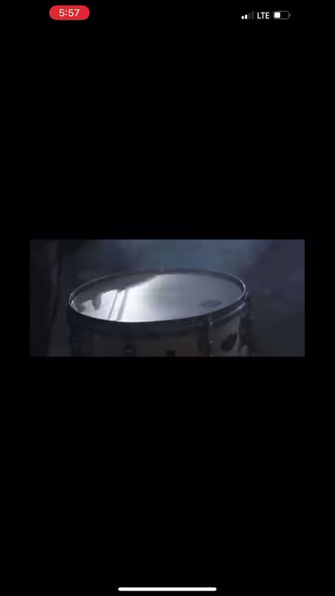

蔡霞 北京时间 2023-06-18T22:25:28Z 1670437576761548800 流氓国家就怕曝光，他们以为用黑暗遮挡事实真相，就能做到扼杀真相，这种鸵鸟政策只能自欺欺人。   蔡霞 北京时间 2023-06-18T22:42:03Z 1670441753357213696 看看中共国警察的流氓嘴脸，流氓作派。全世界有哪个国家警察用流氓行为“执法”？只有中共国。这既是全球最令人嗔目的奇观怪相之一，也是流氓国警察公然侵害人权的犯罪行径。
呼吁警察流氓头子让手下停止流氓行径，这几乎没有可能。公开信更多的作用在呼吁人们关注声援王全璋一家，尽可能提供更多的帮助   蔡霞 北京时间 2023-06-18T22:57:03Z 1670445526955728902 RT @xinwendiaocha: 由于中共国政府的封禁，这个传播最广版本的香港国歌《愿荣光归香港》已在Youtube上不可播放！特此保存！ https://t.co/xZc2MqIa4O   蔡霞 北京时间 2023-06-18T23:13:55Z 1670449772250140673 RT @chinatransition: 中共放弃了市场化改革，转而在一党专政下，将经济资源全面地向军工倾斜，走一条民贫军强，与发达国家对抗的道路。中国的体制离宪政民主越来越远，却在对抗世界民主阵营的道路上越走越远。这跟上世纪30年代的日本、德国、意大利体制对抗自由民主体制没有…   蔡霞 北京时间 2023-06-18T23:21:51Z 1670451766117437447 RT @luoshch: 雇佣地痞和流氓来耍无赖骚扰，什么下三滥的手法都出来了，中共当局已经堕落到了什么地步？！

我痛心地注意到这个像中学学生一样的孩子和地痞流氓们混在一起，站在最前面，地痞流氓行为已经向下一代渗透，这个国家还有救吗？   蔡霞 北京时间 2023-06-18T23:25:06Z 1670452584325476353 RT @HuPing1: 如果中国政府在发现疫情后，就及时地启动中国在萨斯事件后花大气力建立起来的世界一流的应急机制，疫情完全可以扼杀在萌芽状态。即便是仅仅根据中国官媒发表的信息我们也可以断定，“亲自指挥亲自部署”的中共总书记习近平是这场全球性大灾难的第一责任人。   蔡霞 北京时间 2023-06-18T06:25:16Z 1670195935777832960 在北京时有句话：活得长就是政治。”
这句话是指在极权统治下，争取自由民主的异议人士对抗当局隐形施害的一个重要方面，就是意志不屈、身体强健，思维清晰，反应敏捷，让自己活得更长更好，待看习朝下场。
锻炼身体保持健康，吸收新的知识，这对我来说是每天的必修课。   蔡霞 北京时间 2023-06-18T09:36:50Z 1670244144957263873 RT @Jam79922967: 我的老师说：【如果不是他爸，路人甲不可能被“推荐上清华”。即使1977年大学恢复高考，凭他成绩不可能考上大学。复读一年，1978年复考，依然不会考上。做个村长比较合适，最多做到乡长。】 https://t.co/cX6C45NcWu   蔡霞 北京时间 2023-06-18T04:48:59Z 1670171707141922817 RT @yibaochina: 【译丛】“共同价值观”如何成为遏制中国战略的关键属性 https://t.co/o8E4pTm1am 通过对安全援助、地缘经济伙伴关系和基础设施/技术连接上依靠谁的战略选择施加影响，越有可能将所有具体的战略选择简化为一个二选一难题：是站在中国一边…   蔡霞 北京时间 2023-06-18T04:53:40Z 1670172884957007872 有内行人认为：從時間線上看幾個沿海沙灘連續出現海產死亡，污染源或许是大亞灣核电站，前幾天香港中電公佈有輻射輕微上升。
現在牆內全都指責日本核廢水就是帶節奏。日本的水是經過加拿大到美國經過赤道才到東南亞再沿中國海岸線北上。洋流決定不直接流到中國。
欺骗、隐瞒、甩锅是中共国一贯手法。   蔡霞 北京时间 2023-06-18T05:27:33Z 1670181410823454722 口头传达不写文字是中共干坏事时的一贯做法。中共有些写出文字是用来宣传的（即忽悠人）：让看不让干。真正干的通过“口头传达”，一是便于甩锅。中共党里有句口头禅：“你领会精神了吗？”党化语言：“贯彻落实ＸＸＸ会议精神………”，干出严重恶果是下面“领会错了”，上面不承担责任。二是便于权力任性而为   蔡霞 北京时间 2023-06-18T06:06:58Z 1670191329102495747 RT @milesyu10: 感谢美国之音对我的采访。

https://t.co/tQJ4ydggjX   蔡霞 北京时间 2023-06-18T00:07:01Z 1670100745603907584 人民日报那时内部压力很大，有一篇文章记叙了6月3号到6月4号那两天中的38个小时，人民日报社社长与副社长们为抵抗来自中南海里的高压，他们艰难地做了什么。
一群坚持良知的令人尊敬的老新闻人们！那篇文章现在很难找到了。好像题目就是《38个小时》。胡绩伟是人民日报社这群人中的最杰出代表   