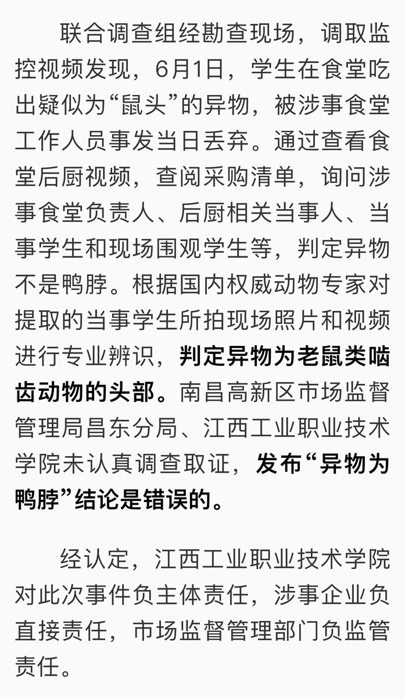
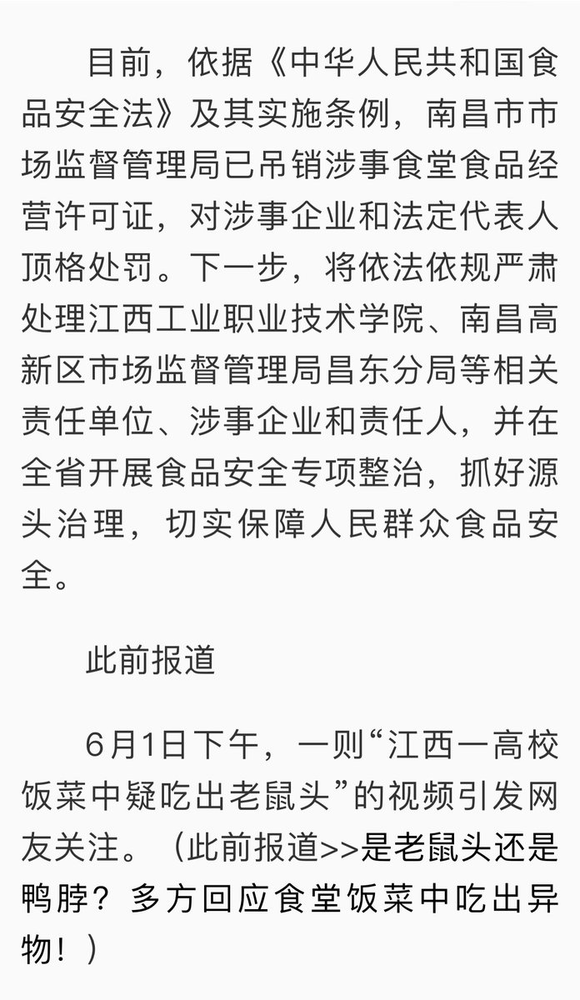
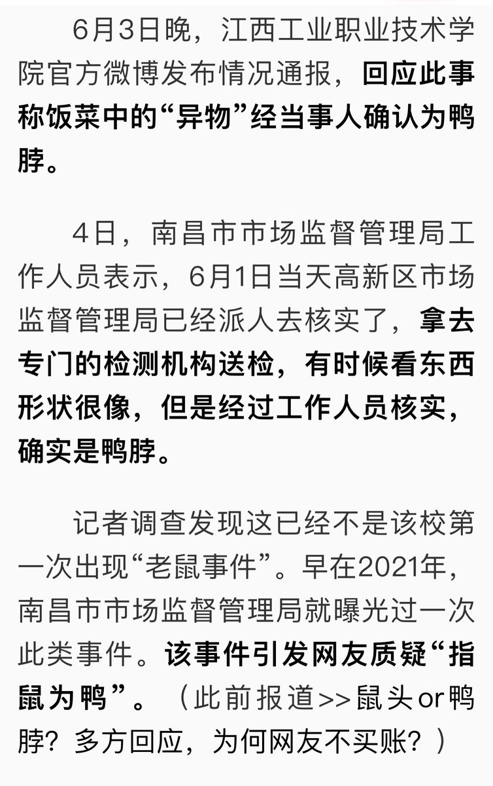
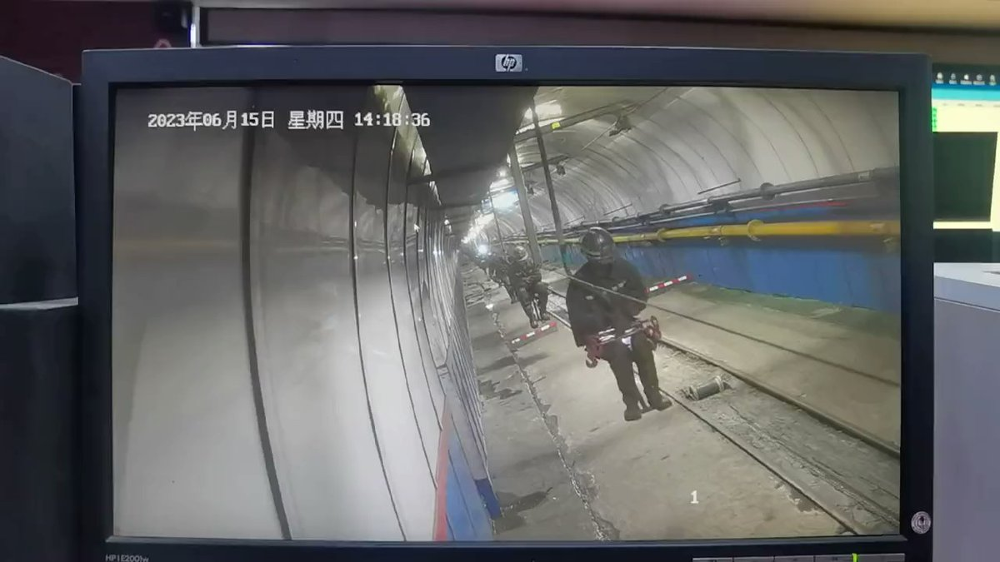
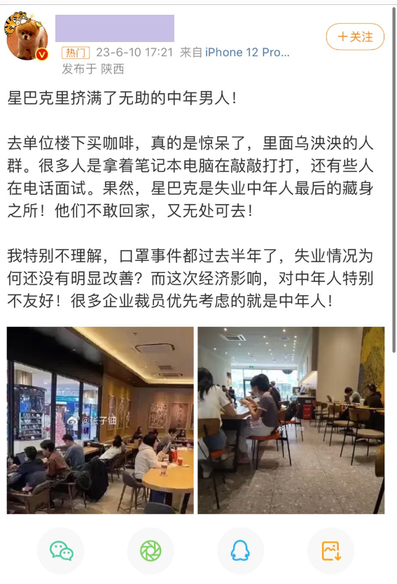
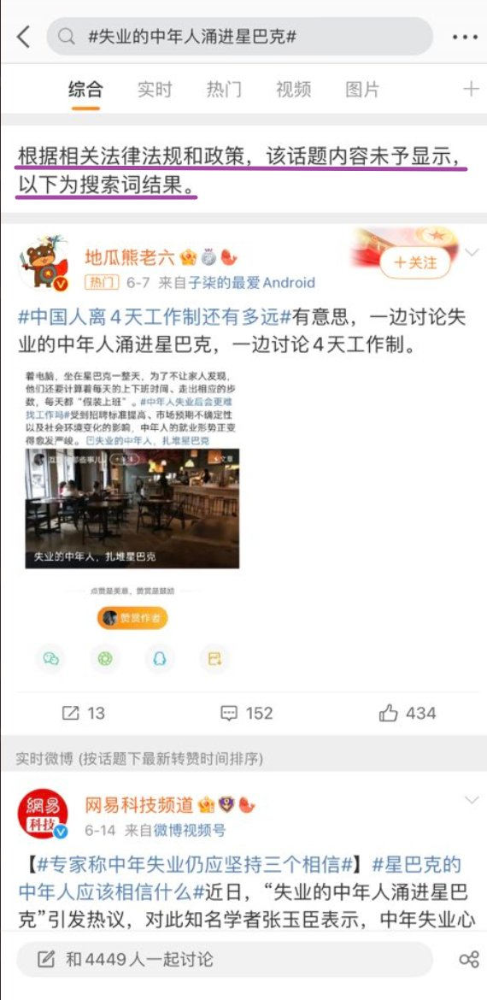

A李老师不是你老师 北京时间 2023-06-17T20:32:22Z 1670046729306009600 网友投稿
【女子曝光天价烧烤，被指控造谣抹黑长沙，当众怒吞认罪书】
6月13日，湖南长沙。一女子发布一个视频曝光长沙天价烧烤，称这个在长沙特别常见，希望可以把长沙烧烤的价格打下来。
根据女子事后描述，第二天下午，网信办有人联系其见面，被女子拒绝。当晚，女子再次发布视频曝光长沙的天价烧烤不是个例。
随后第三天，公安局，网信办等多名执法人员两次上门将女子带走协助调查。在调查期间，询问其是否是为了想红，是否收受稿费，是否故意抹黑等
在得到女子否认后，警察威胁称“如果不配合搞东搞西，就调查你父母”。
随后女子被关在“小房间”，警察称她将要被治安拘留两天。期间，因肠胃炎和双相情感障碍，女子被送医院，在意识模糊中听见周围人称，最近长沙烧烤负面新闻太多，需要有人顶锅，只要女子认了造谣，他们就可以让平台把所有视频下架，同时震慑其他说长沙烧烤价格贵的人。
之后有人送来一份文件，称只要盖章就能回家。上面赫然写着“承认造谣，恶意抹黑长沙”。
女子表示不愿意签署，对方称不签就继续跟你耗。随后女子将“认罪书”当场就水吞下，被立即送去洗胃。之后所有执法人员都不见了。
洗完胃之后，警察托人送来手机，称“事情结束了”。
6月17日，女子发布长文讲述事发经过。（见评论区）   A李老师不是你老师 北京时间 2023-06-17T16:43:28Z 1669989122260234240 “指鼠为鸭”再次反转
6月17日，江西联合调查组认定，江西工业职业技术学院饭菜中的异物是鼠头。 https://t.co/huzE3bG9HK   A李老师不是你老师 北京时间 2023-06-17T01:05:01Z 1669752956147707909 网友投稿
6月15日，山西吕梁一矿井发生事故 https://t.co/bNpwrkAGk4   A李老师不是你老师 北京时间 2023-06-17T01:15:15Z 1669755528908615701 补充视频 https://t.co/4hBpkXKgBK   A李老师不是你老师 北京时间 2023-06-17T01:26:17Z 1669758308364824590 网友投稿
近日，“失业的中年人涌进星巴克”的新闻引发关注，一名博主称，自己去楼下买咖啡，发现大量的失业中年人为了不让家人知道自己失业，在上班时间躲在星巴克里或是在寻找工作，或是正在面试。
然而，6月15日，有网友发现“失业的中年人涌进星巴克”这一话题已经被封禁。 https://t.co/f2DT9rpjdV   A李老师不是你老师 北京时间 2023-06-17T01:54:43Z 1669765460072562701 网友投稿
近日，《英雄联盟》解说用词针对亚运会赛事进行了大量“和谐”改动。
除了“杀”“死”“血”等词汇需要更改外，大量的游戏传统词汇也被禁止出现。这导致在首日第一场比赛中，因解说们在解说过程中反复出现违禁词事故，导致比赛结束后就被立即换下。
李老师认为，主办方为了规避审查和谐词汇只是掩耳盗铃，无法隐藏《英雄联盟》存在暴力血腥和对抗的本质。
反观近年来如《长津湖》等爱国题材电影，尽管爆炸断肢血肉横飞，并不影响但是全国各中小学依然组织中小学生集体观影，完全不存在心理健康方面的担忧。
因此，主办方真正要考虑的并不是如何让词汇更和谐去恶心观众，而是应该研究如何让《英雄联盟》披上爱国的大衣。   