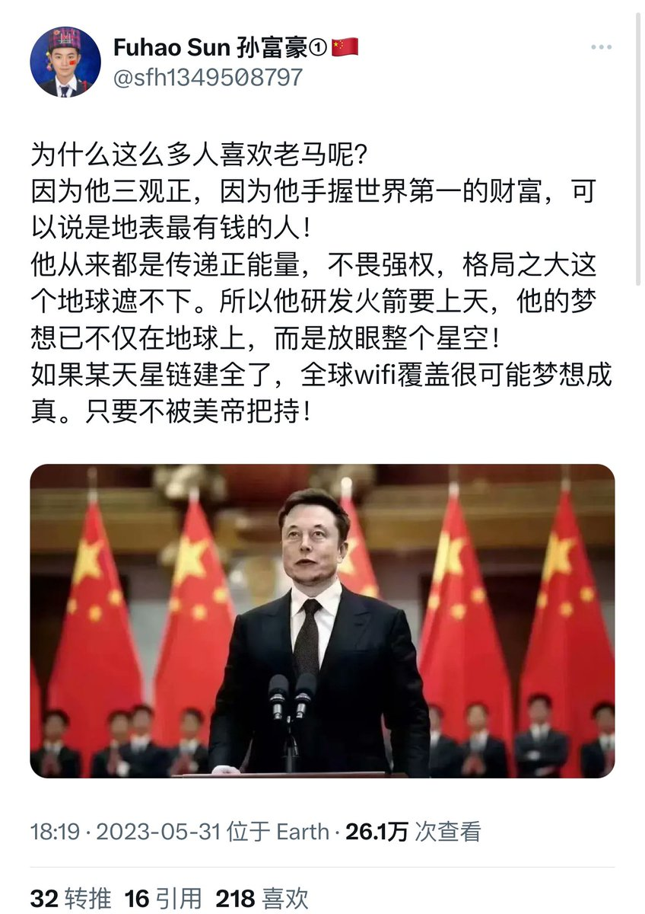
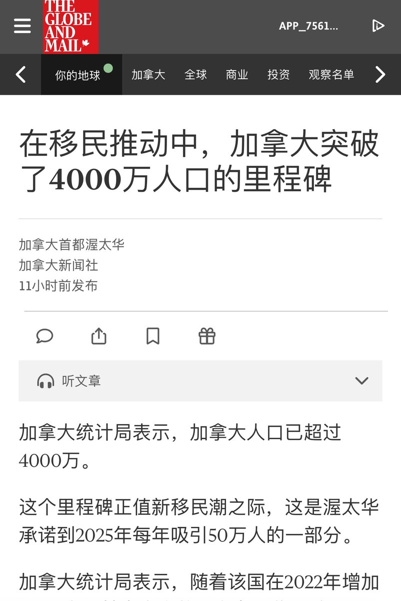

多伦多方脸 北京时间 2023-06-17T18:43:32Z 1670019339335131138 马斯克又乳华了？
前几天小粉红才刚舔完啊😩 https://t.co/bcSbW0jVLN   多伦多方脸 北京时间 2023-06-17T14:51:16Z 1669960889037094915 抛开事实不谈，那个老鼠头没有一点责任吗？
谁叫你长得像鸭脖，哪怕只有1%像   多伦多方脸 北京时间 2023-06-17T15:13:10Z 1669966399173967872 加拿大今天突破4000万人口了。
以后在视频里不能说，加拿大接近4000万人口，要改成4000万了😁
目前预估是2041年突破5000万，并在世纪末突破1亿人口。
除了我本身是新移民外，我本身也十分认可这种通过新移民提供发展动力的方式。
尤其是加拿大侧重的是技术移民 https://t.co/KEpS4Rl0KE https://t.co/pM8mNNksDE   多伦多方脸 北京时间 2023-06-17T12:48:58Z 1669930107618881538 江西省调查组，确定这个异物是老鼠头了。 https://t.co/ouTB2LxhaB   多伦多方脸 北京时间 2023-06-17T11:35:11Z 1669911539284074497 你会发现所有的粉红
他们都反对，高福利制度，反对正常执行劳动法，反对废除996，反对官员收入公开等等等
但凡只要有利于人民的是一项不支持
这是为什么呢？因为他们支持的是党，党和人民的利益是冲突的。   