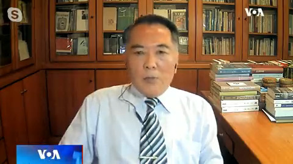
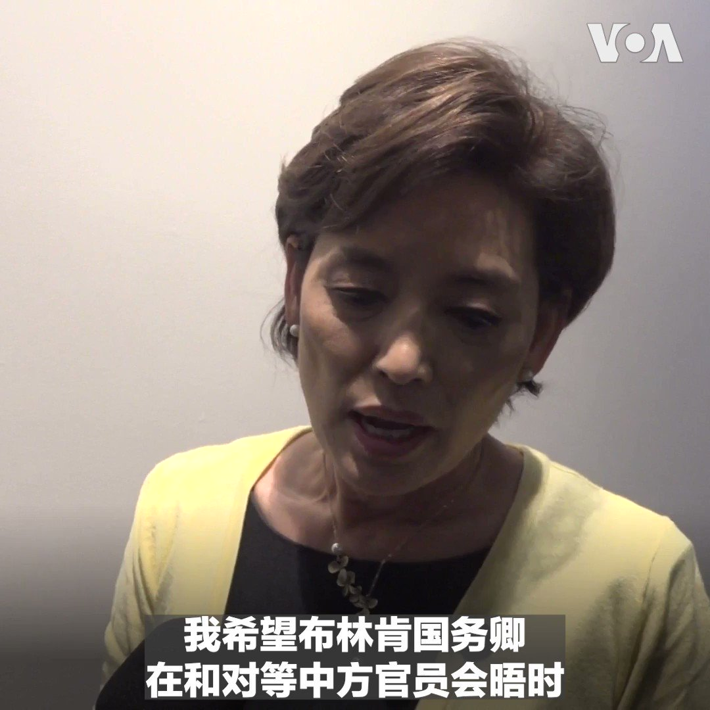

美国之音中文网 北京时间 2023-06-17T22:29:02Z 1670076089040007168 意大利政府裁定倍耐力中国最大股东无权任命公司首席执行官 https://t.co/nX9DEQsgWZ   美国之音中文网 北京时间 2023-06-17T22:49:33Z 1670081253025157124 美日菲安保合作剑指中国 专家:联合吓阻比亲善北京更有效 https://t.co/c4LMEOqLLs   美国之音中文网 北京时间 2023-06-17T22:49:35Z 1670081260847529986 印度总理莫迪即将正式访美，两国关系有望再掀新的一页 https://t.co/vLkZH515s8   美国之音中文网 北京时间 2023-06-17T23:43:03Z 1670094716619362304 专访余茂春： 投身美中博弈 个人荣辱不惊 https://t.co/mhMQUEiEUT   美国之音中文网 北京时间 2023-06-17T23:43:05Z 1670094724328484864 联合国秘书长痛批国际货币基金组织和世界银行，呼吁推动重大改革 https://t.co/OSlvaj4gqm   美国之音中文网 北京时间 2023-06-17T20:53:33Z 1670052060287619073 台湾于六月接连派出四位部长级官员赴欧，包括正在波兰、捷克和欧盟访问的台湾外长吴钊燮。分析人士说，台湾在多点分进合击的策略下，台欧关系持续升温。在欧洲重新检视对华政策之际，他们呼吁，台湾积极协助欧洲“知中”，让欧洲认清，一旦台海爆发冲突，欧洲不可能置身事外。https://t.co/dO94KoqBzZ https://t.co/FtnsbUa0we   美国之音中文网 北京时间 2023-06-17T21:00:02Z 1670053692085600257 #越洋电话 #陈迈平 1978年，在一本名叫《今天》的杂志出现在北京西单的民主墙上，并催生出朦胧诗流派。陈迈平曾是这本杂志的编辑，副主编和社长。
完整版🔗https://t.co/KpjvPKSXf6
Spotify🔗https://t.co/W1yuQyoMlz
Apple Podcast🔗https://t.co/Hyxy0Rpfdw
Google Podcast🔗https://t.co/UPadnE7u8m https://t.co/GmbBIy6tlK   美国之音中文网 北京时间 2023-06-17T21:00:39Z 1670053845777657857 中国社会多年来深受少子化与老龄化所困，雪上加霜的是结婚人数持续减少，初婚年龄不断延后，甚至决定不婚不育的女性也越来越多。根据中国民政部6月9日公布的《2022年4季度民政统计数据》，去年全国结婚登记量为683.3万对，创下自1986年统计结婚数据以来的历史新低。报道：https://t.co/pW1wREvla6 https://t.co/1exbt5HEiC   美国之音中文网 北京时间 2023-06-17T21:09:53Z 1670056167551426561 台湾近日爆发性骚扰风波，逾30位女性控诉遭跨政坛、学界、媒体和艺文圈等人士的性骚扰经历。此波女权#MeToo运动已造成两名民进党立委参选人退选及多人退出公众领域。女权人士表示，台湾有关性别平等的三大法规已施行多年，但在文化和落实面仍有极大落差。报道: https://t.co/amPvABlmMY https://t.co/4PKMvY86nr   美国之音中文网 北京时间 2023-06-17T21:55:35Z 1670067668056158209 英国国王查尔斯三世17日在他的官方生日庆祝阅兵式上骑马检阅军队。阅兵式也称为军旗敬礼分列式 Trooping the Colour。查尔斯三世的母亲、已故的伊丽莎白二世女王在1986年她60岁的时候停止了骑着马阅兵，74岁的查尔斯三世又恢复了这一传统。 https://t.co/JrAOkNp0lC   美国之音中文网 北京时间 2023-06-17T22:00:03Z 1670068792108646403 在本期《鹰与盾》节目中，主持人马克将向您详细介绍乌克兰本周大反攻的最新动态，并分析乌克兰主力部队是否已展开行动。此外，美国五角大楼12日宣布，将再次向乌克兰提供3.25亿美元的军事援助，其中包含斯崔克装甲运兵车以及M2步兵战车，以弥补其战场损失。马克将为您详细解读这些俄乌战争的最新进展。 https://t.co/50hlQb5aEz   美国之音中文网 北京时间 2023-06-17T16:49:33Z 1669990654842384386 美国会两党提案取消小额包裹免税 SHEIN、Temu等中国电商恐遭重创 https://t.co/Q5vPn32rIq   美国之音中文网 北京时间 2023-06-17T15:36:08Z 1669972177754689536 韩国称:布林肯支持韩国与中国发展“成熟”的关系 https://t.co/UEFMuT4xWc   美国之音中文网 北京时间 2023-06-17T16:19:33Z 1669983105791262721 乌干达一学校遭到恐怖袭击 造成25人死亡 https://t.co/iX56tHTv4l   美国之音中文网 北京时间 2023-06-17T12:27:55Z 1669924810238078976 美国国务卿布林肯定于18日到19日访问北京，人们对于他此行在美中许多争议问题上取得重大进展的期待较低，不过分析人士认为布林肯此行至少能向人们展示全世界最重要的两个国家的关系并不会脱轨。 https://t.co/lWuyaSAUP6   美国之音中文网 北京时间 2023-06-17T12:30:00Z 1669925335217893376 布林肯为何要去北京对话？台湾政治大学国际关系研究中心资深研究员宋国诚教授说：大国间共识机制有必要，但布林肯去中国是对牛弹琴，其中也有警告北京的味道。美中没话可对，中共也无兴趣改善关系，谢锋说过美国三分法就是遏制打压中国的“障眼法”。#时事大家谈完整版：https://t.co/f7wJIZyg0D https://t.co/6aMdQoiMN4   美国之音中文网 北京时间 2023-06-17T14:00:01Z 1669947990751219712 一名不久前才脱离前线战斗、化名“死亡”的乌克兰陆军狙击手在扎波罗热附近的一个秘密地点参加训练，他说自己还能活着已经是一个奇迹，因为随时陷入险境。几天前一枚火箭弹击中离他仅150米的地方，车被撕成碎片。这个训练场以美系狙击步枪为主，乌军也使用欧系、俄系以及自制型号。 https://t.co/fwyqJfgB0u   美国之音中文网 北京时间 2023-06-17T10:13:04Z 1669890873805639680 路透社：英国保安国务大臣打破常规会晤台湾数位发展部长 https://t.co/T2dzHon23I   美国之音中文网 北京时间 2023-06-17T11:00:01Z 1669902691575943168 从上海空运直达墨西哥，230美元一公斤，大宗也能直达，中国销售商可以提供受美国政府严格控制、用于制造强效合成阿片类药物芬太尼的化学前体，它的效力可达吗啡的100倍。为了避免被发现，包裹有时会贴上“猫粮”标签。美国之音记者调查发现，芬太尼原料的在线销售仍然在进行中。 https://t.co/ccVsQfqmyS   美国之音中文网 北京时间 2023-06-17T11:30:00Z 1669910236306501633 北京高层见库克、马斯克和盖茨，意在影响美中关系？西密歇根大学政治系教授王元纲博士说：不要把中共看得那么高端。这三位都是既得利益者。美国手上筹码很多。美国商界对中国态度已有180度大转变，影响力也大不如前。#时事大家谈完整版： https://t.co/f7wJIZyg0D https://t.co/wjSphwzQvL   美国之音中文网 北京时间 2023-06-17T12:09:33Z 1669920190983987201 朝鲜召开重要党代会 解决陷入困境的经济及应对国防战略问题 https://t.co/5q8OHJbMvM   美国之音中文网 北京时间 2023-06-17T06:51:33Z 1669840163428786176 美国之音拒绝续签前俄罗斯官媒记者的合同 https://t.co/jhxO314NEM   美国之音中文网 北京时间 2023-06-17T07:06:04Z 1669843815983894529 布林肯访中在即 美众院共和党领袖：降低台海紧张局势应为首要重点 https://t.co/cZ8gkyrFpL   美国之音中文网 北京时间 2023-06-17T07:06:06Z 1669843823474929665 担心俄罗斯的破坏威胁，北约采取行动保护海底管道和电缆 https://t.co/ECjQaajUvc   美国之音中文网 北京时间 2023-06-17T07:21:28Z 1669847689117458432 余茂春曾是美国制定中国政策的重要参与者，也是美中关系研究领域的重量级人物。余茂春的国务院同行称他为“国宝级智囊”，中国官媒则称他是卖身投靠的“狗头军师”和“汉奸”。余茂春在《纵深视角》谈自己在美中两地的荣辱问题，并就中国政治、社会及美中关系的重要问题发表观点。 https://t.co/Bwx4bYIAot   美国之音中文网 北京时间 2023-06-17T07:49:34Z 1669854761200553984 普京证实俄罗斯已在白俄罗斯部署战术核武器 https://t.co/93ZYJcHPbk   美国之音中文网 北京时间 2023-06-17T07:56:00Z 1669856381124644864 美国国务卿布林肯启程访问中国，几名美国会众院外委会高级成员在接受美国之音采访时表示，与中方就美国关切议题进行沟通是好事，但对访问出现重大成果不表乐观。印太小组委员会主席金映玉强调，希望布林肯能向中方清楚表明，中国在印太地区许多咄咄逼人的行为是不可接受的。https://t.co/8EGQu1lkgm https://t.co/9aGdmZ8RxI   美国之音中文网 北京时间 2023-06-17T08:00:00Z 1669857389162405892 世界媒体看中国——金哲报道：新冠大疫之后，中国与西方渐行渐远；西方对中国的天真看法寿终正寝。西方何以不再信任中国？相关报道：https://t.co/ilnVJQHmZh https://t.co/EhHkua5xHG   美国之音中文网 北京时间 2023-06-17T08:03:32Z 1669858279529537536 新冠管制迫使这些外国人离开中国，如今他们还想回去吗？ https://t.co/aI0zIJkRKa   美国之音中文网 北京时间 2023-06-17T08:03:34Z 1669858287725187073 世界难民日专题：去国离乡，寻找希望的中国走线移民 https://t.co/YoDKBzVJJ0   美国之音中文网 北京时间 2023-06-17T08:06:21Z 1669858988144623622 巴勒斯坦总统阿巴斯本周五结束对中国的访问，巴中双方宣布建立“战略伙伴关系”。然而，观察人士分析，中巴新建立的关系对巴勒斯坦的实质助益仍有待观察，仅凸显了北京在中东的战略愿景。至于外界关注的以巴和谈，专家则认为北京难有能力担任斡旋角色。报道内容：https://t.co/chC4UY6Ef5 https://t.co/hHwIx9A2PD   美国之音中文网 北京时间 2023-06-17T08:30:35Z 1669865085773443072 布林肯访北京可否为台海紧张情势降温？专家：不太可能 https://t.co/5m1xjuA6NM   美国之音中文网 北京时间 2023-06-17T09:00:02Z 1669872494436847616 一键解锁 #美国热搜 榜 1、是谁请来梅西为习近平生日唱堂会？2、人民日报要圆习近平的帝王梦 3、习近平破了毛泽东的禁忌 4、习近平是哆啦A梦中胖虎转世？5、习近平错别字石刻 6、龙舟赛冲撞习近平生日遭停办 7、公安的遮羞布执法 8、女土豪唱打土豪 https://t.co/oSoo7XQMyz   美国之音中文网 北京时间 2023-06-17T09:01:03Z 1669872753770643456 意大利政府采取措施限制中国对轮胎制造商倍耐力的影响 https://t.co/OMMI6Ew4x9   美国之音中文网 北京时间 2023-06-17T09:30:03Z 1669880049372385292 布林肯启程去北京前呼吁与中国改善沟通 https://t.co/pbOgRSCzYZ   美国之音中文网 北京时间 2023-06-17T04:53:17Z 1669810398235856896 以华人为主的移民16日在悉尼集会，要求尽快批准他们的永久居民身份。澳大利亚搁置“黄金签证”项目，使签证审批时间延长。2012年推出的商务创新与投资计划(BIIP)吸引很多中国富人移民澳大利亚。但评估显示BIIP签证持有者比澳大利亚人平均所做出的贡献要少，今后政府将重点解决关键技能人才缺乏的问题。 https://t.co/RZWBXVib3P   美国之音中文网 北京时间 2023-06-17T05:06:33Z 1669813737581338625 戴琪阐述拜登政府以“工人为中心”的贸易政策，呼吁重新设计供应链加强其韧性 https://t.co/zBBc5c5yzh   美国之音中文网 北京时间 2023-06-17T05:24:09Z 1669818167559065600 巴勒斯坦总统访中落幕 习近平为“以巴和解”指明方向了吗？ https://t.co/sgp8vaO6Xz   美国之音中文网 北京时间 2023-06-17T05:24:11Z 1669818176778149893 中国船只频繁经过越南油气田区域导致紧张局势升级 https://t.co/IFdMNv9kfh   美国之音中文网 北京时间 2023-06-17T05:32:23Z 1669820239125544960 美国表示要重新加入联合国教科文组织时，中国批评华盛顿将国际组织视为“公园”。 这种比较具有误导性，与教科文组织章程第二条中规定的国家成员资格条款相矛盾。#揭谎频道为您详细探究。https://t.co/dOKqi1RGO5   美国之音中文网 北京时间 2023-06-17T03:21:03Z 1669787188291334144 留日女生发布“港独”言论被起诉 开海外港人因言获罪先例 https://t.co/2RJgSiBaVF   美国之音中文网 北京时间 2023-06-17T03:37:03Z 1669791216224051200 结婚人数史上新低 中国“最后一代”吶喊“勿滥生无辜” https://t.co/A8o2MXwLnd   美国之音中文网 北京时间 2023-06-17T00:33:03Z 1669744907832143873 调解俄乌冲突的非洲领导人在空袭警报和导弹爆炸声中抵达基辅 https://t.co/va3Y2SnwsC   美国之音中文网 北京时间 2023-06-17T01:03:05Z 1669752469793153024 加拿大卡车巴士相撞，15名前往赌场的老年乘客死亡 https://t.co/NoklEEQwXt   美国之音中文网 北京时间 2023-06-17T01:29:03Z 1669759003881242624 欲盖弥彰，遗体火化数据缺失暴露中国染疫死亡人数巨大 https://t.co/jO8s6VrMp8   美国之音中文网 北京时间 2023-06-17T01:52:34Z 1669764918806188033 台湾前参谋总长：北京发展航母并非剑指台湾而是要称霸世界 https://t.co/sVsGZbteqo   美国之音中文网 北京时间 2023-06-17T02:06:28Z 1669768417791074310 即将启程前往北京的美国国务卿布林肯6月16日表示，他在访华期间将就美国关切的一系列问题和中方进行“直接”、“坦率”的讨论。他表示，此行目的在建立与中方开放有力的沟通渠道、推进美国的利益与价值观，并寻求双方可以进行合作的领域。布林肯是拜登政府上任以来访问中国最高层级的官员。 https://t.co/9yOePVbKHY   美国之音中文网 北京时间 2023-06-17T02:21:34Z 1669772218329604096 美国大型核潜艇驶抵韩国，华盛顿宣言付诸实施 https://t.co/fHCb5mCIbn   