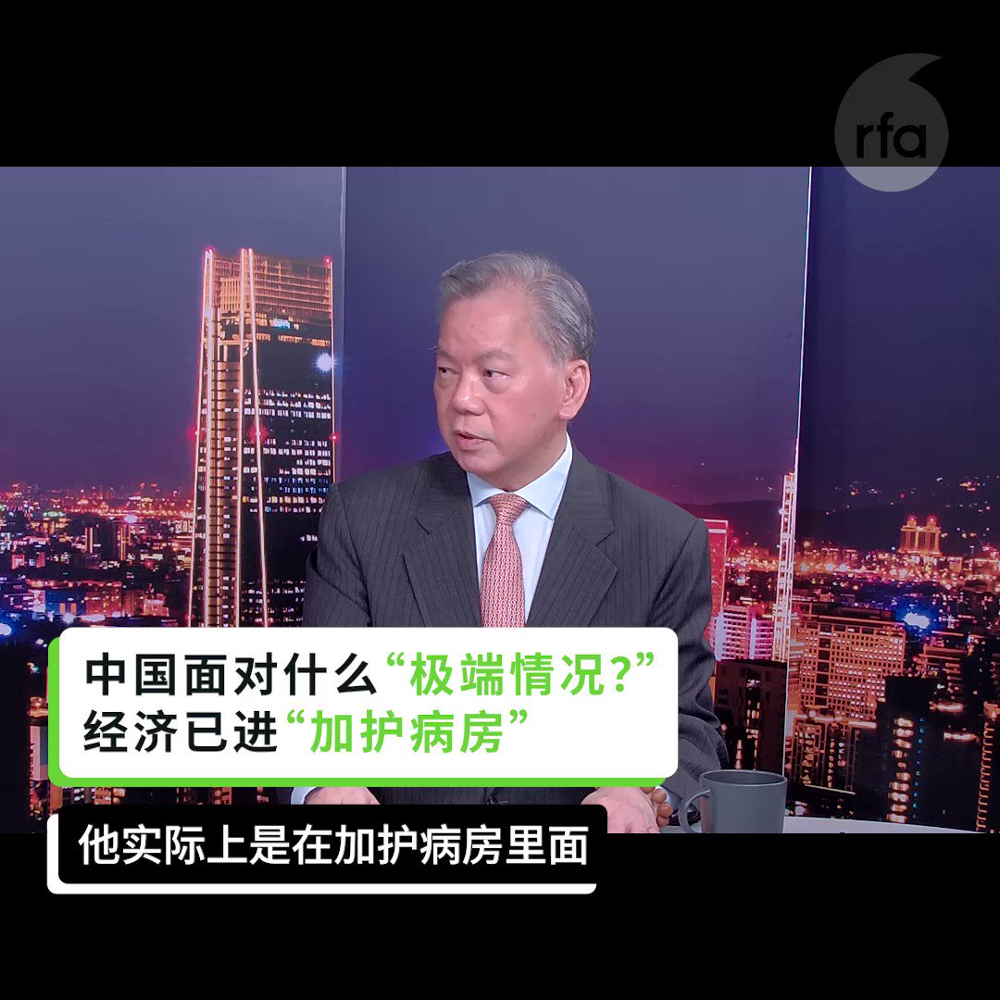
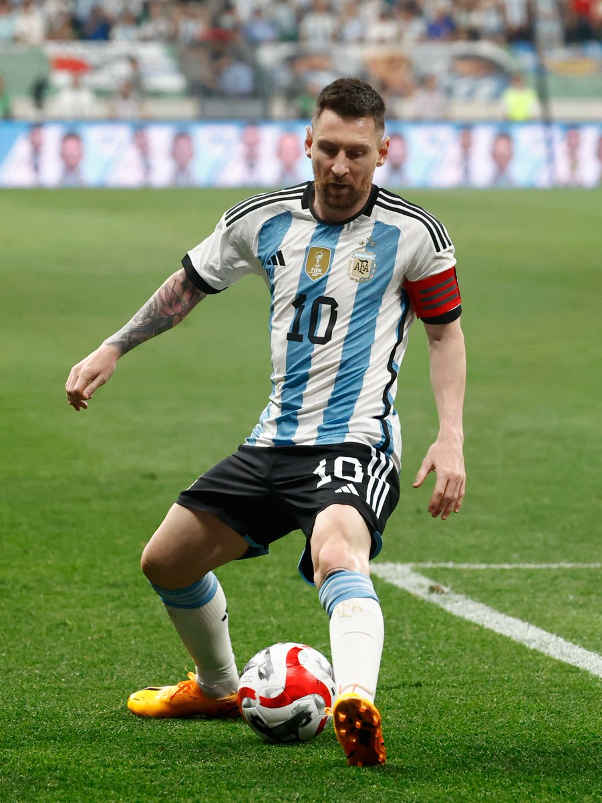
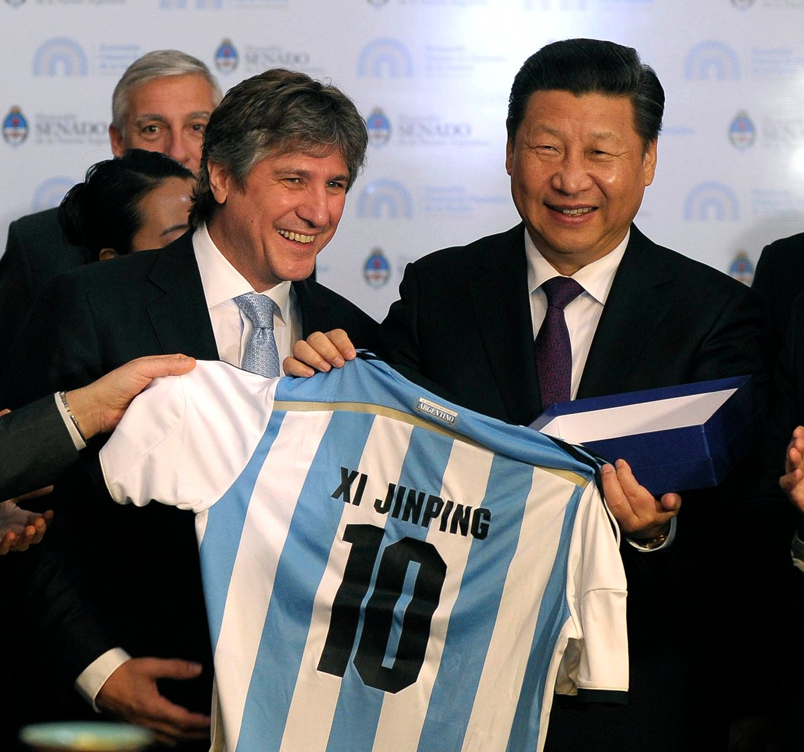
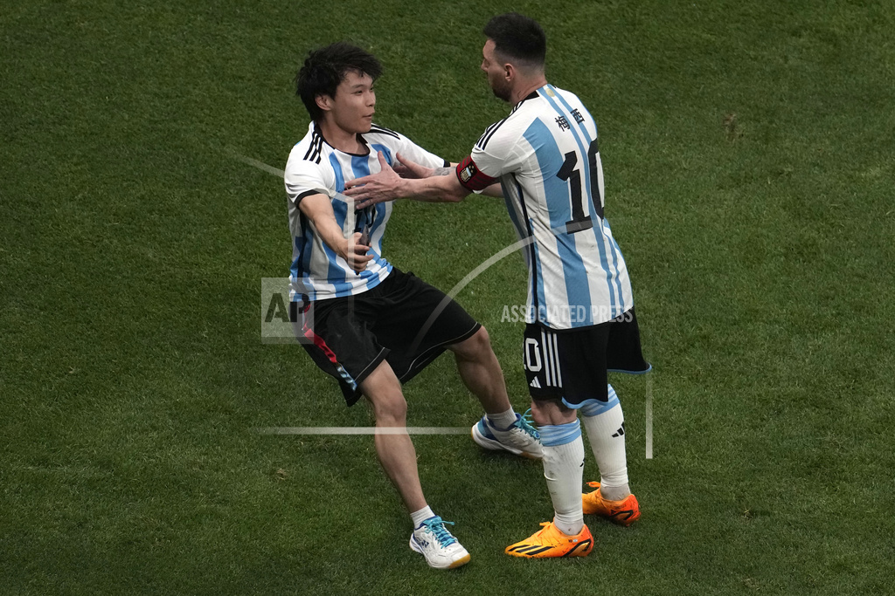
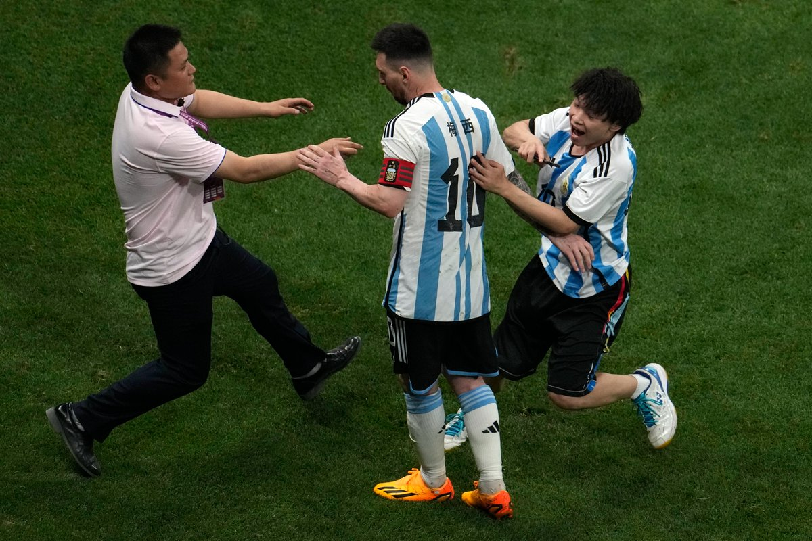
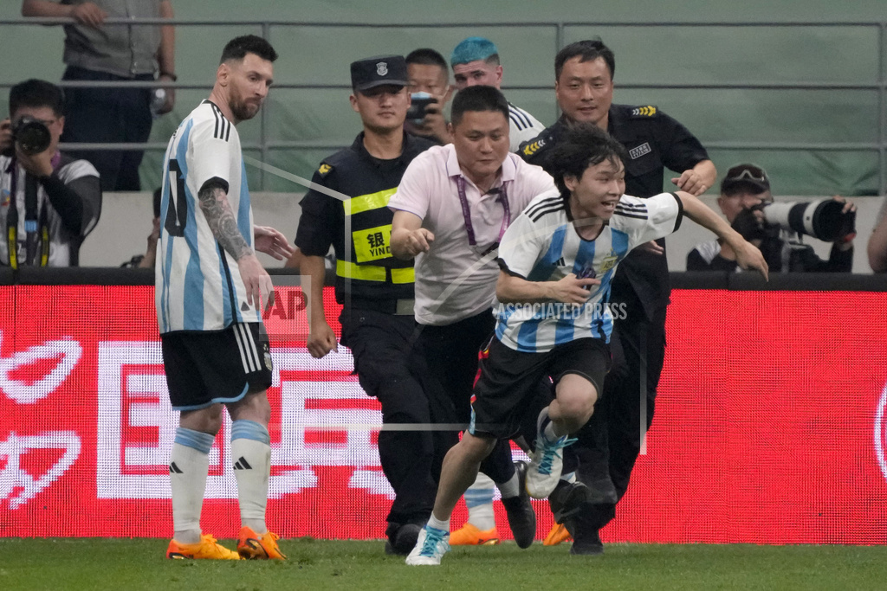
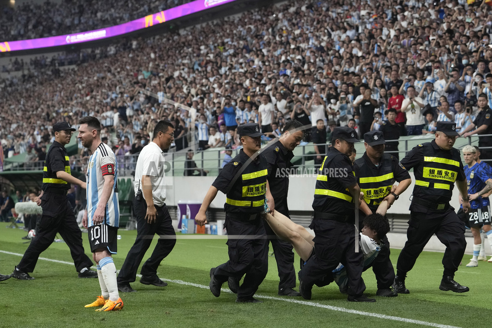

自由亚洲电台 北京时间 2023-06-17T03:32:37Z 1669790098370469891 【中国经济进入“重症监护病房”】
【战争 经济 社会动荡 等 #极端情况 成隐忧】
完整视频：https://t.co/ruGG9Ch5Tx
在 #亚洲很想聊 节目中，东华大学新经济政策研究中心主任 #陈松兴 表示，负债率过高，资金外流，中国的社会问题可能在三到五年内爆发。
时政评论家 #陈破空：所谓的极端情况，包括可能的战争、经济和粮食的问题，以及社会动荡，都让习近平担忧权力基础遭到动摇。   自由亚洲电台 北京时间 2023-06-17T03:42:48Z 1669792663493840896 中国政府近日公布一连串经济数据，虽然官方口风仍是稳中向好，但楼市疲软、消费乏力，凸显经济下滑的趋势明显。面对经济动力不足，北京也正计划出台一系列救市措施。但是，老办法能奏效吗？

https://t.co/lK5rq3hUCM   自由亚洲电台 北京时间 2023-06-17T04:17:11Z 1669801313377607681 中国国家统计局近日公布，中国16-24岁青年有600多万人还在寻找工作，并表示根据中国采用的统计方式，每周工作一小时及以上就不算失业。消息传出后，引发了人们的种种议论。

https://t.co/GfsRgSubBO   自由亚洲电台 北京时间 2023-06-17T01:13:41Z 1669755135986216960 球王梅西赴京踢球，正逢习近平70大寿，引起坊间联想。这是谁安排的？

据澳大利亚广播公司披露，这场比赛是由一个名为中国虹桥国际投资有限公司（ China Rainbow International Investment Company）的发起人组织的，该公司之前曾表示自己是一家工程和石油化工公司。

参议员克莱尔·钱德勒（Claire Chandler）说，该公司曾公开表明是统一战线组织成员。“这次活动的时间和统战部在其中发挥的核心作用，为澳大利亚国足在不知不觉中带来被当做宣传目的的真实风险。”

中国驻堪培拉大使馆的一位发言人说，他们“不知道”该投资公司与统战部有联系，也不知道足球比赛被安排在习近平主席的生日当天举行。

你信吗？

图一：6月15日，梅西在北京工体比赛中（美联社）
图二：习近平在2014年7月19日访问布宜诺斯艾利斯时，在阿根廷副总统阿马多·布多（Amado Boudou）的陪同下，收到一件印有他名字的阿根廷足球队10号球衣。（路透社）   自由亚洲电台 北京时间 2023-06-17T01:49:14Z 1669764083917389824 加拿大众议员库柏（Michael Cooper）周四再度于国会提出《#加台关系架构法》（Canada-Taiwan Relations Framework Act），法案在众议院一读获全院鼓掌通过。

https://t.co/gFdvpsTDsZ   自由亚洲电台 北京时间 2023-06-17T00:20:55Z 1669741856295378944 【少年跳下看台 引发全网狂欢】
6月15日晚，在北京新工体举行的阿根廷与澳大利亚的国际足球友谊赛上，一名中国少年穿着阿根廷球队的10号球衣跳下看台，满场奔跑，与在场的阿根廷球星 #梅西 拥抱，还与阿根廷门将大马丁击掌，随后被姗姗来迟的保安制服，并被四脚仰天抬出球场，被抬出时还在大笑。

这一场景的视频和图片上传网络后，引发中国社媒狂欢。很多人为少年的行为点赞，羡慕他的勇敢、自由和年轻；有社媒文章感叹说，中国太缺少这样的欢笑。还有文章说，有梦想时就要拼尽全力去争取。

据澎湃新闻网报道，有视频显示，这位球迷被抬出场后又回到看台，对着视频镜头称，因为特别想见梅西，发现现场保安不严，所以冲动地跳下场去。他又承认这种行为非常不好。

另据北京朝阳区公安分局的微信公号，这位球迷邸某某年满18岁，朝阳公安分局已依法对其行政拘留，同时责令其十二个月内，不得进入体育场馆观看同类比赛。   