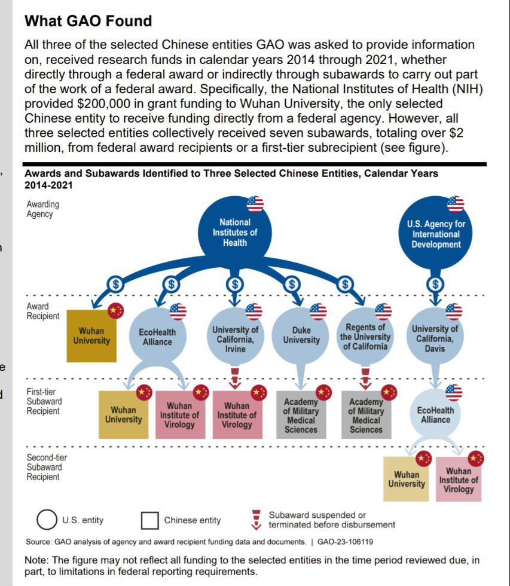
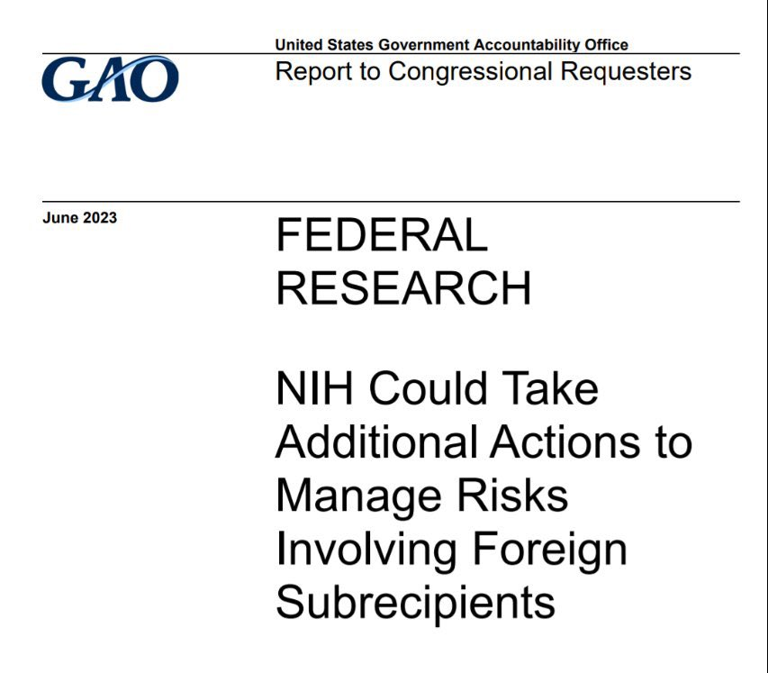

蔡霞 北京时间 2023-06-17T09:50:05Z 1669885091064029188 RT @ltshijie: 比爾蓋茨這次見習近平的門票有點貴：5000萬美元。這次比爾蓋茨到中國專門給中國衛健委捐款5000萬美元。   蔡霞 北京时间 2023-06-17T02:23:43Z 1669772760279842816 RT @Spring02060527: #香港警方 在「#六四事件」34周年「带走」31人回警署，但关注香港人权的法律团体指出，不少截查既不合理亦缺乏法律基础，目的应是藉此骚扰及阻吓市民无惧地行使言论和集会自由，形同「非法囚禁」；
加上无理限制市民悼念「六四」所在的维园和铜锣湾…   蔡霞 北京时间 2023-06-17T02:25:33Z 1669773220399177728 RT @VOAChinese: 美国国会参议院外交关系委员会主席梅嫩德斯6月13日在接受美国之音采访时就中国在古巴设立间谍基地一事表示，“光是我们不知道有这件事的这个事实，确实让我感到震惊。”他希望国务卿布林肯在访问中国时能向中方明确表示，中国的行为是“对美国安全和主权的侵犯”…   蔡霞 北京时间 2023-06-17T02:30:33Z 1669774480431001600 RT @yibao_en: 美聯邦政府問責辦公室，發布NIH和USAID的錢是如何流入武漢病毒研究所 https://t.co/jUxHwZDNmK   蔡霞 北京时间 2023-06-17T02:30:44Z 1669774526971006976 RT @yibao_en: 美國將會公開新的病毒溯源信息：最先感染病毒的是武漢實驗室的人，而且他們就是研究新病毒的人員。👇   蔡霞 北京时间 2023-06-17T02:31:12Z 1669774642956087297 RT @caichu88: 世界媒体看中国：西方何以不再信任中国？
在过去的20年里，中国在可见的、不远的将来超过美国成为全球第一大经济体的说法一度甚嚣尘上，甚至成为一种流通广泛的共识。然而，在过去的两年里，尤其是在过去的两个月里，世界媒体又呈现出各方的另一种共识，这就是，中国…   蔡霞 北京时间 2023-06-17T02:31:49Z 1669774799797903361 RT @yibao_en: YouTube 慢慢的在香港消失。信息就是金錢，沒有自由信息的金融中心不可能繼續為中心！   蔡霞 北京时间 2023-06-17T00:50:55Z 1669749404851482626 我不认为美国在与中共的意识形态与影响力战争中已经输了，美国强大的意识形态与影响力根基在美国自由民主制度；共产极权意识形态及其制度的谎言欺骗只能得逞一时，不可能永远欺骗世界。
Spalding将军指出的“中共党正在侵蚀美国的自由”在真实发生，我们应警惕并揭露CCP隐蔽实施的各种方式的认知战舆论战   蔡霞 北京时间 2023-06-17T02:14:22Z 1669770408936226816 RT @YuanLi1972: 我希望未来的中国：这些尘肺农民、留守儿童的问题会慢慢得到解决，希望他们能跟我们过上一样的医疗水平和教育水平。我觉得这是一个真正的“大国”应该有的形象和一种人文关怀，这个是需要我们“先富裕”起来的一些城市人来关注到这些弱势群体，去伸手拉他们一把，我…   蔡霞 北京时间 2023-06-17T02:17:04Z 1669771086739955712 RT @ZhangDong_SCH: 乌军机动小分队，越野电动滑板车，灵活快速无声，打一枪换一地，声东击西。现代战争的一种打法，不错👍   蔡霞 北京时间 2023-06-17T02:22:10Z 1669772368749944832 RT @chinatransition: 本所翻译的《圆桌谈判与民主转型：1989年的东欧和中国》（Jon Elster 著；张小山、杨子立译 王天成审校）重点研究前共产主义国家1989年的圆桌谈判，探讨了发生条件、谈判的预备、代表的产生、谈判的过程、争议的焦点、各方的战略战术…   