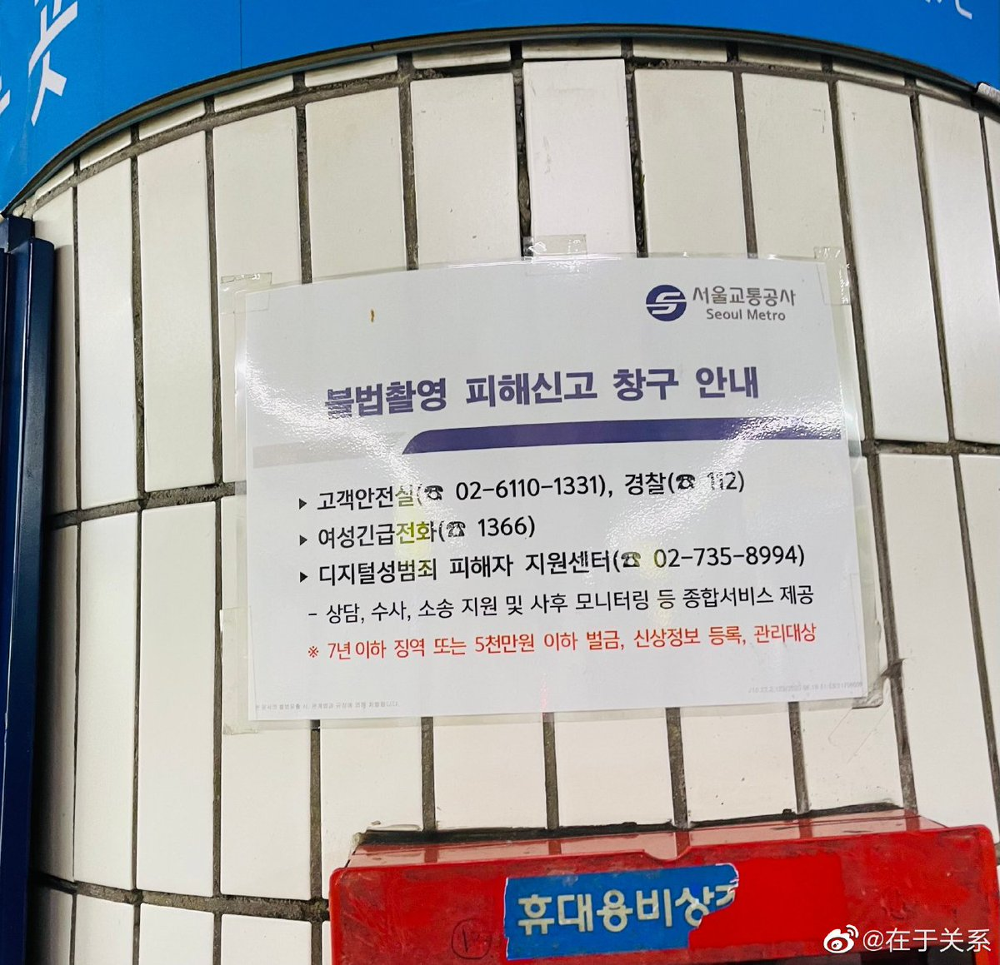
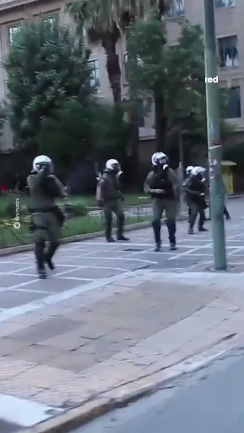
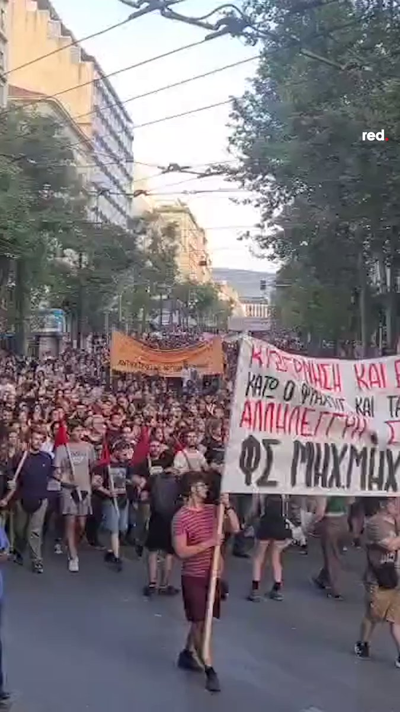

谁将十万横扫三江 北京时间 2023-06-17T12:00:05Z 1669917807189065728 各方对比，祖国可真是最美逆行者

【首尔一号线地铁里贴的关于地铁偷拍盗摄的警示贴纸】

红字的意思是：盗摄者会判7年以下有期徒刑或者五千万以下罚款，会被登录个人信息，成为被观察对象。

黑字的意思是：警察、地铁安全室电话、女性紧急电话、网络性犯罪受害者支援热线，提供咨询、搜查、诉讼支援等。   谁将十万横扫三江 北京时间 2023-06-17T12:12:38Z 1669920965508354049 一艘难民船在希腊海岸倾覆，可能造成数百人死亡，抗议活动表达了公众对欧盟边境大规模死亡的愤怒，希腊雅典爆发了冲突。希腊当局因不顾早期警告而未营救这艘过度拥挤的船只而受到猛烈批评。

希腊当局为他们没有采取行动辩护，声称该船拒绝了救援尝试。然而，这与难民援助组织Alarm Phone的报道相矛盾，他们曾多次收到来自地中海人满为患的船只的求救电话。
 
据估计，船上有多达 750 人，其中包括大约 100 名儿童，大多数人仍下落不明。寻找更多幸存者的希望正在消退，当局担心死亡人数可能达到 600 人，这可能成为地中海最致命的事件之一。   谁将十万横扫三江 北京时间 2023-06-17T12:14:41Z 1669921481709731840 数千人走上雅典街头，担心超过 500 名移民在皮洛斯沉船事故中丧生。希腊各地都发起了反种族主义示威活动，称这些死亡事件是欧洲堡垒手中的“大屠杀”。 https://t.co/bqegB8Pn5V   谁将十万横扫三江 北京时间 2023-06-17T12:18:25Z 1669922422370471936 https://t.co/kBWdWWUlEE   谁将十万横扫三江 北京时间 2023-06-17T07:46:12Z 1669853914035003393 RT @whyyoutouzhele: 网友投稿
6月15日，山西吕梁一矿井发生事故 https://t.co/bNpwrkAGk4   谁将十万横扫三江 北京时间 2023-06-17T07:46:38Z 1669854026211680256 RT @chuushindou: RFA作为美国国际媒体署资助的媒体，应该平衡各群体的意见，不能被封闭的民运团体把持，否则即是失职。RFA的18位特约评论员，40后4人，50后5人，60后3人，70后4人，2人不明。80年以后出生的一个都没有，造成了民运大佬把控所有发声空间的客…   