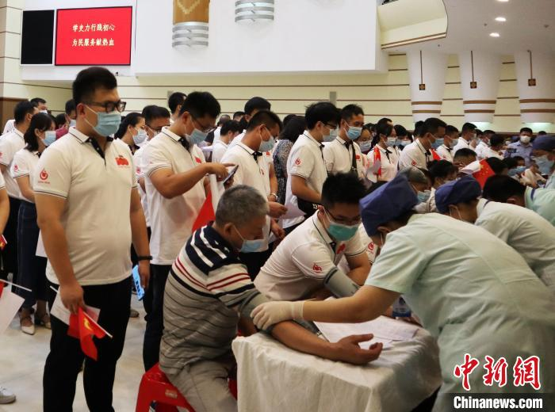
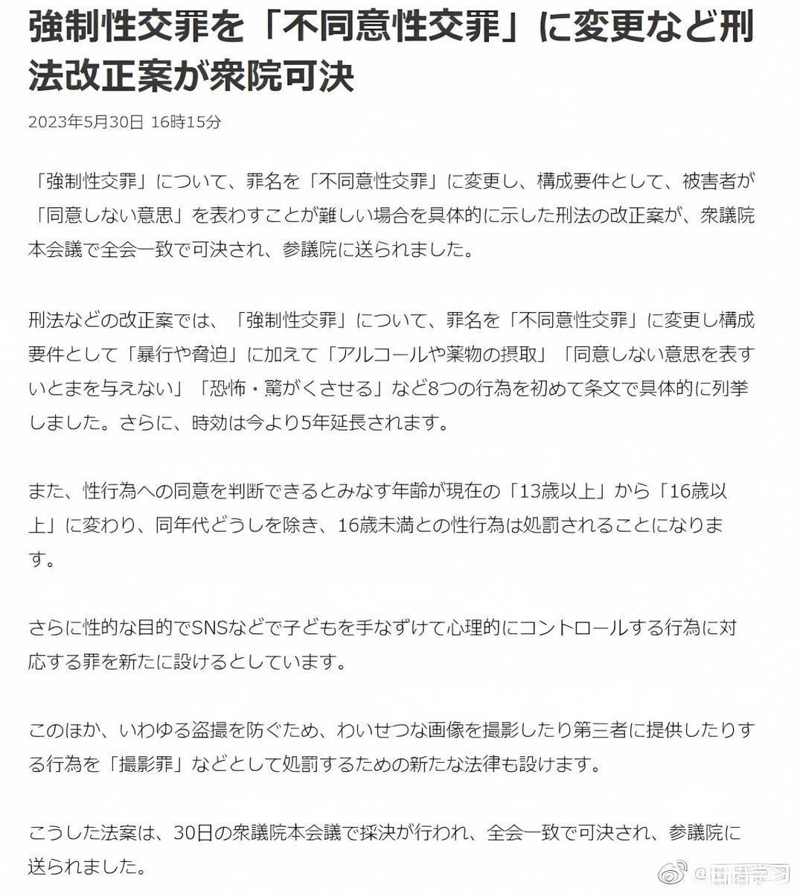

谁将十万横扫三江 北京时间 2023-06-17T18:19:55Z 1670013396098646016 网友投稿：自己所在单位献血400CC给一万块钱加14天假期 图文无关

号召无偿献血，他们却有如此待遇，最看不起中国人的还得是党 https://t.co/huBngDVzci   谁将十万横扫三江 北京时间 2023-06-17T19:19:34Z 1670028406296309767 武汉2名工人井下作业被沼气熏倒抢救无效身亡 https://t.co/RuUF2zo7Zu   谁将十万横扫三江 北京时间 2023-06-17T19:24:29Z 1670029646258380800 RT @haveafreeheart: 回顾整个事件
食品安全问题反而没那么重要了
更可怕的是人家在众目睽睽之下
就敢理直气壮的指鼠为鸭，逼良为娼
还记得当事同学事后拍视频说什么吗？

“误会了，就是鸭脖”   谁将十万横扫三江 北京时间 2023-06-17T19:25:05Z 1670029796376719360 RT @laborpowercn: 【工劳快讯是什么？】中国劳动者是社会不公的最大受剥削者，却长期处于失语、不可见的无力处境。本频道希望通过汇聚、备份及分类有关工人权益的新闻/社交媒体资讯，以此提高基层劳动者在社会中的可见度。我们鼓励每一位读者，一起助力向本频道投稿！https…   谁将十万横扫三江 北京时间 2023-06-17T11:51:43Z 1669915701824593920 RT @torontobigface: 你会发现所有的粉红
他们都反对，高福利制度，反对正常执行劳动法，反对废除996，反对官员收入公开等等等
但凡只要有利于人民的是一项不支持
这是为什么呢？因为他们支持的是党，党和人民的利益是冲突的。   谁将十万横扫三江 北京时间 2023-06-17T11:57:38Z 1669917192849346560 日本众议院一致通过刑法修正案：

❶ 将性同意年龄从13岁提高至16岁。
❷ 将「強制性交罪」更名为「不同意性交罪」（即「非合意性交罪」），在原本的构成条件「暴行和胁迫」基础上，增加「酒精和药物摄入」「没有说NO的机会/场景」「威胁、压迫」等8种行为，且时效延长5年。
❸ 在网上以性目的PUA、洗脑孩子也犯罪。
❹ 新设针对偷拍或分享猥亵照片的偷拍罪。   谁将十万横扫三江 北京时间 2023-06-17T11:59:05Z 1669917555744702468 RT @handongfang: "红星新闻记者注意到，四川多地网友曾在人民网“领导留言板”留言，询问四川育儿假的情况。一名网友反映称，“我咨询本单位人力，人力说没有育儿假。如果是企业都得执行育儿假，请问这种情况如何解决，如何才能申请到育儿假？” https://t.co/GO…   谁将十万横扫三江 北京时间 2023-06-17T12:00:05Z 1669917807189065728 各方对比，祖国可真是最美逆行者

【首尔一号线地铁里贴的关于地铁偷拍盗摄的警示贴纸】

红字的意思是：盗摄者会判7年以下有期徒刑或者五千万以下罚款，会被登录个人信息，成为被观察对象。

黑字的意思是：警察、地铁安全室电话、女性紧急电话、网络性犯罪受害者支援热线，提供咨询、搜查、诉讼支援等。   谁将十万横扫三江 北京时间 2023-06-17T12:12:38Z 1669920965508354049 一艘难民船在希腊海岸倾覆，可能造成数百人死亡，抗议活动表达了公众对欧盟边境大规模死亡的愤怒，希腊雅典爆发了冲突。希腊当局因不顾早期警告而未营救这艘过度拥挤的船只而受到猛烈批评。

希腊当局为他们没有采取行动辩护，声称该船拒绝了救援尝试。然而，这与难民援助组织Alarm Phone的报道相矛盾，他们曾多次收到来自地中海人满为患的船只的求救电话。
 
据估计，船上有多达 750 人，其中包括大约 100 名儿童，大多数人仍下落不明。寻找更多幸存者的希望正在消退，当局担心死亡人数可能达到 600 人，这可能成为地中海最致命的事件之一。   谁将十万横扫三江 北京时间 2023-06-17T12:14:41Z 1669921481709731840 数千人走上雅典街头，担心超过 500 名移民在皮洛斯沉船事故中丧生。希腊各地都发起了反种族主义示威活动，称这些死亡事件是欧洲堡垒手中的“大屠杀”。 https://t.co/bqegB8Pn5V   谁将十万横扫三江 北京时间 2023-06-17T12:18:25Z 1669922422370471936 https://t.co/kBWdWWUlEE   谁将十万横扫三江 北京时间 2023-06-17T07:46:12Z 1669853914035003393 RT @whyyoutouzhele: 网友投稿
6月15日，山西吕梁一矿井发生事故 https://t.co/bNpwrkAGk4   谁将十万横扫三江 北京时间 2023-06-17T07:46:38Z 1669854026211680256 RT @chuushindou: RFA作为美国国际媒体署资助的媒体，应该平衡各群体的意见，不能被封闭的民运团体把持，否则即是失职。RFA的18位特约评论员，40后4人，50后5人，60后3人，70后4人，2人不明。80年以后出生的一个都没有，造成了民运大佬把控所有发声空间的客…   