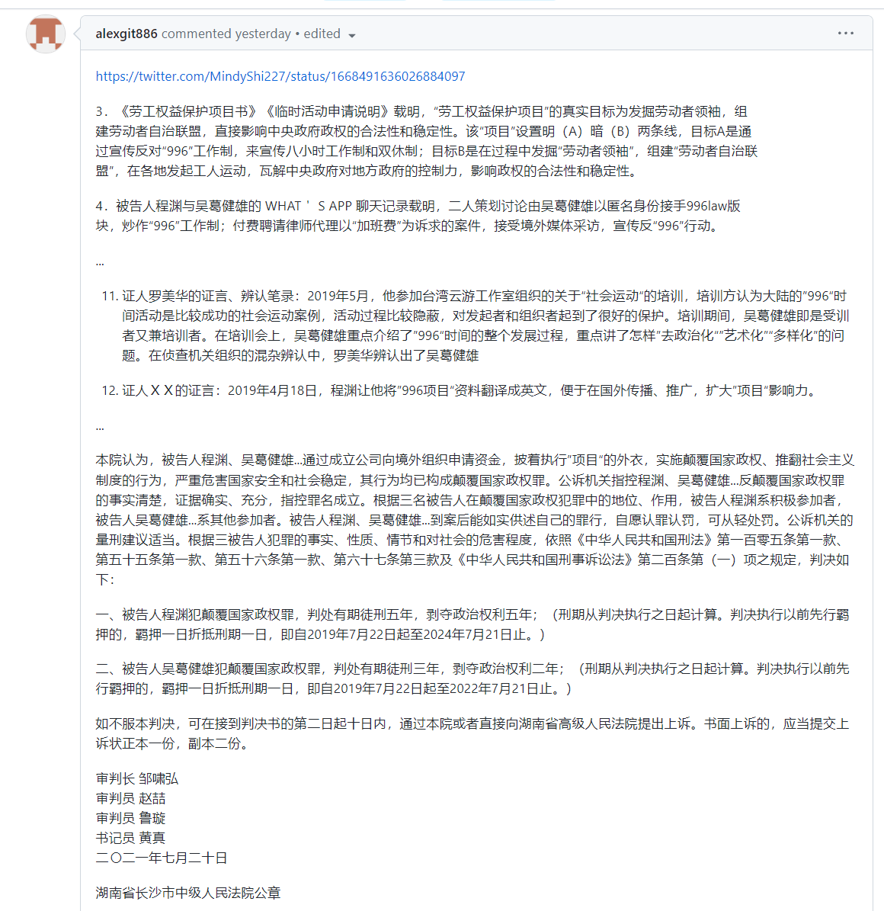
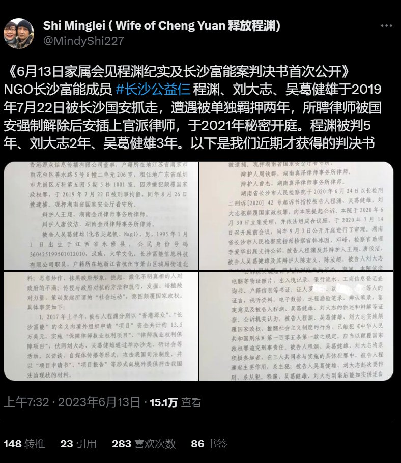

A李老师不是你老师 北京时间 2023-06-16T03:58:17Z 1669434171956121619 网友投稿
6月15日，据报道，https://t.co/GoY2mp6462项目发起人程渊因犯颠覆国家政权罪，判处有期徒刑五年，剥夺政治权利五年。
“属于程序员的抗争”
据悉，2019年3月27日，一个名为996ICU的项目在GitHub上传开。在这个项目指向的域名页面上，发起人程渊这样写到：“什么是https://t.co/GoY2mp6462？工作996，生病ICU”。
他将996工作制下最低72个工时与《劳动合同法》等条文对比，并呼吁“程序员生命为重（Developers’ lives matter）”。
这个项目随后受到广大程序员的支持，引发大众关注程序员群体的工作健康问题。被定义为“程序员的一次反抗”。   A李老师不是你老师 北京时间 2023-06-16T03:58:39Z 1669434262045577231 法院判决书全文
https://t.co/zuFQCryqkN   A李老师不是你老师 北京时间 2023-06-16T03:59:01Z 1669434354186047492 https://t.co/aTysQXw8Zd   