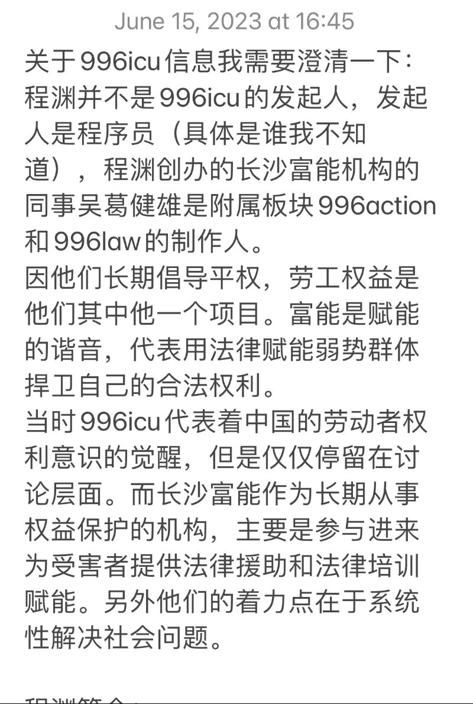
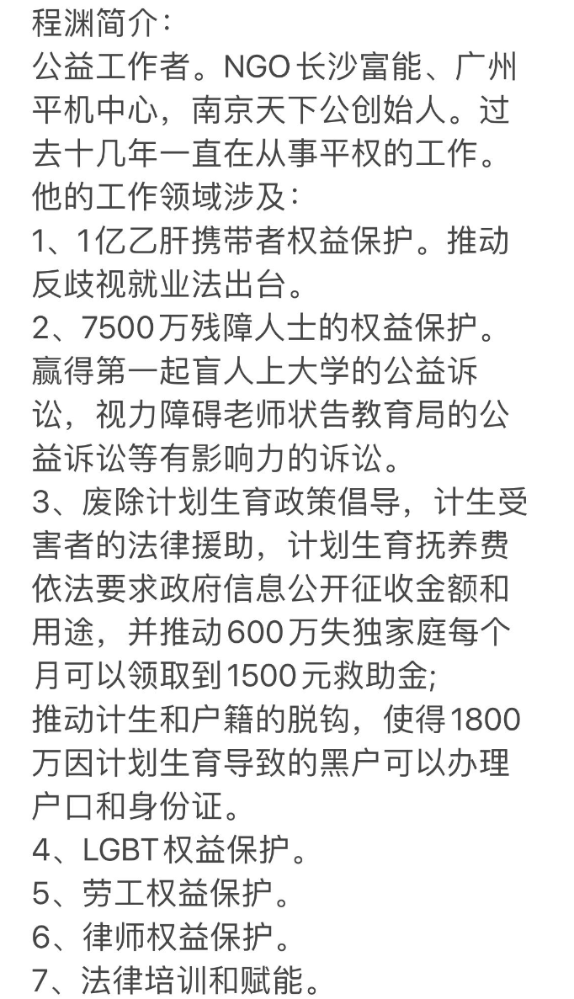

A李老师不是你老师 北京时间 2023-06-16T06:45:15Z 1669476188656398342 “宏大叙事下的脓疮”–搜狐新闻海报合集
近日，搜狐新闻根据国务院，国家统计局，发改委，最高检察院等机构发布的权威数据，制作了一系列海报，传递当下中国社会所面临的严峻问题。
这些国家数据如同2020年5月前总理李克强的讲话一样，再次将人们从宏大叙事中拉回到现实层面。

https://t.co/XSLjcJK15i   A李老师不是你老师 北京时间 2023-06-16T07:59:18Z 1669494823806545920 更正，程渊的妻子表示程渊并非996icu的发起人，而是附属板块996action和996law的制作人。
https://t.co/mIw9nvDvKb https://t.co/4wHZjJjnRI   A李老师不是你老师 北京时间 2023-06-16T03:58:17Z 1669434171956121619 网友投稿
6月15日，据报道，https://t.co/GoY2mp6462项目发起人程渊因犯颠覆国家政权罪，判处有期徒刑五年，剥夺政治权利五年。
“属于程序员的抗争”
据悉，2019年3月27日，一个名为996ICU的项目在GitHub上传开。在这个项目指向的域名页面上，发起人程渊这样写到：“什么是https://t.co/GoY2mp6462？工作996，生病ICU”。
他将996工作制下最低72个工时与《劳动合同法》等条文对比，并呼吁“程序员生命为重（Developers’ lives matter）”。
这个项目随后受到广大程序员的支持，引发大众关注程序员群体的工作健康问题。被定义为“程序员的一次反抗”。   A李老师不是你老师 北京时间 2023-06-16T03:58:39Z 1669434262045577231 法院判决书全文
https://t.co/zuFQCryqkN   A李老师不是你老师 北京时间 2023-06-16T03:59:01Z 1669434354186047492 https://t.co/aTysQXw8Zd   