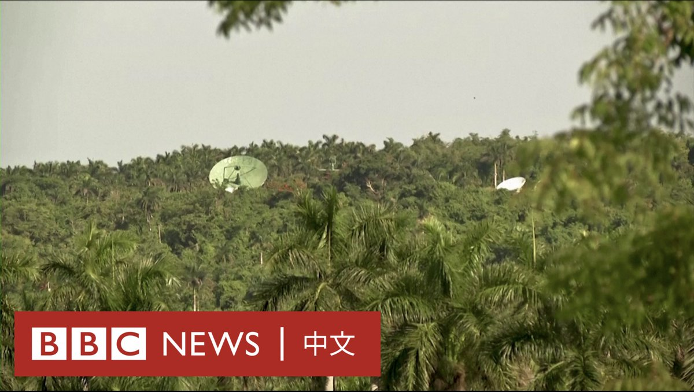
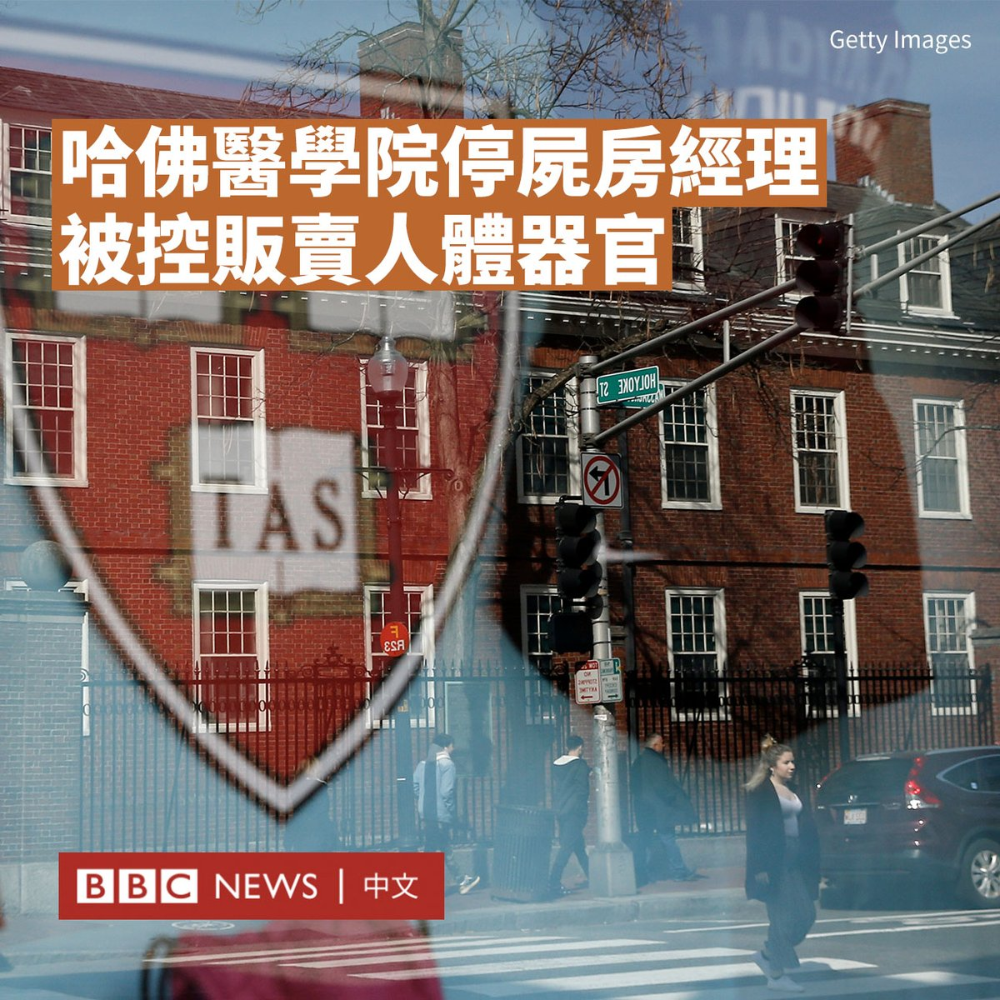

D英国广播公司BBC 北京时间 2023-06-16T20:03:00Z 1669676948103262208 在古巴小镇贝胡卡尔附近，一条蜿蜒的小路延伸至丛林深处，尽头是一块写有“禁止入内”的告示牌。

美国一直怀疑这个曾经藏有苏联核弹头的古巴小镇，长期以来是个情报收集基地。在上周美媒发表中国在古巴设立监听设施的报导后，这一地区再次受到关注。不过，即便是当地人也对丛林中的秘密基地知之甚少。 https://t.co/BW8T4KYaSQ   D英国广播公司BBC 北京时间 2023-06-16T16:38:58Z 1669625601068617728 “你是我今年见到的第一位美国朋友。”

中国国家主席习近平周五（6月16日）在北京会见比尔及梅琳达·盖茨基金会联席主席、微软公司（Microsoft）联合创始人比尔·盖茨（Bill Gates）。

在官方媒体播出的画面中，习近平称呼比尔·盖茨是中国的“老朋友”，并补充说，中美关系的基础“在民间”。 https://t.co/4m9HD1k8yR   D英国广播公司BBC 北京时间 2023-06-16T14:40:50Z 1669595871581966336 在英格兰怀特岛，科学家们发现了一个此前未知的恐龙类型的化石遗骸。

这是自1865年以来，在该岛上发现的首个新的甲龙物种，它与此前发现的多刺甲龙属于同一家族。

该化石是在距今6600万至1.45亿年的岩石层中被发现的。它被命名为“Vectipelta barretti”，以向在伦敦自然历史博物馆工作了20年的保罗·巴雷特（Paul Barrett）教授致敬。

虽然这种巨型爬行动物刀刃般的铠甲看起来很可怕，但它只食用植物。

尽管这只新恐龙与此前在岛上发现的多刺甲龙有一些相似之处，但科学家认为这两个物种的关系并不十分密切。

科学家们表示，除了有不同的颈部、背部和骨盆的骨骼外，最近发现的恐龙有更多的尖状铠甲。

这个新物种与在中国发现的甲龙有更多共同点，这表明它们可能在早白垩世从亚洲自由迁徙到欧洲。

自然历史博物馆的研究员斯图尔特·庞德（Stuart Pond）表示，这一发现揭示了当时在英国存在的物种的多样性。

他称，这一发现将使研究者重新分析其他类似的化石遗骸，因为一个多世纪以来，科学家们一直认为这些化石都属于多刺甲龙。

发现该化石的团队说，新物种的发现地层被称为威塞克斯组（Wessex Formation），其是一个可供人们进一步了解恐龙如何灭绝的“极其重要”的资源。

目前，关于6600万年前恐龙大规模消失的原因，仍存在着相互竞争的理论，有包括小行星撞击和大规模火山爆发等假说。   D英国广播公司BBC 北京时间 2023-06-16T12:05:56Z 1669556890659958785 中国算“发展中国家”吗？北京和华盛顿在这一问题上各执一词。有国际关系学者表示，该争议的背后源于发展中国家的标签“既有政治利益，也有经济利益”。https://t.co/tbOSjXMgeT   D英国广播公司BBC 北京时间 2023-06-16T09:33:23Z 1669518499289645056 哈佛医学院（Harvard Medical School）停尸房的一名前经理和其他三人被指控偷窃和贩运人体遗骸。据报道，塞德里克·洛奇（Cedric Lodge）从捐赠给这座知名医学院的遗体上取下“头部、大脑、皮肤和骨头”等器官，并在网上出售。

根据起诉书，他和妻子丹尼斯（Denise）曾向宾夕法尼亚州和马萨诸塞州的买家出售身体部位。这些行动据称从2018年持续到2021年。如罪名成立，洛奇等其他共犯将面临15年监禁。

检方指控洛奇利用哈佛医学院“解剖学礼物计划”（Anatomical Gifts Program）经理的工作之便，肢解捐赠给医学研究的尸体。

这些遗体本是医学生用来研究和实践医疗程序的。起诉书称，当学校使用完尸体后，他们通常会被火化，并将骨灰归还给他们的家人，或埋葬在大学的医学墓地。

洛奇和他的妻子被指控从这些捐赠的尸体上采集身体部位，随后贩卖和运输。检方在声明中称，有时，洛奇甚至允许买家进入停尸房自行挑选。

一名来自马萨诸塞州的店主被指花600美元购买了被解剖的脸部，并打算将其鞣制成皮革。目前尚不清楚这些遗骸是否已被用于产品制作中。

哈佛大学医学院院长乔治·Q·戴利（George Q.Daley）表示，他“惊悉如此令人不安的事情可能发生在我们的校园”，并表示对遗体捐赠者的亲属带来的痛苦“感到非常抱歉”。   D英国广播公司BBC 北京时间 2023-06-16T01:18:00Z 1669393831991873543 周四（6月15日）晚在北京举行的阿根廷队大战澳大利亚队的比赛中，一名球迷冲进球场，与梅西（Lionel Messi）拥抱后在场内狂奔，最后被安保人员带离。

这一插曲成为中国社交媒体上最热议的话题。梅西在中国拥有众多粉丝，这场在北京工人体育场举行的友谊赛在该国掀起足球热潮。

现场影片显示，在下半场比赛中，一名身穿蓝白相间的10号球衣的年轻男子在比赛空档中迅速跳下看台，展开双臂奔向梅西。他在成功与梅西拥抱后，继续摆脱安保，与阿根廷队门将马丁内斯（Emiliano Martínez）击掌。

在狂奔了大半场后，他被数名安保人员抬走。这一插曲引发现场观众欢呼。

影片显示，这名球迷最后回到了看台。目前尚不清楚他是否将面临处罚。

这场比赛是去年卡塔尔世界杯后，夺冠的阿根廷国家队首次出国比赛。开赛81秒梅西就攻入一球，收获个人生涯最快进球纪录。比赛最终以阿根廷2:0完胜澳大利亚落幕。   