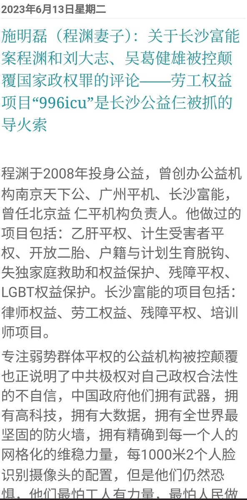
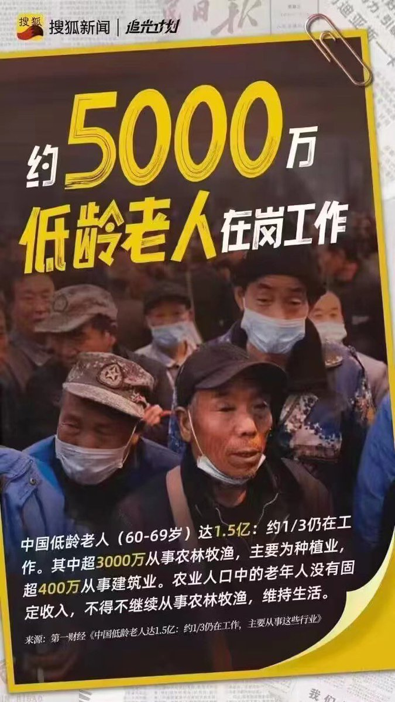

多伦多方脸 北京时间 2023-06-16T17:17:55Z 1669635406080643073 最近有很多人说程渊，也就是996ICU受到了境外势力的资助，所以罪无可赦，无论他做的是什么。
那我们看看程渊的做过的事情，哪件不是人民想得到的？
为什么境外势力天天只做些有利于人民的事情？
如果境外势力都是这样的，我是巴不得被境外势力渗透，多多的渗透，狠狠的渗透 https://t.co/n23FudQswg   多伦多方脸 北京时间 2023-06-16T12:54:53Z 1669569211927269376 吃点好的😁 https://t.co/2qKVjZfhPP   多伦多方脸 北京时间 2023-06-16T11:01:37Z 1669540706250289153 其实有时候老说大的来了，大的来了
我们确实深在大中不知大，如果把拉美化看作我们的未来，其实我们已经有一定的征兆了
1.移民人数激增
2.中产阶级灭亡
3.社会治安变乱
当然还有一个没出现那就是独裁政权灭亡。
方脸说：如果拉美化是中国的未来，那么中国路在何方？ https://t.co/Sr8BM0BJEB   多伦多方脸 北京时间 2023-06-16T10:42:23Z 1669535866208006144 这盛世江山怎么能不美丽？ https://t.co/lkT4wuz4vr   多伦多方脸 北京时间 2023-06-16T08:01:41Z 1669495425467035648 中国到底是法大还是党大？
中国到底是人民大还是共产党大？
低情商回答:党大
中国特色回答:说谁大不合适，落入西方思维陷阱，党的意志和法律高度统一
共产党的利益和人民利益高度统一
😬😬😬   多伦多方脸 北京时间 2023-06-16T08:30:54Z 1669502775779274752 如何找到中国最不能代表人民的一群人？
去全国人民代表大会就全能找到了。
人民代表大会最不能代表人民。
要的就是一种反差感   多伦多方脸 北京时间 2023-06-16T06:12:15Z 1669467882303135744 申请劳动仲裁，被冠以恶意仲裁
寻求劳动法保护，被冠以劳动碰瓷
现在搞了个996网站，要被冠以颠覆国家政权罪
就这样的政党，真的还会有人认为他在为人民服务？   