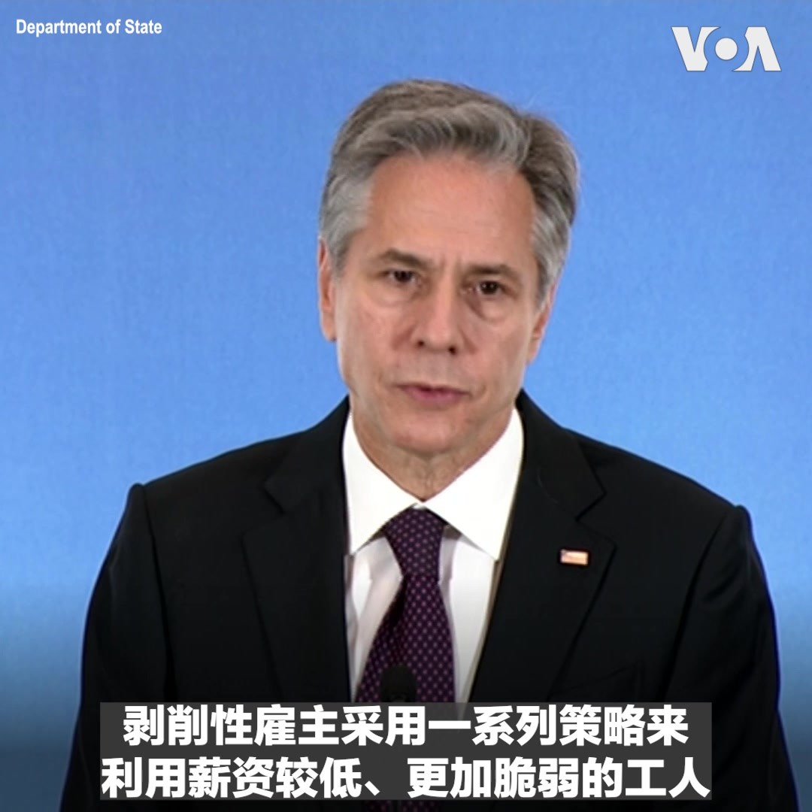
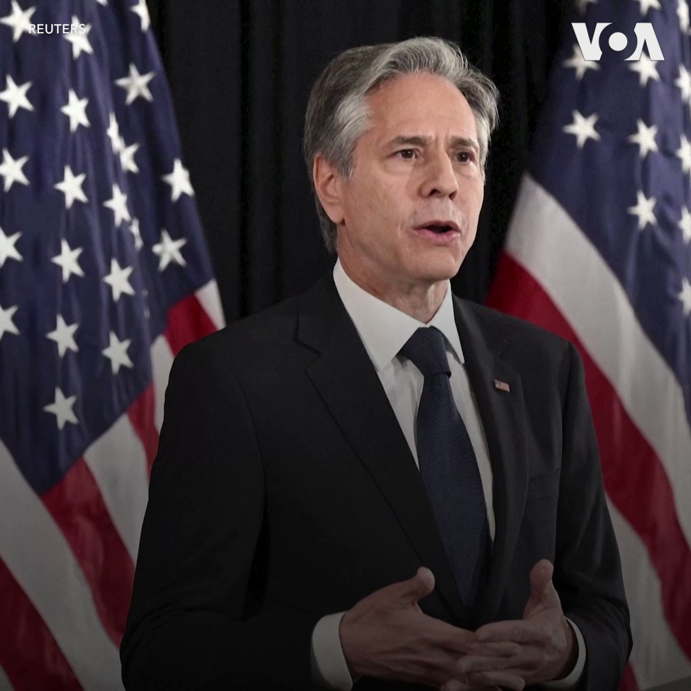
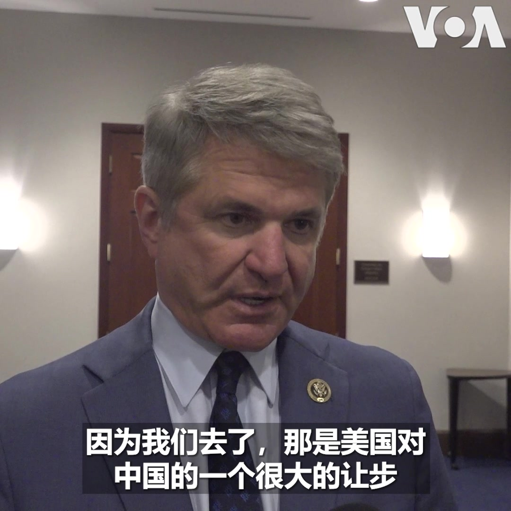

美国之音中文网 北京时间 2023-06-16T13:58:33Z 1669585233585520641 人权活动人士称 中国无视其境内的朝鲜难民安危 https://t.co/HoKwL348r0   美国之音中文网 北京时间 2023-06-16T10:05:05Z 1669526478315470850 欧洲议会通过决议,呼吁释放香港报纸创办人黎智英并废除港版国安法 https://t.co/mgbJmZjj4N   美国之音中文网 北京时间 2023-06-16T09:35:04Z 1669518925049257985 拜登政府对瑞典加入北约“抱持希望” https://t.co/qrJgxVX61b   美国之音中文网 北京时间 2023-06-16T06:45:48Z 1669476327844454401 美国国务卿布林肯6月15日公布国务院2023年《人口贩运报告》，报告评估188个国家和地区为打击人口贩运所采取的新举措，并指出问题日益严重的领域。报告继续把中国列为打击人口贩运表现最差的第三类国家。报告提及台湾在2022年为打击人口贩运所做的努力，并把台湾列为表现最好的第一类国家。 https://t.co/wYkkOpCPPu   美国之音中文网 北京时间 2023-06-16T06:53:03Z 1669478151733514240 美国公布年度人口贩运报告，阿富汗、中国和俄罗斯等国仍被列为最差一级 https://t.co/2KmKUo2ufZ   美国之音中文网 北京时间 2023-06-16T07:09:53Z 1669482388127113217 美国国务卿布林肯将于18日和19日访问北京。这是近五年来美国国务卿的首次访华，也是拜登政府上任以来访问中国的级别最高的美国政府官员。布林肯此次中国之行要与北京谈什么？外界为何对此预期不高？详细报道：https://t.co/v3k5A3m47J https://t.co/7GvcRTj2YJ   美国之音中文网 北京时间 2023-06-16T07:12:47Z 1669483117810262018 美国国务卿布林肯访问中国前夕，美国国会众议院外交事务委员会主席麦考尔 @RepMcCaul 告诉美国之音，他认为美中外交领袖会晤的首要议题应聚焦台海局势。麦考尔说，中国在太平洋上的行为相当咄咄逼人，“降低在台湾海峡的紧张局势是第一重点”。 https://t.co/6k3X59Jg3y   美国之音中文网 北京时间 2023-06-16T07:31:08Z 1669487737748049921 国务卿布林肯终于能访华了。间谍气球事件致原计划延迟后北京一直拒绝美方再安排请求。美方为何追着北京对话？北京为何先拒后答应？布林肯此行会白走一趟？习近平6月16日见微软比尔•盖茨。这是他近年来首次见外国企业家。北京现在跟美国玩“政冷经热”游戏？请收看美国之音6月16日上午9点《时事大家谈》 https://t.co/Imi6VQIR84   美国之音中文网 北京时间 2023-06-16T07:47:00Z 1669491727768465408 当越来越多的国际企业因为中东的经营环境、地缘风险、人权纪录等问题而远离之际，中国企业却对中东展现出更高的兴趣。时政评论人小民先生认为，北京与中东威权政府之间的相互靠拢为贸易提供了基础，而且中企在国内已经对腐败等中东存在的问题司空见惯了。时事大家谈完整版：https://t.co/AXObe4opS6 https://t.co/n8hBSi51Ck   美国之音中文网 北京时间 2023-06-16T08:15:00Z 1669498774345883655 美国国会众议院外交事务委员会主席麦考尔 @RepMcCaul 本周在一场听证会上说，中国以发展中国家身份向国际机构贷款，又借由“一带一路”设下债务陷阱，俨然一场国际骗局。国会参众两院最近通过法案，要求美国政府推动终结中国在国际组织的发展中国家地位。报道内容：https://t.co/rQH9ro0VC4 https://t.co/bc2Mky4pEY   美国之音中文网 北京时间 2023-06-16T08:38:05Z 1669504586313527297 美国安全公司：中国间谍入侵了数百个公共和私人网络 https://t.co/F1jjlYe0vm   美国之音中文网 北京时间 2023-06-16T08:38:07Z 1669504594358177792 布林肯访北京前，美议员提新法案助台抗中 https://t.co/KJ1cf5AXOC   美国之音中文网 北京时间 2023-06-16T04:25:18Z 1669440970029518880 中国领导人习近平近日更强调“极限思维”和“极端情况”。在美国国务卿布林肯访华寻求稳定美中关系之际，军事专家警告说，习近平的备战指示和解放军增加大胆挑衅美军的行动并非偶然，而是旨在测试美军交战规则和意志，以便加快武统台湾的进程。报道内容：https://t.co/UzPv4J28nT https://t.co/Jvsw4x0Sgh   美国之音中文网 北京时间 2023-06-16T04:39:04Z 1669444432037548032 新调查发现美中紧张局势让亚洲国家担忧 https://t.co/Z2uNAnEKZu   美国之音中文网 北京时间 2023-06-16T05:23:03Z 1669455503926370305 莫停留在周年日“行礼如仪”：流亡海外的香港活动人士呼吁团结扎实长期抗争 https://t.co/AKPM3Jcizq   美国之音中文网 北京时间 2023-06-16T05:41:30Z 1669460144088915972 美国务卿布林肯访华前夕，白宫国安顾问沙利文前往日本会见日、菲、韩安全官员。“中国战略分析智库”研究员邓聿文先生认为，拜登政府分头行动，意在安抚盟友，告诉他们美国虽然需要与中国恢复交流，但对华战略没有转向，步调也不会放缓。时事大家谈完整版：https://t.co/AXObe4opS6 https://t.co/b7IYegOLrO   美国之音中文网 北京时间 2023-06-16T05:51:33Z 1669462672965009408 布林肯去北京到底要谈什么？美国为何又期待不高？ https://t.co/Cp7f6owbB6   美国之音中文网 北京时间 2023-06-16T05:51:34Z 1669462680590221312 中国锂业中心的采矿热潮是有代价的 https://t.co/S80chz9JwF   美国之音中文网 北京时间 2023-06-16T06:08:03Z 1669466829025320960 南非警察正在接受中国警务培训 https://t.co/sPct6Dqmd7   美国之音中文网 北京时间 2023-06-16T02:23:29Z 1669410311848247299 澳大利亚政府15日表示将终止俄罗斯在堪培拉建造新大使馆的租约。澳大利亚政府表示俄罗斯计划建造新使馆的地址就在澳大利亚议会旁边，这将对澳大利亚国家安全构成威胁。 https://t.co/Z5196mujAT https://t.co/j9FGE7Opmv   美国之音中文网 北京时间 2023-06-16T02:38:03Z 1669413978135748610 朝鲜周四又发两枚导弹，美日韩商讨应对中朝安全威胁之策 https://t.co/1wxYCI0kGc   美国之音中文网 北京时间 2023-06-16T02:53:35Z 1669417886384009217 众多国际人权组织致函布林肯，敦促向北京交涉迫害人权问题 https://t.co/i6zUaoW5IO   美国之音中文网 北京时间 2023-06-16T03:08:02Z 1669421525097922560 台湾#MeToo性骚扰风暴延烧，立委选情已现冲击 https://t.co/OM3qxMQhUv   美国之音中文网 北京时间 2023-06-16T03:13:32Z 1669422909083865099 日本首相岸田文雄6月15日发表声明，谴责朝鲜当天向日本海方向发射两枚短程弹道导弹。此次发射正值白宫国安顾问沙利文对日本和韩国进行访问。也有分析认为，朝鲜此次试射导弹意在对美韩两军当天开启的联合演习作出回应。 https://t.co/isAZRGQMnj   美国之音中文网 北京时间 2023-06-16T03:52:03Z 1669432601566760962 台湾、中国外长轮番访欧竞逐支持　分析:台湾应助欧“知中” https://t.co/Gq6pJqpT6X   美国之音中文网 北京时间 2023-06-16T00:39:03Z 1669384031413362688 中国国力提升，隐秘的情报收集成为美中之间公开的新热点 https://t.co/CpiYcAWfG6   美国之音中文网 北京时间 2023-06-16T00:23:33Z 1669380129532055553 美日韩国安官员聚首东京，讨论台海、东、南中国海紧张局势及合作 https://t.co/fyAYibY8Gx   