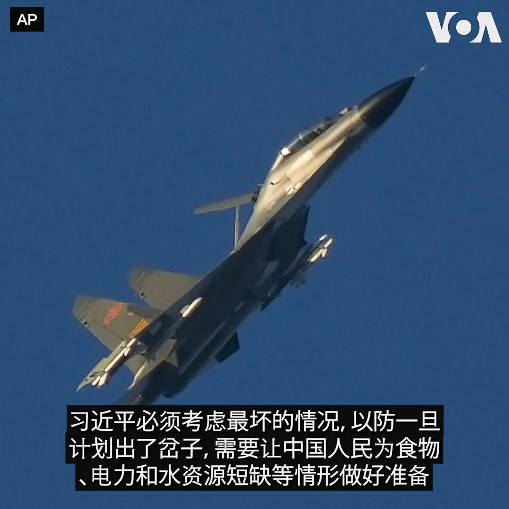
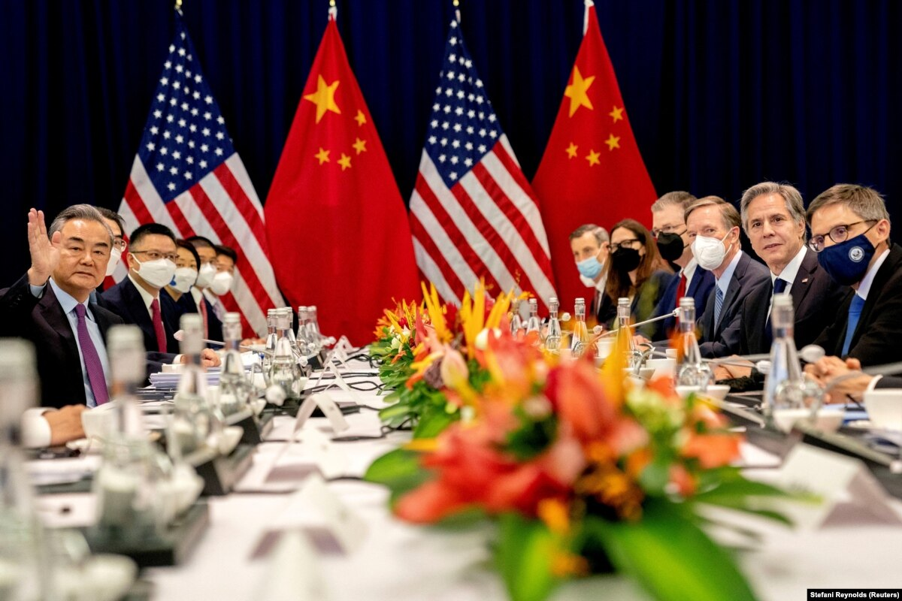
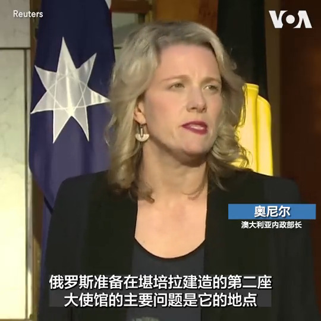
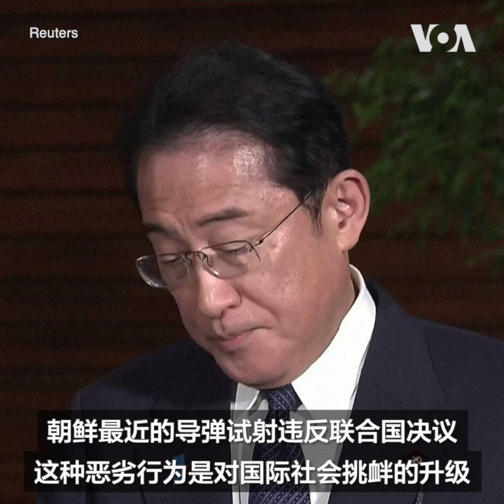

美国之音中文网 北京时间 2023-06-16T04:25:18Z 1669440970029518880 中国领导人习近平近日更强调“极限思维”和“极端情况”。在美国国务卿布林肯访华寻求稳定美中关系之际，军事专家警告说，习近平的备战指示和解放军增加大胆挑衅美军的行动并非偶然，而是旨在测试美军交战规则和意志，以便加快武统台湾的进程。报道内容：https://t.co/UzPv4J28nT https://t.co/Jvsw4x0Sgh   美国之音中文网 北京时间 2023-06-16T04:39:04Z 1669444432037548032 新调查发现美中紧张局势让亚洲国家担忧 https://t.co/Z2uNAnEKZu   美国之音中文网 北京时间 2023-06-16T05:23:03Z 1669455503926370305 莫停留在周年日“行礼如仪”：流亡海外的香港活动人士呼吁团结扎实长期抗争 https://t.co/AKPM3Jcizq   美国之音中文网 北京时间 2023-06-16T05:41:30Z 1669460144088915972 美国务卿布林肯访华前夕，白宫国安顾问沙利文前往日本会见日、菲、韩安全官员。“中国战略分析智库”研究员邓聿文先生认为，拜登政府分头行动，意在安抚盟友，告诉他们美国虽然需要与中国恢复交流，但对华战略没有转向，步调也不会放缓。时事大家谈完整版：https://t.co/AXObe4opS6 https://t.co/b7IYegOLrO   美国之音中文网 北京时间 2023-06-16T05:51:33Z 1669462672965009408 布林肯去北京到底要谈什么？美国为何又期待不高？ https://t.co/Cp7f6owbB6   美国之音中文网 北京时间 2023-06-16T05:51:34Z 1669462680590221312 中国锂业中心的采矿热潮是有代价的 https://t.co/S80chz9JwF   美国之音中文网 北京时间 2023-06-16T06:08:03Z 1669466829025320960 南非警察正在接受中国警务培训 https://t.co/sPct6Dqmd7   美国之音中文网 北京时间 2023-06-16T02:23:29Z 1669410311848247299 澳大利亚政府15日表示将终止俄罗斯在堪培拉建造新大使馆的租约。澳大利亚政府表示俄罗斯计划建造新使馆的地址就在澳大利亚议会旁边，这将对澳大利亚国家安全构成威胁。 https://t.co/Z5196mujAT https://t.co/j9FGE7Opmv   美国之音中文网 北京时间 2023-06-16T02:38:03Z 1669413978135748610 朝鲜周四又发两枚导弹，美日韩商讨应对中朝安全威胁之策 https://t.co/1wxYCI0kGc   美国之音中文网 北京时间 2023-06-16T02:53:35Z 1669417886384009217 众多国际人权组织致函布林肯，敦促向北京交涉迫害人权问题 https://t.co/i6zUaoW5IO   美国之音中文网 北京时间 2023-06-16T03:08:02Z 1669421525097922560 台湾#MeToo性骚扰风暴延烧，立委选情已现冲击 https://t.co/OM3qxMQhUv   美国之音中文网 北京时间 2023-06-16T03:13:32Z 1669422909083865099 日本首相岸田文雄6月15日发表声明，谴责朝鲜当天向日本海方向发射两枚短程弹道导弹。此次发射正值白宫国安顾问沙利文对日本和韩国进行访问。也有分析认为，朝鲜此次试射导弹意在对美韩两军当天开启的联合演习作出回应。 https://t.co/isAZRGQMnj   美国之音中文网 北京时间 2023-06-16T03:52:03Z 1669432601566760962 台湾、中国外长轮番访欧竞逐支持　分析:台湾应助欧“知中” https://t.co/Gq6pJqpT6X   美国之音中文网 北京时间 2023-06-16T00:39:03Z 1669384031413362688 中国国力提升，隐秘的情报收集成为美中之间公开的新热点 https://t.co/CpiYcAWfG6   美国之音中文网 北京时间 2023-06-16T00:23:33Z 1669380129532055553 美日韩国安官员聚首东京，讨论台海、东、南中国海紧张局势及合作 https://t.co/fyAYibY8Gx   