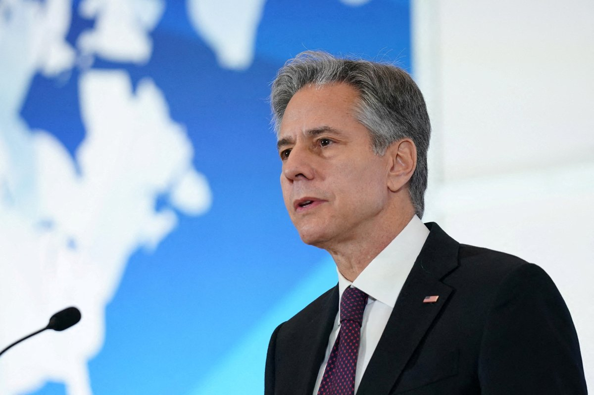
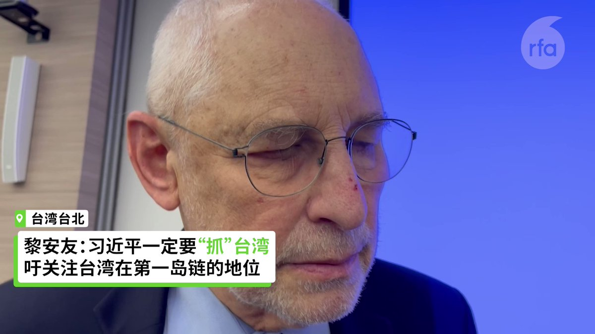
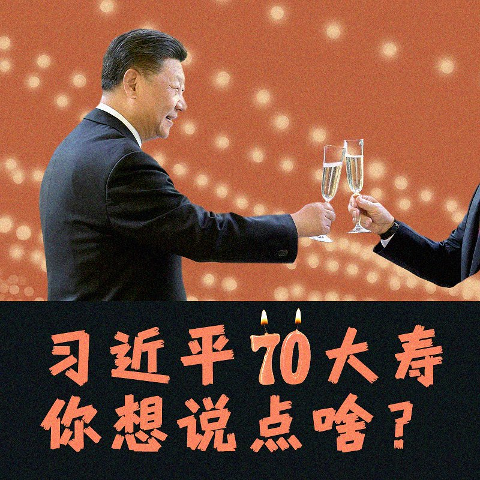
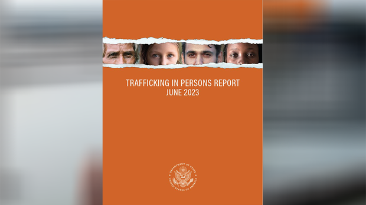
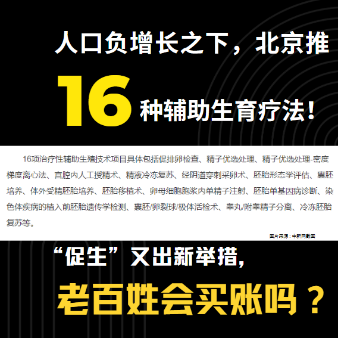
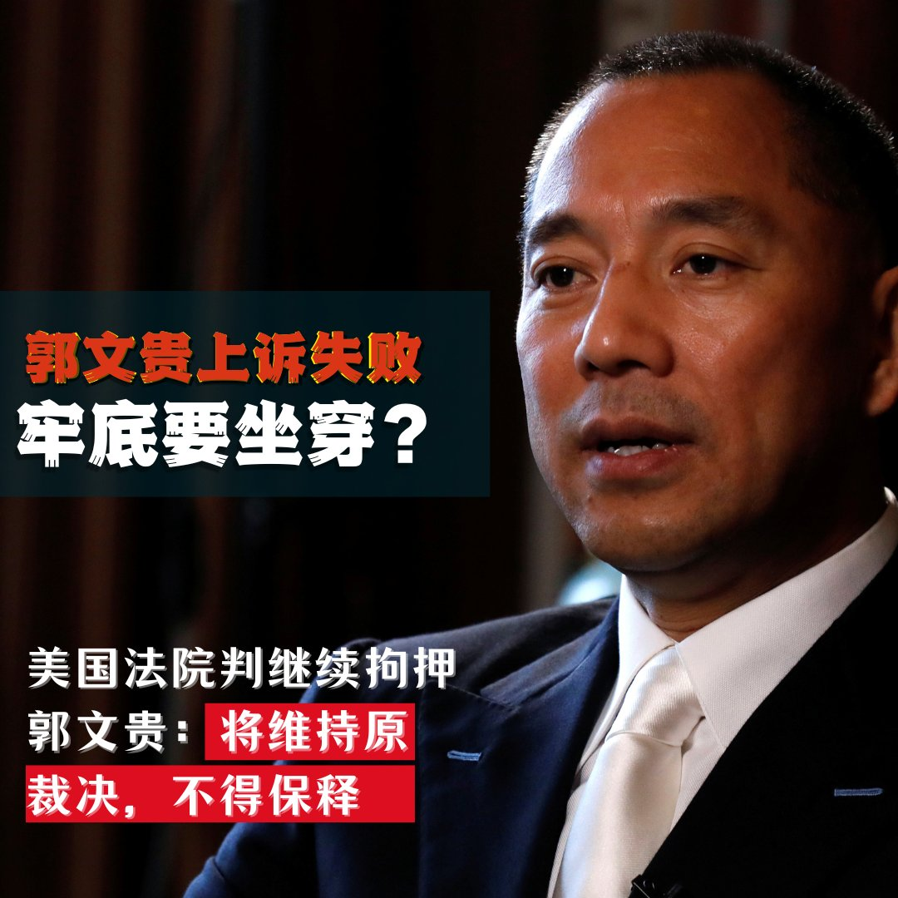
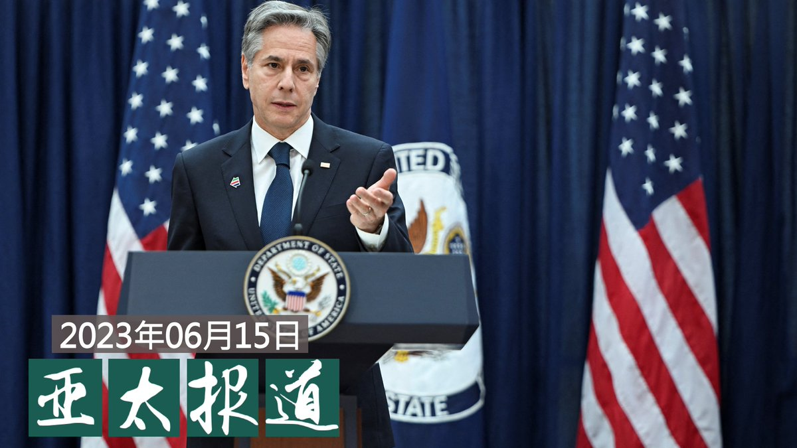
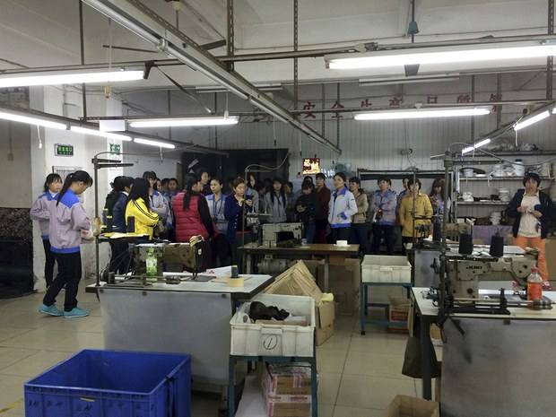

自由亚洲电台 北京时间 2023-06-16T22:43:57Z 1669717455847948288 2018年的中国在很多方面都酝酿着对后来产生深远影响的变化。3月份，全国人大通过了 #宪法修正案，取消了 #国家主席任期制，为 #习近平连任 第三届中国最高领导人铺平了道路。与此同时，媒体上频频闪现着对民营企业不详的信号。   自由亚洲电台 北京时间 2023-06-16T22:44:30Z 1669717593093971969 就在胡力任离开中国的时候，孟军的橡胶企业订单还在上升中。但让他没想到的是，仅仅一年半以后，他自己的亿元企业会随着新冠疫情一起沉沦。   自由亚洲电台 北京时间 2023-06-16T22:45:10Z 1669717760748781576 由于专利还在他手中，胡力任离开中国以后，还有不少公司打电话邀请他去做项目，但他都拒绝了，“我宁可把这些专利都废掉，也不愿意再为这个国家贡献任何技术，”胡力任说，他已经彻底醒悟了，“我不要再为这样一个黑暗的社会、黑暗的政权、黑暗的国家服务了，没有意义了。我觉得这个国家已经完蛋了。”   自由亚洲电台 北京时间 2023-06-16T22:45:58Z 1669717961957949441 胡力任和孟军都曾是中国改革开放大潮中的弄潮儿，他们两人也都明白、或者利用过中国的 #官商关系，有时甚至选择性忽视这种关系对社会可能造成的危害。但在近年中国政治、社会的变动中，这两位民营企业家均受到重创，被迫改变自己的初衷和人生计划，并开始修正自己过去对中国的理解。   自由亚洲电台 北京时间 2023-06-16T22:51:38Z 1669719386536521731 @Jeff23Wang 欢迎收听自由亚洲电台深度报道播客 https://t.co/q3QLYQcxWD   自由亚洲电台 北京时间 2023-06-16T23:44:33Z 1669732705117044736 中国研究专家 #黎安友 表示，习近平一定要掌控台湾，不只因为"中国梦"，更与习主导全球的计划中，台湾具重要战略地位有关。他认为，台湾是中美关系不能解决的难题，如果中国欲武统台湾，美国必定出手。台湾明年大选，不管谁当选，北京都不会让台湾的新总统有好日子过。

https://t.co/2baZz0zyK9   自由亚洲电台 北京时间 2023-06-16T21:38:19Z 1669700934958456833 RT @RFA_Chinese: 6月15日是 #习近平70岁生日。俄罗斯总统 #普京、朝鲜国务委员会委员长 #金正恩 发送祝寿贺电。… https://t.co/YaVJPyfo6P   自由亚洲电台 北京时间 2023-06-16T22:13:46Z 1669709856595406850 RT @RFA_Chinese: 美国指控流亡中国商人郭文贵诈骗10亿美元，4月份，曼哈顿联邦法官以其有逃亡可能为由拒绝其律师提出的2500万美元保释方案。路透社6月14日报道，位于曼哈顿的上诉法院称将维持原裁决，郭文贵不得保释，将继续被关押狱中。法院文件中提到，如果郭文贵被指…   自由亚洲电台 北京时间 2023-06-16T19:01:14Z 1669661404499161088 【中共持续骚扰 #王全璋 一家】
【刁难其合法租屋为“非法侵入”】
中共当局持续骚扰 #709事件 中的 #维权律师，王全璋及其妻子 #李文足，以及未成年的儿子，几个月来一直 #居无定所，屡屡遭到当地公安驱赶而数次搬家。
李文足周五发布多条影片，指丈夫王全璋在他们北京昌平昌盛园小区最新的住所，下楼倒完垃圾回到楼上时，3个不明身份的人不让王全璋进屋。随后，一个人更用身体堵着门不让他们关门，另一个直接躺到地上“哀嚎”疑似“碰瓷”。
其后北京昌平松园派出所民警闯入李文足的家，指收到报案有人涉嫌“#非法侵入他人住宅”，质疑王全璋一家没有合法居住权。即使李文足提供租赁合同、房东影片，警察都说不能证明是合法入住，要求房东本人或亲属拿着身份证、户口本、房产证到家里证明。
据王全璋早前提供的公开信息，他们最新租住的房屋，房东为“江祥君”，是他们的朋友，目前身在美国，他与王全璋签订了为期5年的租房合同。房东在6月11日还亲自录制了影片，证明合同内容真实、合法、有效，并未与王全璋解除合同。
但最后，李文足合法租住的家再次被“断电”。   自由亚洲电台 北京时间 2023-06-16T16:45:48Z 1669627320846655488 【人权团体呼吁布林肯对中共侵犯人权问责】
美国国务卿布林肯18日访华前，国际人权组织“人权观察”（Human Rights Watch）刊登一篇致布林肯的联名信，此信由42个倡导中国、香港、西藏和新疆人权的非政府组织联合向布林肯提出呼吁。
联名信敦促布林肯为中国政府侵犯人权的行为寻求问责。联名信要求布林肯告诉中共当局：美国打算与盟友一起支持对新疆的暴行罪进行国际调查、立即释放所有人权捍卫者、释放在中国被错误拘留或已被强迫失踪的美国人和其家人、立即废除强加给西藏儿童的强制性寄宿学校制度。联名信还呼吁布林肯，如果情况允许，与“天安门母亲”的成员会面。
联名信要求布林肯告诉中共当局，美国将大力调查并适当起诉中国官员及其在美国的代理人违反美国法律的镇压行为，包括骚扰、恐吓和监视在美国批评中国政府的人。并要求布林肯在访华期间举行媒体简报，以显示对新闻自由的支持，离华后也要这样做，以便被禁止进入中国和香港的记者都能够参加。报道:https://t.co/7pqMEmzDcJ
#布林肯
#人权
#HumanRightsWatch   自由亚洲电台 北京时间 2023-06-16T17:45:09Z 1669642258264752128 【#黎安友:若中国犯台 美国一定派兵介入】
【台湾不管谁选上总统 北京都不会让他有好日子过】
著名的中国问题专家黎安友(Andrew J. Nathan)16日在台北就“如何防止台海冲突”发表演讲。他说，习近平一定要掌控台湾，不只为了实现中国梦，更与习近平主导全球的计划中，台湾具重要战略地位有关。他认为，台湾在中美关系中是无法解决的难题，如果中国攻击台湾，美国一定会派兵介入。他还说，台湾明年不管选出谁当总统，北京都不会让台湾的新总统有好日子过。   自由亚洲电台 北京时间 2023-06-16T16:09:14Z 1669618119227379717 【经济疲弱产能过剩 #钢价 跌逾两成】
【再有工人集体讨薪】
中国经济疲软，房地产市场对钢铁需求极速下降，造成大批钢铁企业的资金循环出现断流，不得不停产。5月31日，河北唐山再有一家年产240万吨钢材的企业停产，该厂欠薪导致数千工人讨薪维权。钢铁业一工程师对本台说，今年头六个月钢材价格跌25%，这种跌势一般企业很难承受。详细报道:https://t.co/F3gUQNv4ia   自由亚洲电台 北京时间 2023-06-16T06:30:01Z 1669472357420003328 #捷克 总统帕维尔与台湾外交部长 #吴钊燮 同在布拉格一场会议受邀演讲，这是欧洲非邦交国家领袖首次与台湾的外长同台。帕维尔呼吁各国团结支持台湾，不被中国强加意志，吴钊燮感谢捷克在欧洲带头支持台湾。台湾立委林昶佐则受邀担任挪威举办的"哈维尔奖"颁奖人。

https://t.co/1FkqpETUU8   自由亚洲电台 北京时间 2023-06-16T07:41:01Z 1669490225058308098 6月15日是 #习近平70岁生日。俄罗斯总统 #普京、朝鲜国务委员会委员长 #金正恩 发送祝寿贺电。
中共历任领导人都坚持“#不做寿”，官方资料只写领导人出生月份，没有日期；即使外国政要向中国领导人祝寿，相关新闻也不作报道。港媒指出，这是由于毛泽东早在1940年代就为中共高层立下了“不做寿、不送礼、少敬酒、少拍掌、不以人名作地名、不要把中国同志同马（克思）恩（格斯）列（宁）斯（大林）并列”的规矩。
但是“不做寿”规矩近年有所松动。所以每年这一天，中国网民都分外留意官方动向，并不时将某些事情与习近平的生日相关联。今年网民热议，请  #梅西 到北京踢球，是不是为给习祝寿？   自由亚洲电台 北京时间 2023-06-16T08:24:04Z 1669501055984365569 RT @RFA_Chinese: 本台深度报道《中国 #拐卖妇女 现象深层分析》又获大奖！
佳作重温：https://t.co/CCLsVzCdrF https://t.co/EUeWjNEPIn   自由亚洲电台 北京时间 2023-06-16T05:32:11Z 1669457801045856259 美国国务院周四（6月15日）发布了2023年《#人口拐卖报告》，全面概述了全球人口拐卖的现状以及美国政府用以对付的办法。
美国国务卿布林肯专门就此发表声明，强调解决 #人口拐卖 这样的全球问题需要一个跨政府、商业和公民社会的全球联盟。通过共享资源和信息，可以更好地追踪和应对不断变化的拐卖趋势，更好地制定以创伤为导向的反人口拐卖政策和策略。
报告中列出了11个国家的政府，涉及政策性的人口拐卖、政府资助的拐卖、与政府相关的医疗服务或其他领域中的强迫劳动、政府营地中的性奴役，或者招募或雇佣儿童士兵等情况，中国位列其中。
报告中还叙述了一些与中国相关的人口拐卖例证。其中尤其提到，一些总部位于中国的犯罪辛迪加组织在社媒上伪装成劳务中介组织，哄骗来自东亚等地区、有一定英语能力或技术背景的工人到柬埔寨、泰国和老挝等东南亚地区去工作，但这些人到达后却是被关押在大型建筑物里，护照被收缴，并遭受肉体或性暴力，他们被迫以欺诈的方式在网上获取普通人的数字货币或诱使他们参与网上赌博等等。   自由亚洲电台 北京时间 2023-06-16T05:33:06Z 1669458033972506625 本台此前报道，今年四月，江苏常州女子杨丽与其母亲在前往北京上访及就医时被疑似黑道分子暴打、绑架回常州。当时，杨丽与其家人怀疑这些黑道分子是受当地派出所指使。事隔两个月，本周三，杨丽与其母亲在前往北京看病时又再度被不明人士绑架回常州。

https://t.co/Z4pc8Ldy3h   自由亚洲电台 北京时间 2023-06-16T05:46:30Z 1669461402371731457 6月15日，北京市医保局发布通知，自7月1日起，16项治疗性辅助生殖技术项目将纳入本市基本医疗保险报销范围，本市新生儿出生即可享受医保待遇。
去年，中国出现过去60多年来的首次人口负增长。路透社说，这是当局为提高中国低迷的出生率采取的最新举措。您认为，中国政府绞尽脑汁鼓励生育，老百姓是否会买账？中国人为什么不愿生了？   自由亚洲电台 北京时间 2023-06-16T05:47:42Z 1669461704323784709 美国指控流亡中国商人郭文贵诈骗10亿美元，4月份，曼哈顿联邦法官以其有逃亡可能为由拒绝其律师提出的2500万美元保释方案。路透社6月14日报道，位于曼哈顿的上诉法院称将维持原裁决，郭文贵不得保释，将继续被关押狱中。法院文件中提到，如果郭文贵被指控罪名全部成立，他将面临最高195年的刑期。
您对郭文贵被捕怎么看？您认为，他被捕的真相是否已经完全揭开？   自由亚洲电台 北京时间 2023-06-16T05:54:11Z 1669463337510539264 【#亚太报道（2023-6-15）】
欢迎收听和订阅播客【亚太报道】 https://t.co/MjLNSvVMqc
#布林肯访华 倒计时下的 #美中关系 / G7对中国：降风险不 #脱钩 / #程渊 披露 #赤山监狱 实施体罚和强迫劳动 / #王全璋 一家再遭逼迁 / 中国怪象：富豪外流 农民拦路 https://t.co/2QOHQdHSfP   自由亚洲电台 北京时间 2023-06-16T05:59:02Z 1669464556190711808 亚洲基础设施投资银行(AIIB，#亚投行)加拿大籍高级主管毕加博（Bob Pickard）日前宣布辞职，并批评亚投行被中国共产党控制，充满有毒文化。#加拿大 政府随即宣布，停止与亚投行的关系。

https://t.co/HwZ7huP4rs   自由亚洲电台 北京时间 2023-06-16T06:08:09Z 1669466850806181891 据路透社报道，总部位于香港的中国劳工人权组织“#中国劳工通讯” 统计得知，今年头五个月，中国各地工厂总计发生了逾140起 #罢工， 为七年来新高。上一次的最高记录出现在2016年，当时前五个月各地累计发生313起罢工。
“中国劳工通讯”认为，中国经济低迷，出口和工厂出产量下滑，工厂难以支付工人薪资，被迫裁员或关闭，这使得劳资冲突次数飙升，将重挫消费者和营商信心。并且制造订单减少和工厂关闭的情况可能持续。
报道也指出，“中国劳工通讯”收集的数据是通过社交媒体平台获得的抗议活动消息，其中部分消息通过该组织在工会或工厂的联系获得确认，但并非所有报道都得到核实。   自由亚洲电台 北京时间 2023-06-16T02:49:20Z 1669416817356587008 "709"事件中遭到打压的中国维权律师持续受到中共当局的驱赶，不仅是维权律师 #李和平 一家，律师 #王全璋 及家人近期也屡遭北京公安逼迁。
这是在为美国国务卿 #布林肯访华 做维稳准备吗？

https://t.co/knmTROI1nF   自由亚洲电台 北京时间 2023-06-16T03:33:23Z 1669427905733054479 6月15日，#欧洲议会 通过一项支持香港的决议，促请港府释放壹传媒集团创办人 #黎智英 等人，并再次呼吁欧盟理事会制裁香港特首 #李家超 等中、港官员。欧洲议会过往曾多次通过支持香港的决议，然而欧盟却不为所动。这些决议，对香港的实际作用有几大？
https://t.co/M1AAuPi2DV   自由亚洲电台 北京时间 2023-06-16T03:56:30Z 1669433719697063937 美国国务卿布林肯（Antony Blinken）推迟数月的访华行程本周末即将展开。在美中竞争激烈、双边关系跌入几十年来低谷的情况下，这次访问到底能对美中关系带来哪些影响？美中各有怎样的期待？
本台记者凯迪 @KittyWang5 报道。
https://t.co/GqPjdzQ00H   自由亚洲电台 北京时间 2023-06-16T00:38:20Z 1669383851347693568 施明磊：“（#程渊）非常非常瘦，大概只有五十公斤，也就是一百斤左右。他在里面踩缝纫机，一天踩十二个小时。他有痔疮，腰椎也有问题，他的头发也全白掉了，身体机能也出了问题，牙痛，牙齿开始脱落。”

https://t.co/1J1D00x9Rn   自由亚洲电台 北京时间 2023-06-16T02:17:17Z 1669408754125926400 #事实查核｜中国是"#发展中国家"吗？该地位有"坚实的国际法基础"吗？
https://t.co/20eXK0tPrp   自由亚洲电台 北京时间 2023-06-16T00:15:18Z 1669378053624176642 美国财政部长耶伦认为试图与中国 #脱钩 会是巨大错误，她主张降低风险，但绝非脱钩，并认为国际货币基金和世界银行反映美国价值观，扮演关键制衡力量，中国无资格获 #世银贷款。中国外交部则驳斥，世银并不属于美国。
https://t.co/akJAMlFuu7   