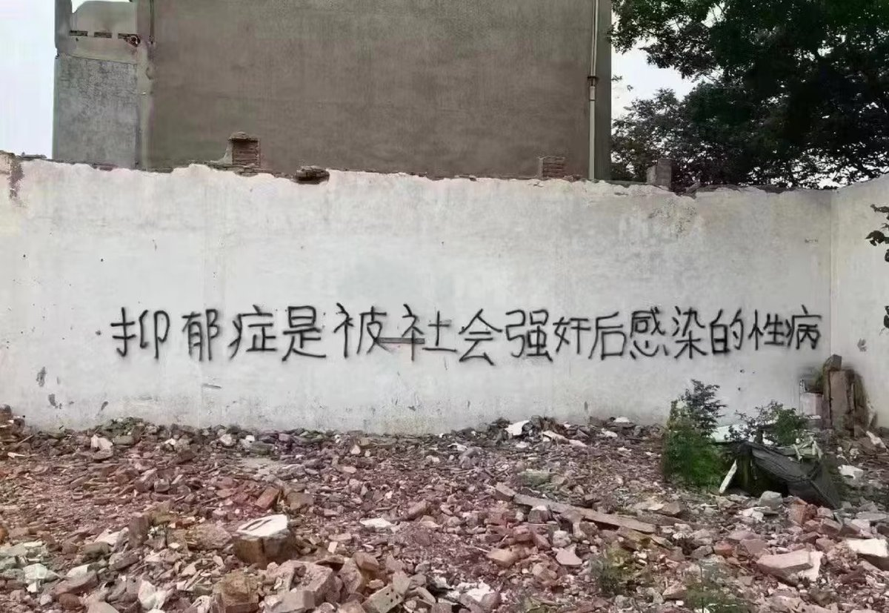
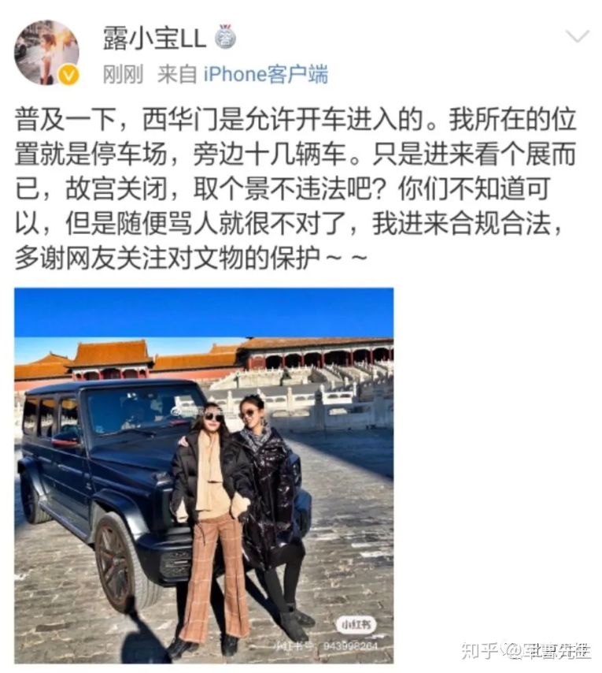

谁将十万横扫三江 北京时间 2023-06-16T10:00:02Z 1669525207294574593 RT @lilaoshizuikeai: 中国主旋律影片里，“政治”是正确和神圣的，前40集无论如何描写混乱和罪恶，最后五集永远是“天降大爹”，提着尚方宝剑卡卡一顿乱削，最后维护了党和国家的利益，不负老百姓的期望。…   谁将十万横扫三江 北京时间 2023-06-16T09:24:00Z 1669516138563403777 “怎么不强奸别人专找你呢？” https://t.co/dCf0kMbQ3X   谁将十万横扫三江 北京时间 2023-06-16T06:22:54Z 1669470563365183488 RT @whyyoutouzhele: 网友投稿
6月15日，人民日报发文批评故宫博物馆存在大量商业拍摄行为，遭遇评论区群嘲“故宫大G”事件 https://t.co/lhLvnNvRZo   谁将十万横扫三江 北京时间 2023-06-16T06:27:22Z 1669471687870644226 RT @torontobigface: 申请劳动仲裁，被冠以恶意仲裁
寻求劳动法保护，被冠以劳动碰瓷
现在搞了个996网站，要被冠以颠覆国家政权罪
就这样的政党，真的还会有人认为他在为人民服务？   谁将十万横扫三江 北京时间 2023-06-16T06:51:04Z 1669477651529240577 RT @whyyoutouzhele: “宏大叙事下的脓疮”–搜狐新闻海报合集
近日，搜狐新闻根据国务院，国家统计局，发改委，最高检察院等机构发布的权威数据，制作了一系列海报，传递当下中国社会所面临的严峻问题。
这些国家数据如同2020年5月前总理李克强的讲话一样，再次将人们从…   谁将十万横扫三江 北京时间 2023-06-16T06:52:58Z 1669478131298873345 RT @whyyoutouzhele: 网友投稿
6月15日，据报道，https://t.co/qOYyOQyaUG项目发起人程渊因犯颠覆国家政权罪，判处有期徒刑五年，剥夺政治权利五年。
“属于程序员的抗争”… https://t.co/RUM166r5RO   