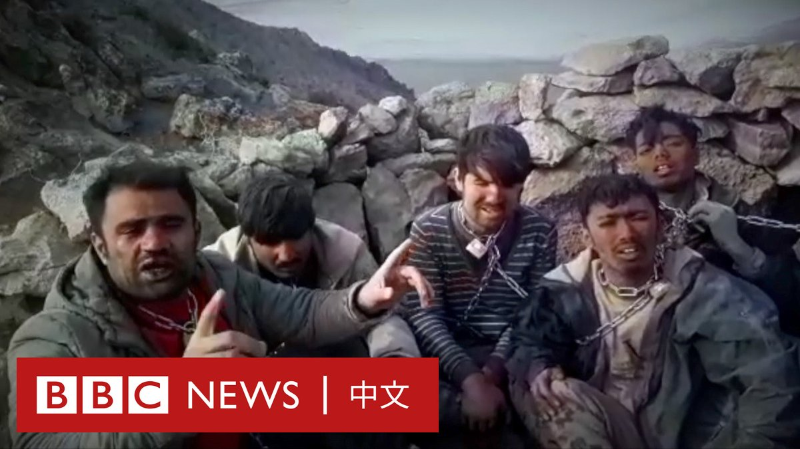

D英国广播公司BBC 北京时间 2023-06-15T15:12:47Z 1669241526839566336 在香港政府寻求禁止2019年示威活动中走红的抗议歌曲《愿荣光归香港》后，该歌曲周三（6月14日）起从多家主流音乐网站上下架。

目前，这首歌曲的原版在包括Spotify、Apple Music和KKBOX等音乐串流平台上下架，而其也无法在Facebook上播放。

不过，目前在YouTube上尚能检索到该歌曲的多个版本。

Spotify回应称，这首歌是应其发行商要求撤下的，而非平台的决定。

这首歌的创作团队“DGX Music”周三（6月14日）则在社交媒体上表示，正在处理一些“和串流平台无关的技术问题”，因此带来“暂时性”影响。

2020年，当局将“光复香港，时代革命”的抗议口号列为非法，指其具有分裂和颠覆意图，而这首歌的歌词包含部分口号。

香港政府律政司6月5日宣布，已向法庭申请禁制令，要求在网上禁播《愿荣光归香港》。法院决定延迟到7月21日再行处理。

律政司在一份声明中表示，由于该歌歌词含有“煽动的口号”，并多次被错误表述为“香港国歌”，“对国家和特区造成严重损害”，因此决定向法院申请禁制令。

该决定引起一些香港人争相购买该音乐，此曲的多个版本在香港iTunes平台上攻入排行榜前10名。

去年，在多个国际比赛场合发生了《愿荣光归香港》被当作中国国歌播放的情况，引发当局愤怒。香港官员称其已要求Google修改搜索“香港国歌”时靠前展示该歌曲的结果，但遭到Google拒绝。   D英国广播公司BBC 北京时间 2023-06-15T16:21:20Z 1669258776673648643 一艘载有难民的渔船在希腊南部海岸倾覆沉没，导致最少79人死亡。希腊官员表示，目前过百人获救，但仍有数百人失踪。当局指这是希腊最严重的移民悲剧之一，宣布全国哀悼三天。https://t.co/B0kIQhPNQa   D英国广播公司BBC 北京时间 2023-06-15T12:35:07Z 1669201847872114688 在马来西亚因美国脱口秀演员谢必孜（Jocelyn Chia）的MH370笑话而要求国际刑警组织介入后，在新加坡长大的谢必孜对BBC说，她认为马来西亚的反应是“荒谬的”。

她称，美国漫画过去曾把“9/11”袭击事件作为笑话的素材，并表示其段子“在社交媒体上被断章取义了”。https://t.co/N1OUMLHPX1   D英国广播公司BBC 北京时间 2023-06-15T14:00:29Z 1669223330023632897 朝鲜领导人金正恩向中国国家主席习近平发送贺电并赠送花篮，祝贺习近平70岁生日。

据朝中社周四（6月15日）报道，金正恩委托朝鲜驻华大使李龙男周二通过中共中央对外联络部副部长，向习近平赠送祝寿花篮。

报道称，金正恩周五再次向习近平致生日贺电，称赞习近平“长期献身中国特色社会主义事业，并深得全体中共党员和人民的尊敬和信赖”。

金正恩说，在习近平的领导下，中共的“权威大有提高”，中国综合国力和国际地位“空前得到加强”。

“希望总书记同志领导好中国共产党和中华人民共和国以及中华民族，并在责任重大的工作中取得更大成就。”朝中社引述金正恩的话说。   D英国广播公司BBC 北京时间 2023-06-15T11:19:15Z 1669182754263822337 BBC的一项调查发现，许多为逃离塔利班统治的阿富汗移民在伊朗和土耳其边境遭到绑架与虐待。

不少移民的家人收到帮派分子的勒索影片，要求他们支付赎金以让亲人离开。 https://t.co/bT1C1e6BUT   D英国广播公司BBC 北京时间 2023-06-15T09:19:00Z 1669152495682158593 76岁的厄瓜多尔女子贝拉·蒙托亚（Bella Montoya）上周因疑似中风入院，后被医生宣布死亡。然而在之后的葬礼上，悼念者们惊讶地发现蒙托亚还活着。 https://t.co/mS35y1ztNX   