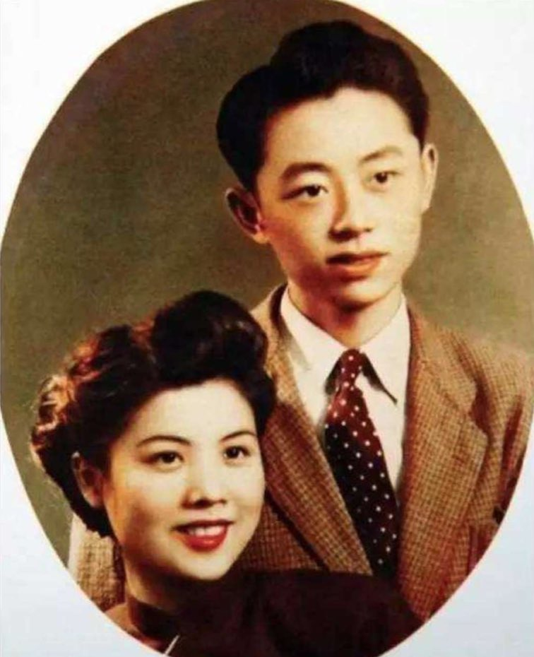
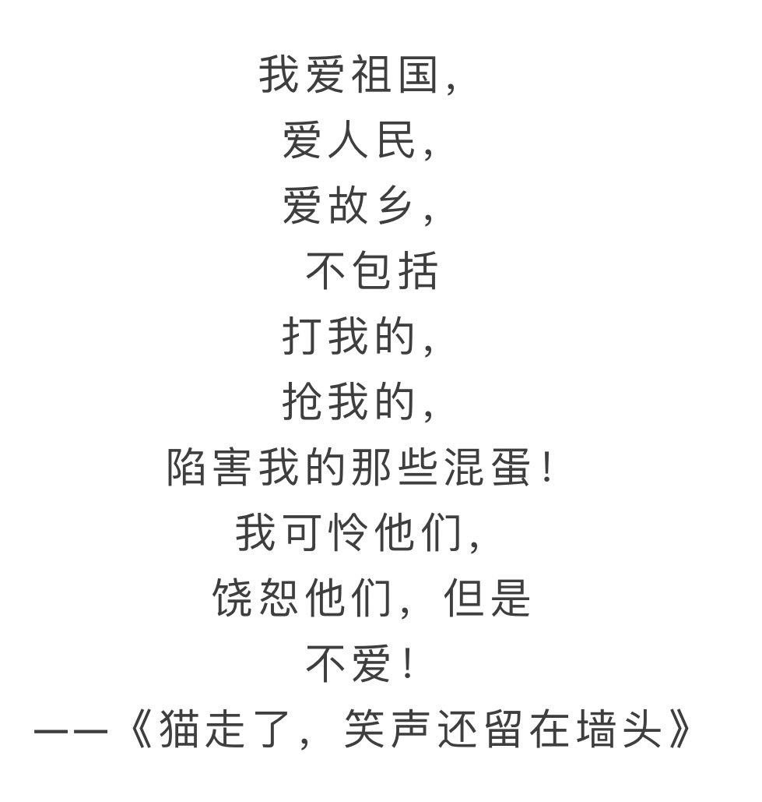
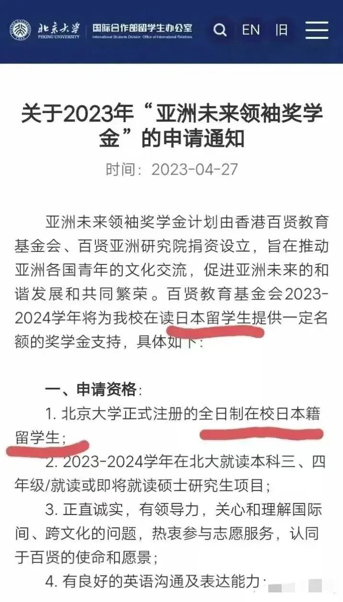
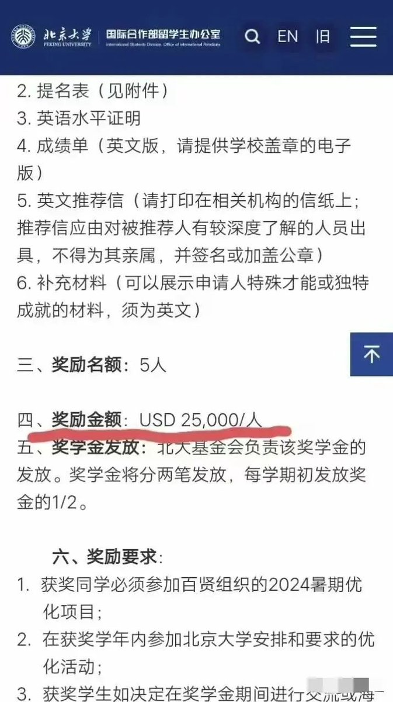

Petrichor 北京时间 2023-06-15T11:45:33Z 1669189374133559297 内外有别，双重标准。 https://t.co/7c610ugdON   Petrichor 北京时间 2023-06-15T11:52:50Z 1669191205333225474 这是一条好狗：作风优良，对主忠诚。 https://t.co/1W5yjc7PFY   Petrichor 北京时间 2023-06-15T11:57:04Z 1669192272481484801 黄永玉说：“我爱晚睡觉、爱抽烟、不运动、不吃水果，喜欢穷聊，最重要的秘诀就是不养生。”

说白了，自己怎么开心怎么来。 https://t.co/VlXie9GyJc   Petrichor 北京时间 2023-06-15T05:31:11Z 1669095160586592258 经济下行，百姓不买房、不买车、不买奢侈品。但政府让大学涨学费，竟然一次性涨了一半，苦了他们父母。在大学一些课明显无用，例如某某某思想，但大学生却要为此交学费。
中国大学生脾气真好，这要在欧美，不要说涨50%，就是涨15%，大学生们也一定上街敲锅抗议。 https://t.co/S8OOPZbM9i   Petrichor 北京时间 2023-06-15T05:36:41Z 1669096547038945281 敲锅抗议 https://t.co/LcEBCJATAz   Petrichor 北京时间 2023-06-15T05:49:13Z 1669099701960949765 北京大学发布的《关于2023年“亚洲未来领袖奖学金”的申请通知》被网友广泛关注并引发热议，原因就是该《申请通知》中明文规定该奖学金的申请资格中第一条就是：北京大学正式注册的全日制在校日本籍留学生，不给中国学生。中国学生问道：难道北大眼中的未来亚洲领袖只有日本人配得上？ https://t.co/PEEQ1pEiFH   Petrichor 北京时间 2023-06-15T04:14:34Z 1669075878951657478 甲午战争日本打败中国，清政府派定国公载泽造访日本，学习救国良方。询问首相伊藤博文：“日本为何能打败人才济济强大的中国？”伊藤说：“贵国并非没有人才，然而贵国乃专制之地，不管人才、地才，一遇专制俱为奴才！此乃贵国愚昧落后，不能强盛的根源，也是我们战胜你们的原因。”现在奴性远胜晚清！ https://t.co/l9IT0Fa0pn   Petrichor 北京时间 2023-06-15T04:15:55Z 1669076219474636800 曾经有外国人挖苦中国人：“一忍，只要活着，哪怕像猪也行；二蠢，没有思考，什么谎言都相信；三软，絲毫无骨气，任由强者欺凌；四笨，不会反思，任由悲剧一次次重演；五坏，没有敬畏，对弱者更加凶残；六恶，没有底线，为一己之利无恶不作！”话虽刻薄，可寥寥数语刻画了中国奴才的真实嘴脸。   Petrichor 北京时间 2023-06-15T04:16:44Z 1669076427507998724 从中国历史看，大多拥有权力者，专横跋扈，上腐下贪！在外敌面前都是外强中干，不堪一击。GDP居全球第一的大宋王朝，被几万蒙古兵就打垮了；GDP占全球40%的大清王朝，还打不过20万人的葡萄牙，这就是“人才遇专制皆奴才”的结果，就是专制与奴才惹的祸！   Petrichor 北京时间 2023-06-15T04:18:46Z 1669076939250757632 专制体制下的统治者享受专制权力带来的巨大利益，对民主宪政体制怀恨在心，必定对人民群众获得自由民主产生恐惧与仇恨；而习惯于跪地求生的奴才们，早已冥顽不化，只会看主子的眼色行事，讨主子欢心。贴身太监姚勋说：“这是陛下的恩赐，奴才们心甘情愿，怎可诋毁我大清国律，干涉我大清内政？”   