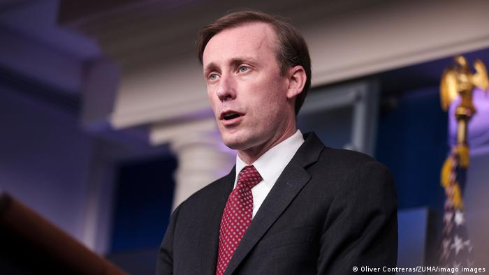

德国之声 北京时间 2023-06-15T21:49:23Z 1669341332006117376 【美日韩国家安全顾问共商中国及朝鲜议题】

白宫在声明中指出，美日韩三边伙伴关系比以往任何时候都更强大、更具潜力。白宫声明发布后不久，朝鲜又试射了一枚弹道导弹。

详细报道👉https://t.co/uI9XE807g9 https://t.co/x2G629WlVc   德国之声 北京时间 2023-06-15T18:29:01Z 1669290911208034305 德广联、德国《时代周报》以及荷兰公共广播电视台NOS调查指出，荷兰军事情报局去年6月最先得到了 #乌克兰 可能计划攻击 #北溪天然气管道 的消息，随后通知了美国、德国等盟友。美国中央情报局接报后曾警告乌克兰方面切勿执行这样的计划。详细报道：https://t.co/fhAIosGeKY https://t.co/J2uQkEwxd1   德国之声 北京时间 2023-06-15T19:10:49Z 1669301429872279552 环保组织“绿色和平”负责任凯泽（ Martin Kaiser）说，俄乌战争、中美紧张关系等地缘政治话题为气候保护谈判蒙上了阴影。“原本期待发达国家能够对谈判起到推动作用，但这一希望也落空了。" 

详细报道 👉https://t.co/Jf9JV3oRI5 https://t.co/o0O2GBmYdP   德国之声 北京时间 2023-06-15T20:08:13Z 1669315873864073225 路透社援引知情人透露的消息称，#英国外相 #祁湛明(James Cleverly)可能会在7月底访问中國。6月15日，祁湛明会见了英国议员努斯拉特·加尼（Nus Ghani），蒂姆·劳顿（Tim Loughton）和海伦娜·肯尼迪（Helena Kennedy）并在推特上表示，他对 #中国 制裁 #英国议员感到遗憾，他完全支持这些议员。 https://t.co/UOa3a6qwhd   德国之声 北京时间 2023-06-15T20:32:37Z 1669322013679255553 如果受到国际刑事法院通缉的俄罗斯总统普京现身南非参加金砖国家峰会，会逮捕他吗？ https://t.co/vmme67Og7e   德国之声 北京时间 2023-06-15T18:00:30Z 1669283732270862339 #中国 外交部发言人汪文斌强调，李强总理此行访问德法是应"德国总理朔尔茨、法国政府邀请"。
详细报道 👉https://t.co/Vp7MMTSaNX https://t.co/U4WjmO4egO   德国之声 北京时间 2023-06-15T16:33:40Z 1669261880773279744 #习近平 出生于1953年6月15日，其父习仲勋曾任中国国务院副总理，习近平是典型的“红二代”。2023年3月，习近平史无前例地开启第三个国家主席任期，迄今没有任何接班人选浮现。习近平如何成为政治强人？一看你就懂  👉https://t.co/pH3hoeBP0i https://t.co/aVc7hkFTpM   德国之声 北京时间 2023-06-15T17:19:49Z 1669273496130662400 #俄罗斯总统普京 6月15日向中国领导人#习近平 祝贺他70岁大寿。普京称习近平为 "亲爱的朋友 "，盛赞其“为促进俄罗斯和中国之间的全面伙伴关系所做的努力"，并表示，”在你的领导下，中华人民共和国取得了令人印象深刻的成就：经济呈现稳定增长，公民的福祉在增加，北京在世界的地位在加强。“ https://t.co/ff6lhEPRDu   德国之声 北京时间 2023-06-15T17:36:19Z 1669277648541843457 怎样删除你在ChatGPT的个人数据？
你知道ChatGPT了解你有多深？这里手把手教你怎样阻止AI储存你的个人信息。 https://t.co/OqWDnxS2cI   德国之声 北京时间 2023-06-15T16:10:05Z 1669255944427958273 6月15日应该是#中国 国家主席 #习近平 的70岁生日。#普京 已经给习近平发去了７０岁大寿贺电。

点击看图集 👉https://t.co/7ht5wtNoFt https://t.co/aaK8NLzwe3   德国之声 北京时间 2023-06-15T12:26:17Z 1669199623108304896 流亡 #美国 的中国富豪 #郭文贵 日前因涉嫌诈骗10亿美元被捕。美国法院4月拒绝其律师提出的保释案，本月14日再驳回其上诉，将郭文贵继续关押狱中。🇨🇳 🇺🇸
https://t.co/57ITrLvpHA   德国之声 北京时间 2023-06-15T12:49:08Z 1669205375311044608 #亚投行 是由中国筹组的一个跨国金融组织，14日遭离职员工踢爆，其高层受 #中国共产党 主导，内部充满 #有毒文化。 #加拿大作为成员国之一，宣布将暂时冻结往来以利调查。亚投行及中国怎么回应？ #AIIB
https://t.co/7IpqqQ3NYs   德国之声 北京时间 2023-06-15T10:43:51Z 1669173845524348928 Spotify澄清，这首歌是由发行商下架；此曲的原创团队DGX Music则称正在处理一些「和串流平台无关的技术问题」，并对「暂时的影响」感到抱歉。
 
此前港府申请禁播《愿荣光》，引起港人争相购买，让此曲的各种版本在香港 iTunes Store 上攻占排行榜前10名。（完）   德国之声 北京时间 2023-06-15T11:35:46Z 1669186913868152832 日本 #福岛 第一核电厂12日展开废炉作业中的核能处理水"试行排放"作业，意在测试相关设备能否正常运转。日方将依试行结果在夏季决定正式排水时机。但首尔与北京对此事反应不同，日本 国内也出现反对声浪。https://t.co/1EmiO4h2f2
 
🤔日本开始试排核废水，您会担心吗？请在留言处跟我们分享您的想法👇   德国之声 北京时间 2023-06-15T09:50:05Z 1669160317979443202 #微软 创办人 #比尔盖茨 可能在他访问 #中国 期间，会见习近平。若有关报导属实，这将是 #习近平 近年来首次会见外国民营企业家。两人曾有过哪些互动？🇨🇳 🇺🇸https://t.co/yO99u7Vl49   德国之声 北京时间 2023-06-15T10:41:17Z 1669173199509262341 #香港 反修例歌曲《#愿荣光归香港》日前遭港府申请禁制令，香港法院将于7月21日再聆讯此案。然而在正式成为 #禁歌 之前，这首歌的各种版本在iTunes Store、Spotify、KKBOX等串流平台，及Facebook和Instagram的Reels上，均已无法播放。（续） https://t.co/eV2XAW0pCN   德国之声 北京时间 2023-06-15T10:42:27Z 1669173493303504896 路透社14日尝试在港版iTunes、KKBOX、Facebook、Instagram上搜索这首歌时，只显示了台湾 #董事长乐团 的版本，原创者「汤玛仕与众香港人」的版本在Spotify上则可显示但「无法播放」。（续）   德国之声 北京时间 2023-06-15T09:35:39Z 1669156683275202561 美国国务院14日表示，国务卿 #布林肯 即将于周末展开的访中之行，不太可能为 #中美关系 带来突破与转机，只盼能 #降低误判风险。两国关系为何难回温？目前已知的行程有哪些？
https://t.co/jM75Thodl4   