美国之音中文网 北京时间 2023-06-15T21:03:45Z 1669329849759023111 6/15【#时事大家谈】中国大使批韩国不该“赌中国输”，韩方为何激烈回应？巴勒斯坦领导人访华，北京为何又盯上了“巴以和谈”？

“中国战略分析智库”研究员邓聿文先生；中国时政评论人，自媒体“小民之心”主持小民先生
主持人：平章
https://t.co/KOe5rYBl3x https://t.co/ywZfgSI7xq   美国之音中文网 北京时间 2023-06-15T16:26:34Z 1669260093375008770 美中全球竞争 巴基斯坦表态不选边站 https://t.co/pTlFyqPIl2   美国之音中文网 北京时间 2023-06-15T16:43:03Z 1669264241344536576 帕劳总统指责中国船只入侵经济海域 请求美国加强巡逻 https://t.co/5EYkmYYL4e   美国之音中文网 北京时间 2023-06-15T17:28:05Z 1669275575083745285 澳大利亚以国家安全为由 启动立法程序阻止俄罗斯建新大使馆 https://t.co/pmOdGqJQon   美国之音中文网 北京时间 2023-06-15T14:31:00Z 1669231009802633216 科罗拉多河上的胡佛大坝比三峡还要高35米，由此形成的米德湖是世界上最大的人工湖之一，蓄水量可达近400亿立方米，但近年干旱导致水位一度降至历史最低点。科罗拉多河沿岸包括加州、内华达、亚利桑那等7个州与联邦政府达成体现历史性共识的节水协议，避免沿岸都市出现缺水危机。 https://t.co/iqoT4He0Zx 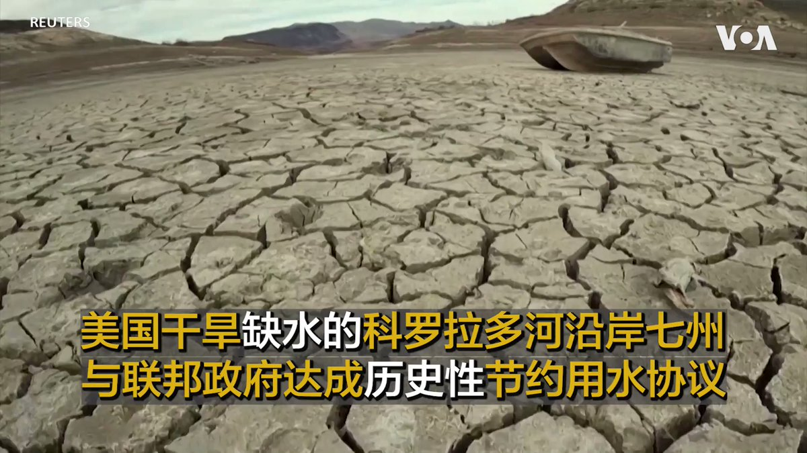  美国之音中文网 北京时间 2023-06-15T14:47:04Z 1669235053946363904 加拿大喊停在亚投行的参与 中国否认亚投行被中共控制 https://t.co/mhcku286w3   美国之音中文网 北京时间 2023-06-15T16:13:03Z 1669256692499107840 中国出口疲软 工人罢工抗议更趋频繁 https://t.co/fMhnrSsyMr   美国之音中文网 北京时间 2023-06-15T12:38:00Z 1669202572433842178 乌克兰最快将于夏天派飞行员接受F-16训练，北约已开始研究后勤细节，这款具备改变俄乌战争走向实力的多功能强大战机未来有望发威。包括语言及飞行模拟器培训在内，乌军飞行员掌握F-16基本技能或需要4个月。乌军最新的飞机出自1990年代，何时能获得F-16战机仍不明确。 https://t.co/Ic4cKaIBxk 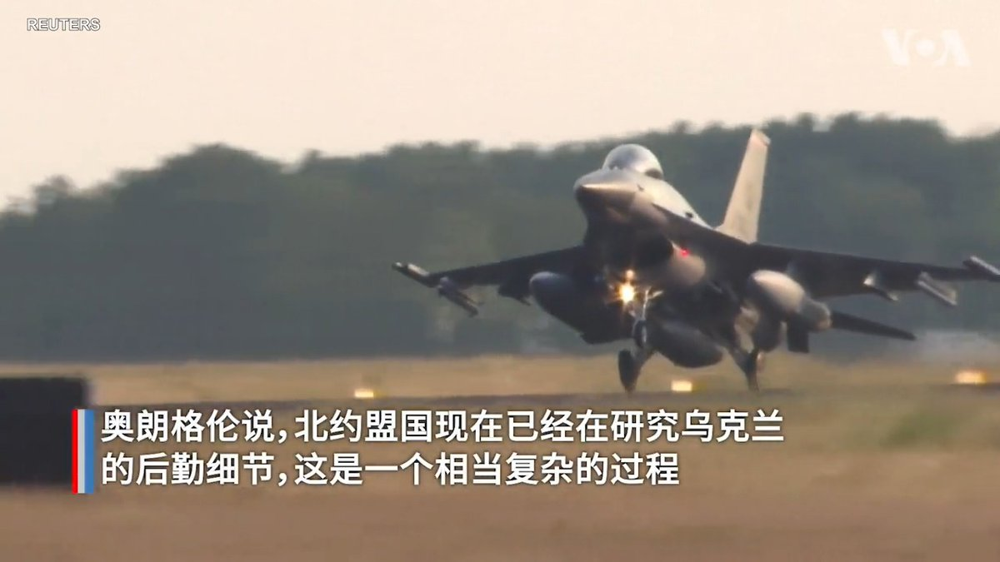  美国之音中文网 北京时间 2023-06-15T14:02:04Z 1669223730705498112 巴布亚新几内亚与美国防务协议被公开 显示美军可畅行无阻使用巴新军事基地 https://t.co/yNBlpV2zzi   美国之音中文网 北京时间 2023-06-15T11:11:03Z 1669180690922115072 布林肯寻求沟通避免美中冲突，专家警告习近平提“极限思维”或加快攻台进程 https://t.co/uhbIW6MXIC   美国之音中文网 北京时间 2023-06-15T11:38:34Z 1669187617831944193 对抗“一带一路”债务陷阱，美议员出奇招 https://t.co/RJ3A8apps6   美国之音中文网 北京时间 2023-06-15T11:52:00Z 1669190996498817026 前总统特朗普对卸任后不当处理机密文件的所有37项指控均不认罪，这桩开创历史先例的案件将持续发展。民意调查显示，与前不久纽约检察官针对成人影星封口费案的指控相比，公众认为机密文件案更为严重，但对其是否应该遭指控则意见明显分歧。预计他在共和党初选中的领先地位不会动摇。 https://t.co/BqV6rjxd6M 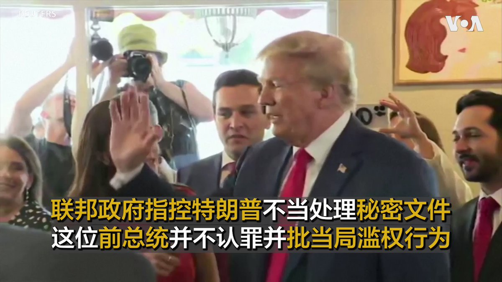  美国之音中文网 北京时间 2023-06-15T08:23:29Z 1669138522618441729 美国国会参议院少数党领袖麦康奈尔6月14日在参议院全院发表讲话时说，美国的印太伙伴正与西方站在一起，反对当今的专制侵略。“支持乌克兰不是件让我们分散注意力的事情，它是威慑中国的根本，”他说。 https://t.co/L4RVaJ7Wy1 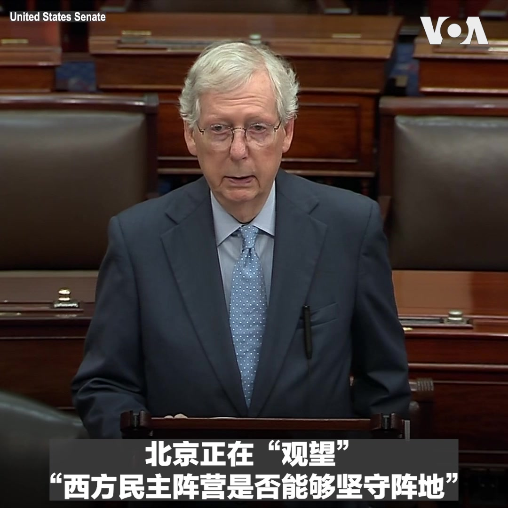  美国之音中文网 北京时间 2023-06-15T10:08:58Z 1669165067248492545 台湾战略专家认为，中国发展核武将造成东亚地区的安全困境。澳大利亚学者认为，中国的目的不是想对外围国家动武，而是在削减美国的影响力。报道： https://t.co/cFoqBIl6Yk https://t.co/pz9gQicBOh 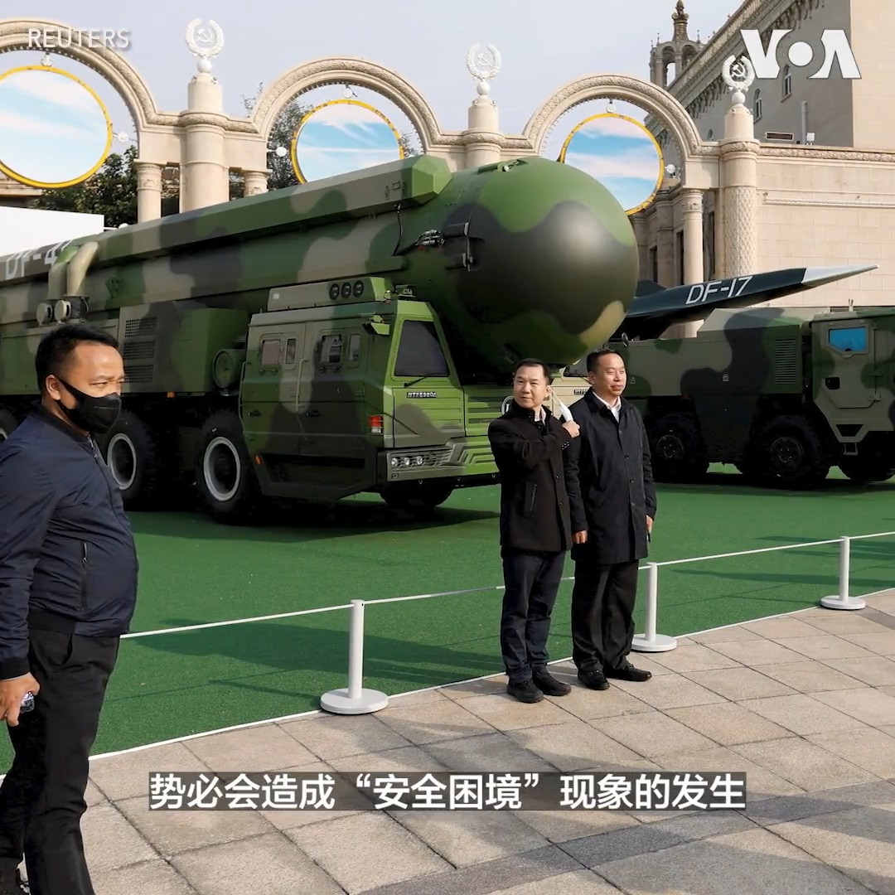  美国之音中文网 北京时间 2023-06-15T06:30:00Z 1669109962478436352 美国国务卿布林肯6月16号动身访华，试图修复美中关系。近日习近平重申“内循环”以应对“极端情况”。独立时评人郑旭光说，这表明习不指望美中关系从根本上缓和，美国在台海等核心利益上不会让步，习暗示布林肯别来中国了。#时事大家谈完整版：https://t.co/NNdVdqtTIo https://t.co/faG3RRrSBD 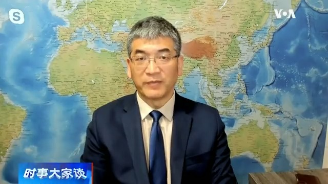  美国之音中文网 北京时间 2023-06-15T06:30:30Z 1669110088005718018 美国国务卿布林肯6月16号动身访华，试图修复美中关系。近日习近平重申“内循环”以应对“极端情况”。独立时评人郑旭光说，这表明习不指望美中关系从根本上缓和，美国在台海等核心利益上不会让步，习暗示布林肯别来中国了。#时事大家谈完整版：https://t.co/NNdVdqurxW https://t.co/lxqA90vSOF   美国之音中文网 北京时间 2023-06-15T06:32:33Z 1669110603796082688 中国与巴勒斯坦建立“战略伙伴关系” 扩大在中东地区的影响力 https://t.co/T9NsF4XZRb   美国之音中文网 北京时间 2023-06-15T07:00:00Z 1669117513588678657 中国驻韩大使批尹锡悦政府“赌美国赢、中国输”，并称“现在赌中国输的人今后一定会后悔”。此言论在韩国引发激愤，两国关系进一步恶化。事件背后是否反映出北京的焦虑和首尔的决心？另一方面，巴勒斯坦总统访华，北京为何对“巴以和谈”兴趣正浓？6月15日时事大家谈将讨论这些问题，请留言参与。 https://t.co/NtfHJL79h5   美国之音中文网 北京时间 2023-06-15T07:03:04Z 1669118285705805825 推特上的中国：亚投行高管指控中共影响，公开辞职并称“很高兴回到自由世界” https://t.co/hljMzF13z8   美国之音中文网 北京时间 2023-06-15T07:52:56Z 1669130834631090176 美国国务卿布林肯将在6月18日和19日访问北京。美国国务院发言人米勒在6月14日的例行记者会上说明布林肯访华的三个目标，并淡化了美中关系能通过此行取得重大突破的预期，但他强调，美中能直接沟通非常重要，这样才不会让竞争演变成冲突或对抗。 https://t.co/c1oilqzOKe 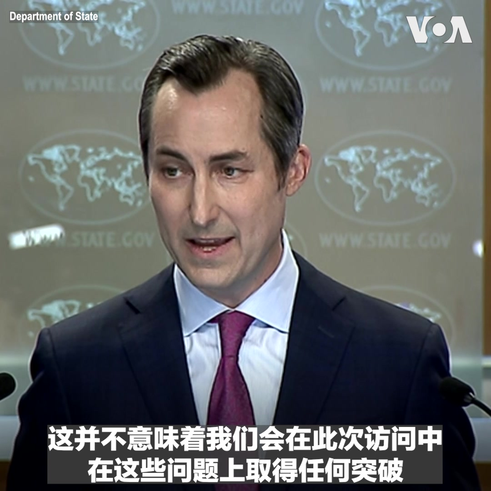  美国之音中文网 北京时间 2023-06-15T08:00:01Z 1669132617663516672 习近平重申内循环，说“当别人不给我们开门的时候”，要“活得更好”。美国三一学院经济系荣休教授文贯中说，中国绝对没有内循环的市场经济条件，改革开放让中国近百年来第一次实质性地提高了生活水平，中共要夺回市场支配权，又走上死路。#时事大家谈完整版：https://t.co/NNdVdqurxW https://t.co/2QgUQDjURb   美国之音中文网 北京时间 2023-06-15T08:15:03Z 1669136399558397953 中国正在全球电子间谍竞赛中努力追赶 https://t.co/VmhfmC95LR   美国之音中文网 北京时间 2023-06-15T08:28:05Z 1669139678187122688 中国流亡商人郭文贵保释被拒后上诉失败 https://t.co/g1LYhRM1x2   美国之音中文网 北京时间 2023-06-15T09:00:01Z 1669147716377534464 一键解锁#美国热搜 榜 1、深度分析习近平的极端情况是什么？2、西方如何应对习近平的极端情况论？3、中国掀起割韭菜薅羊毛运动4、拍照片当汉奸5、三个孩子就是好，不用国家来养老6、早请示晚汇报2.07、新时代的和尚 8、城管打小贩引公愤 https://t.co/zoidrsdtlN https://t.co/W5aAigM4wp   美国之音中文网 北京时间 2023-06-15T09:15:06Z 1669151510671024128 美国务院官员：布林肯访中将坦诚交流台海情势，重申台海和平稳定是美国深切利益 https://t.co/i01ATHLVLw   美国之音中文网 北京时间 2023-06-15T09:43:04Z 1669158550361485313 美联储维持利率不变，但表示今年可能会再加息两次 https://t.co/JgtpValGMj   美国之音中文网 北京时间 2023-06-15T09:43:06Z 1669158557139496960 美国宇航局在土星卫星上发现了生命的关键组成部分 https://t.co/NPdJTXJnec   美国之音中文网 北京时间 2023-06-15T04:46:32Z 1669083926370086912 克什米尔的藏人穆斯林社区在茁壮成长 https://t.co/agsmGjJdzx   美国之音中文网 北京时间 2023-06-15T05:04:09Z 1669088357362860032 中国拒绝美国加快维吾尔人庇护法案，指责政治操纵 https://t.co/bBgq8tsycE   美国之音中文网 北京时间 2023-06-15T05:04:10Z 1669088364769996801 美国国务卿布林肯周五访华以稳定双边关系 https://t.co/PwPKyip3Bm   美国之音中文网 北京时间 2023-06-15T05:36:03Z 1669096386078588928 加拿大籍高管从“亚投行”辞职，称“共产党代理人”主导该银行 https://t.co/iIyckzFQ1N   美国之音中文网 北京时间 2023-06-15T06:00:11Z 1669102460953042951 美国国会参议院外交关系委员会主席梅嫩德斯6月13日在接受美国之音采访时就中国在古巴设立间谍基地一事表示，“光是我们不知道有这件事的这个事实，确实让我感到震惊。”他希望国务卿布林肯在访问中国时能向中方明确表示，中国的行为是“对美国安全和主权的侵犯”。 https://t.co/HL0RbBhX54 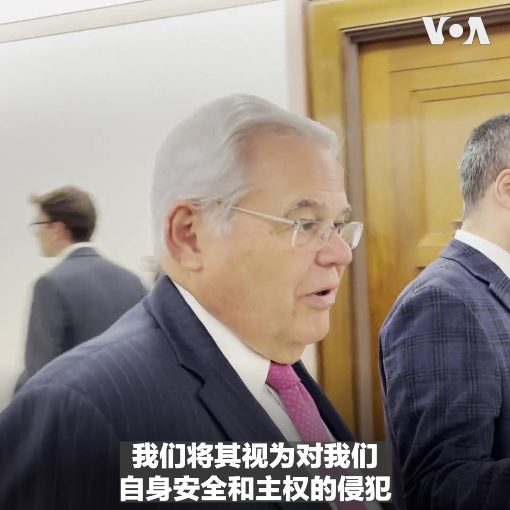  美国之音中文网 北京时间 2023-06-15T03:08:08Z 1669059160439156737 德国政府6月14日首次发布国家安全战略（NSS）报告，就俄罗斯的侵略行为以及中国谋求利用经济影响力实现政治目标发出警告。报告全面阐述了德国的外交政策，并涵盖气候变化和供应链受阻等全球议题。 https://t.co/RljjsViQld 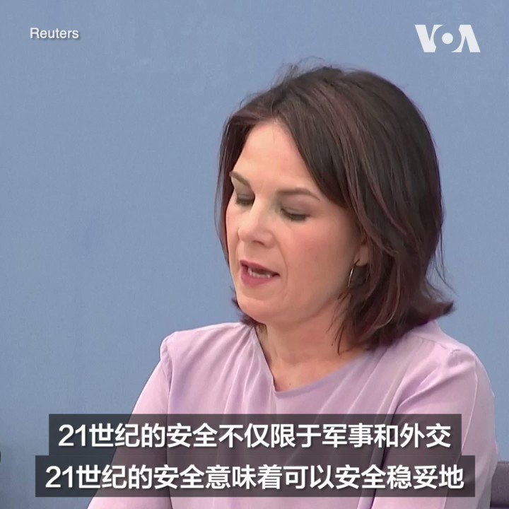  美国之音中文网 北京时间 2023-06-15T03:37:58Z 1669066669900046356 联合国难民事务官员6月14日说，目前全球有大约1亿1千万人由于战乱、迫害和人权遭受侵犯等原因流离失所。仅去年一年，全球流离失所人口增加近两千万人。其中，乌俄战争造成至少1千1百万人逃离家园。 https://t.co/pzd80WPBdW 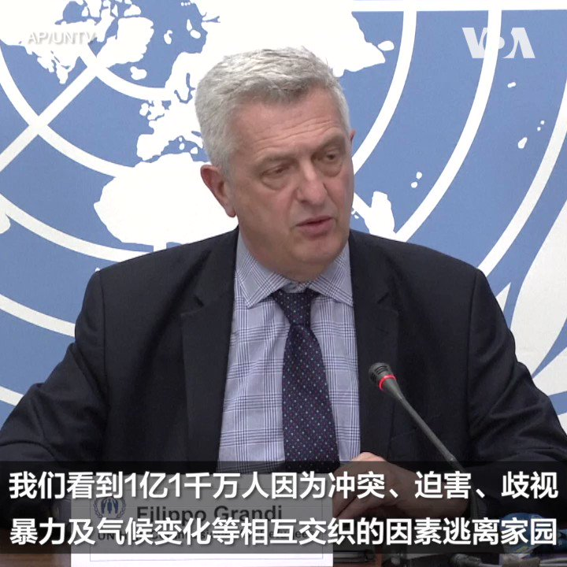  美国之音中文网 北京时间 2023-06-15T00:50:23Z 1669024494256627725 俄战术核弹陆续运抵白俄罗斯，卢卡申科：如要使用他会跟普京协商https://t.co/KHvVAp81Qb   美国之音中文网 北京时间 2023-06-15T00:57:04Z 1669026177007362048 中国核武库大幅扩张，日本台湾如何应对？ https://t.co/23cUSkEjdD   美国之音中文网 北京时间 2023-06-15T01:09:02Z 1669029191113744404 美国会众院外交事务委员会将在美东时间6月14日下午2点举行听证会，聚焦中国“一带一路”倡议。委员会邀请国务院、商务部和美国国际发展金融公司的高级官员到场说明美国政府在“对抗中国胁迫性一带一路外交”方面做出了哪些努力。美国之音将在美国之音官网、YouTube频道和推特平台进行直播，敬请收看。 https://t.co/I6juYXmppW 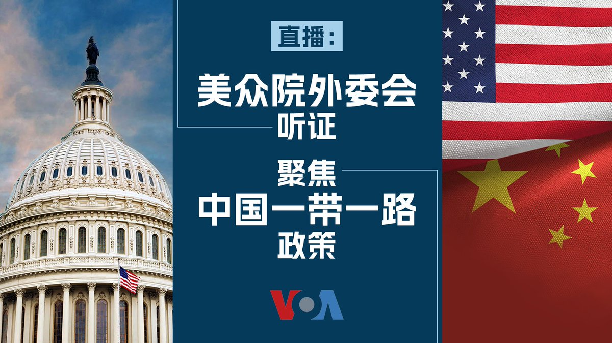  美国之音中文网 北京时间 2023-06-15T01:11:33Z 1669029823866617859 比尔·盖茨抵达北京 预计周五会晤习近平 https://t.co/3KgrtUz5Vk   美国之音中文网 北京时间 2023-06-15T01:11:35Z 1669029832137797632 德国首次发布国家安全战略 称俄罗斯为最大威胁，中国是系统性对手 https://t.co/ZRja3IcLHT   美国之音中文网 北京时间 2023-06-15T01:40:06Z 1669037009393041410 巴丢草华沙画展遭中国官员阻挠，人权组织批干涉他国言论自由又一例 https://t.co/q9GK1qjSQa   美国之音中文网 北京时间 2023-06-15T01:59:46Z 1669041955433504780 美国会众院外交事务委员会将在美东时间6月14日下午2点举行听证会，聚焦中国“一带一路”倡议。委员会邀请国务院、商务部和美国国际发展金融公司的高级官员到场说明美国政府在“对抗中国胁迫性一带一路外交”方面做出了哪些努力。 https://t.co/m4khHq13mo   