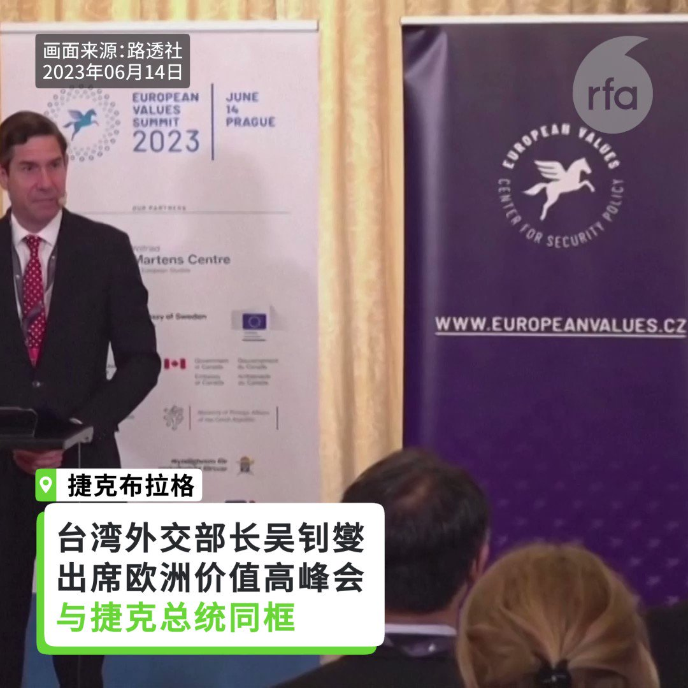
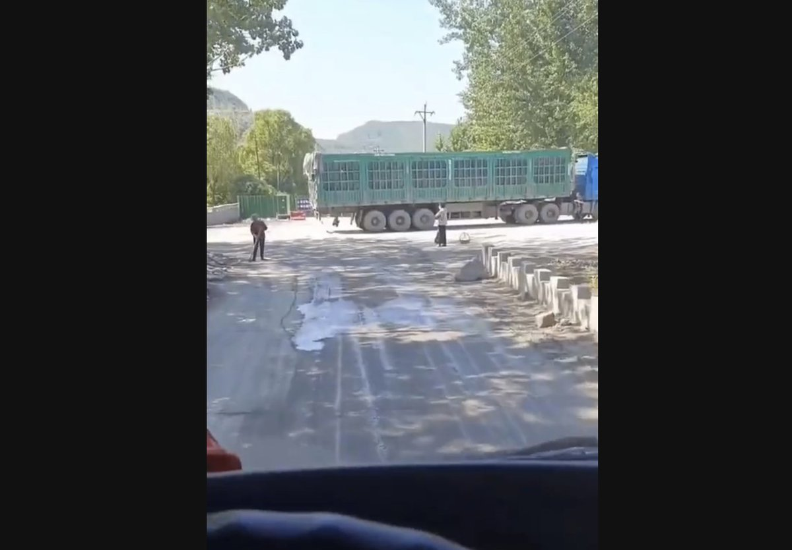

自由亚洲电台 北京时间 2023-06-15T22:38:40Z 1669353738245668867 本台深度报道《中国 #拐卖妇女 现象深层分析》又获大奖！
佳作重温：https://t.co/CCLsVzCdrF https://t.co/EUeWjNEPIn   自由亚洲电台 北京时间 2023-06-15T23:07:38Z 1669361025265672193 RT @RFA_Chinese: 【警方能用身份证号获取聊天记录】
【大数据库已掌握民众全部信息】
中国警方通过大数据获取民众个人信息的技术手段不断提升。近期，一网民在海口被警察抽查时发现，警方不查当事人手机，仅凭其 #身份证 号码便可查到这位网民的 #微信… https://…   自由亚洲电台 北京时间 2023-06-15T23:18:25Z 1669363740280782850 #禁书解读 | #余杰：为 #八九民运 史填上重要的一块拼图 #吴建民《岁月有痕》
https://t.co/VOSbBSqHII   自由亚洲电台 北京时间 2023-06-15T23:41:31Z 1669369553716150273 对于中国青年失业率频频创新高，时政评论员 #陈破空 在本台“ #亚洲很想聊”节目中分析指，中国今年出现三个“最”，考生的数量1300多万，是毛泽东去世以来 #高考 之“最”、 毕业即失业，#失业率 也创造历史之“最”，另一个就是年轻一代躺平之“最”。
https://t.co/5a540ihuZ1   自由亚洲电台 北京时间 2023-06-15T22:03:44Z 1669344943746469891 RT @RFA_Chinese: #事实查核｜美军印太司令说如果再遭中国军舰拦截，将优先开火？https://t.co/N2LQ5GHDwH   自由亚洲电台 北京时间 2023-06-15T16:33:33Z 1669261853300785153 【台外交部长与捷克总统同框】
【捷克总统呼吁欧洲团结支持台湾】
#台湾外交部长 #吴钊燮 与 #捷克总统 #帕维尔（Petr Pavel）在布拉格智库“#欧洲价值安全政策中心”的一场会议中同时受邀演讲。这是欧洲的非邦交国家领袖首次与台湾的外长同台。帕维尔关切台海和平稳定及确保台湾 #民主自由，他呼吁，民主国家团结支持台海现状，不得以片面及胁迫的方式加以改变，并且确保台湾的民主自由获得维护。

吴钊燮则强调，#台湾 从 #欧洲 得到的声援愈来愈多，帕维尔的力挺对台湾人来说是一大鼓舞。他表示，台湾将致力维护台湾海峡的现状，不会屈服于压力也不会成为挑衅者，维护台海和平与稳定应是两岸共同责任，也是全球民主社会的共同期望。   自由亚洲电台 北京时间 2023-06-15T15:38:50Z 1669248083308470273 【#农民拦路 为生存】
【中国社会从有序渐入无序状态】
在中国富豪竞相出逃离开中国的背景下，中国一般民众的生活品质却呈现快速下滑的现象。在河北 #唐山 东北部，一货车司机在途经马兰庄镇一带期间，先后被十多个农民拦截，要求支付 #过路费。此一现象早在上个世纪九十年代中国经济起步时出现，其后消失。学者认为，中国社会正从有序社会重返 #无序状态。
 https://t.co/2pqPMyY5In   自由亚洲电台 北京时间 2023-06-15T13:27:10Z 1669214945815445506 【中国青年失业率20.8%】
【再创 #历史新高】
根据中国统计局15日公布的数据显示，5月份中国 #青年失业率 达20.8%，再创新高纪录。此外，社会消费品零售总额、全国居民消费价格(CPI）以及出口都下滑。
数据指出，中国全国城镇调查失业率为5.2%，与上月持平。但是16-24岁失业率为20.8%，比上个月多出0.4个百分点，青年失业率居高不下。
https://t.co/UaHYMM7uB7   自由亚洲电台 北京时间 2023-06-15T09:21:35Z 1669153143047716864 RT @RFA_Chinese: 【#亚太报道（2023-6-14）】
欢迎收听和订阅播客【亚太报道】 https://t.co/MjLNSvVeAE
#布林肯 将于18、19日访华/#内蒙牧民 阻止草场被卖被推土机撞伤/#709案律师 #李和平 在成都遭 #边控/警方通过身份…   自由亚洲电台 北京时间 2023-06-15T09:22:51Z 1669153463551377408 RT @RFA_Chinese: 近日，由贵州省榕江县足球爱好者自发组织的"#贵州村超"风靡全国，这场足球赛事更像一场盛大狂欢节，吸引了无数的球迷和媒体的关注。不过6月13日却传出中国足协下发通知，要对贵州村超"进行调研"。https://t.co/0ryqjU3Z7m   自由亚洲电台 北京时间 2023-06-15T05:28:38Z 1669094521588596736 【#亚太报道（2023-6-14）】
欢迎收听和订阅播客【亚太报道】 https://t.co/MjLNSvVeAE
#布林肯 将于18、19日访华/#内蒙牧民 阻止草场被卖被推土机撞伤/#709案律师 #李和平 在成都遭 #边控/警方通过身份证获取民众聊天记录/中资网购平台在美销售 #新疆 产品 https://t.co/lxXkl257qM   自由亚洲电台 北京时间 2023-06-15T05:29:51Z 1669094825130426368 两位知情人士向路透社表示，微软公司创始人 #比尔·盖茨 将于本周五访华期间，会晤中国国家主席 #习近平。这将是习近平近年来首次会见外国私营企业家，会面可能是一对一的进行。 第三个消息来源也证实他们会见面，但没有提供细节。https://t.co/YXXW55q3bt   自由亚洲电台 北京时间 2023-06-15T02:32:19Z 1669050147026657311 近日，由贵州省榕江县足球爱好者自发组织的"#贵州村超"风靡全国，这场足球赛事更像一场盛大狂欢节，吸引了无数的球迷和媒体的关注。不过6月13日却传出中国足协下发通知，要对贵州村超"进行调研"。https://t.co/0ryqjU3Z7m   自由亚洲电台 北京时间 2023-06-15T02:33:36Z 1669050470143254534 在英港人周日（11日）被疑似中国留学生殴打，英国保安国务大臣图根达特（Tom Tugendhat）终于开腔回应，形容事件严重，并强调英国不能容忍向强权发声者被灭声。不过施袭者怀疑已返回中国。与此同时，有媒体报道说，#英国外相 或于七月底 #访华，中共高官也将在下周访英。英国对华态度软化，会否令香港议题边缘化呢？https://t.co/J5ul1zHy6q   自由亚洲电台 北京时间 2023-06-15T02:35:27Z 1669050935539032072 专栏 | #劳工通讯：福建晋江佳信轻工发展有限公司关厂，不付拖欠工资 (九)https://t.co/fGPj61Ofe1   自由亚洲电台 北京时间 2023-06-15T03:31:22Z 1669065007500238875 一家全球供应链验证公司近日公布了一项研究报告，报告指出中国线上购物平台 #拼多多 旗下的在线购物网站Temu，违反美国法律，将 #新疆 生产的产品贩卖给美国消费者。https://t.co/4bnyd5483G   自由亚洲电台 北京时间 2023-06-15T04:00:15Z 1669072276334030849 捷克总统帕维尔（Petr Pavel）14日与来访的台湾外交部长吴钊燮同台，并呼吁各国团结起来支持台湾，致力维系和支持台湾的民主，不要让中国的意志强加于台湾。吴钊燮则说，帕维尔的力挺对台湾人来说是一大鼓舞。https://t.co/8WtPfK5E0O   自由亚洲电台 北京时间 2023-06-15T04:13:21Z 1669075573077954560 6月14日，中国海军“戚继光”号训练舰抵达菲律宾进行为期3天的访问。
您认为，中国与菲律宾正在南海争夺海域之际，#中国军舰访问菲律宾 能否修补地区关系？ https://t.co/CCE64j9AWO   自由亚洲电台 北京时间 2023-06-15T04:14:28Z 1669075856273162245 专栏 | #网络博弈：这个六四镇压者名单上都有谁？https://t.co/ANzyRONf65   自由亚洲电台 北京时间 2023-06-15T04:15:44Z 1669076172821471234 #事实查核｜美军印太司令说如果再遭中国军舰拦截，将优先开火？https://t.co/N2LQ5GHDwH   自由亚洲电台 北京时间 2023-06-15T01:38:25Z 1669036583427915776 美中双方周三（14日）分别宣布了美国国务卿布林肯将于18、19日访华的消息。https://t.co/AQuLpNEqsI   自由亚洲电台 北京时间 2023-06-15T01:39:03Z 1669036741821358095 据日经亚洲报道，近日，移民谘询公司Henley &amp; Partners发布一份报告，该报告推估2023年，中国会流失13,500位富有人口，延续近十年来，中国流失百万富翁的趋势。https://t.co/twt3RUoTNA   自由亚洲电台 北京时间 2023-06-15T01:39:32Z 1669036866434129941 加拿大皇家骑警针对外国干预案，启动百余项调查，包括众议员庄文浩疑因批评北京而遭中方威胁一案。不少曾受中国骚扰的人士呼吁，需要独立的公开聆讯，让全国朝野正视问题并拿出解决方案。https://t.co/01o4AJhqzC   自由亚洲电台 北京时间 2023-06-15T01:40:14Z 1669037040380379137 台湾海巡官员私自"放行"四名中国观光客非法入境离岛澎湖"自由行"九天，遭拔官和移送法办，总统蔡英文视察空军时则出现中国解放军广播声，在野党立委称国家安全不容儿戏。https://t.co/oJuIxDWlKs   自由亚洲电台 北京时间 2023-06-15T01:41:10Z 1669037274560905216 澳大利亚退役陆军少将莱恩(Mick Ryan)发表科技惊悚小说《白日战争：前进台湾》, 故事设定在2028年，前任中国领导人遇刺身亡，新任中国领导人必须转移视线以便稳定政局；于是趁着美国忙于迎接总统大选和对付天灾的时候，挥军攻打台湾。https://t.co/e0h3WE2IHV   自由亚洲电台 北京时间 2023-06-15T01:41:46Z 1669037426973499403 #中国709案 受害律师李和平持续受到当局打压，除了北京的寓所被人恶意破坏 ，当局更以可能危害国家安全为由，限制他和家人出境。 另一709案涉案律师王全璋在迁入新居后，仍被公安上门滋扰。https://t.co/mit5OTEbVA   自由亚洲电台 北京时间 2023-06-15T00:01:19Z 1669012150004879360 【内蒙古牧民阻止草场被卖】
【 一人被推土机撞伤】
#内蒙古 #扎鲁特旗 #阿日昆都楞镇 牧民，不满该镇种畜场官员将 #草场 出售给商人，本周二在草场上抗议，买家雇佣的工程人员开着 #推土机，直接冲撞抗议者，导致一名牧民受伤，被送医院救治。 https://t.co/jHtjAQEwFt   