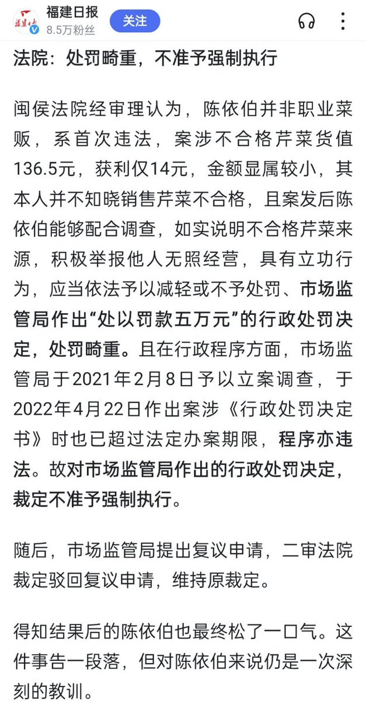
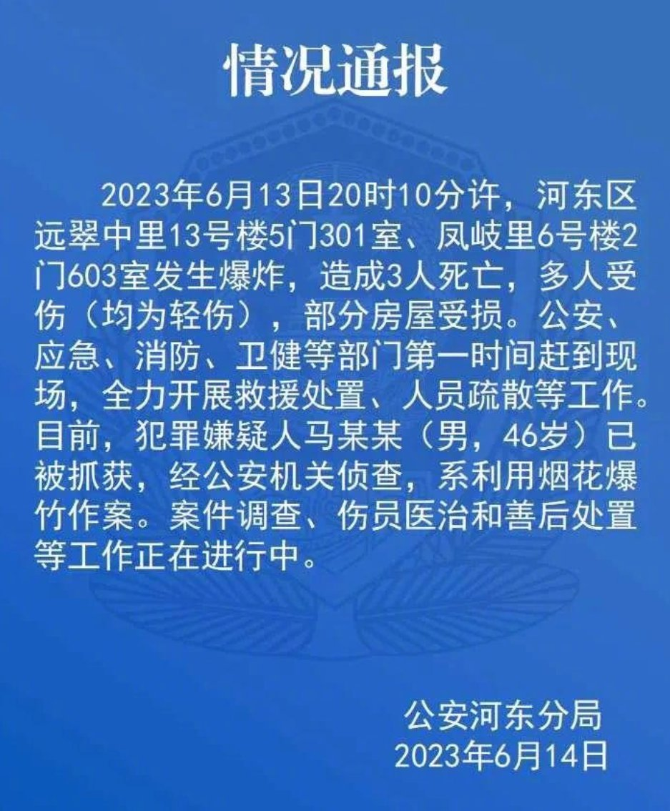
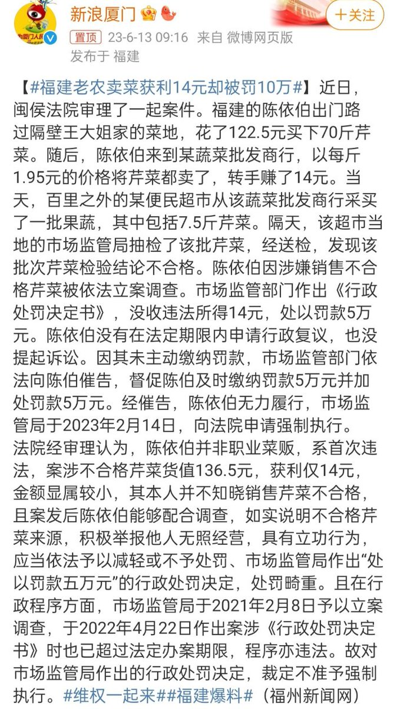
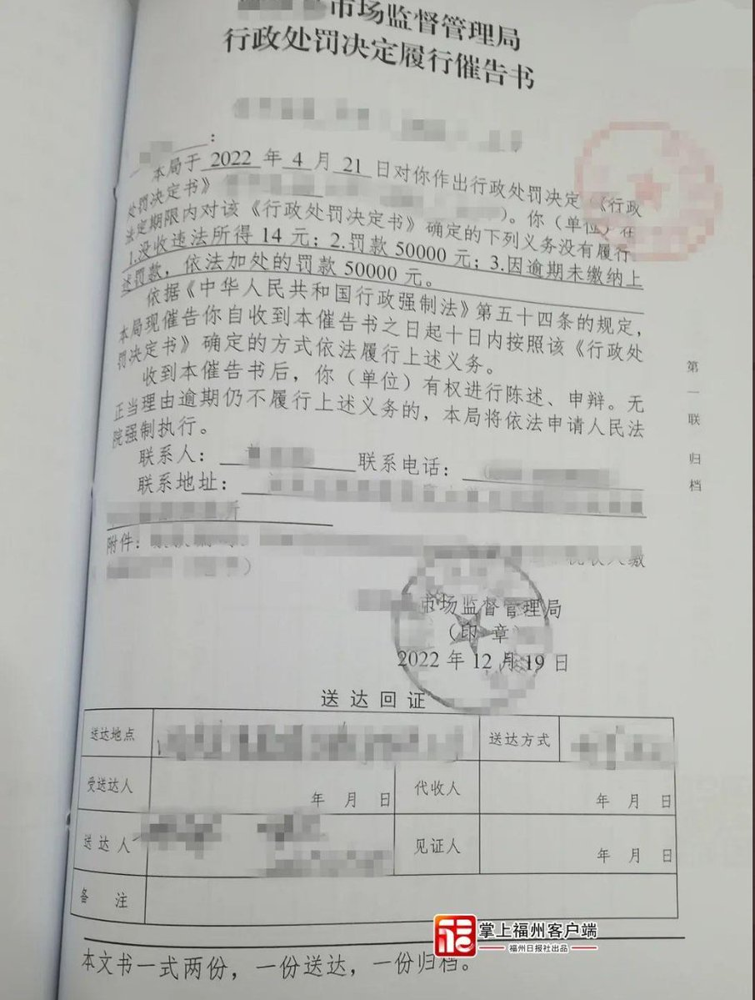
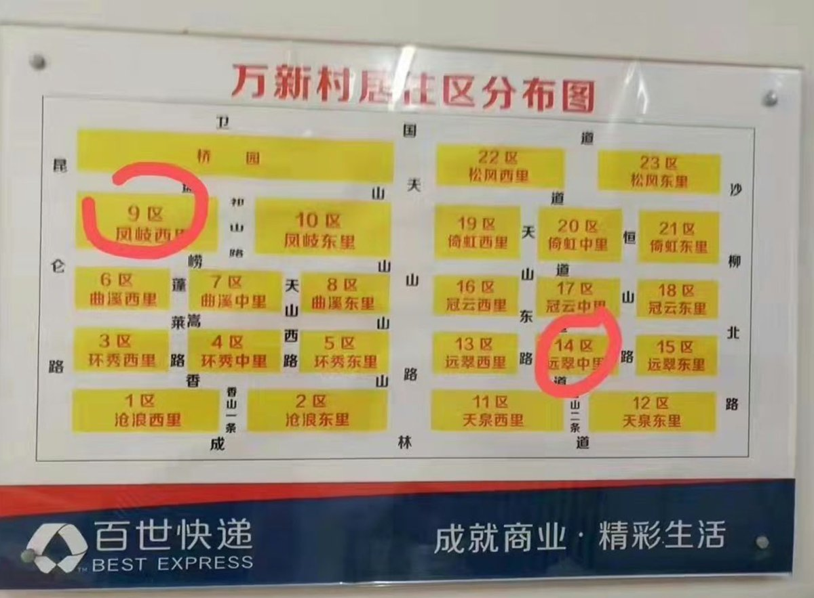
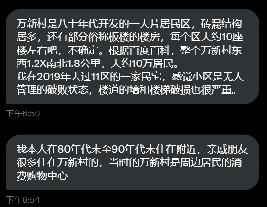

A李老师不是你老师 北京时间 2023-06-14T09:58:22Z 1668800014062174209 网友投稿
6月13日，福建老农卖菜获利14元被罚十万被多家媒体报道，引发关注。
据悉， 福建一老农2019卖的菜质量不合格，在2021年被当地市监局立案调查，2022年4月22日市监局做出处罚该老农五万元的决定，后来又追加五万元，共计十万元。 因老人无力缴纳罚款，市监局向闽侯法院申请对老人强制执行。但闽侯法院认为市监局对老罚款的决定处罚畸重、程序违法，故不予强制执行。   A李老师不是你老师 北京时间 2023-06-14T08:47:51Z 1668782264627470337 根据公安河东分局的情况通报
爆炸系人为，犯罪嫌疑人利用烟花爆竹造成三人死亡，多人受伤。 https://t.co/ObuarL76Dn   A李老师不是你老师 北京时间 2023-06-14T09:19:21Z 1668790192281464834 网友投稿
6月13日，福建老农卖菜获利14元被罚十万被多家媒体报道，引发关注。
据悉， 福建一老农2019卖的菜质量不合格，在2021年被当地市监局立案调查，2022年4月22日市监局做出处罚该老农五万元的决定，后来又追加五万元，共计十万元。 因老人无力缴纳罚款，市监局向闽侯法院申请对老人强制执行。但闽侯法院认为市监局对老罚款的决定处罚畸重、程序违法，故不予强制执行，并对市监局进行行政处罚。   A李老师不是你老师 北京时间 2023-06-14T05:39:42Z 1668734916958322697 网友补充 https://t.co/E1yt4zWdT7   A李老师不是你老师 北京时间 2023-06-14T05:42:42Z 1668735671358443525 后续：警察将打人城管铐走，途中城管被周围愤怒的民众群殴。 https://t.co/WU4V6tnXEj   