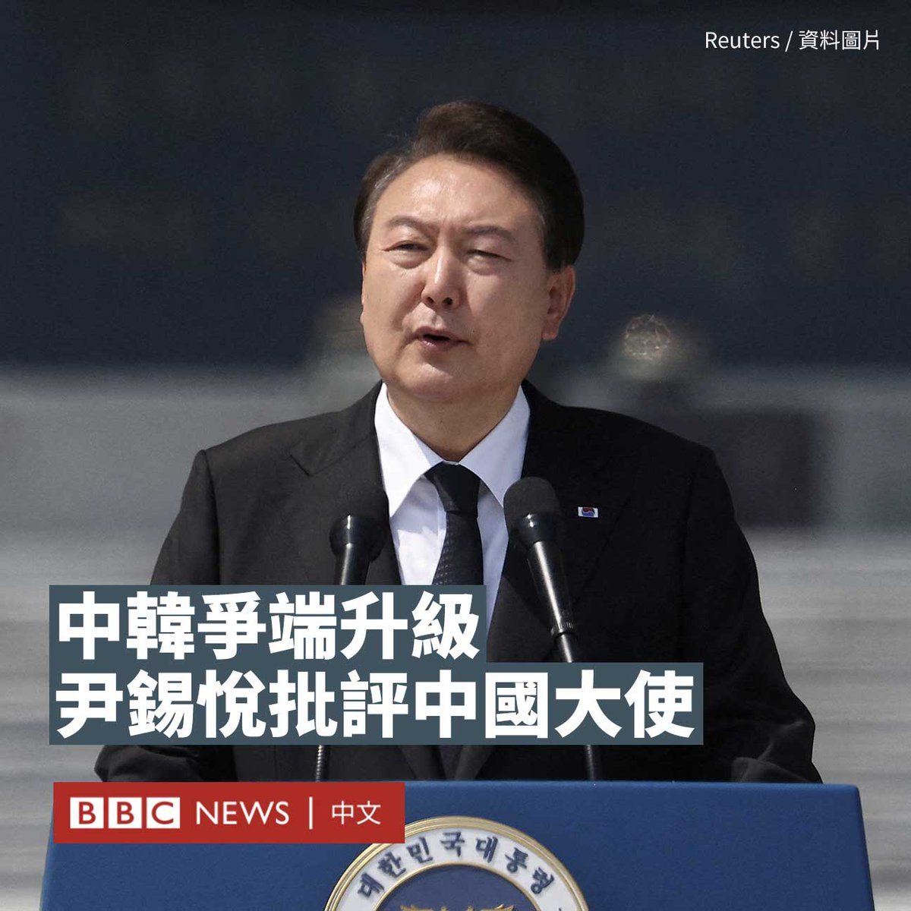

D英国广播公司BBC 北京时间 2023-06-14T14:33:23Z 1668869223886786562 在中国驻韩大使邢海明批评韩国政府外交政策引发两国口水战后，韩国总统尹锡悦周二（6月13日）罕见直接批评邢海明言论不当。

据韩联社报道，尹锡悦当日在国务会议上表示，邢海明作为外交官，是否具有相互尊重和增进友谊的态度（令人怀疑），其言行令韩国国民不满。

多家韩国媒体也报道了这一事件。韩国总统办公室高级官员还向韩联社表示，总统室把邢大使的发言内容和原委“看得非常严重”。

邢海明6月8日与韩国最大在野党党首李在明会面时表示：“有人赌美国赢、赌中国输，这显然是误判，没看清历史大势”，“现在赌中国输的人今后一定会后悔”。此话在韩国引起争议。

韩国外交部上周五（6月9日）召见邢海明，指责其“荒谬的挑衅行为”。外交部发言人任洙奭表示，邢海明的言行违背了规定外交使节肩负增进友好关系使命的《维也纳外交关系公约》和外交惯例，属于干涉内政行为。

北京在次日也采取行动，约见了韩国大使表明“严重关切和不满”，称希望韩方“深刻反思当前中韩关系的问题所在”。   D英国广播公司BBC 北京时间 2023-06-14T15:42:41Z 1668886661248466946 英国诺丁汉（Nottingham）发生连环袭击案，造成两名19岁学生和一名50多岁男子死亡，另外至少三人受伤。

一名31岁的男性嫌疑人在被警方制伏后被拘捕。

警方称该起事件是“可怕和悲惨的”，但案件仍处于调查的早期阶段，尚未确定疑犯的犯案动机。

据了解，涉案男子是西非裔移民。

当地警方于周二（6月13日）凌晨四时左右接到报警，在市区道路上发现两名倒地的学生受了致命伤。

大约一小时后，在距离发现两名倒地学生地点3.2公里外的另一条道路上，有一名年约50岁的男子被发现身亡，其身上有刀伤。

随后，市中心有一辆小型货车试图冲撞路人。三名伤者被送往医院接受治疗，其中一名男伤者情况危殆，另外两名伤者则受轻伤。

警方事后截停涉案的小型货车，并以电枪制服一名31岁男子，以涉嫌谋杀罪名拘捕他。

诺丁汉大学后来发表声明，“非常悲痛地”确认这起袭击事件的两名青少年受害者是该校的学生。

一名要求匿名的目击者告诉BBC，他看到一名年轻男子和女子被刺伤，并听到了“可怕而令人毛骨悚然的尖叫声”。

“我看到他先刺伤了男生，然后又刺伤了女生。重复地行刺，大概有四、五次。男生倒在了路中间。”

这次袭击事件震动了诺丁汉庞大的学生群体，该市是两所大学和超过五万名学生的家园。   D英国广播公司BBC 北京时间 2023-06-14T12:23:56Z 1668836647042011136 作为美国历史上首位面临联邦刑事指控的前总统，特朗普周二（6月13日）到迈阿密一家法院就机密文件案首次出庭应讯。

他对不当处理绝密机密信息和妨碍司法公正等37项联邦刑事罪名拒不认罪。

在离开法院后，他意外现身当地一家古巴餐厅，向支持者致意。他的支持者唱起生日歌，为其提前庆生。 https://t.co/cOwJPh1ubK   D英国广播公司BBC 北京时间 2023-06-14T10:53:37Z 1668813918540644352 台湾新北市板桥一所知名连锁私立幼儿园近日发生院童疑遭喂食“管制药品”案，引发台湾家长恐慌。https://t.co/VhYeCYOsFk   D英国广播公司BBC 北京时间 2023-06-14T08:40:58Z 1668780534682484736 一份联合国报告显示，全球一半人仍然认为男性是更好的政治领袖，甚至25％的人认为男人殴打妻子是正当的。https://t.co/W8O6lTRqIq   D英国广播公司BBC 北京时间 2023-06-14T01:53:41Z 1668678036483624962 【最新消息】美国前总统特朗普（Donald Trump）正在乘车前往迈阿密法院，准备就机密文件案出庭应讯。

特朗普面临37项指控，包括非法保留机密文件，以及串谋妨碍司法公正等罪名。这是有史以来首次有美国前总统遭到联邦刑事指控。他预计将否认这些指控。 https://t.co/E3WYAnZSsj   D英国广播公司BBC 北京时间 2023-06-14T02:12:22Z 1668682741888729088 【最新消息】美国前总统特朗普（Donald Trump）的车队抵达位于迈阿密的联邦法院，他将在那里听取对他的37项指控。

现场高度戒备，一些特朗普的支持者在法院外挥舞旗帜，表达对他的支持。 https://t.co/BWbzCruKY7   