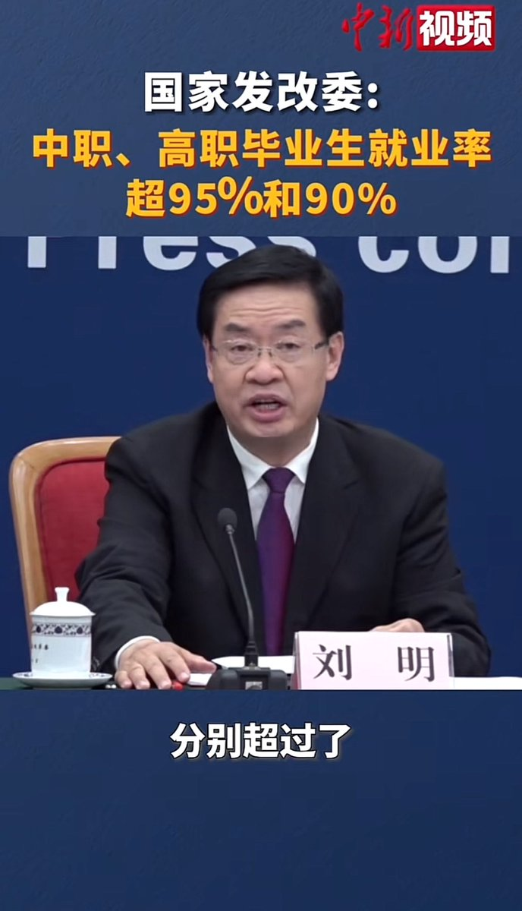

多伦多方脸 北京时间 2023-06-14T15:26:58Z 1668882709131952128 你有点冷酷🥶 https://t.co/VbtpQyM44X   多伦多方脸 北京时间 2023-06-14T13:53:45Z 1668859248577744896 不是100%我不服 https://t.co/x8bcIyIHEG   多伦多方脸 北京时间 2023-06-14T11:00:34Z 1668815664516321281 中国现在青年失业率20.4%，而社会总失业率才5.1%，中间差了15.3%
为什么有这种巨大差距？
是因为中国现在没有办法给刚毕业的大学生提供岗位了
中国不是没有人才，而是社会无法提供需要高素质人才的岗位
这也是陷入中等收入陷阱，进入拉美化的征兆
方脸说：拉美化，中国的宿命
https://t.co/ZA9Ka9HBWl   多伦多方脸 北京时间 2023-06-14T10:17:59Z 1668804948606472192 有一个地方，只要你不骂人，宣扬一些反人类的话语。
不论你反共还是支持共产党，都不会被封号。你却说这里是假的言论自由。
而还有一个地方，你甚至说言论自由几个字都要被封，你却说他有最公平自由的言论环境。
我觉得这样的人脑子有些问题。   