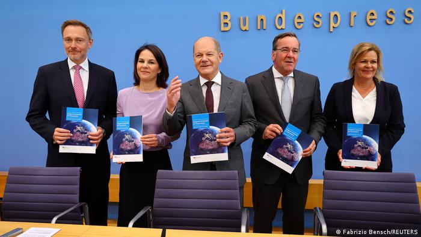

德国之声 北京时间 2023-06-14T20:20:33Z 1668956588764286979 德国公布二战后首部安全战略
早在数月之前，德国就宣称将推出第一个国家安全战略。千呼万唤，随著俄乌战争在欧洲持续，安全战略显得比任何一个时候都更为必要。 https://t.co/ZBt0JtAy54   德国之声 北京时间 2023-06-14T20:36:18Z 1668960555686567940 #德国 出台首份#国家安全战略，将9项议题列为德国安全的核心挑战。德国总理肖尔茨说，德国政府会在其中国战略中保持一种平衡。

详细报道：https://t.co/NadpUZqCKv https://t.co/ssU2HgiIP1   德国之声 北京时间 2023-06-14T16:44:40Z 1668902262570196992 #美国财长 耶伦本周二在众议院金融服务委员会的听证会上表示，她认为美国和中国都能从开放的贸易和投资中获益，如果#美国 试图与#中国 脱钩，那将是灾难性的。耶伦希望尽快访华。 https://t.co/RMHqOIHhSJ   德国之声 北京时间 2023-06-14T17:36:15Z 1668915241026043906 事实上，在不久前发生的 #中国军机 #南海 拦截美国侦察机以及中国军舰 #台湾海峡 拦截 #美国军舰 这两起事件上，习向外界演示了他的“极限思维”——要制造一种危局，让美国认识到无所顾忌地对中国进行抵近侦察和自由航行，将会付出很大代价，从而打退堂鼓。https://t.co/JSt27OrZp1 https://t.co/XBxRbdZ7y6   德国之声 北京时间 2023-06-14T18:06:06Z 1668922754807091201 在 #白俄罗斯 境内部署 #核武器 是苏联解体以来，#俄罗斯 首次在其领土之外的地区部署战术核武。https://t.co/iXYdhWN2mq https://t.co/WwlITt9R9k   德国之声 北京时间 2023-06-14T15:55:04Z 1668889778190778372 【脱口秀演员又炎上了】🇲🇾
#马来西亚 正在寻求国际刑警组织帮助，以追查1名「玩笑开过火」的纽约脱口秀演员。

#脱口秀 演员谢必孜（Jocelyn Chia）在演出影片中，先是揶揄新马的经济发展差异，并称「马来西亚的飞机都飞不起来」，随后又说「马航班机失踪不好笑是吗？有些笑点就是落不了地啦。」（续） https://t.co/KN01J8v5c7   德国之声 北京时间 2023-06-14T15:57:25Z 1668890370359324672 马来西亚航空的MH370班机自2014年从吉隆坡起飞后便失踪至今，机上239名乘客全数罹难，至今仍未寻获飞机主体。
影片在网上引发众怒，TikTok已依其仇恨言论准则予以删除。（续）   德国之声 北京时间 2023-06-14T16:07:03Z 1668892795380154368 马来西亚也对此展开正式抗议及调查，警方13日更称，将向国际刑警组织申请取得她的「完整身份」及「最新位置」等资讯，但国际刑警组织尚未对此公开回应。

谢必孜告诉美国CNN，这个段子她已经表演过100多次，从未有过任何问题，并表示该片段被断章取义。（续）   德国之声 北京时间 2023-06-14T16:07:41Z 1668892956051251200 🤔您觉得 #脱口秀演员 拿失踪航班开玩笑，是不是太过火了呢？请在留言处跟我们分享您的看法👇
关于「脱口秀尺度」的相关报导👉https://t.co/tgKnynOA8N   德国之声 北京时间 2023-06-14T16:15:20Z 1668894879840124928 AI安排怎样的柏林一日游？ https://t.co/rLbcb86ML9   德国之声 北京时间 2023-06-14T12:50:29Z 1668843327637147648 【美国务院改口：未决定是否邀李家超出席APEC】 https://t.co/IcBq9rUWS8

在反对声浪之中，美国 #国务院 13日修正声明，表示先前的说法有误，美方尚未决定是否邀请香港特首 #李家超 参与APEC会议。同日，李家超强调主办国有责任邀请成员出席。   德国之声 北京时间 2023-06-14T13:11:37Z 1668848646987628546 《日经亚洲》报导，#北约 将升级与日本🇯🇵、韩国🇰🇷、澳大利亚🇦🇺与纽西兰🇳🇿的伙伴关系，并拟将在东京设立办事处，以此为强化该组织在 #印太地区 合作的枢纽。https://t.co/yYMGbmijTu   德国之声 北京时间 2023-06-14T12:15:59Z 1668834646807793666 美国前总统 #川普 因 #机密文件案 遭起诉，13日出席在迈阿密法院举行的听证会。他的律师对全数指控表示 #不认罪。此案牵动美国选情，接下来可能如何发展？
https://t.co/w2dGXHqmDh   