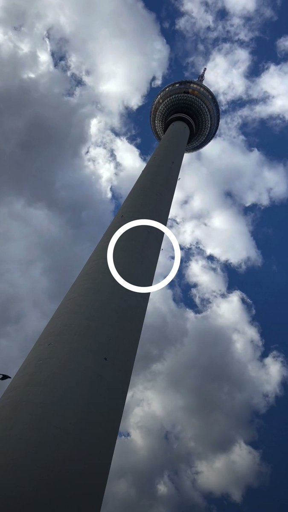

德国之声 北京时间 2023-06-14T16:15:20Z 1668894879840124928 AI安排怎样的柏林一日游？ https://t.co/rLbcb86ML9   德国之声 北京时间 2023-06-14T12:50:29Z 1668843327637147648 【美国务院改口：未决定是否邀李家超出席APEC】 https://t.co/IcBq9rUWS8

在反对声浪之中，美国 #国务院 13日修正声明，表示先前的说法有误，美方尚未决定是否邀请香港特首 #李家超 参与APEC会议。同日，李家超强调主办国有责任邀请成员出席。   德国之声 北京时间 2023-06-14T13:11:37Z 1668848646987628546 《日经亚洲》报导，#北约 将升级与日本🇯🇵、韩国🇰🇷、澳大利亚🇦🇺与纽西兰🇳🇿的伙伴关系，并拟将在东京设立办事处，以此为强化该组织在 #印太地区 合作的枢纽。https://t.co/yYMGbmijTu   德国之声 北京时间 2023-06-14T12:15:59Z 1668834646807793666 美国前总统 #川普 因 #机密文件案 遭起诉，13日出席在迈阿密法院举行的听证会。他的律师对全数指控表示 #不认罪。此案牵动美国选情，接下来可能如何发展？
https://t.co/w2dGXHqmDh   